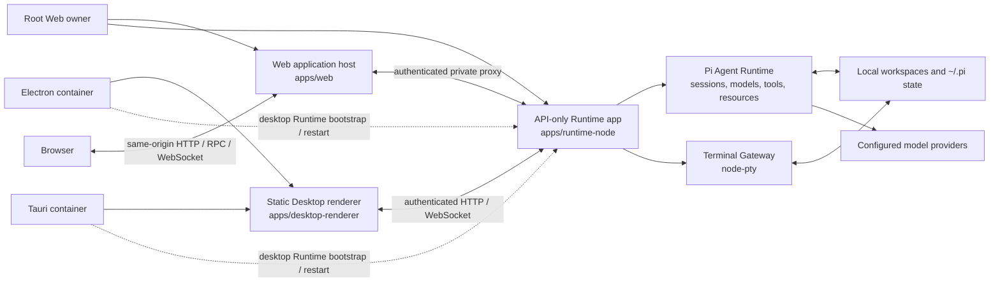

<a name="readme-top"></a>

<p align="center">
  English | <a href="./README.zh-CN.md">简体中文</a>
</p>

<div align="center">
  <picture>
    <source media="(prefers-color-scheme: dark)" srcset="./apps/web/public/pi-logo-on-dark.svg">
    <source media="(prefers-color-scheme: light)" srcset="./apps/web/public/pi-logo-on-light.svg">
    
  </picture>
  <h1 align="center">Pi Workbench</h1>
  <p align="center">
    <strong>A local-first AI coding workbench built around projects and persistent agent sessions.</strong>
  </p>
  <p align="center">
    Use Pi Coding Agent, workspace files, model configuration, and real terminals from Web, Electron, or Tauri.
  </p>
</div>

<div align="center">
  
  
  
  <a href="./LICENSE"></a>
</div>

<div align="center">
  <a href="#product-preview">Preview</a> |
  <a href="#what-works-today">Features</a> |
  <a href="#versioning-and-releases">Versioning</a> |
  <a href="#quick-start">Quick start</a> |
  <a href="#architecture">Architecture</a> |
  <a href="#development">Development</a> |
  <a href="./docs/i18n.md">Internationalization</a>
</div>

<hr>

Pi Workbench runs a shared [assistant-ui](https://github.com/assistant-ui/assistant-ui) product shell
in the serverful browser app and in a static Desktop renderer consumed by Electron and Tauri. The
root Web command keeps [`apps/web`](./apps/web/) and [`apps/runtime-node`](./apps/runtime-node/) as
separate process owners. Each desktop container instead owns its Runtime and passes one narrow,
authenticated connection to [`apps/desktop-renderer`](./apps/desktop-renderer/). The current build
selects
[`@earendil-works/pi-coding-agent`](https://github.com/earendil-works/pi) as its production Agent
Runtime through Workbench's client and server adapter boundaries.

Sessions, Workbench settings, resource configuration, and workspace access stay on the local
machine. Requests sent to a configured model still leave the machine and are governed by that model
provider's terms and privacy policy.

## Product preview

<p align="center">
  
</p>

<table>
  <tr>
    <td width="50%" valign="top">
      
      <br>
      <sub>Persistent conversation with the project file workspace</sub>
    </td>
    <td width="50%" valign="top">
      
      <br>
      <sub>Toolbox package discovery and project-scoped installation</sub>
    </td>
  </tr>
</table>

## What works today

| Area                            | Current behavior                                                                                                          |
| ------------------------------- | ------------------------------------------------------------------------------------------------------------------------- |
| **Pi conversations**            | Persistent sessions, search, rename, pin, archive, fork, regenerate, cancel, steer, and queued follow-up                  |
| **Models and providers**        | Pi account sign-in, API keys, model discovery, capability checks, and custom providers                                    |
| **Projects and files**          | Import trusted workspaces; browse, preview, edit, and save text files; preview Markdown, media, PDF, and Office documents |
| **Terminal**                    | Real `node-pty` sessions rooted in a workspace, including interactive commands started by the agent                       |
| **Toolbox and Pi resources**    | Inspect and manage Skills, prompts, Pi extensions, packages, and bundled Component Extensions                             |
| **Local conversation import**   | Import compatible Codex, Claude Code, and Cursor conversations without modifying their source files                       |
| **Attachments and inspection**  | Image/PDF understanding, token usage, context trace, tool timelines, and interactive approval requests                    |
| **Internationalized interface** | Runtime locale switching with complete `en-US` and `zh-CN` base catalogs                                                  |

> [!IMPORTANT]
> Pi sessions, model configuration, the file workspace, external-session import, and Terminal use
> real local backends. Review currently tracks file mutations in memory rather than reading Git;
> Browser is a session/navigation surface and does not render a live webpage yet; Artifact previews
> are populated from tool-provided data. These surfaces are still experimental.

## Versioning and releases

Pi Workbench follows [Semantic Versioning](https://semver.org/) and publishes annotated Git tags in
the form `vMAJOR.MINOR.PATCH`. While the project remains in early `0.x` development:

- `0.MINOR.0` introduces a substantial capability or an intentional breaking change to an unstable
  extension, runtime, RPC, or persisted-state contract.
- `0.MINOR.PATCH` contains backward-compatible fixes, documentation, performance work, and internal
  refactors.
- Prereleases use identifiers such as `v0.2.0-alpha.1`, `v0.2.0-beta.1`, or `v0.2.0-rc.1`.
- `v1.0.0` will mark the first release with explicitly supported public contracts and migration
  expectations.

[`package.json`](./package.json) is the canonical version source. A release tag must match that
version, point to a commit on `main`, and never be moved or reused; corrections are published as a
new Patch release. GitHub Release notes are maintained in both English and Simplified Chinese.

## Quick start

> [!WARNING]
> Pi Workbench directly accesses workspaces selected by the user. The local service and Terminal run
> with the current operating-system user's permissions, and Terminal is **not a sandbox**.

Prerequisites:

- Node.js `22.19+`
- pnpm
- Git
- A native C/C++ toolchain only when `node-pty` has no prebuilt binary for the current platform

The repository uses pnpm. Do not install dependencies with npm or Yarn.

```bash
git clone https://github.com/yyy0107/pi-workbench.git
cd pi-workbench
pnpm install
pnpm dev
```

`pnpm dev` synchronizes the required static assets, then runs the root
[`web-runtime-watch`](./scripts/web-runtime-watch.mjs) manager. Each managed generation owns one Web
process and one Runtime process, verifies their identity/admission boundary, and exposes the Web
process at [http://127.0.0.1:3000](http://127.0.0.1:3000). Add a project directory, then open
Settings → Models to sign in to a provider or add an API-key/custom-provider configuration. Select
a model in the Composer to start a conversation.

### Running without hot reload

`pnpm dev` enables two reload layers: the root source-generation manager replaces the separately
owned Web/Runtime generation when Runtime, Web-host, or package source changes, while Next.js
development mode provides Fast Refresh/HMR for application code and styles.

> [!TIP]
> **Recommended:** when hot compilation is not required, use the production build and server. This
> is the simplest and most predictable way to disable all file watching, Fast Refresh, and HMR.

Build once and run the production server:

```bash
pnpm build
pnpm start
```

Production mode does not watch source files or apply Fast Refresh. After changing source code, run
`pnpm build` again and restart `pnpm start`.

Only when Next.js Fast Refresh is still required, disable just the outer source-generation manager
with:

```bash
pnpm predev
pnpm dev:once
```

This starts the same separate Web/Runtime topology once and still provides Next.js Fast Refresh for
pages, components, and styles. Changes to [`apps/web/src/server/`](./apps/web/src/server/),
[`apps/web/src/runtime-connected-web-main.ts`](./apps/web/src/runtime-connected-web-main.ts),
[`apps/runtime-node/`](./apps/runtime-node/), or package server code require a manual restart. The
root orchestrator resolves exact app roots, so it remains independent of the caller's working
directory. The installed Next.js development server does not provide a supported switch for
disabling Fast Refresh while otherwise retaining development mode; use the production commands
above when all hot compilation must be disabled.

### Electron development

The managed command builds the current Runtime/Desktop composition, starts the Desktop renderer's
Next.js development server, waits for its product marker, and then starts Electron. Electron owns
the Runtime process from `.desktop-build`; the root orchestrator owns only the renderer and Electron
children and cleans them in reverse order:

```bash
pnpm electron:dev
```

The managed renderer uses `http://127.0.0.1:3000`. Startup fails if that endpoint is occupied; the
command never kills an unrelated listener.

To use a Desktop renderer server you already own, first create a current `.desktop-build`
Runtime/Desktop composition, then pass its one canonical IPv4 loopback HTTP origin:

```bash
WORKBENCH_DESKTOP_RENDERER_ORIGIN=http://127.0.0.1:43127 \
pnpm electron:dev:connect
```

Connect mode verifies the renderer marker, starts only Electron, and still lets Electron own
Runtime. `localhost`, remote hosts, paths, query strings, fragments, and the obsolete two-origin
environment contract are rejected.

### Tauri development

Tauri consumes the same built static Desktop renderer and Runtime artifact; it does not use a
remote production URL or the browser Web host. Build those inputs before starting the app:

```bash
pnpm --filter @workbench/runtime-node build
pnpm --filter @workbench/desktop-renderer build
pnpm --filter @workbench/desktop-tauri dev
```

This path restages the admitted renderer and target sidecar before launching `tauri dev`; it is a
static-renderer workflow, not Next.js HMR. Rust/Cargo and the platform's Tauri system dependencies
are additionally required. Packaged Electron and Tauri load only admitted local assets under a
strict CSP; their bridge exposes only Runtime bootstrap and lifecycle restart to the trusted main
frame/window. Do not work around a startup failure with a remote renderer URL or relaxed
script/style policy.

### Production builds

Run the production Web service:

```bash
pnpm build
pnpm start
```

The root build is orchestration only: it builds the Node Runtime used by Web/Tauri and the Web app,
then delegates the Desktop renderer, installed-Electron ABI Runtime, and exact composition to the
Electron app. For a focused build, use the owning workspace command:

```bash
pnpm --filter @workbench/runtime-node build
pnpm --filter @workbench/web build
pnpm --filter @workbench/desktop-renderer build
pnpm --filter @workbench/desktop-electron build # build renderer + Electron-ABI Runtime + composition
```

Web, Runtime, and Desktop renderer artifacts are published under `.desktop-build/web/`,
`.desktop-build/runtime-node/`, and `.desktop-build/desktop-renderer/`. Electron writes the exact
renderer/Runtime composition to `.desktop-build/desktop-artifacts.json`. `pnpm start` runs the permanent root
[`web-runtime-orchestrator`](./scripts/web-runtime-orchestrator.mjs) in production mode, keeping Web
and Runtime as separate sibling owners.

Build the desktop application:

```bash
pnpm electron:pack # native unpacked application; includes the required Linux execution smoke
pnpm electron:dist # native installer/distributable; includes the required Linux execution smoke
```

Both Electron commands run the production build automatically. Desktop output is written to
`dist-electron/`. Configured targets are macOS DMG/ZIP, Windows NSIS, and Linux AppImage; build on
the target operating system for the corresponding artifact. The packaged Window/RPC/WebSocket/PTY/
Runtime-restart/renderer-reload/titlebar/cleanup execution contract is currently implemented only
for a native Linux target. On macOS, Windows, or a cross-target build, the canonical commands fail
rather than reporting an unexecuted application as successful. Use
`pnpm electron:pack:artifact` or
`pnpm electron:dist:artifact` only when you explicitly need manifest/layout/budget artifact
validation; they return a structured `execution: "not-run"` result and do not claim the native
execution contract passed.

Electron artifact composition and packaging belong to
[`apps/desktop-electron`](./apps/desktop-electron/). Its
[`build-desktop-artifacts.cjs`](./apps/desktop-electron/scripts/build-desktop-artifacts.cjs) builds
the installed-Electron Runtime target before publishing the composition. Staged packages carry the
non-executable
[`desktop-artifact-support.cjs`](./apps/desktop-electron/scripts/desktop-artifact-support.cjs)
contract used to validate and load those artifacts. Packaging stages the app under
`.electron-build/app/`, including the composed artifacts at
`.electron-build/app/desktop-runtime/`. After a current composition already exists, the app-owned
entry points are `pnpm --filter @workbench/desktop-electron run pack` and
`pnpm --filter @workbench/desktop-electron run dist`; the root `electron:*` commands remain the
canonical clean flow because they build first.

Build Tauri from the same current artifacts with:

```bash
pnpm build
pnpm --filter @workbench/desktop-tauri tauri:build
# Linux Debian package only:
pnpm --filter @workbench/desktop-tauri tauri:build:deb
```

Tauri output is owned by `apps/desktop-tauri/src-tauri/target`. The repository does not currently
configure desktop signing credentials, notarization, or an updater endpoint, so these commands do
not constitute a signed auto-updating release. Add those only in target-OS release jobs with managed
secrets; Windows and macOS package/native smoke rows remain unverified.

If desktop startup reports a missing or stale manifest, rerun `pnpm build`. If managed Electron
development cannot bind `127.0.0.1:3000`, stop that listener or run the Desktop renderer yourself
and use the canonical connect command above. Tauri build failures before Rust compilation usually
mean the renderer/Runtime artifacts were not built or the target's Tauri system dependencies are
missing. A missing bootstrap, CSP rejection, or sidecar target mismatch indicates mixed or stale
artifacts: rebuild and restage them together instead of widening the bridge, CSP, or Origin list.

## Architecture

The browser and desktop apps reuse the same Workbench Shell and Pi client contributions through two
application roots. Browser commands run the serverful Web host beside API-only Runtime. Electron
and Tauri load the same admitted static Desktop renderer artifact; each container owns one
target-matched Runtime process and exposes only narrow bootstrap and lifecycle-restart capabilities
to its trusted main window.



The public Web host binds the canonical loopback address `127.0.0.1`; `PORT` changes its default
port of `3000`. The permanent host does not accept a remote bind address.

### Extension model

Pi Workbench currently has three extension categories:

- **Built-in Workbench extensions** are statically compiled UI contribution bundles owned by
  [`@workbench/shell`](./packages/workbench/shell/src/extensions/builtin/) and the installed
  [Pi contribution leaf](./packages/agent-runtime/adapters/pi/contributions/src/extensions/).
- **Installable Component Extensions** are trusted UI bundles shipped in the application catalog.
  They can be installed or removed at runtime, but their code is still included at build time. The
  current catalog contains Generative UI.
- **Pi extensions and resources** are loaded by Pi's ResourceLoader and can contribute agent tools,
  commands, prompts, and Skills. Toolbox exposes their user and project scopes.

Workbench does not download or execute arbitrary remote UI JavaScript and does not have a separate
Extension Host or stable third-party UI plugin ABI. UI extension code should import the public
authoring API from [`@workbench/extension-sdk`](./packages/extension-platform/sdk/src/index.ts).
Mounted extension components import runtime hooks from
[`@workbench/extension-host`](./packages/extension-platform/host/src/index.ts) and use only the
explicitly exported Host leaves.

## Security boundary

The Electron and Tauri renderers are isolated from native authority, but Pi tools and terminal
processes execute through the local backend with the user's real permissions. Import only projects
you trust and review tool requests before approving them.

`PI_WORKBENCH_TRUSTED_HOSTS` only adds allowed request authorities; it does not provide
authentication or TLS. Project resource trust is stored per directory through Pi. Set
`PI_WORKBENCH_TRUST_PROJECT=1` only when the current process should trust every imported project.

See the [Pi Server adapter](./packages/agent-runtime/adapters/pi/server/README.md) and
[Terminal Runtime](./packages/terminal/README.md) for implementation details.

## Repository map

| Directory                                                                                                                                                      | Responsibility                                                                           |
| -------------------------------------------------------------------------------------------------------------------------------------------------------------- | ---------------------------------------------------------------------------------------- |
| [`scripts/`](./scripts/)                                                                                                                                       | Root Web/Runtime and Electron development orchestration plus repository gates            |
| [`apps/web/`](./apps/web/)                                                                                                                                     | Next.js routes, Runtime-connected/Web-only hosts, Web artifact build, config, and assets |
| [`apps/runtime-node/`](./apps/runtime-node/)                                                                                                                   | API-only Runtime application composition, lifecycle, and artifact build                  |
| [`apps/desktop-renderer/`](./apps/desktop-renderer/)                                                                                                           | Static-export Desktop application, navigation, bootstrap, assets, and artifact manifest  |
| [`apps/desktop-electron/`](./apps/desktop-electron/)                                                                                                           | Electron lifecycle, artifact composition/staging, packaging, budget, and distribution    |
| [`apps/desktop-tauri/`](./apps/desktop-tauri/)                                                                                                                 | Tauri lifecycle, Runtime sidecar, renderer staging, capabilities, and packaging          |
| [`packages/workbench/shell/`](./packages/workbench/shell/)                                                                                                     | Reusable application shell, chat, workspace UI, shared UI, and core extensions           |
| [`packages/extension-platform/sdk/`](./packages/extension-platform/sdk/)                                                                                       | Host-free extension contracts, authoring helpers, registries, and lifecycle              |
| [`packages/extension-platform/host/`](./packages/extension-platform/host/)                                                                                     | React Host hooks, contribution hosts, and application-injected services                  |
| [`packages/agent-runtime/adapters/pi/`](./packages/agent-runtime/adapters/pi/)                                                                                 | Pi protocol, shared types, client/server adapters, and UI contributions                  |
| [`packages/agent-runtime/core/client/`](./packages/agent-runtime/core/client/), [`packages/agent-runtime/core/server/`](./packages/agent-runtime/core/server/) | Backend-neutral browser and server Agent Runtime adapter boundaries                      |
| [`packages/terminal/`](./packages/terminal/)                                                                                                                   | Terminal contracts, client helpers, PTY sessions, Pi tool adapter, and gateway           |

## Development

Primary checks and build commands:

```bash
pnpm lint
pnpm typecheck
pnpm test
pnpm build
```

Use checks proportional to the change. User-visible copy must update both `en-US` and `zh-CN` in the
same change. Locale identifiers, fallback behavior, component-owned dictionaries, and the process
for adding another language are documented in the
[internationalization guide](./docs/i18n.md).

## Documentation

- [Internationalization](./docs/i18n.md)
- [Workbench extension platform](./docs/extensions.md)
- [RightWorkspace architecture](./docs/right-workspace.md)
- [Browser Agent Runtime adapter](./packages/agent-runtime/core/client/README.md)
- [Server Agent Runtime ports](./packages/agent-runtime/core/server/README.md)
- [Pi Server adapter](./packages/agent-runtime/adapters/pi/server/README.md)
- [Terminal Runtime](./packages/terminal/README.md)

Detailed subsystem documentation is currently mostly written in Simplified Chinese.

## License

Pi Workbench is released under the [MIT License](./LICENSE). Third-party dependencies and bundled
assets remain subject to their respective licenses.
