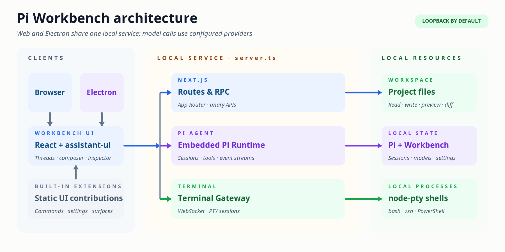

<a name="readme-top"></a>

<div align="center">
  <picture>
    <source media="(prefers-color-scheme: dark)" srcset="./public/pi-logo-on-dark.svg">
    <source media="(prefers-color-scheme: light)" srcset="./public/pi-logo-on-light.svg">
    
  </picture>
  <h1 align="center">Pi Workbench</h1>
  <p align="center">
    <strong>本地优先、以工作区为中心的 AI 编程工作台。</strong>
  </p>
  <p align="center">
    在同一个 Web / Electron 应用中运行 Pi Coding Agent、持久会话、工作区文件与真实终端。
  </p>
</div>

<div align="center">
  
  
  
  <a href="#更多文档"></a>
</div>

<div align="center">
  <a href="#快速开始">快速开始</a> |
  <a href="#架构">架构</a> |
  <a href="./docs/extensions.md">扩展开发</a> |
  <a href="./runtime/pi/README.md">Pi Runtime</a> |
  <a href="./runtime/terminal/README.md">Terminal</a>
</div>

<hr>

Pi Workbench 在浏览器或 Electron renderer 中运行
[assistant-ui](https://github.com/assistant-ui/assistant-ui) Workbench Client，并将
`@earendil-works/pi-coding-agent` 嵌入由 [`server.ts`](./server.ts) 启动的本地 Next.js 服务。
运行时、会话和工作区访问默认留在本机；模型请求仍会发送到你配置的模型提供方。

它面向需要长期会话、真实项目上下文和本机工具的编码工作流：从一个工作区开始，在同一界面中管理
模型、命令、消息队列、文件、Diff、终端和可恢复的 Inspector Surface。

|                                                                         |                                                                      |
| ----------------------------------------------------------------------- | -------------------------------------------------------------------- |
| [**持久化 Pi 会话**](./runtime/pi/README.md#session-生命周期和持久状态) | 按工作区组织会话、模型、队列、归档、分叉和交互请求                   |
| [**自带模型配置**](./runtime/pi/README.md#模型)                         | 通过账号登录、API 密钥或自定义 Provider 接入模型                     |
| [**工作区文件能力**](./runtime/pi/README.md#workspace-和-host-目录)     | 浏览、预览和编辑代码、Markdown、图片、PDF、媒体与 Office 文档        |
| [**真实交互终端**](./runtime/terminal/README.md)                        | 在工作区目录中运行 PTY，并继续操作 Agent 发起的交互式命令            |
| [**Web 与桌面共用实现**](./electron/)                                   | 浏览器与 Electron 共享 Next.js、Pi RPC/WebSocket 和 Terminal 服务    |
| [**可组合的扩展平台**](./docs/extensions.md)                            | 使用 Slot、Command、Renderer、Settings 和 Workspace Surface 组合界面 |

> [!NOTE]
> Pi 会话、Explorer、File 和 Terminal 已连接真实后端；Review、Browser 和 Artifact 当前主要提供
> 扩展宿主与界面。Workbench 尚无稳定的第三方插件 ABI 或权限隔离。

## 快速开始

Pi Workbench 默认在当前机器上运行，并直接访问你选择的工作区。

> [!WARNING]
> 本地服务和 Terminal 以当前用户权限访问文件系统与真实 shell；Terminal **不是沙箱**。

**前置条件**：Node.js `22.12+`、pnpm 和 Git。项目不支持 npm 或 Yarn。

### 方式一：Web 开发

```bash
git clone https://github.com/yyy0107/pi-workbench.git
cd pi-workbench
pnpm install
pnpm dev
```

打开 [http://127.0.0.1:3000](http://127.0.0.1:3000)，添加一个工作区，在“设置 → 模型”中配置
Provider，再从 Composer 选择模型并开始会话。

基础启动不要求 `.env.local`。Pi 也可以沿用 Provider 支持的环境认证，但模型与凭据应优先通过应用
设置管理。如果 `node-pty` 没有当前平台的预编译产物，安装依赖时还需要本机 C/C++ 构建工具链。

### 方式二：Electron 桌面开发

全新 clone 如果尚未运行过 `pnpm dev` 或 `pnpm build`，先同步被 Git 忽略的静态资源：

```bash
pnpm icons:sync
pnpm file-viewer:sync
pnpm electron:dev
```

Electron 会自行启动带热更新的 Workbench 服务；如果 `127.0.0.1:3000` 已运行本项目，Electron
会直接连接它。

### 方式三：生产构建

```bash
pnpm build
pnpm start

pnpm electron:pack # 生成当前平台可运行目录
pnpm electron:dist # 生成当前平台安装包
```

Electron 产物写入 `dist-electron/`。当前目标为 macOS DMG/ZIP、Windows NSIS 和 Linux AppImage，
通常应在对应目标平台构建。

---

## 架构

浏览器或 Electron renderer 运行 assistant-ui Workbench Client；本地 [`server.ts`](./server.ts)
统一分发 Next.js HTTP/RPC、Pi 事件流和 Terminal WebSocket。开发与生产都应使用项目脚本，
不要直接运行 `next dev` 或 `next start`。

<p align="center">
  <a href="./docs/assets/pi-workbench-architecture.png">
    
  </a>
</p>

<p align="center">
  <sub><a href="./docs/assets/pi-workbench-architecture.excalidraw">可编辑的 Excalidraw 源文件</a>（下载后使用 Excalidraw 打开）</sub>
</p>

### 两种 Extension

- **Workbench extensions** 位于 [`extensions/builtin/`](./extensions/builtin/)，是随应用静态编译、
  同进程运行的 UI Contribution Bundles。
- **Pi agent extensions** 由 Pi ResourceLoader 加载，可注册 Agent tools、events 和 commands；
  设置页展示的是这一类扩展。

两者不是同一套扩展系统。当前不加载远程 JavaScript，也没有独立 Extension Host。开发 UI 扩展时
从 [`@/platform/extensions`](./platform/extensions/index.ts) 导入公共 API。

### 仓库边界

| 目录                                                                           | 职责                                         |
| ------------------------------------------------------------------------------ | -------------------------------------------- |
| [`app/`](./app/)、[`workbench/`](./workbench/)、[`components/`](./components/) | Next.js 路由、Workbench Shell、聊天与共享 UI |
| [`platform/extensions/`](./platform/extensions/)                               | UI 扩展的公共契约、Registry、Host 与生命周期 |
| [`extensions/builtin/`](./extensions/builtin/)                                 | 随应用静态编译的内置 Contribution Bundles    |
| [`runtime/pi/`](./runtime/pi/)                                                 | Pi RPC、会话、模型、Workspace、命令与实时流  |
| [`runtime/terminal/`](./runtime/terminal/)                                     | PTY、Tool Terminal 与 Terminal WebSocket     |
| [`electron/`](./electron/)                                                     | 桌面启动、本地服务进程与打包                 |

## 安全边界

`PI_WORKBENCH_TRUSTED_HOSTS` 只放宽请求来源校验，不提供认证或 TLS；跨机器访问必须由外层可信代理
提供身份认证和 TLS。项目资源信任由工作区导入时的确认与 `~/.pi/agent/trust.json` 管理；仅在明确
需要对本次进程信任所有项目时才使用 `PI_WORKBENCH_TRUST_PROJECT=1` 覆盖。

完整说明见 [Pi Runtime 请求信任边界](./runtime/pi/README.md#请求信任边界) 和
[Terminal Runtime](./runtime/terminal/README.md)。

## 开发

提交改动前运行：

```bash
pnpm check # lint + typecheck + test
pnpm build
```

开发前请阅读 [`AGENTS.md`](./AGENTS.md) 以及待修改文件附近最近的嵌套 `AGENTS.md`。只使用 pnpm；
用户可见文案同时维护 `en-US` 和 `zh-CN`；修改 Next.js 代码前查阅仓库安装版本的
`node_modules/next/dist/docs/`。

## 更多文档

- [Workbench 扩展组件开发指南](./docs/extensions.md)
- [RightWorkspace 扩展架构](./docs/right-workspace.md)
- [Pi Runtime 架构、协议与配置](./runtime/pi/README.md)
- [Terminal Runtime 与安全边界](./runtime/terminal/README.md)
- [DeepSeek Harness HTTP / WebSocket 接口参考](./docs/deepseekharness-api-design.md)（Workbench 仅实现当前子集）
