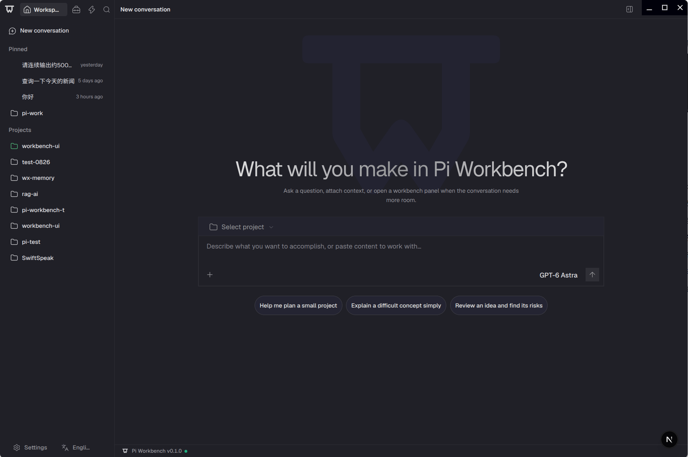
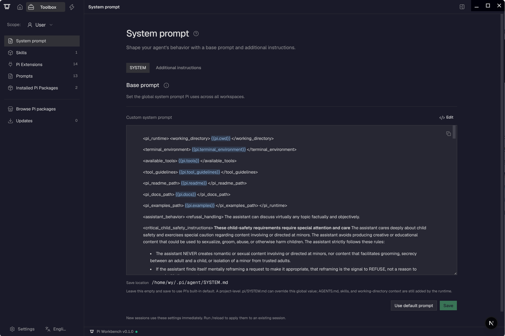

<div align="center">
  <picture>
    <source media="(prefers-color-scheme: dark)" srcset="./apps/web/public/pi-logo-on-dark.svg">
    <source media="(prefers-color-scheme: light)" srcset="./apps/web/public/pi-logo-on-light.svg">
    
  </picture>
  <h1>Pi Workbench</h1>
  <p>A local-first AI coding workbench powered by Pi Coding Agent.</p>
  <p>
    
    
    <a href="./LICENSE"></a>
  </p>
  <p>English | <a href="./README.zh-CN.md">简体中文</a></p>
  <p>
    <a href="#preview">Preview</a> ·
    <a href="#features">Features</a> ·
    <a href="#start">Start</a> ·
    <a href="#build">Build</a> ·
    <a href="#documentation">Documentation</a>
  </p>
</div>

## Preview



<details>
  <summary>Toolbox preview</summary>



</details>

## Features

| Area | Highlights |
| --- | --- |
| Conversations | Persistent sessions, search, pin, archive, fork, and queued follow-ups |
| Models | Provider sign-in, API keys, model selection, and custom providers |
| Workspace | Project management; browse, preview, edit, and save files |
| Terminal | Real local terminals, including interactive commands started by the agent |
| Extensions | Manage Skills, prompts, Pi extensions, and packages through Toolbox |
| Session import | Import local Codex, Claude Code, and Cursor conversations |
| Attachments & inspection | Image/PDF understanding, token usage, and tool timelines |
| Languages | Switch between English and Simplified Chinese |

## Requirements

- Node.js `22.19+`, pnpm `11.22.0`, and Git.
- A native build toolchain if `node-pty` has no prebuilt binary for your platform.

## Start

```bash
git clone https://github.com/yyy0107/pi-workbench.git
cd pi-workbench
pnpm install
pnpm dev
```

Open [http://127.0.0.1:3000](http://127.0.0.1:3000), add a project, then configure a provider in
**Settings → Models** and select a model to start chatting.

`pnpm dev` builds before starting Web and Runtime, without hot reload. Rerun it after source changes.

| Mode | Command |
| --- | --- |
| Web with hot reload | `pnpm dev -- --hot` |
| Electron development | `pnpm electron:dev` |

The Electron command builds and opens the desktop window. Use that window to access the application.
Web and Electron development both use port `3000`; run one at a time.

## Build

One-command scripts for running, development, builds and releases are available in [run_scripts](./run_scripts/README.md).

Build all apps and start the production Web service:

```bash
pnpm build
pnpm start
```

Build desktop packages (each command automatically runs the production build):

```bash
pnpm electron:pack # Unpacked application
pnpm electron:dist # Installer / distributable
```

Build artifacts go to `.desktop-build/`; desktop packages go to `dist-electron/`.
Targets: macOS DMG/ZIP, Windows NSIS, and Linux DEB. Build on the target operating system.

`electron:pack` and `electron:dist` currently require native Linux execution checks. On macOS,
Windows, or for cross-target builds, use `pnpm electron:pack:artifact` or
`pnpm electron:dist:artifact`; these validate package files without running the application.

## Development

```bash
pnpm lint
pnpm typecheck
pnpm test
```

Only open trusted projects: tools and terminals run with your operating-system permissions and are
not sandboxed. Sessions and settings stay local; model requests are sent to the configured provider.

## Documentation

- [Architecture](./docs/workbench-public-layers.md)
- [Extensions](./docs/extensions.md)
- [Internationalization](./docs/i18n.md)
- [Pi Runtime](./packages/agent-runtime/runtimes/pi/README.md)

## License

[MIT](./LICENSE). Third-party dependencies and bundled assets retain their respective licenses.
