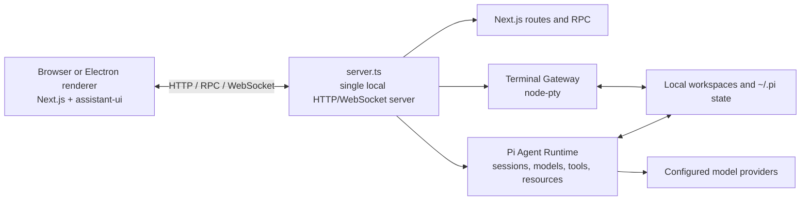

<a name="readme-top"></a>

<p align="center">
  English | <a href="./README.zh-CN.md">简体中文</a>
</p>

<div align="center">
  <picture>
    <source media="(prefers-color-scheme: dark)" srcset="./public/pi-logo-on-dark.svg">
    <source media="(prefers-color-scheme: light)" srcset="./public/pi-logo-on-light.svg">
    
  </picture>
  <h1 align="center">Pi Workbench</h1>
  <p align="center">
    <strong>A local-first AI coding workbench built around projects and persistent agent sessions.</strong>
  </p>
  <p align="center">
    Use Pi Coding Agent, workspace files, model configuration, and real terminals from one Web or Electron interface.
  </p>
</div>

<div align="center">
  
  
  
  <a href="./LICENSE"></a>
</div>

<div align="center">
  <a href="#product-preview">Preview</a> |
  <a href="#what-works-today">Features</a> |
  <a href="#quick-start">Quick start</a> |
  <a href="#architecture">Architecture</a> |
  <a href="#development">Development</a> |
  <a href="./docs/i18n.md">Internationalization</a>
</div>

<hr>

Pi Workbench runs an [assistant-ui](https://github.com/assistant-ui/assistant-ui) client in the
browser or Electron renderer and connects it to a local service started by
[`server.ts`](./server.ts). The current build selects
[`@earendil-works/pi-coding-agent`](https://github.com/earendil-works/pi) as its production Agent
Runtime through Workbench's client and server adapter boundaries.

Sessions, Workbench settings, resource configuration, and workspace access stay on the local
machine. Requests sent to a configured model still leave the machine and are governed by that model
provider's terms and privacy policy.

## Product preview

<p align="center">
  
</p>

<table>
  <tr>
    <td width="50%" valign="top">
      
      <br>
      <sub>Persistent conversation with the project file workspace</sub>
    </td>
    <td width="50%" valign="top">
      
      <br>
      <sub>Toolbox package discovery and project-scoped installation</sub>
    </td>
  </tr>
</table>

## What works today

| Area                            | Current behavior                                                                                                          |
| ------------------------------- | ------------------------------------------------------------------------------------------------------------------------- |
| **Pi conversations**            | Persistent sessions, search, rename, pin, archive, fork, regenerate, cancel, steer, and queued follow-up                  |
| **Models and providers**        | Pi account sign-in, API keys, model discovery, capability checks, and custom providers                                    |
| **Projects and files**          | Import trusted workspaces; browse, preview, edit, and save text files; preview Markdown, media, PDF, and Office documents |
| **Terminal**                    | Real `node-pty` sessions rooted in a workspace, including interactive commands started by the agent                       |
| **Toolbox and Pi resources**    | Inspect and manage Skills, prompts, Pi extensions, packages, and bundled Component Extensions                             |
| **Local conversation import**   | Import compatible Codex, Claude Code, and Cursor conversations without modifying their source files                       |
| **Attachments and inspection**  | Image/PDF understanding, token usage, context trace, tool timelines, and interactive approval requests                    |
| **Internationalized interface** | Runtime locale switching with complete `en-US` and `zh-CN` base catalogs                                                  |

> [!IMPORTANT]
> Pi sessions, model configuration, the file workspace, external-session import, and Terminal use
> real local backends. Review currently tracks file mutations in memory rather than reading Git;
> Browser is a session/navigation surface and does not render a live webpage yet; Artifact previews
> are populated from tool-provided data. These surfaces are still experimental.

## Quick start

> [!WARNING]
> Pi Workbench directly accesses workspaces selected by the user. The local service and Terminal run
> with the current operating-system user's permissions, and Terminal is **not a sandbox**.

Prerequisites:

- Node.js `22.19+`
- pnpm
- Git
- A native C/C++ toolchain only when `node-pty` has no prebuilt binary for the current platform

The repository uses pnpm. Do not install dependencies with npm or Yarn.

```bash
git clone https://github.com/yyy0107/pi-workbench.git
cd pi-workbench
pnpm install
pnpm dev
```

`pnpm dev` synchronizes the required static assets and starts the local Workbench service with
reload support. Open [http://127.0.0.1:3000](http://127.0.0.1:3000), add a project directory, then
open Settings → Models to sign in to a provider or add an API-key/custom-provider configuration.
Select a model in the Composer to start a conversation.

### Electron development

`electron:dev` does not run the Web `predev` hook. In a fresh checkout, synchronize the generated
static assets once before starting Electron:

```bash
pnpm icons:sync
pnpm file-viewer:sync
pnpm electron:dev
```

In development, Electron uses `127.0.0.1:3000`. It connects to an existing Pi Workbench service on
that address when one is available; otherwise it starts and watches its own local service.

### Production builds

Run the production Web service:

```bash
pnpm build
pnpm start
```

Build the desktop application:

```bash
pnpm electron:pack # unpacked application for the current platform
pnpm electron:dist # installer or distributable for the current platform
```

Both Electron commands run the production build automatically. Desktop output is written to
`dist-electron/`. Configured targets are macOS DMG/ZIP, Windows NSIS, and Linux AppImage; build on
the target operating system for the corresponding artifact.

## Architecture

The browser and Electron renderer use the same Next.js and assistant-ui application. A single local
custom server owns Next.js HTTP/RPC dispatch, the Pi event WebSocket, and the Terminal WebSocket.
Electron starts that same service as a child process instead of maintaining a second backend.



The server listens on `127.0.0.1:3000` by default. `PORT` changes the port, and `WORKBENCH_HOST`
changes the bind address. Exposing the service beyond loopback requires an external authentication
and TLS boundary.

### Extension model

Pi Workbench currently has three extension categories:

- **Built-in Workbench extensions** are statically compiled UI contribution bundles in
  [`extensions/builtin/`](./extensions/builtin/) and are always active.
- **Installable Component Extensions** are trusted UI bundles shipped in the application catalog.
  They can be installed or removed at runtime, but their code is still included at build time. The
  current catalog contains Generative UI.
- **Pi extensions and resources** are loaded by Pi's ResourceLoader and can contribute agent tools,
  commands, prompts, and Skills. Toolbox exposes their user and project scopes.

Workbench does not download or execute arbitrary remote UI JavaScript and does not have a separate
Extension Host or stable third-party UI plugin ABI. UI extension code should import the public
authoring API from [`@/platform/extensions`](./platform/extensions/index.ts).

## Security boundary

The Electron renderer uses browser isolation, but Pi tools and terminal processes execute through
the local backend with the user's real permissions. Import only projects you trust and review tool
requests before approving them.

`PI_WORKBENCH_TRUSTED_HOSTS` only adds allowed request authorities; it does not provide
authentication or TLS. Project resource trust is stored per directory through Pi. Set
`PI_WORKBENCH_TRUST_PROJECT=1` only when the current process should trust every imported project.

See the [Pi Runtime trust boundary](./runtime/pi/README.md) and
[Terminal Runtime](./runtime/terminal/README.md) for implementation details.

## Repository map

| Directory                                                                                  | Responsibility                                                        |
| ------------------------------------------------------------------------------------------ | --------------------------------------------------------------------- |
| [`app/`](./app/), [`workbench/`](./workbench/), [`components/`](./components/)             | Next.js routes, application shell, chat, workspace UI, and shared UI  |
| [`platform/extensions/`](./platform/extensions/)                                           | Workbench extension contracts, registries, hosts, and lifecycle       |
| [`extensions/`](./extensions/)                                                             | Built-in and app-bundled installable Workbench extensions             |
| [`runtime/assistant-ui/`](./runtime/assistant-ui/), [`runtime/server/`](./runtime/server/) | Backend-neutral browser and server Agent Runtime adapter boundaries   |
| [`runtime/pi/`](./runtime/pi/)                                                             | Concrete Pi client/server adapters, sessions, models, tools, and RPC  |
| [`runtime/terminal/`](./runtime/terminal/)                                                 | PTY sessions, tool terminals, and Terminal WebSocket gateway          |
| [`electron/`](./electron/)                                                                 | Desktop lifecycle, local service process, packaging, and distribution |

## Development

Primary checks and build commands:

```bash
pnpm lint
pnpm typecheck
pnpm test
pnpm build
```

Use checks proportional to the change. User-visible copy must update both `en-US` and `zh-CN` in the
same change. Locale identifiers, fallback behavior, component-owned dictionaries, and the process
for adding another language are documented in the
[internationalization guide](./docs/i18n.md).

## Documentation

- [Internationalization](./docs/i18n.md)
- [Workbench extension platform](./docs/extensions.md)
- [RightWorkspace architecture](./docs/right-workspace.md)
- [Browser Agent Runtime adapter](./runtime/assistant-ui/README.md)
- [Server Agent Runtime ports](./runtime/server/README.md)
- [Pi Runtime architecture and protocols](./runtime/pi/README.md)
- [Terminal Runtime](./runtime/terminal/README.md)

Detailed subsystem documentation is currently mostly written in Simplified Chinese.

## License

Pi Workbench is released under the [MIT License](./LICENSE). Third-party dependencies and bundled
assets remain subject to their respective licenses.
