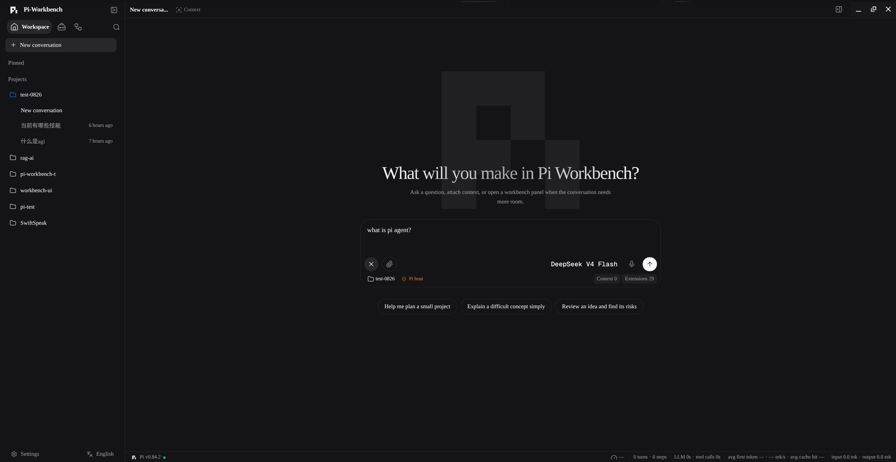
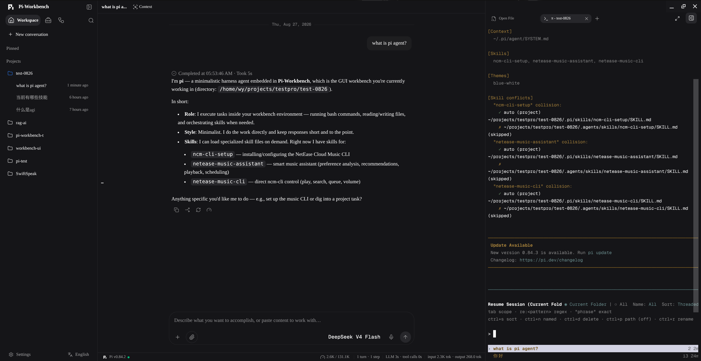
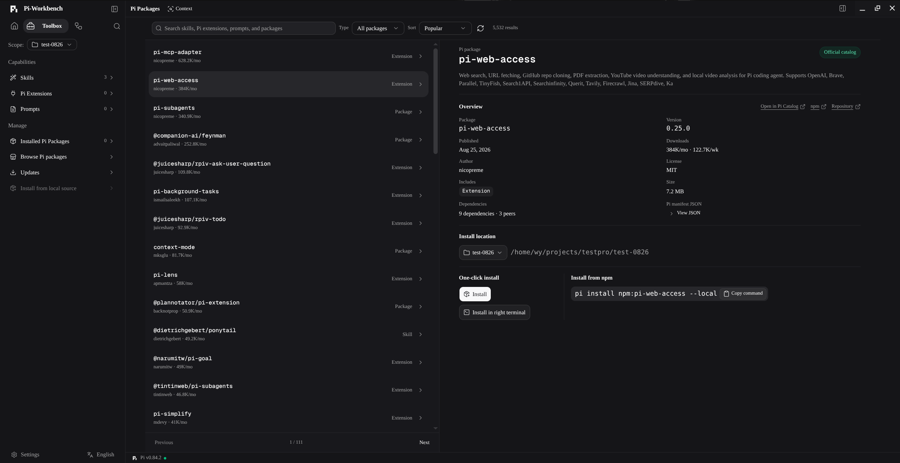
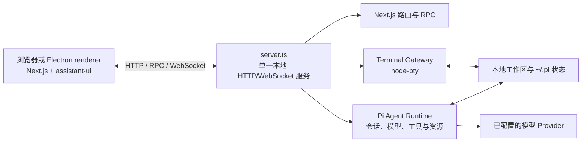

<a name="readme-top"></a>

<p align="center">
  <a href="./README.md">English</a> | 简体中文
</p>

<div align="center">
  <picture>
    <source media="(prefers-color-scheme: dark)" srcset="./public/pi-logo-on-dark.svg">
    <source media="(prefers-color-scheme: light)" srcset="./public/pi-logo-on-light.svg">
    
  </picture>
  <h1 align="center">Pi Workbench</h1>
  <p align="center">
    <strong>以项目和持久 Agent 会话为核心的本地优先 AI 编程工作台。</strong>
  </p>
  <p align="center">
    在同一个 Web 或 Electron 界面中使用 Pi Coding Agent、工作区文件、模型配置和真实终端。
  </p>
</div>

<div align="center">
  
  
  
  <a href="./LICENSE"></a>
</div>

<div align="center">
  <a href="#产品预览">预览</a> |
  <a href="#当前可用能力">功能</a> |
  <a href="#快速开始">快速开始</a> |
  <a href="#架构">架构</a> |
  <a href="#开发">开发</a> |
  <a href="./docs/i18n.zh-CN.md">国际化</a>
</div>

<hr>

Pi Workbench 在浏览器或 Electron renderer 中运行
[assistant-ui](https://github.com/assistant-ui/assistant-ui) Client，并连接到由
[`server.ts`](./server.ts) 启动的本地服务。当前构建通过 Workbench 的客户端和服务端适配边界，选择
[`@earendil-works/pi-coding-agent`](https://github.com/earendil-works/pi) 作为生产 Agent Runtime。

会话、Workbench 设置、资源配置和工作区访问保留在本机。发送给已配置模型的请求仍会离开本机，并受
对应模型提供方的条款和隐私政策约束。

## 产品预览

<p align="center">
  
</p>

<table>
  <tr>
    <td width="50%" valign="top">
      
      <br>
      <sub>持久会话与项目文件工作区</sub>
    </td>
    <td width="50%" valign="top">
      
      <br>
      <sub>Toolbox 扩展包发现与项目级安装</sub>
    </td>
  </tr>
</table>

## 当前可用能力

| 领域                   | 当前行为                                                                                |
| ---------------------- | --------------------------------------------------------------------------------------- |
| **Pi 会话**            | 持久化、搜索、重命名、置顶、归档、分叉、重新生成、取消、steer 和后续消息队列            |
| **模型与 Provider**    | Pi 账号登录、API Key、模型发现、能力检查和自定义 Provider                               |
| **项目与文件**         | 导入可信工作区；浏览、预览、编辑和保存文本文件；预览 Markdown、媒体、PDF 和 Office 文档 |
| **终端**               | 以工作区为根目录运行真实 `node-pty`，并接管 Agent 发起的交互命令                        |
| **Toolbox 与 Pi 资源** | 查看和管理 Skills、Prompts、Pi Extensions、Packages 和随应用提供的 Component Extensions |
| **本地会话导入**       | 导入兼容的 Codex、Claude Code 和 Cursor 会话，不修改原始会话文件                        |
| **附件与运行检查**     | 图片/PDF 理解、Token 用量、Context Trace、Tool Timeline 和交互式审批                    |
| **国际化界面**         | 运行时切换语言，完整提供 `en-US` 和 `zh-CN` 两种基础词典                                |

> [!IMPORTANT]
> Pi 会话、模型配置、文件工作区、外部会话导入和 Terminal 使用真实本地后端。Review 目前只在内存中
> 跟踪工具写入的文件，并不读取 Git；Browser 是会话和导航 Surface，尚不渲染真实网页；Artifact 预览
> 由工具提供的数据填充。这些 Surface 仍处于实验阶段。

## 快速开始

> [!WARNING]
> Pi Workbench 会直接访问用户选择的工作区。本地服务和 Terminal 以当前操作系统用户权限运行，
> Terminal **不是沙箱**。

前置条件：

- Node.js `22.19+`
- pnpm
- Git
- 仅当 `node-pty` 没有当前平台的预编译产物时，才需要本机 C/C++ 构建工具链

仓库统一使用 pnpm，不要通过 npm 或 Yarn 安装依赖。

```bash
git clone https://github.com/yyy0107/pi-workbench.git
cd pi-workbench
pnpm install
pnpm dev
```

`pnpm dev` 会同步所需的静态资源，并以热更新模式启动本地 Workbench 服务。打开
[http://127.0.0.1:3000](http://127.0.0.1:3000)，添加一个项目目录，然后进入“设置 → 模型”，
登录 Provider 账号，或添加 API Key/自定义 Provider 配置。从 Composer 选择模型后即可开始会话。

### Electron 开发

`electron:dev` 不会执行 Web 的 `predev` Hook。全新检出的仓库需要先同步一次生成的静态资源：

```bash
pnpm icons:sync
pnpm file-viewer:sync
pnpm electron:dev
```

开发模式下 Electron 使用 `127.0.0.1:3000`。如果这个地址已经运行 Pi Workbench，它会直接连接；
否则会启动并监听自己的本地服务。

### 生产构建

运行生产 Web 服务：

```bash
pnpm build
pnpm start
```

构建桌面应用：

```bash
pnpm electron:pack # 生成当前平台的可运行目录
pnpm electron:dist # 生成当前平台的安装包或分发文件
```

两个 Electron 命令都会自动执行生产构建。桌面产物写入 `dist-electron/`。当前配置的目标是 macOS
DMG/ZIP、Windows NSIS 和 Linux AppImage；应在对应目标操作系统上构建相应产物。

## 架构

浏览器和 Electron renderer 使用同一套 Next.js 与 assistant-ui 应用。单一本地自定义服务统一处理
Next.js HTTP/RPC、Pi 事件 WebSocket 和 Terminal WebSocket。Electron 启动的也是同一个服务子进程，
没有维护第二套后端。



服务默认监听 `127.0.0.1:3000`。`PORT` 可以修改端口，`WORKBENCH_HOST` 可以修改绑定地址。把服务
暴露到 loopback 之外时，必须在外层提供身份认证和 TLS。

### 扩展模型

Pi Workbench 当前包含三类扩展：

- **内置 Workbench Extensions** 是 [`extensions/builtin/`](./extensions/builtin/) 中静态编译、
  始终启用的 UI Contribution Bundles。
- **可安装 Component Extensions** 是随应用 Catalog 提供的可信 UI Bundles，可以在运行时安装或
  移除，但代码仍在构建时随应用交付。当前 Catalog 包含 Generative UI。
- **Pi Extensions 与 Resources** 由 Pi ResourceLoader 加载，可以提供 Agent Tools、Commands、
  Prompts 和 Skills；Toolbox 展示其 User 和 Project Scope。

Workbench 不下载或执行任意远程 UI JavaScript，也没有独立 Extension Host 或稳定的第三方 UI Plugin
ABI。UI Extension 代码应从 [`@/platform/extensions`](./platform/extensions/index.ts) 导入公共
Authoring API。

## 安全边界

Electron renderer 使用浏览器隔离，但 Pi Tools 和终端进程通过本地后端以用户真实权限执行。只导入
可信项目，并在允许工具请求前检查其内容。

`PI_WORKBENCH_TRUSTED_HOSTS` 只增加允许的请求 Authority，不提供认证或 TLS。Pi 会按目录保存项目
资源信任。只有当前进程应该信任所有已导入项目时，才设置 `PI_WORKBENCH_TRUST_PROJECT=1`。

实现细节见 [Pi Runtime 请求信任边界](./runtime/pi/README.md#请求信任边界)和
[Terminal Runtime](./runtime/terminal/README.md)。

## 仓库结构

| 目录                                                                                       | 职责                                                   |
| ------------------------------------------------------------------------------------------ | ------------------------------------------------------ |
| [`app/`](./app/)、[`workbench/`](./workbench/)、[`components/`](./components/)             | Next.js 路由、应用 Shell、聊天、工作区界面和共享 UI    |
| [`platform/extensions/`](./platform/extensions/)                                           | Workbench Extension 契约、Registries、Hosts 和生命周期 |
| [`extensions/`](./extensions/)                                                             | 内置和随应用提供的可安装 Workbench Extensions          |
| [`runtime/assistant-ui/`](./runtime/assistant-ui/)、[`runtime/server/`](./runtime/server/) | 后端无关的浏览器与服务端 Agent Runtime 适配边界        |
| [`runtime/pi/`](./runtime/pi/)                                                             | 具体 Pi 客户端/服务端 Adapter、会话、模型、工具和 RPC  |
| [`runtime/terminal/`](./runtime/terminal/)                                                 | PTY、Tool Terminal 和 Terminal WebSocket Gateway       |
| [`electron/`](./electron/)                                                                 | 桌面生命周期、本地服务进程、打包与分发                 |

## 开发

主要检查和构建命令：

```bash
pnpm lint
pnpm typecheck
pnpm test
pnpm build
```

根据改动风险选择相应检查。用户可见文案必须在同一项改动中同时更新 `en-US` 和 `zh-CN`。Locale 标识、
回退行为、组件自有词典和新增语言流程见[国际化指南](./docs/i18n.zh-CN.md)。

## 文档

- [国际化指南](./docs/i18n.zh-CN.md)
- [Workbench Extension 平台](./docs/extensions.md)
- [RightWorkspace 架构](./docs/right-workspace.md)
- [浏览器侧 Agent Runtime Adapter](./runtime/assistant-ui/README.md)
- [服务端 Agent Runtime Ports](./runtime/server/README.md)
- [Pi Runtime 架构与协议](./runtime/pi/README.md)
- [Terminal Runtime](./runtime/terminal/README.md)

## 开源协议

Pi Workbench 使用 [MIT License](./LICENSE) 开源。第三方依赖和随附资源仍分别遵循其自身许可证。
