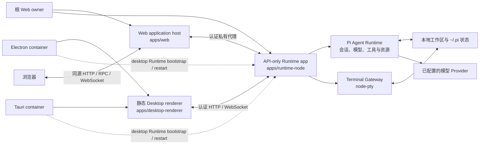

<a name="readme-top"></a>

<p align="center">
  <a href="./README.md">English</a> | 简体中文
</p>

<div align="center">
  <picture>
    <source media="(prefers-color-scheme: dark)" srcset="./apps/web/public/pi-logo-on-dark.svg">
    <source media="(prefers-color-scheme: light)" srcset="./apps/web/public/pi-logo-on-light.svg">
    
  </picture>
  <h1 align="center">Pi Workbench</h1>
  <p align="center">
    <strong>以项目和持久 Agent 会话为核心的本地优先 AI 编程工作台。</strong>
  </p>
  <p align="center">
    通过 Web、Electron 或 Tauri 使用 Pi Coding Agent、工作区文件、模型配置和真实终端。
  </p>
</div>

<div align="center">
  
  
  
  <a href="./LICENSE"></a>
</div>

<div align="center">
  <a href="#产品预览">预览</a> |
  <a href="#当前可用能力">功能</a> |
  <a href="#版本与发布规则">版本规则</a> |
  <a href="#快速开始">快速开始</a> |
  <a href="#架构">架构</a> |
  <a href="#开发">开发</a> |
  <a href="./docs/i18n.zh-CN.md">国际化</a>
</div>

<hr>

Pi Workbench 在带服务端的浏览器应用，以及 Electron/Tauri 共同消费的静态 Desktop renderer 中运行共享的
[assistant-ui](https://github.com/assistant-ui/assistant-ui) 产品 Shell。根 Web 命令继续把
[`apps/web`](./apps/web/) 与 [`apps/runtime-node`](./apps/runtime-node/) 作为两个独立 process owner；每个桌面
container 则自行拥有 Runtime，并只向 [`apps/desktop-renderer`](./apps/desktop-renderer/) 交付一个窄的认证连接。
当前构建通过 Workbench 的客户端和服务端适配边界，选择
[`@earendil-works/pi-coding-agent`](https://github.com/earendil-works/pi) 作为生产 Agent Runtime。

会话、Workbench 设置、资源配置和工作区访问保留在本机。发送给已配置模型的请求仍会离开本机，并受
对应模型提供方的条款和隐私政策约束。

## 产品预览

<p align="center">
  
</p>

<table>
  <tr>
    <td width="50%" valign="top">
      
      <br>
      <sub>持久会话与项目文件工作区</sub>
    </td>
    <td width="50%" valign="top">
      
      <br>
      <sub>Toolbox 扩展包发现与项目级安装</sub>
    </td>
  </tr>
</table>

## 当前可用能力

| 领域                   | 当前行为                                                                                |
| ---------------------- | --------------------------------------------------------------------------------------- |
| **Pi 会话**            | 持久化、搜索、重命名、置顶、归档、分叉、重新生成、取消、steer 和后续消息队列            |
| **模型与 Provider**    | Pi 账号登录、API Key、模型发现、能力检查和自定义 Provider                               |
| **项目与文件**         | 导入可信工作区；浏览、预览、编辑和保存文本文件；预览 Markdown、媒体、PDF 和 Office 文档 |
| **终端**               | 以工作区为根目录运行真实 `node-pty`，并接管 Agent 发起的交互命令                        |
| **Toolbox 与 Pi 资源** | 查看和管理 Skills、Prompts、Pi Extensions、Packages 和随应用提供的 Component Extensions |
| **本地会话导入**       | 导入兼容的 Codex、Claude Code 和 Cursor 会话，不修改原始会话文件                        |
| **附件与运行检查**     | 图片/PDF 理解、Token 用量、Context Trace、Tool Timeline 和交互式审批                    |
| **国际化界面**         | 运行时切换语言，完整提供 `en-US` 和 `zh-CN` 两种基础词典                                |

> [!IMPORTANT]
> Pi 会话、模型配置、文件工作区、外部会话导入和 Terminal 使用真实本地后端。Review 目前只在内存中
> 跟踪工具写入的文件，并不读取 Git；Browser 是会话和导航 Surface，尚不渲染真实网页；Artifact 预览
> 由工具提供的数据填充。这些 Surface 仍处于实验阶段。

## 版本与发布规则

Pi Workbench 遵循[语义化版本](https://semver.org/lang/zh-CN/)，并使用 `vMAJOR.MINOR.PATCH` 格式的
附注 Git Tag。项目处于早期 `0.x` 阶段时：

- `0.MINOR.0` 用于重要新能力，或对尚未稳定的 Extension、Runtime、RPC、持久化状态契约进行有意的
  Breaking Change。
- `0.MINOR.PATCH` 用于向后兼容的修复、文档、性能优化和内部重构。
- 预发布版本使用 `v0.2.0-alpha.1`、`v0.2.0-beta.1` 或 `v0.2.0-rc.1` 等标识。
- `v1.0.0` 表示项目首次明确支持公共契约和迁移预期。

[`package.json`](./package.json) 是版本号的唯一事实来源。Release Tag 必须与该版本一致，指向 `main`
上的 Commit，并且不得移动或复用；修正通过新的 Patch 版本发布。GitHub Release Notes 同时维护英文和
简体中文。

## 快速开始

> [!WARNING]
> Pi Workbench 会直接访问用户选择的工作区。本地服务和 Terminal 以当前操作系统用户权限运行，
> Terminal **不是沙箱**。

前置条件：

- Node.js `22.19+`
- pnpm
- Git
- 仅当 `node-pty` 没有当前平台的预编译产物时，才需要本机 C/C++ 构建工具链

仓库统一使用 pnpm，不要通过 npm 或 Yarn 安装依赖。

```bash
git clone https://github.com/yyy0107/pi-workbench.git
cd pi-workbench
pnpm install
pnpm dev
```

`pnpm dev` 会同步所需的静态资源，再运行根目录的
[`web-runtime-watch`](./scripts/web-runtime-watch.mjs) manager。每一代受管进程分别拥有一个 Web process
和一个 Runtime process，验证两者的 identity/admission 边界，并在
[http://127.0.0.1:3000](http://127.0.0.1:3000) 暴露 Web process。添加项目目录后，进入
“设置 → 模型”登录 Provider 账号，或添加 API Key/自定义 Provider 配置；从 Composer 选择模型后即可开始会话。

### 关闭热编译与热更新

`pnpm dev` 会启用两层热更新：根 source-generation manager 在 Runtime、Web Host 或 package
源码变化时替换一整代分别拥有的 Web/Runtime process；Web process 内的 Next.js 开发模式则为应用代码
和样式提供 Fast Refresh/HMR。

> [!TIP]
> **推荐方案：** 不需要热编译时，优先使用生产构建和生产服务。这是关闭全部文件监听、Fast Refresh
> 和 HMR 最简单、行为最可预期的方式。

先构建一次，再运行生产服务：

```bash
pnpm build
pnpm start
```

生产模式不会监听源码文件，也不会执行 Fast Refresh。修改源码后，需要重新运行 `pnpm build`，然后
重启 `pnpm start`。

仓库还提供了便捷的生产启动脚本：

```powershell
# Windows
.\run_scripts\windows\web-build.cmd
```

```bash
# Linux
./run_scripts/linux/web-build.sh
```

对应的 Electron 打包启动脚本是
[`run_scripts/windows/electron-build.cmd`](./run_scripts/windows/electron-build.cmd) 和
[`run_scripts/linux/electron-build.sh`](./run_scripts/linux/electron-build.sh)。

启动脚本从自身位置解析仓库目录，按 frozen lockfile 安装依赖，再委托给相同的根命令。它们不会终止已有
端口 owner；若 Web 端口冲突，请自行停止对应服务或为 Web server 选择另一个 `PORT`。

只有仍然需要 Next.js Fast Refresh 时，才建议仅关闭外层 source-generation manager：

```bash
pnpm predev
pnpm dev:once
```

这种方式只启动一次相同的独立 Web/Runtime 拓扑，并继续为页面、组件和样式保留 Next.js Fast Refresh。
修改 [`apps/web/src/server/`](./apps/web/src/server/)、
[`apps/web/src/runtime-connected-web-main.ts`](./apps/web/src/runtime-connected-web-main.ts)、
[`apps/runtime-node/`](./apps/runtime-node/) 或 package 服务端代码后必须手动重启。根 orchestrator 会解析
精确的 app root，因此不依赖调用者当前工作目录。当前安装的 Next.js 开发服务器没有提供受支持的开关，
可在保留其他开发模式能力的同时关闭 Fast Refresh；如需关闭全部热编译，请使用上面的生产模式命令。

### Electron 开发

托管命令会构建当前 Runtime/Desktop composition，启动 Desktop renderer 的 Next.js 开发服务器，等待产品
标记就绪后再启动 Electron。Electron 从 `.desktop-build` 自行拥有 Runtime process；根 orchestrator 只拥有
renderer 与 Electron 两个 child，并按相反顺序清理：

```bash
pnpm electron:dev
```

托管 renderer 固定使用 `http://127.0.0.1:3000`。若端口已被占用，启动会失败；命令不会强杀无关 listener。

若要使用自行管理的 Desktop renderer server，请先生成当前 `.desktop-build` Runtime/Desktop composition，再传入
唯一一个 canonical IPv4 loopback HTTP origin：

```bash
WORKBENCH_DESKTOP_RENDERER_ORIGIN=http://127.0.0.1:43127 \
pnpm electron:dev:connect
```

connect 模式会验证 renderer 产品标记，只启动 Electron，并仍由 Electron 拥有 Runtime。`localhost`、远程
host、路径、query、fragment，以及废弃的双 origin 环境契约都会被拒绝。

### Tauri 开发

Tauri 消费相同的静态 Desktop renderer 与 Runtime artifact，不使用远程生产 URL 或浏览器 Web Host。启动前先
构建这两个输入：

```bash
pnpm --filter @workbench/runtime-node build
pnpm --filter @workbench/desktop-renderer build
pnpm --filter @workbench/desktop-tauri dev
```

该流程会在 `tauri dev` 前重新 stage 已 admission 的 renderer 与目标 sidecar；这是静态 renderer 流程，不提供
Next.js HMR。另外还需要 Rust/Cargo 和对应平台的 Tauri 系统依赖。打包后的 Electron/Tauri 只在严格 CSP 下
加载通过 admission 的本地资源；bridge 只向可信主 frame/window 暴露 Runtime bootstrap 与生命周期重启。
不要用远程 renderer URL 或放宽 script/style 策略来绕过启动错误。

### 生产构建

运行生产 Web 服务：

```bash
pnpm build
pnpm start
```

根构建只负责编排：它先构建 Web/Tauri 使用的 Node Runtime 与 Web app，再把 Desktop renderer、当前已安装
Electron ABI 的 Runtime 及精确 composition 委托给 Electron app。只构建某一层时，使用对应 workspace 自己的命令：

```bash
pnpm --filter @workbench/runtime-node build
pnpm --filter @workbench/web build
pnpm --filter @workbench/desktop-renderer build
pnpm --filter @workbench/desktop-electron build # 构建 renderer、Electron ABI Runtime 与 composition
```

Web、Runtime 与 Desktop renderer artifacts 分别发布到 `.desktop-build/web/`、
`.desktop-build/runtime-node/` 和 `.desktop-build/desktop-renderer/`；Electron 把 renderer/Runtime 的精确
组合写入 `.desktop-build/desktop-artifacts.json`。`pnpm start` 以生产模式运行永久的根
[`web-runtime-orchestrator`](./scripts/web-runtime-orchestrator.mjs)，Web 与 Runtime 仍是两个独立 sibling owner。

构建桌面应用：

```bash
pnpm electron:pack # 生成原生可运行目录；Linux 会执行强制的发行应用 smoke
pnpm electron:dist # 生成原生安装包或分发文件；Linux 会执行强制的发行应用 smoke
```

两个 Electron 命令都会自动执行生产构建。桌面产物写入 `dist-electron/`。当前配置的目标是 macOS
DMG/ZIP、Windows NSIS 和 Linux AppImage；应在对应目标操作系统上构建相应产物。当前 packaged
Window/RPC/WebSocket/PTY/Runtime 重启/renderer reload/titlebar/退出清理的执行契约仅在原生 Linux target
实现。macOS、Windows 或 cross-target 构建上，规范命令会失败，不能把未执行的应用误报为成功。只有明确需要
manifest/layout/budget artifact 验证时才使用 `pnpm electron:pack:artifact` 或
`pnpm electron:dist:artifact`；它们会返回结构化 `execution: "not-run"` 结果，不宣称原生执行
契约已经通过。

Electron artifact 组合与打包属于 [`apps/desktop-electron`](./apps/desktop-electron/)。其中
[`build-desktop-artifacts.cjs`](./apps/desktop-electron/scripts/build-desktop-artifacts.cjs) 会先构建当前已安装
Electron 对应的 Runtime target，再发布组合清单；staged package 携带不可执行的
[`desktop-artifact-support.cjs`](./apps/desktop-electron/scripts/desktop-artifact-support.cjs) 契约，用于校验和
加载这些 artifacts。打包过程把 app 暂存到 `.electron-build/app/`，其中组合后的 artifacts 位于
`.electron-build/app/desktop-runtime/`。已有当前 composition 后，app 自有入口是
`pnpm --filter @workbench/desktop-electron run pack` 与
`pnpm --filter @workbench/desktop-electron run dist`；根 `electron:*` 命令会先执行构建，因此仍是规范的 clean flow。

从相同的当前 artifacts 构建 Tauri：

```bash
pnpm build
pnpm --filter @workbench/desktop-tauri tauri:build
# 仅构建 Linux Debian package：
pnpm --filter @workbench/desktop-tauri tauri:build:deb
```

Tauri 输出由 `apps/desktop-tauri/src-tauri/target` 拥有。仓库目前未配置桌面签名凭据、notarization 或 updater
endpoint，因此这些命令不代表已签名且支持自动更新的发行版。只应在目标系统的 release job 中通过托管 secret
补齐这些能力；Windows 与 macOS 的 package/native smoke 仍未验证。

若桌面启动报告 manifest 缺失或过期，请重新运行 `pnpm build`。若托管 Electron 开发无法绑定
`127.0.0.1:3000`，请停止该 listener，或自行运行 Desktop renderer 并使用上面的 canonical connect 命令。
Tauri 在 Rust 编译前失败通常表示 renderer/Runtime artifacts 尚未构建，或目标平台缺少 Tauri 系统依赖。
bootstrap 缺失、CSP 拒绝或 sidecar target mismatch 表示 artifacts 混用或过期；应整体 rebuild/restage，而不是
扩大 bridge、CSP 或 Origin allowlist。

## 架构

浏览器与桌面应用通过两个 application root 复用同一 Workbench Shell 和 Pi client contributions。浏览器命令
让带服务端的 Web Host 与 API-only Runtime 并列运行。Electron/Tauri 加载同一个已 admission 的静态 Desktop
renderer artifact；每个 container 自行拥有一个目标匹配的 Runtime process，只向可信主窗口暴露窄 bootstrap
与生命周期重启能力。



公开 Web Host 固定绑定 canonical loopback 地址 `127.0.0.1`；`PORT` 可以修改默认端口 `3000`。
永久 Host 不接受远程绑定地址。

### 扩展模型

Pi Workbench 当前包含三类扩展：

- **内置 Workbench Extensions** 是由
  [`@workbench/shell`](./packages/workbench/shell/src/extensions/builtin/) 与已安装的
  [Pi contribution leaf](./packages/agent-runtime/adapters/pi/contributions/src/extensions/) 拥有的静态 UI
  Contribution Bundles。
- **可安装 Component Extensions** 是随应用 Catalog 提供的可信 UI Bundles，可以在运行时安装或
  移除，但代码仍在构建时随应用交付。当前 Catalog 包含 Generative UI。
- **Pi Extensions 与 Resources** 由 Pi ResourceLoader 加载，可以提供 Agent Tools、Commands、
  Prompts 和 Skills；Toolbox 展示其 User 和 Project Scope。

Workbench 不下载或执行任意远程 UI JavaScript，也没有独立 Extension Host 或稳定的第三方 UI Plugin
ABI。UI Extension 代码应从
[`@workbench/extension-sdk`](./packages/extension-platform/sdk/src/index.ts) 导入公共 Authoring
API。挂载后的扩展组件从
[`@workbench/extension-host`](./packages/extension-platform/host/src/index.ts) 导入运行时 Hook，
并只使用明确导出的 Host leaf。

## 安全边界

Electron 与 Tauri renderer 都与原生权限隔离，但 Pi Tools 和终端进程通过本地后端以用户真实权限执行。
只导入可信项目，并在允许工具请求前检查其内容。

`PI_WORKBENCH_TRUSTED_HOSTS` 只增加允许的请求 Authority，不提供认证或 TLS。Pi 会按目录保存项目
资源信任。只有当前进程应该信任所有已导入项目时，才设置 `PI_WORKBENCH_TRUST_PROJECT=1`。

实现细节见 [Pi Server adapter](./packages/agent-runtime/adapters/pi/server/README.md) 和
[Terminal Runtime](./packages/terminal/README.md)。

## 仓库结构

| 目录                                                                                                                                                           | 职责                                                                             |
| -------------------------------------------------------------------------------------------------------------------------------------------------------------- | -------------------------------------------------------------------------------- |
| [`scripts/`](./scripts/)                                                                                                                                       | 根 Web/Runtime 与 Electron 开发编排及仓库 gates                                  |
| [`apps/web/`](./apps/web/)                                                                                                                                     | Next.js 路由、Runtime-connected/Web-only Host、Web artifact 构建、配置与静态资源 |
| [`apps/runtime-node/`](./apps/runtime-node/)                                                                                                                   | API-only Runtime 应用组合、生命周期与 artifact 构建                              |
| [`apps/desktop-renderer/`](./apps/desktop-renderer/)                                                                                                           | 静态导出 Desktop 应用、导航、bootstrap、资源与 artifact manifest                 |
| [`apps/desktop-electron/`](./apps/desktop-electron/)                                                                                                           | Electron 生命周期、artifact 组合与 staging、打包、预算与分发                     |
| [`apps/desktop-tauri/`](./apps/desktop-tauri/)                                                                                                                 | Tauri 生命周期、Runtime sidecar、renderer staging、capability 与打包             |
| [`packages/workbench/shell/`](./packages/workbench/shell/)                                                                                                     | 可复用应用 Shell、聊天、工作区界面、共享 UI 与核心扩展                           |
| [`packages/extension-platform/sdk/`](./packages/extension-platform/sdk/)                                                                                       | 无 Host 依赖的 Extension 契约、Authoring helper、Registries 和生命周期           |
| [`packages/extension-platform/host/`](./packages/extension-platform/host/)                                                                                     | React Host Hook、Contribution Host 和应用注入的 Services                         |
| [`packages/agent-runtime/adapters/pi/`](./packages/agent-runtime/adapters/pi/)                                                                                 | Pi protocol、共享类型、client/server adapters 与 UI contributions                |
| [`packages/agent-runtime/core/client/`](./packages/agent-runtime/core/client/)、[`packages/agent-runtime/core/server/`](./packages/agent-runtime/core/server/) | 后端无关的浏览器与服务端 Agent Runtime 适配边界                                  |
| [`packages/terminal/`](./packages/terminal/)                                                                                                                   | Terminal contracts、client helpers、PTY、Pi tool adapter 与 WebSocket Gateway    |

## 开发

主要检查和构建命令：

```bash
pnpm lint
pnpm typecheck
pnpm test
pnpm build
```

根据改动风险选择相应检查。用户可见文案必须在同一项改动中同时更新 `en-US` 和 `zh-CN`。Locale 标识、
回退行为、组件自有词典和新增语言流程见[国际化指南](./docs/i18n.zh-CN.md)。

## 文档

- [国际化指南](./docs/i18n.zh-CN.md)
- [Workbench Extension 平台](./docs/extensions.md)
- [RightWorkspace 架构](./docs/right-workspace.md)
- [浏览器侧 Agent Runtime Adapter](./packages/agent-runtime/core/client/README.md)
- [服务端 Agent Runtime Ports](./packages/agent-runtime/core/server/README.md)
- [Pi Server adapter](./packages/agent-runtime/adapters/pi/server/README.md)
- [Terminal Runtime](./packages/terminal/README.md)

## 开源协议

Pi Workbench 使用 [MIT License](./LICENSE) 开源。第三方依赖和随附资源仍分别遵循其自身许可证。
