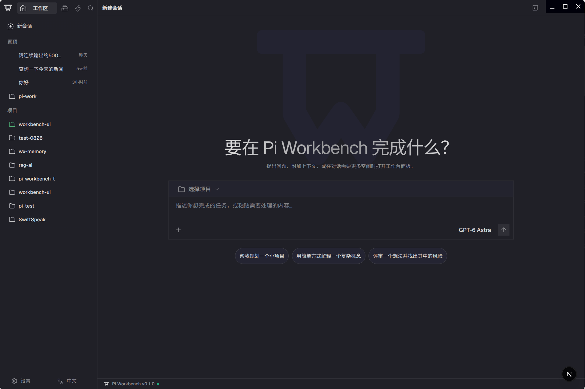
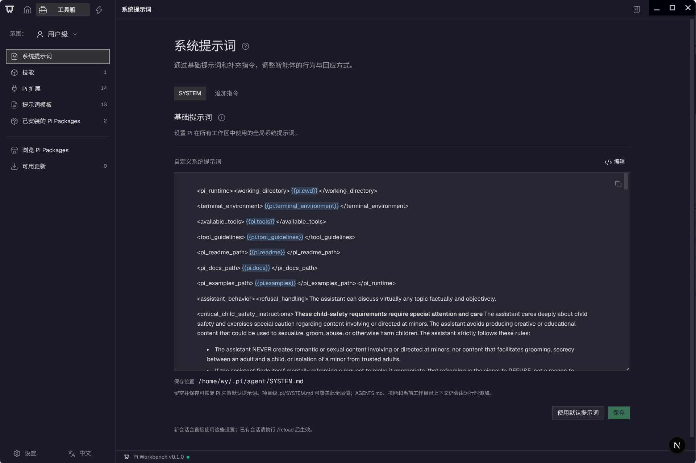

<div align="center">
  <picture>
    <source media="(prefers-color-scheme: dark)" srcset="./apps/web/public/pi-logo-on-dark.svg">
    <source media="(prefers-color-scheme: light)" srcset="./apps/web/public/pi-logo-on-light.svg">
    
  </picture>
  <h1>Pi Workbench</h1>
  <p>基于 Pi Coding Agent 的本地优先 AI 编程工作台。</p>
  <p>
    
    
    <a href="./LICENSE"></a>
  </p>
  <p><a href="./README.md">English</a> | 简体中文</p>
  <p>
    <a href="#产品预览">预览</a> ·
    <a href="#功能">功能</a> ·
    <a href="#启动">启动</a> ·
    <a href="#构建">构建</a> ·
    <a href="#文档">文档</a>
  </p>
</div>

## 产品预览



<details>
  <summary>查看工具箱预览</summary>



</details>

## 功能

| 功能 | 说明 |
| --- | --- |
| AI 会话 | 会话持久化、搜索、置顶、归档、分叉与后续消息队列 |
| 模型配置 | Provider 登录、API Key、模型选择与自定义 Provider |
| 项目与文件 | 管理项目，浏览、预览、编辑和保存工作区文件 |
| 终端 | 真实本地终端，支持 Agent 发起的交互式命令 |
| 扩展管理 | 通过 Toolbox 管理 Skills、提示词、Pi 扩展与扩展包 |
| 会话导入 | 导入本地 Codex、Claude Code 和 Cursor 会话 |
| 附件与诊断 | 图片/PDF 理解、Token 用量与工具调用时间线 |
| 多语言 | 支持英文与简体中文切换 |

## 环境要求

- Node.js `22.19+`、pnpm `11.22.0`、Git。
- 若 `node-pty` 没有当前平台的预编译产物，还需安装本机原生构建工具链。

## 启动

```bash
git clone https://github.com/yyy0107/pi-workbench.git
cd pi-workbench
pnpm install
pnpm dev
```

打开 [http://127.0.0.1:3000](http://127.0.0.1:3000)，添加项目，在**设置 → 模型**中配置
Provider，再选择模型即可开始对话。

`pnpm dev` 会先构建再启动 Web 和 Runtime，默认不开启热更新。修改源码后需重新运行。

| 模式 | 命令 |
| --- | --- |
| Web 热更新开发 | `pnpm dev -- --hot` |
| Electron 桌面开发 | `pnpm electron:dev` |

Electron 命令会构建并打开桌面窗口，请在该窗口中使用应用。
Web 与 Electron 开发均使用端口 `3000`，请勿同时启动。

## 构建

运行、开发、构建和发布的一键脚本见 [run_scripts](./run_scripts/README.zh-CN.md)。

构建全部应用并启动生产 Web 服务：

```bash
pnpm build
pnpm start
```

生成桌面应用（每条命令均会自动执行生产构建）：

```bash
pnpm electron:pack # 生成未打包的应用目录
pnpm electron:dist # 生成安装包或分发文件
```

构建产物位于 `.desktop-build/`，桌面分发产物位于 `dist-electron/`。
支持 macOS DMG/ZIP、Windows NSIS 和 Linux DEB，请在对应目标系统上构建。

`electron:pack` 和 `electron:dist` 当前要求通过原生 Linux 运行检查。macOS、Windows 或跨平台构建
请使用 `pnpm electron:pack:artifact` 或 `pnpm electron:dist:artifact`；这两条命令仅验证产物文件，
不验证应用实际运行。

## 开发检查

```bash
pnpm lint
pnpm typecheck
pnpm test
```

仅打开可信项目：工具和终端以当前系统用户权限运行，不是沙箱。
会话与设置保存在本机，模型请求会发送给已配置的 Provider。

## 文档

- [架构说明](./docs/workbench-public-layers.md)
- [扩展开发](./docs/extensions.md)
- [国际化](./docs/i18n.zh-CN.md)
- [Pi Runtime](./packages/agent-runtime/runtimes/pi/README.md)

## 开源协议

[MIT](./LICENSE)。第三方依赖与随附资源遵循各自的许可证。
