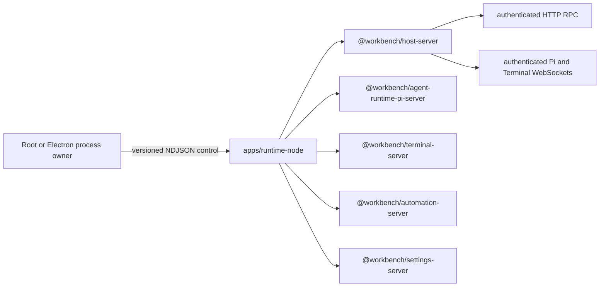

# `@workbench/runtime-node`

`apps/runtime-node` is the Node-only application composition root for the Workbench Runtime Host.
It selects the installed Pi implementation, binds Workbench-owned Automation, Settings,
and Terminal capabilities, and exposes that service graph through the generic Host ingress. It does
not import Next.js, React, browser state, or Electron implementation code.



## Ownership and dependency direction

- [`src/main.ts`](./src/main.ts) claims stdout before loading the service graph, validates the CLI,
  and runs the control-mode entrypoint. Application and third-party logs go to stderr; stdout is
  reserved for schema-created control frames.
- [`src/installed-api-only-runtime-host.ts`](./src/installed-api-only-runtime-host.ts) installs the
  API-only listener and owns startup, warmup, control-session, and bounded shutdown coordination.
- [`src/installed-runtime-service.ts`](./src/installed-runtime-service.ts) combines the Pi HTTP and
  mux/host WebSocket boundaries with the independent Terminal WebSocket gateway. Authentication is
  completed by the Host boundary before a business gateway may allocate a session or PTY.
- [`src/composition/`](./src/composition/) is the sole installed-implementation selection layer. It
  may connect the concrete Pi implementation to Workbench ports and leaf services; reusable domain behavior
  belongs in the package that owns it, not in this app.
- [`@workbench/agent-runtime-server`](../../packages/agent-runtime/core/server/README.md) owns the
  Runtime-neutral command, execution, and thread ports plus the singular installation contract.
  Pi session, history, model, resource, and transport semantics remain in the
  [Pi Runtime packages](../../packages/agent-runtime/runtimes/pi/README.md).
  [`createPiAgentServerImplementation`](../../packages/agent-runtime/runtimes/pi/server/src/agent-runtime/pi-agent-server-implementation.ts)
  implements `WorkbenchAgentServerAdapter`; Host, workspace, Terminal, and Automation retain their
  separate domain ports and composition bindings.
- [`@workbench/automation-server`](../../packages/server/automation/) owns Automation definitions,
  persistence, and scheduling. Its installed Pi binding launches an ordinary visible session
  through the generic Agent execution port.
- [`@workbench/settings-server`](../../packages/server/settings/) owns Workbench preference
  persistence and subscriptions. This app injects the installed Pi agent directory and compatibility
  environment variables.
- [`@workbench/terminal-server`](../../packages/terminal/server/README.md) owns PTY/session lifecycle
  and native dependencies. The Pi-specific Bash tool adapter is the separate
  `@workbench/pi-terminal-tool` leaf.

Packages do not import this app. The Web app, Electron app, and future native containers consume its
public process/transport contract; they do not source-import its composition modules.

## Control, transport, and lifecycle

Production uses a private, versioned NDJSON control channel. An external process owner sends the
complete desktop-sidecar authentication authority, waits for a credential-free ready frame, and
later asks for graceful shutdown. The Runtime binds loopback ingress and reports the actual origin
only after RPC warmup succeeds. Malformed control input, a disconnected controller, startup
failure, or output failure closes any started Host instead of leaving an unmanaged listener.

HTTP bearer/CORS admission and the WebSocket first-frame/private-hop admission are owned by
`@workbench/host-server`. Pi and Terminal receive only authenticated requests. Request trust still
applies independently: Host/Origin/cross-site checks guard browser reachability, while sensitive
filesystem and native-host operations remain loopback-only.

Shutdown stops ingress, closes upgraded sockets, quiesces Pi-owned resources, then releases
Terminal sessions. Automation, package-catalog, and registered application hooks are disposed
through their installed owners. A positive deadline bounds graceful cleanup; the external
process owner remains responsible for terminating an uncooperative child after the protocol
deadline.

## Runtime artifact

[`scripts/build-runtime-artifact.ts`](./scripts/build-runtime-artifact.ts) produces the immutable,
target-keyed Runtime artifact consumed by desktop containers. Workbench package JavaScript is
bundled; only the declared Pi dynamic package, WebSocket runtime, and Terminal native packages stay
external. The producer traces their complete physical pnpm closure, materializes the requested
runtime ABI, prunes non-target native variants, writes a measured native inventory and strict
manifest, admits the candidate, and atomically publishes it.

Electron is a consumer of that producer contract. It supplies the target/materializer request and
must not reconstruct Runtime dependencies from repository-root hoists. Artifacts are keyed by
runtime flavor, platform, architecture, libc, Node ABI, and N-API version; an artifact for one key
cannot satisfy another.

## Commands and focused verification

From the repository root:

```bash
pnpm --filter @workbench/runtime-node dev
pnpm --filter @workbench/runtime-node typecheck
pnpm --filter @workbench/runtime-node test
pnpm --filter @workbench/runtime-node build:artifact
pnpm --filter @workbench/runtime-node smoke:native
```

`dev` runs the Runtime process itself; the normal browser Web/Runtime topology is owned by root
`pnpm dev`, and the desktop topology is owned by root `pnpm electron:dev`. The package tests cover
control, Host composition, lifecycle, RPC/WebSocket/Terminal admission, and artifact production
boundaries.

Release CI supplies `WORKBENCH_NODE_PTY_NATIVE_BUILD_MANIFEST` from the native Runner's
`@workbench/terminal-server native:pty:build` step. When it is present, artifact publication fails
unless the retained `node-pty` files exactly match the recorded SHA-256, size, and mode. Local builds
without that variable may use the package's current-target prebuild and never compile implicitly.
