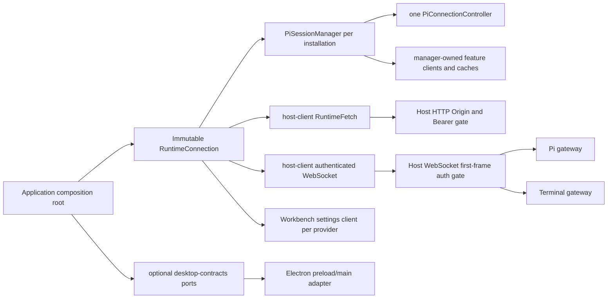

# Apps / Packages / Electron / Tauri Phase 1 Host Connection Evidence

Recorded: 2026-08-29

Baseline source revision: `77322072c64aa6a15d8ee8bf34927a91669db488`
(`refactor: split agent runtime into workspace packages`)

Branch: `codex/agent-runtime-workspace-refactor`

This document records the Phase 1 gate for
[`workbench-apps-packages-tauri-migration-plan.md`](../workbench-apps-packages-tauri-migration-plan.md).
Phase 1 removes the renderer's implicit same-origin and Electron-specific assumptions without yet
moving the root Next app, Runtime Host, or Electron container. Browser and current packaged Electron
therefore retain their existing same-origin topology while the shared client and server boundaries
are ready for a later loopback sidecar assembly.

## Delivered ownership model

The renderer composition root captures one immutable `RuntimeConnection` descriptor and derives
settings, Pi HTTP, Pi WebSocket, and Terminal WebSocket clients from that same value. A Pi
installation owns exactly one manager and one reconnecting connection controller. Transport-bound
feature facades, settings snapshots and mutation queues, package/update caches, context policy,
execution stores, Workspace File buffers, listeners, and Blob URLs are owned by the corresponding
manager or React provider lifetime rather than by module-global state.

Two descriptors may deliberately use the same logical `instanceId` while pointing at different
loopback ports and tokens. Tests prove that their URLs, Authorization headers, sockets, snapshots,
listeners, queues, and invalidation signals do not cross. Caller-owned connection and transport
options are cloned/frozen at the installation boundary, so later mutation cannot redirect an
installed client.

## Packages and contracts

Phase 1 added three real workspace leaves with bounded public APIs:

| Package                        | Responsibility                                                                                                                                                                    |
| ------------------------------ | --------------------------------------------------------------------------------------------------------------------------------------------------------------------------------- |
| `@workbench/host-contracts`    | Versioned immutable Runtime connection descriptors, strict control/auth DTO parsing, identity fields, and stable WebSocket close codes.                                           |
| `@workbench/host-client`       | Same-origin or loopback-only HTTP resolution, optional Bearer transport, and a browser-compatible WebSocket wrapper that authenticates before exposing a logical open connection. |
| `@workbench/desktop-contracts` | Platform-neutral, optional desktop capability ports. The first port is a strictly validated title-bar overlay capability.                                                         |

The Pi client accepts explicit per-call HTTP transport and an installation-scoped
`PiClientTransport`; it does not use a module setter or mutable default registry. Terminal's PTY,
transcript, and readiness sockets use the same Host WebSocket factory and root-relative protocol
paths. Production root consumers are protected by
[`check-transport-boundaries.mjs`](../../scripts/check-transport-boundaries.mjs), which rejects new
direct WebSocket construction, implicit runtime `location.origin`, raw workspace-content URLs, and
standalone Pi RPC helpers outside the exact composition/facade allowlist.

## Desktop HTTP and WebSocket boundary

The loopback Host transport has a shared, conformance-tested security model:

- HTTP accepts an exact configured renderer Origin and an exact Bearer credential. Token comparison
  is constant-time, preflight methods/headers are allowlisted, and credentials plus external Origin
  headers are scrubbed before delegating to Next or a business router.
- WebSocket upgrade first validates the Origin, then requires a strict, versioned authentication
  frame with the expected instance and token. Authentication frames are limited to 16 KiB and a
  bounded deadline; Pi and Terminal share a pending-auth admission limit.
- The authenticated acknowledgement must finish sending before the business gateway callback runs.
  A rejected, timed-out, mismatched, or prematurely closed socket cannot allocate a Pi subscription,
  session, Terminal session, or PTY.
- The client reports `CONNECTING` until acknowledgement, rejects pre-authentication `send`, and never
  puts a token in a URL, error message, close reason, or authentication acknowledgement.
- Stable close codes cover invalid frames (`4400`), credentials/instance (`4401`), timeout (`4408`),
  and protocol version (`4409`). Reconnect always reuses the installation's original frozen factory.

Current Electron still launches the combined same-origin Next/Runtime server. The server auth policy
is injectable and exercised by real HTTP and `ws` conformance tests, but the packaged Electron
product path intentionally does **not** activate loopback sidecar Bearer/bootstrap mode yet. Token
generation, versioned container control frames, and activation belong to the later Runtime artifact
and Electron supervision phases; no transitional environment variable or CLI token channel was
introduced.

## Desktop capability boundary

Electron no longer owns renderer DOM observation. Workbench observes its appearance state and calls
the optional `DesktopTitleBarPort`; a browser without that port is a no-op. The preload exposes only
the frozen `workbenchDesktop.titleBar.setOverlay` method, while main and preload both validate the
opaque `#RRGGBB` payload. Main also verifies the expected `webContents` and main frame. The shared
contract and Workbench adapter import neither Electron nor Tauri.

## Verification evidence

The Phase 1 worktree was checked after all parallel slices were integrated, then rebuilt from fresh
production output roots.

| Gate                             | Result | Evidence                                                                                                                                                                                                                 |
| -------------------------------- | ------ | ------------------------------------------------------------------------------------------------------------------------------------------------------------------------------------------------------------------------ |
| `pnpm check`                     | Pass   | Formatting/lint, workspace and transport boundaries, root plus all configured package typechecks, and the complete root/package test graph passed. Pi client alone passed `261/261`.                                     |
| Fresh `pnpm build`               | Pass   | Next 16.3.1 production compilation, TypeScript, static generation, and the custom Runtime server bundle passed after the old `.next`, `.desktop-build`, `.electron-build`, and `dist-electron` outputs were moved aside. |
| Custom-server external allowlist | Pass   | Still exactly `@earendil-works/pi-coding-agent`, `next`, `node-pty`, and `ws`; no `@workbench/*` runtime external was introduced.                                                                                        |
| `pnpm electron:pack`             | Pass   | Linux x64 unpacked application produced successfully. Staging measured `123.4 MiB`, `6353` files, `115` dependency packages; packaged application measured `123.3 MiB`, `6344` files.                                    |
| `pnpm electron:budget`           | Pass   | Independent budget check measured application `123.4 MiB`, `node_modules` `38.0 MiB`, `6353` files, and `115` dependency packages.                                                                                       |
| Staged Host smoke                | Pass   | The actual `.electron-build/app/desktop-runtime` emitted IPC ready on a random loopback port; `host.describe`, `session.list`, Pi `events.host` WebSocket upgrade, and IPC shutdown all passed.                          |
| Runtime cleanliness              | Pass   | Existing budget checks found no TypeScript, tests, source maps, broken symlinks, build-only packages, or undeclared workspace-source runtime packages.                                                                   |

Phase 0 staging was `123.3 MiB`, `6348` files and `115` dependency packages; its packaged app was
`123.2 MiB`, `6339` files. Phase 1 therefore adds about `0.1 MiB` and five staged/packaged files while
keeping the production dependency-package count and external allowlist unchanged. The explained
drift is the three small contract/client package runtime closures and Electron title-bar validation
helper; tests and TypeScript sources remain excluded from the staged runtime.

Targeted coverage additionally includes:

- strict Host contract parsing and malformed-frame rejection;
- same-origin compatibility and two loopback connections with independent URLs/tokens;
- real Host client-to-server authenticated WebSocket acknowledgement ordering;
- Pi and Terminal zero-resource allocation before authentication;
- HTTP CORS/Bearer/raw-header scrubbing and token non-disclosure;
- Pi manager creation/reconnect and feature/cache isolation;
- Terminal ready/reconnect/invalid-session behavior;
- provider lifetime, Strict Effects replay, disposal, and late async completion;
- sidecar Workspace File authenticated byte fetch, Blob revocation, source switching, failure retry,
  and prevention of duplicate large-text/source/diff fetches;
- preload/main title-bar validation and the browser no-capability path.

## Residuals carried forward

These are deliberate later-phase work, not failed Phase 1 gates:

1. Activate the already-tested sidecar auth policy only when the versioned Runtime artifact/control
   protocol and Electron container bootstrap own token generation and delivery.
2. Validate custom-protocol renderer to loopback HTTP/WebSocket behavior, including Private/Local
   Network Access behavior, in the real Electron/Tauri WebViews before static desktop production.
3. The Pi package retains its explicit no-transport same-origin compatibility fallback. Workbench
   production consumers are mechanically restricted to installation-bound facades.
4. Continue updating the machine ownership ledger after each Phase 2 capability extraction; do not
   hide path or dependency drift through a blind snapshot refresh.

With these boundaries and evidence in place, the repository can enter Phase 2 capability extraction
without making a shared implementation part of `apps/web` merely because it currently lives under a
root application directory.
