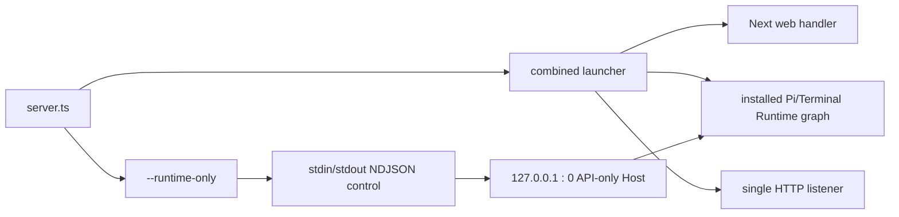

# Phase 3 Runtime Host Evidence

记录日期：2026-08-30

本文件是 [迁移计划 Phase 3](../workbench-apps-packages-tauri-migration-plan.md) 的实现与 fresh gate
证据。它记录 Next/Runtime 职责原位拆分、唯一 Runtime API owner、control/auth/lifecycle contract、custom-server
closure、native staging 和两种 Host smoke；不把 Phase 4 的 `apps/runtime-node` relocation、Electron 双进程监督或
installer 产物提前计入本阶段。

## 本次基线与执行记录

以下记录来自同一共享工作树和最终一次 fresh 输出，不复用 Phase 0、Phase 1 或 Phase 2 的历史 artifact。

| 项目                                                      | 本次 Phase 3 记录                                                                                                                                                                                                                                                                         |
| --------------------------------------------------------- | ----------------------------------------------------------------------------------------------------------------------------------------------------------------------------------------------------------------------------------------------------------------------------------------- |
| 源码 revision / branch / 工作树状态                       | `77322072c64aa6a15d8ee8bf34927a91669db488`；`codex/agent-runtime-workspace-refactor`；共享 dirty worktree，fresh gate 开始时 `git status --porcelain=v1` 为 539 项；没有提交、暂存或重写用户改动                                                                                          |
| OS、架构、Node、pnpm、Next、Electron、ABI                 | Linux `7.0.0-30-generic` x86_64 glibc；Node `v24.16.0`（module ABI 137、N-API 10）；pnpm `11.22.0`；Next `16.3.1`；Electron `43.4.1`（module ABI 148、N-API 10）                                                                                                                          |
| fresh 输出根的移出/恢复位置                               | 将 `.next`、`.desktop-build`、`.electron-build`、`dist-electron` 可恢复地移至 `/projects/workbench-aui/phase3-runtime-host-final-artifacts.dVgRAg`，逐项确认四个源输出根均不存在后才开始最终 build；第一次诊断产物另保留于 `/projects/workbench-aui/phase3-runtime-host-artifacts.6tjc9M` |
| `pnpm check` 输出与退出码                                 | `0`；lint/format、workspace/transport/Runtime ownership guards、root + 25 package typecheck、root/package tests 全部通过；Pi server 最终 `703/703`                                                                                                                                        |
| `pnpm build` 输出与退出码                                 | `0`，约 18.1 秒；Next production build 生成 13 条 app routes；`electron/build-desktop-server.cjs` 生成 custom server，精确 external 6 项且无 `@workbench/*` external                                                                                                                      |
| `node electron/build-package.cjs --dir` 输出与退出码      | `0`，约 18.2 秒；Electron rebuild 完成；staged Runtime `120.5 MiB / 6316 files / 115 dependency packages`；electron-builder 生成 `dist-electron/linux-unpacked`；directory packaging 后预算再次通过                                                                                       |
| `pnpm electron:budget` 输出与退出码                       | `0`；`app=120.5 MiB`、`node_modules=37.2 MiB`、`files=6316`、`packages=115`                                                                                                                                                                                                               |
| combined、native、API-only smoke 的命令、退出码和脱敏报告 | 三项均 `0`；build-package 内 mandatory wiring 通过后又分别直接重跑并采集下文脱敏报告                                                                                                                                                                                                      |
| artifact 字节数、文件数、依赖包数、动态/原生清单、SHA-256 | 见“Fresh artifact、closure 与 native provenance”；所有计数、hash 和 smoke 均来自上述最终输出                                                                                                                                                                                              |

历史测量仍以 [Phase 0 Build Baseline](./phase-0-build-baseline.md)、
[Phase 1 Host Connection Evidence](./phase-1-host-connection-evidence.md) 与
[Phase 2 Aggregate Release Evidence](./phase-2-aggregate-release-evidence.md) 为准；本文件只增加 Phase 3 的 fresh
证据，不覆盖其数字、hash 或结论。

## 已落地的运行时职责边界

本阶段当时的根 `server.ts` 为同时承载 Web 与 `--runtime-only` 的薄入口；后续迁移已把这两项职责分别移动到
[`apps/web/src/server.ts`](../../apps/web/src/server.ts) 与
[`apps/runtime-node/src/main.ts`](../../apps/runtime-node/src/main.ts)。当时它默认加载 combined launcher，
`--runtime-only` 在取得 stdout control lease 后才加载 API-only Runtime Host。两条路径分别是：



`workbench/server/combined-workbench-server.ts` 只在兼容的 combined 模式组合 Next web handler、已安装 Runtime
service 与一个 HTTP listener。`runtime/server/installed-api-only-runtime-host.ts` 只安装相同的 Runtime graph 并交给
`@workbench/host-server` 的 API-only listener；该路径不加载或调用 Next handler。API-only Host 固定绑定
`127.0.0.1` 和端口 `0`，并在 bound 后回读实际地址、探测身份端点。

两种 assembly 都从 `runtime/server/installed-runtime-service.ts` 取得 Pi HTTP handler、Pi/Terminal WebSocket
gateway 和 upgrade-required path 集合。该 service 本身不依赖 Next。当前根 `dev/start` 的 combined 用户入口仍保留，
尚未进入 Phase 4 的 `apps/runtime-node` relocation 或双进程监督。

## Runtime API、Next 过渡缝与路径安全

Runtime API 的实际业务 router 由已安装 Pi service 提供。以下 **10 个** Next route 仅导入并直接调用
`delegateRuntimeApiRoute`；`scripts/check-runtime-host-ownership.mjs` 以 source-aware token scanner 和拒绝为默认的
有限语法白名单固定 import、配置、HTTP methods 与直接转发形状：

| Runtime route                    | 过渡方式  |
| -------------------------------- | --------- |
| `/api/[rpc]`                     | delegator |
| `/api/session.export`            | delegator |
| `/api/workspace.files.content`   | delegator |
| `/api/pi/models`                 | delegator |
| `/api/pi/running/events`         | delegator |
| `/api/pi/sessions`               | delegator |
| `/api/pi/sessions/[id]`          | delegator |
| `/api/pi/sessions/[id]/commands` | delegator |
| `/api/pi/sessions/[id]/events`   | delegator |
| `/api/pi/workspaces/pick`        | delegator |

跨 custom-server 与 Next route bundle 的缝是 `workbench/server/runtime-api-route-delegator.ts` 中版本化的
`globalThis` binding。combined launcher 在 Next 准备 route bundle 前绑定一个 Runtime handler，route bundle 不导入、
也不构造 Pi service；binding 不可用时返回无缓存的 `503 runtime_host_unavailable`。这是一条 Phase 3 兼容缝，
不是第二个 Host、session registry 或 stream hub。

`@workbench/host-server/workbench-http-server` 先判断 Runtime-owned API，再把非 Runtime 请求交给 Next。非 Runtime
WebSocket upgrade 仅经 `nonRuntimeUpgradeRelay` 直接 relay 给 Next；Runtime-owned upgrade 不会进入该 relay。
`isApiHttpRequest` 对绝对/网络路径、缺失目标、反斜杠、dot segment、重复 slash、NUL、畸形百分号和多层编码做
有界归一化：任何含糊或最终指向 `/api` 的请求都留在 Host trust/auth fence 内，不能先被 Next 规范化。

Canonical API path 是唯一支持形状。非 canonical 或编码/含糊 API path 当前走 fail-closed Runtime 处理并安全返回
`404`，不保留旧行为的 `308` 重定向。HTTP 与 Upgrade 的攻击矩阵、malicious Origin 和 sidecar 未认证请求均有
Host package 回归；fresh API-only smoke 再验证 canonical health/identity/RPC/WS 路径。

## 控制协议、身份与认证边界

`@workbench/host-server/runtime-host-control-session` 实现严格的一次 start / 一次 shutdown NDJSON session：start
frame 提供 token 与 allowed origins，Host 生成与凭据独立的 instance id，只输出 schema 创建的 ready、
startup-error 或 shutdown-ack frame。控制输入损坏、顺序错误、stdin 断开、启动失败或输出失败都会走有界 shutdown /
非成功结果，不会继续提供未受控服务。

`runtime/server/runtime-control-stdout.ts` 在导入应用图之前独占 stdout；lease 把其他
`process.stdout.write` 重定向到 stderr，只有控制 Writable 可写 NDJSON。`runInstalledRuntimeHostControl` 同时把
`console.debug/info/log` 重定向到 stderr，SIGINT/SIGTERM 和 control 结果按受控 lifecycle 退出。

通用 API-only ingress 提供受保护的 `GET/HEAD /api/health` 与 `/api/identity`（带
`Cache-Control: no-store`），拒绝其他方法。Host listener 在 loopback、port 0、身份回读的前提下启动。sidecar policy
在 HTTP 上执行 exact Origin、Bearer token、预检和 header canonicalization；在 Pi 与 Terminal WS 上执行 upgrade
trust、first-frame token/instance authentication、限额/时限和确认帧先于业务分配。`/api/events.host`、
`/api/events.mux` 与 Terminal 的 HTTP 请求要求 upgrade，普通 HTTP 不会伪装为流连接。

## 单一安装图与关闭顺序

`workbench/server/pi/installed-pi-server.ts` 是应用层唯一 Pi installation boundary，使用版本化
`globalThis.__workbenchInstalledPiServer` 保留已有 Agent、RPC graph、session registry 与 stream hub；模块重载只升级
transport/lifecycle facade。Package Catalog、Automation 与 Execution 各有同一 process-lifetime service getter，以保留
network/timer/repository、active run 和 Pi callback identity。现有 source/test 约束的关闭顺序为：

```text
Package Catalog shutdown → Automation shutdown → Execution shutdown → Pi shutdown hooks
  → Terminal session/tool-session teardown
```

Pi disposer 先关闭并等待 Package Catalog 的 scheduler、在途 fetch 与 retry，再依次关闭 Automation、Execution 和 Pi
hooks；Runtime disposer 等 Pi quiescent 后才关闭 Terminal owners。所有 process-lifetime disposer 都在任何 abort 或外部
callback 前发布稳定 Promise，支持同步重入并在出错时继续释放后续 owner。API-only lifecycle 先停止 HTTP admission，
以同一 deadline 并发关闭升级 socket 与 Runtime disposer；combined 启动失败则取消 warmup、解除 route binding，并在
5 秒上限内并发清理 Runtime 与 Next application。该 bounded cleanup 解决启动半失败的资源回收，但不应被表述为已完成
Phase 4 process relocation 或 Electron split。

## Fresh staged smoke

`electron/build-package.cjs` 按 staged native smoke、combined staged Runtime smoke、API-only Runtime smoke、
electron-builder 和 packaged budget 的顺序执行；任一 smoke 失败都会阻止 packaging。最终 package 命令通过后，又对同一
`.electron-build/app/desktop-runtime` 直接重跑三项 CLI，取得以下脱敏结果：

```text
ELECTRON_RUN_AS_NODE=1 <electron> electron/native-runtime-smoke.cjs \
  --runtime .electron-build/app/desktop-runtime
exit 0
target = linux/x64/glibc, Electron 43.4.1, ABI 148, N-API 10
loaded = tree-sitter.node, tree-sitter-bash.node, node-pty/pty.node（均来自 staged inventory realpath）

node electron/staged-runtime-smoke.cjs \
  --runtime .electron-build/app/desktop-runtime
exit 0; durationMs = 815
HTTP = events.host:426, events.mux:426, untrusted-host:403
RPC = host.describe, session.list
WS = events.host:1000, events.mux:1008, terminal:1000
ready pid/port 与 Terminal processHandle 已脱敏

node electron/staged-api-only-runtime-smoke.cjs \
  --runtime .electron-build/app/desktop-runtime
exit 0; durationMs = 1124
control = start:stdin, ready, shutdown:stdin, shutdown-ack, exit:0
HTTP = health:200, identity:200, missing-bearer:401, malicious-origin:403
RPC = host.describe, session.list
WS = events.host:authenticated:1000, events.mux:authenticated:1008,
     terminal:authenticated:1000
ready pid/httpOrigin 与 Terminal processHandle 已脱敏；报告不含 access token
```

API-only smoke 使用真实 staged `desktop-server-launcher.cjs --runtime-only`、stdin/stdout control、Bearer HTTP、
first-frame authenticated WS 和真实 Terminal gateway/node-pty。它在读到严格 `shutdown-ack` 后继续等待子进程自然
`exit:0` 与 stdio close；因此本次通过不是 parent 强杀或成功路径 `process.exit(0)` 的假绿。

## esbuild closure 与预算契约

`electron/build-desktop-server.cjs` 用真实 esbuild `metafile.outputs[*].imports` 收集实际 external imports，并拒绝任何
`@workbench/*` external。`electron/desktop-runtime-budget.cjs` 将 runtime allowlist 与预算精确比对；当前要求的 external
集合恰为六项：

```text
@earendil-works/pi-coding-agent
next
node-pty
tree-sitter
tree-sitter-bash
ws
```

该集合是当前 combined root artifact 的 source-level closure/预算契约；其中 `next` 仍因 Phase 3 保留 combined launcher
而存在。它不是 Phase 4 独立 Runtime artifact 的最终 allowlist。

## Fresh artifact、closure 与 native provenance

最终输出的直接计数如下；目录字节数使用 `du -sb`，Runtime budget 使用实际 regular-file byte sum，因此
`.electron-build` 的目录计数与 `appBytes` 有少量目录项差异。

| 输出/范围                                 | 字节数        | 文件数 | 说明                                                     |
| ----------------------------------------- | ------------- | ------ | -------------------------------------------------------- |
| `.next`                                   | 446,550,112   | 4,667  | fresh Next build                                         |
| `.desktop-build`                          | 5,603,836     | 2      | `server.mjs` + source-level `runtime-allowlist.json`     |
| `.electron-build`                         | 126,349,645   | 6,316  | staged Electron app                                      |
| `dist-electron`                           | 406,647,654   | 6,333  | `linux-unpacked` directory package；本次未生成 installer |
| staged app budget regular files           | 126,338,204   | 6,316  | `node_modules=39,045,073` bytes；115 dependency packages |
| staged source map/source/test/broken link | 0 / 0 / 0 / 0 | —      | budget 与 native inventory 均 fail-closed                |

动态依赖清单确认 `@earendil-works/pi-ai@0.84.2` 与
`@earendil-works/pi-coding-agent@0.84.2`；原生 owner 均为 `@workbench/terminal-server`：

| 包                        | 选中 binary                                                               | bytes     | SHA-256                                                            |
| ------------------------- | ------------------------------------------------------------------------- | --------- | ------------------------------------------------------------------ |
| `node-pty@1.1.0`          | `node_modules/node-pty/build/Release/pty.node`                            | 75,728    | `d2e7a2fd87b6c6ef9653230e776dc7569b19a5be8de2c0a53940f19c9246dd05` |
| `tree-sitter@0.25.1`      | `node_modules/tree-sitter/prebuilds/linux-x64/tree-sitter.node`           | 679,752   | `8bac0eef8899dd6e2feda111df061cb6bdbe92c0b3672ca3c7fe4df5cb176ea6` |
| `tree-sitter-bash@0.25.1` | `node_modules/tree-sitter-bash/prebuilds/linux-x64/tree-sitter-bash.node` | 1,382,672 | `26573c48d8780349cb7e386328faba91e50833032ac06f5760cfca3568611d97` |

关键 manifest/artifact digest：

| 文件                                                     | SHA-256                                                            |
| -------------------------------------------------------- | ------------------------------------------------------------------ |
| `.desktop-build/server.mjs`                              | `2a6d38d0e6a8a328601f77d620448828b3a3674d61ad3e8462942da2da968bfb` |
| `.desktop-build/runtime-allowlist.json`                  | `0f8726edd16e76f08657a5f3b688797193b09c3e262a0beb7715ba756ad9a868` |
| staged `desktop-runtime/runtime-allowlist.json`          | `d61c9d28853d1f203670df5a88193a317dc5052f57e5dbf51264fccdb05ecb69` |
| staged `desktop-runtime/native-runtime-inventory.json`   | `a08f313ceedc8f16dadb829c56c470397eb1a4ecb997f003f240282637f11f54` |
| packaged `desktop-runtime/native-runtime-inventory.json` | `a08f313ceedc8f16dadb829c56c470397eb1a4ecb997f003f240282637f11f54` |

`tree-sitter@0.25.1` 的 Bun-only template require 会让 NFT 1.11 产生
`./prebuilds/\x1a-\x1a/tree-sitter.node` 假路径。最终实现没有关闭 NFT glob/pure-expression analysis，也没有放宽
warning allowlist；`prepare-package.cjs` 通过 NFT 公共 `resolve` hook，只在 external allowlist、Terminal owner、真实
issuer、target tuple、单一 regular winner 与 realpath confinement 全部精确匹配时，把该 specifier 解析到受 inventory
约束的 target prebuild，其余 resolution 仍交给 NFT 默认实现。

## Gate 中发现并关闭的真实缺陷

第一次 fresh staging 没有被当作通过记录，而是暴露并关闭了两个真实 blocker：

1. NFT 对上述 Tree-sitter Bun template 产生 unresolved warning。定向 resolver 修复后，真实 trace warning 从 4 条降为
   既有允许的 3 类，同时仍把 target `tree-sitter.node` 纳入 file list。
2. API-only smoke 已收到 `shutdown-ack`，但 Package Catalog warmup 丢弃 caller signal，并在 `finally` 启动无 owner 的
   background refresh，导致进程 5 秒内不能自然退出。`PiPackageCatalogService` 现拥有 lifecycle AbortController、在途
   operation tracking 和稳定 `shutdown()`；Installed Pi v3 将其纳入最先关闭的 process-lifetime owner。最终 smoke 在
   1.124 秒内完成 start/auth/RPC/WS/PTY/shutdown 并自然 `exit:0`。

## 结论与剩余边界

Phase 3 的职责拆分与本阶段 gate 已完成：combined/API-only Host、RPC、Pi WS、Terminal WS、shutdown、非 Pi Host
fixture、单一 registry/hub、整仓 check、fresh build、native staging、directory packaging 和 budget 均通过。

仍不声称以下事项完成：

1. 未运行 clean checkout + frozen install；本次是在现有共享 dirty worktree 上执行。未生成 AppImage/installer，
   `--dir` 只验证 Linux unpacked directory package。
2. 未执行 macOS、Windows 或 musl target，也未启动 Browser/Playwright。native inventory/smoke 只证明本机
   Linux x64 glibc + Electron ABI 148。
3. 不声称 `apps/runtime-node`、`apps/web`、Electron process split、static renderer、Tauri scaffold 或 Tauri migration
   已开始或完成；它们属于 Phase 4 及以后。
4. Runtime API 只支持 canonical path；含糊/编码/重复或 trailing slash API path 被 Host 安全边界 fail-closed 为
   Runtime-owned，并可能返回 `404`，不复刻旧 Next 的 `308` canonical redirect。
5. Catalog、Automation、Execution 等 installed owners 是 process-lifetime contract；同一 Node 进程完整 dispose 后再安装
   新 Runtime graph 不在本阶段支持范围，未来若需要须引入显式 generation/reset contract。
6. electron-builder 仍报告既有的缺少 `description`/`author`、`asar` disabled 与非当前平台 optional dependency 提示；
   它们没有改变本次 Runtime closure、native provenance 或目录包通过结论，但应在后续 release packaging 单独处理。
