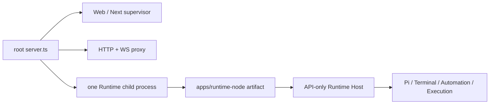

# Phase 4 Runtime Node Evidence

记录日期：2026-08-30

本文件收口 [Apps / Packages / Electron / Tauri 迁移计划的 Phase 4](../workbench-apps-packages-tauri-migration-plan.md)：
`apps/runtime-node` 已成为唯一的 API-only Runtime Host assembly，根 `server.ts` 已降为临时 Web
supervisor/proxy，Electron staging 同时使用独立的 Web supervisor 与 opaque Runtime child artifact。本文件不把
`apps/web` relocation、Electron app relocation、静态 desktop renderer、Tauri 或 Phase 7 的平台级 hard-containment
提前计为完成。

基线 source revision：`77322072c64aa6a15d8ee8bf34927a91669db488`

分支：`codex/agent-runtime-workspace-refactor`

本次记录来自共享 dirty worktree；没有在此 gate 中提交、暂存、reset 或覆盖既有改动。它也不是 clean checkout +
`pnpm install --frozen-lockfile` 的证据。

## 已完成的 assembly 边界

`apps/runtime-node` 是第一个精确加入 `apps/*` workspace pattern 的真实 app，拥有自己的 manifest、独立
`tsconfig`、`src/`、`test/` 及 artifact builder。它是以下 application-lifetime owner 的唯一 composition root：

- Pi Server installation、Terminal、Automation、Execution 与 Package Catalog provider selection；
- API-only listener、loopback/port-0 control、identity/health、Bearer 与 first-frame WebSocket trust；
- Runtime RPC warmup 与确定的 shutdown graph；
- Runtime artifact 的 CLI/config parsing、manifest 和 native/dynamic dependency closure。

当时的根 `server.ts` 不再在 Web process 内创建 Runtime graph；其 Phase 5 后的现行后继入口为
[`apps/web/src/server.ts`](../../apps/web/src/server.ts)，supervisor/proxy 实现位于
[`apps/web/src/server/migration-workbench-supervisor.ts`](../../apps/web/src/server/migration-workbench-supervisor.ts)。在本阶段
它只作为 Phase 5 前的短期 Web supervisor：启动一个 opaque Runtime child、消费严格 NDJSON ready/control contract，
并把 Runtime HTTP/WebSocket 请求代理到 child。Web 与 Runtime 之间没有 source import；它们只通过版本化
control/artifact contract 通信。



该结构仍是迁移过渡层：Phase 5 才移动 Next app，Phase 7 才移动 Electron app 并实现 production Web-ready →
Runtime-ready → BrowserWindow 的平台容器生命周期。

## Runtime artifact contract 与独立执行

Runtime builder 只接受 `apps/runtime-node` 与 `packages/` 的 source closure，esbuild 将所有
`@workbench/*` source package bundle 到 `server.mjs`。它拒绝 `next` 和任何 `@workbench/*` external；目前精确
third-party external set 为：

```text
@earendil-works/pi-coding-agent
node-pty
tree-sitter
tree-sitter-bash
ws
```

动态 package 清单为 `@earendil-works/pi-ai` 和 `@earendil-works/pi-coding-agent`；native package 清单为
`node-pty`、`tree-sitter`、`tree-sitter-bash`。manifest 同时固定 entrypoint、control/host protocol version、upgrade
paths、target tuple、external/dynamic/native closure 与资源 allowlist。每项 source/NFT/native input 都有 realpath
confinement，因而不能用 app 外 source 或越界 symlink 伪造 artifact 成功。

从临时、非 repo cwd 运行已构建的 Node artifact 并搬迁 artifact 后，仍完成真实 API-only conformance：strict
stdin/stdout NDJSON `start → ready → shutdown → shutdown-ack`、loopback `health`/`identity`、Bearer HTTP、
`host.describe`/`session.list` RPC、Pi `events.host` / `events.mux` WebSocket 与 Terminal PTY WebSocket，最后自然
退出。该证据证明 app 与 artifact 没有依赖调用者 cwd 或 Web source tree。

Node target 是本机 Node `24.16.0`、Linux x64 glibc、module ABI `137`、N-API `10`；它与 Electron artifact
target 是不同的、不可互换的 materialization。

## Electron-native target、staging 与 smoke

Electron packaging 不复用 Node ABI artifact。真实 target 为：

| Field                   | Value                                                 |
| ----------------------- | ----------------------------------------------------- |
| Runtime flavor          | `electron-node`                                       |
| Target key              | `electron-node-linux-x64-glibc-abi148-electron43.4.1` |
| Electron                | `43.4.1`                                              |
| Embedded Node           | `24.18.1`                                             |
| Node module ABI / N-API | `148` / `10`                                          |
| Platform                | Linux x64 glibc                                       |

该 target 会在 Electron ABI 下真实运行 `@electron/rebuild`，并以 native inventory 的 selected winner
加载实际 binary，而不是仅比对 filename。最终 inventory 记录的 native files 为：

| Package                   | Selected binary                                                           |     Bytes | Mode   | SHA-256                                                            |
| ------------------------- | ------------------------------------------------------------------------- | --------: | ------ | ------------------------------------------------------------------ |
| `node-pty@1.1.0`          | `node_modules/node-pty/build/Release/pty.node`                            |    75,728 | `0775` | `d2e7a2fd87b6c6ef9653230e776dc7569b19a5be8de2c0a53940f19c9246dd05` |
| `tree-sitter@0.25.1`      | `node_modules/tree-sitter/prebuilds/linux-x64/tree-sitter.node`           |   679,752 | `0664` | `8bac0eef8899dd6e2feda111df061cb6bdbe92c0b3672ca3c7fe4df5cb176ea6` |
| `tree-sitter-bash@0.25.1` | `node_modules/tree-sitter-bash/prebuilds/linux-x64/tree-sitter-bash.node` | 1,382,672 | `0664` | `26573c48d8780349cb7e386328faba91e50833032ac06f5760cfca3568611d97` |

最终 staged Runtime child 为 `2,603` regular files、`161` symlinks；其 resource manifest 覆盖 `2,597`
model/runtime resources。结合 Web supervisor 后，完整 `desktop-runtime` 是 `7,404` regular files 加 `225`
symlinks（总计 `7,629` entries）；日志中的分项为 Web supervisor 约 `94.7 MiB`、Runtime child 约 `29.0 MiB`。

以下均在真实 staged artifact 或其搬迁副本上完成，不以 fixture 代替：

- Electron-as-Node native smoke 加载 inventory 指定的 `node-pty`、`tree-sitter` 与 `tree-sitter-bash`；
- combined Host smoke 经 Web supervisor/proxy 取得 `host.describe`、`session.list`、Pi host/mux WS，以及真实
  Terminal PTY 流与正常 shutdown；
- direct API-only smoke 经 artifact 的 control channel 取得 ready、authenticated HTTP/RPC/WS/PTY 与自然退出；
- relocation smoke 从临时目录执行上述 artifact，证明运行时资源没有回读 repository source；
- 认证桥接以等价、request-bound 的 policy capability 识别 proxy clone，而不是 object identity；它仍限制一次使用，
  失配会消耗 capability，且在 HTTP/WS trust 成功前不会分配 Pi/Terminal business graph。恶意 Host/Origin、错误
  Bearer 与 replay 都有回归覆盖。

## Packaging full-tree closure

第一次真实 `electron-builder --dir` 暴露了 package-copy drift：builder 的 `files` pipeline 会遗漏 3 个
`node-addon-api/*.target.mk` 和 `tree-sitter-bash` 的 `bindings/node/binding.cc`；尝试 `extraResources` 又因 root
`node_modules` matcher/filter 与 copy mode normalization 不满足完整树 preservation。这个失败没有被记录为通过。

最终配置刻意不让 `desktop-runtime` 进入 `build.files` 或 `extraResources`。`electron/after-pack.cjs` 在 builder
完成 app copy 之后，先检查 staging/Resources 的 lexical 与 realpath confinement、存在 curated allowlist，再删除
Resources 中同名目标并用 `cpSync({ recursive: true, preserveTimestamps: true, verbatimSymlinks: true })` materialize
完整 Runtime tree。production `electron/main.cjs` 只从 `process.resourcesPath/desktop-runtime` 解析 child root；开发
模式才使用 source-adjacent staging root，且启动环境会剥离 Runtime artifact override。

最终真实命令 `node electron/build-package.cjs --dir` 成功：它按顺序执行 artifact build、native rebuild/smoke、
combined/direct Host smoke、electron-builder Linux unpacked directory package、packaged budget。最后的 budget 将
staged 与 packaged `desktop-runtime` 做全树精确比较：每一个 regular file 的 logical path、size、SHA-256、mode，以
及每一个 symlink 的 logical path、raw link target 都相同；`7,404 + 225` entries 的 delta 为 `0`。这也检验了上述
4 个先前丢失的资源已存在于 packaged resources。`--dir` 仅为 Linux unpacked package，不是 installer/AppImage
发布证明。

Runtime budget 还要求 Web supervisor 与 Runtime child 各自的 manifest/allowlist 正确、aggregate third-party closure
精确、没有 `@workbench/*` runtime external、没有未声明 workspace source 或 build-only package，并分别限制 source map、
broken symlink 与不允许的 source/test-shaped payload。

不能把这项结果表述为 literal “0 TypeScript”。artifact 中有 **99 个** manifest-owned Pi examples；它们是
model-readable SDK resources，可能为 TS 或 test-shaped，但不会被 startup、NFT 或 dynamic loader 自动 admission。预算
实际断言的是：这 99 项之外的 forbidden TypeScript 为 `0`、examples 之外的 forbidden test-shaped payload 为 `0`。

## Gate 摘要

| Gate                                        | Result | Proof boundary                                                                                                          |
| ------------------------------------------- | ------ | ----------------------------------------------------------------------------------------------------------------------- |
| Runtime Node production artifact            | Pass   | app/packages-only bundle closure、target manifest、no Next / no `@workbench/*` external、relocated API-only conformance |
| Root Web supervisor                         | Pass   | one child only、strict NDJSON control、proxy/auth boundary、no second Host graph                                        |
| Electron ABI-native artifact                | Pass   | exact Electron `43.4.1`/ABI `148` rebuild, manifest-selected native load and hashes above                               |
| Combined/direct/relocated Runtime behavior  | Pass   | ready/RPC/Pi WS/Terminal PTY/shutdown on actual artifacts                                                               |
| Directory package and resource preservation | Pass   | `node electron/build-package.cjs --dir` plus staged ↔ packaged full-tree `0` delta                                      |
| Packaged budget                             | Pass   | split Web/Runtime manifests, resource/native provenance and source-shape policy                                         |
| Fresh production build                      | Pass   | root `pnpm build` rebuilt Runtime artifact and the Web supervisor bundle with its exact Web-only `next` external        |
| Complete repository validation              | Pass   | `pnpm check`: formatting/lint, ownership and transport guards, root/apps/packages typecheck, and all test layers        |

The complete repository validation ran after the final Phase 0 metadata refresh and Phase 4 documentation update, with
the shared worktree held still for the duration. It exited successfully as one `pnpm check` invocation.

## Residuals and explicit non-claims

1. **Phase 7 hard-containment remains open.** Cooperative shutdown and parent-managed bounded cleanup are proven, but
   cross-platform hard crash/orphan containment (Windows Job Object, Linux cgroup/PDEATHSIG-equivalent policy, and their
   release tests) is not completed.
2. `@workbench/host-contracts` presently contains provider-specific Pi/native deployment constants. A later extraction
   should move that deployment contract to a Runtime-artifact-focused package without reversing the current dependency
   direction.
3. The builder's current input realpath checks confine known source inputs. A dedicated hardening pass should add a
   provenance pre-walk for nested overlay symlinks before their copy, even though the frozen current package closure has
   no observed escape.
4. An injected unit test covers unexpected Runtime child exit causing Web sibling closure. A separate real-process
   crash-to-sibling-closure proof remains desirable before claiming the complete Electron supervision matrix.
5. This is Linux x64 glibc, Electron `43.4.1`, ABI `148` proof only. It does not prove macOS, Windows, musl, signing,
   installer artifacts, Browser/Playwright behavior, static desktop renderer, or Tauri sidecar behavior.
6. Phase 5 has not moved `app/`, Next configuration, Web composition, or root aliases. Phase 6 must make standalone
   staging consume independently versioned Web and Runtime manifests; Phase 7 must then relocate the Electron app.
