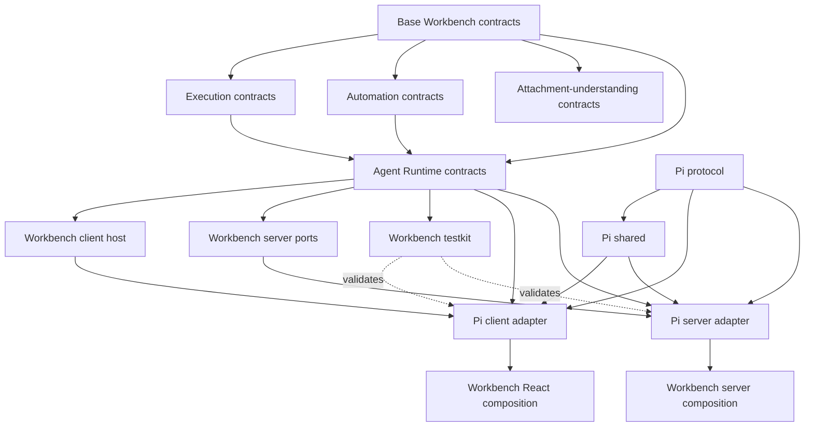

# Workbench Agent Runtime 多 Package 重构计划

状态：Completed（2026-08-29；Agent Runtime first delivery）

目标：把当前单 package 内的 `runtime/**` 模块重构为 pnpm workspace 下多个拥有独立
`src/`、`test/`、`package.json` 和 `tsconfig.json` 的 package；由 Workbench 定义公共接口，Pi 作为
第一个具体 Adapter 实现。

## 0. 实施结果

本计划的 Agent Runtime 第一交付已经完成。仓库现在包含 14 个真实 pnpm workspace leaf
package：4 个领域 contracts、4 个 Workbench Agent Runtime Core package、4 个 Pi Adapter package，以及
2 个通用 server package。分组目录不包含 `package.json`，每个 leaf package 都拥有独立的 `src/`、适用的
`test/`、有限 `exports`、manifest 和无根 `@/*` alias 的 `tsconfig.json`。

已落地的关键边界：

- Workbench owns contracts、client host、server ports 和 client/server testkit；Pi protocol、shared、client、server
  均作为 Adapter leaf package 实现这些接口；
- 服务端通用 persistence、RPC error、process environment、shutdown/settings document 支撑收口到
  `@workbench/server-core`；`@workbench/execution-server` 现拥有 Execution node executor/error、compiler、
  engine、repository、service 和 Terminal Command adapter，而 Pi 只在应用安装层注入 Agent executor/catalog；
- 浏览器与服务端各自只有一个显式 Pi composition root；测试中的非 Pi fixture 可以只实现 Workbench 最小
  client/server contract；
- Runtime-neutral builtin extensions 与当前安装 Runtime 的 contributions 已拆成两个互斥列表；Pi UI 能力由
  `@workbench/agent-runtime-pi-contributions` 拥有，并只经 `apps/web` 应用组合边界暴露；
- 旧 `runtime/assistant-ui`、`runtime/pi/{contracts,shared,client,server}` 以及已迁移的
  `runtime/shared`/`runtime/server` compatibility 实现已删除；
- 本计划第一交付中的 custom Electron server 会 bundle 所有 `@workbench/*` source package，并机械断言其 single-server
  external allowlist 精确为 `@earendil-works/pi-coding-agent`、`next`、`node-pty`、`ws`。

最终 gate 全部通过：`pnpm check`、fresh `pnpm build`、Electron staging/runtime budget、staged server
ready + `host.describe`/`session.list` RPC + Pi WebSocket smoke，以及 `pnpm electron:pack`。最终 staged runtime 为
123.3 MiB、6348 个文件、115 个依赖 package；packaged Linux directory 为 123.2 MiB、6339 个文件。产物中
TypeScript、测试、source map、broken symlink 和 `@workbench/*` external runtime package 均为零；这是当时单一
custom-server artifact 的历史测量，并非后续拆分 artifact 的约束。

source-first exports 同时声明 `types`、`import` 和同源 `default` 条件；实际修改 Pi Protocol 与 Pi Server 的
`packages/**/src` 文件后，`pnpm dev` 包装路径和 Electron development 使用的直接 `tsx watch server.ts` 路径都检测到
变更、重启并再次完成 ready/RPC warmup。

本计划第一交付收口时，按原始范围约束，Next 应用仍位于仓库根；这不是该交付的未完成项。后续迁移已将它移入
`apps/web`，并保留本计划完成的 Pi Client/public installation 边界。独立 Web/Runtime manifests 已取代上述
single-server allowlist：Web external 精确为 `[next]`，Runtime external 精确为
`[@earendil-works/pi-coding-agent,node-pty,tree-sitter,tree-sitter-bash,ws]`，aggregate 为六个唯一 package；dynamic ownership
另行精确记录为 `[@earendil-works/pi-ai,@earendil-works/pi-coding-agent]`。Runtime manifest 可精确列出 Pi README/docs/examples
的 model-readable closure，其中允许 manifest-owned 的 TypeScript/test-shaped 资源，但它们不构成 startup、NFT 或
dynamic-loader admission，closure 之外仍禁止这类资源。

后续 Extension Platform、Host Server、Terminal、Execution 与 Shell capability extraction 不回写或重新定义本计划
已经完成的第一交付范围与历史 gate 度量。

## 1. 结论与范围

本次重构采用 Ports and Adapters（端口与适配器）结构：

- Workbench 拥有跨实现稳定的 contracts、浏览器 Runtime Host、服务端 ports 和契约测试；
- Pi 只实现 Workbench 定义的 client/server 接口，并保留自己的 wire protocol、SDK 对象和生命周期；
- Workbench Core 不导入 Pi；只有应用组合根显式选择 Pi installation；
- 浏览器继续复用 assistant-ui 的 `AssistantRuntime`、`RemoteThreadListAdapter` 和 capabilities，不创建第二套
  Workbench message/thread/stream 模型；
- Pi 的 `AgentSession`、`ExtensionRuntime`、registries、tool definitions、callbacks、provider credentials、
  文件系统对象和 SDK 错误只存在于 Pi Server package；
- 当前行为、RPC 路径、持久化格式、Extension 激活方式和 Electron 产品结构不在本次重构中改变。

第一交付范围聚焦 Agent Runtime：

1. workspace 基础设施；
2. Workbench 纯 contracts；
3. Workbench Agent Runtime client/server/testkit；
4. Pi protocol/shared/client/server，以及组合层中只承载 Pi 专属 UI/extension 能力的 integration bundle；
5. 应用和服务端组合根切换到 package 公共入口；
6. 移除旧目录兼容入口。

以下内容不与第一交付同时进行：

- 不把 Next 应用移动到后续 `apps/*` assembly tier；
- 不把 Electron 移动到后续 `apps/*` assembly tier；
- 不引入 Turborepo、Nx 或新的构建器；
- 不实现 Runtime 动态发现、Registry、选择 UI 或 fallback；
- 不把 Pi 独有的 history、context policy、resource loader、event journal 或 WebSocket frame 提升成通用接口；
- 不同时迁移全部 Workbench 扩展、RightWorkspace 或 UI primitives；
- 不改变现有 RPC 语义和持久化数据格式。

### 1.1 当前基础与重构性质

当前项目已经存在正确的逻辑雏形，不需要推倒重写：

- 浏览器侧已有 Workbench-owned `WorkbenchAgentRuntimeAdapter`，并复用 assistant-ui Runtime；
- 服务端已有 `commands`、`execution`、`threads` 三组 port；
- 已有非 Pi fixture、Pi conformance suite 和 dependency-boundary tests；
- 浏览器实现选择已集中在 `workbench/providers/installed-agent-runtime.tsx`。

因此本次工作的本质是：把“靠目录和约定维持的逻辑边界”升级成“由 pnpm manifest、exports、独立 tsconfig、契约测试和
构建 gate 强制的 package 边界”，同时收紧仍泄漏 Pi 语义的少数公共接口。

审计时的规模说明这些目录已经足以形成真实 leaf package：

| 当前目录               | 生产文件 | 测试文件 |
| ---------------------- | -------: | -------: |
| `runtime/shared`       |        9 |        5 |
| `runtime/assistant-ui` |       14 |        7 |
| `runtime/server`       |       24 |       12 |
| `runtime/pi/contracts` |        4 |        1 |
| `runtime/pi/shared`    |        6 |        3 |
| 旧 Pi 浏览器实现目录   |       38 |       30 |
| `runtime/pi/server`    |      141 |      113 |
| `runtime/terminal`     |       11 |       11 |

同时，仓库仍有数十个 Pi 目录外消费者直接导入旧 Pi 浏览器实现，服务端 routes/custom server 也直接导入
`runtime/pi/server`。所以“文件搬进 package”只是中间里程碑；最终还必须把这些消费者分成 Workbench 通用能力、Pi-owned
contribution 和应用组合根三类。

## 2. 设计原则

### 2.1 依赖倒置

允许的核心方向：

```text
Workbench contracts
       ↑
Workbench client host      Workbench server ports
       ↑                            ↑
Pi client adapter          Pi server adapter
```

禁止：

```text
Workbench contracts  → Pi
Workbench client     → Pi
Workbench server     → Pi
Workbench UI         → Pi SDK/server internals
Pi client            → Pi server
Pi server            → Pi client/React
```

### 2.2 Workbench 接口只表达产品真实需要

公共接口不是一套新的通用 Agent SDK。只保留当前 Workbench 已经使用并有行为验证的能力：

- Runtime 稳定 ID；
- assistant-ui thread list 和 active thread Runtime；
- Composer command catalog；
- 后台 thread presentation 与结构 revision；
- 最小 thread CRUD 与 prompt submit/cancel；
- 通过显式可选子端口表达 search、queue mutation、regenerate、branch、fork 和 resume；
- Workbench 稳定错误；
- Workbench 自有的可选 capability/extras。

不得把以下 Pi 语义直接复制到公共接口：

- `AgentSession`、`PiQueuedPrompt`、`CommandView`；
- Pi canonical event/history；
- Pi compaction、context policy、resource loader；
- Pi extension runtime、tools 或 provider 对象；
- Pi RPC/stream envelope；
- Pi SDK 错误码或 JSONL 内部结构。

只有第二个真实生产实现也需要相同语义时，才扩展 Workbench 公共接口。

现有服务端 port 中的 `leafId`、`expectedLeafId`、`atEventRevision` 和 rename 返回的 canonical journal
`revision` 仍带有 Pi 实现形状。移动文件前先在独立接口 PR 中改成 Workbench-owned opaque state/branch/fork token，或留在
Pi capability；Pi Adapter 负责映射到 leaf/event sequence。不得在物理迁移 PR 中同时修改 wire 字段。

### 2.3 最末级目录才是 package

`packages/agent-runtime`、`core`、`adapters` 和 `pi` 只是分组目录，不放 `package.json`。只有具有独立
`src/`、`test/` 和公开 API 的最末级目录才是 workspace package，避免父子 package include 重叠、脚本重复执行和
exports 所有权不清。

### 2.4 每次迁移只改变一个边界

每个阶段保持可构建、可测试、可回滚：

- 先建立新 package 和公共入口；
- 再迁移一个依赖闭包；
- 旧路径暂时只做无逻辑 re-export；
- 所有消费者迁移后删除兼容入口；
- 文件移动与行为修改不放在同一阶段。

## 3. 目标目录

```text
packages/
├── contracts/
│   ├── core/
│   │   ├── src/
│   │   ├── test/
│   │   ├── package.json
│   │   └── tsconfig.json
│   ├── execution/
│   │   ├── src/
│   │   ├── test/
│   │   ├── package.json
│   │   └── tsconfig.json
│   ├── automation/
│   │   ├── src/
│   │   ├── test/
│   │   ├── package.json
│   │   └── tsconfig.json
│   └── attachment-understanding/
│       ├── src/
│       ├── test/
│       ├── package.json
│       └── tsconfig.json
│
└── agent-runtime/
    ├── core/
    │   ├── contracts/
    │   │   ├── src/
    │   │   ├── test/
    │   │   ├── package.json
    │   │   └── tsconfig.json
    │   ├── client/
    │   │   ├── src/
    │   │   ├── test/
    │   │   ├── package.json
    │   │   └── tsconfig.json
    │   ├── server/
    │   │   ├── src/
    │   │   ├── test/
    │   │   ├── package.json
    │   │   └── tsconfig.json
    │   └── testkit/
    │       ├── src/
    │       ├── test/
    │       ├── package.json
    │       └── tsconfig.json
    │
    └── adapters/
        └── pi/
            ├── protocol/
            │   ├── src/
            │   ├── test/
            │   ├── package.json
            │   └── tsconfig.json
            ├── shared/
            │   ├── src/
            │   ├── test/
            │   ├── package.json
            │   └── tsconfig.json
            ├── client/
            │   ├── src/
            │   ├── test/
            │   ├── package.json
            │   └── tsconfig.json
            └── server/
                ├── src/
                ├── test/
                ├── package.json
                └── tsconfig.json
```

选择 `protocol` 而不是 `pi-contracts`，用于明确区分：

- `agent-runtime/core/contracts` 是 Workbench 拥有的跨实现接口；
- `adapters/pi/protocol` 是 Pi Client 与 Pi Server 之间的实现私有线协议。

## 4. Package 清单与职责

### 4.1 基础领域 contracts

#### `@workbench/contracts`

来源：

- `contracts/composer.ts` 与 `runtime/shared/composer/**`；
- `contracts/locale.ts`；
- `runtime/shared/model-selection.ts`；
- 从现有 Pi alias 中提取的 Workbench workspace summary/identity 与 workspace file search DTO；
- 其他确实跨 client/server、JSON-safe 且不属于具体 Runtime 的小型核心 DTO。

约束：

- 不依赖 React、Next.js、assistant-ui、Node 文件系统或具体 Runtime；
- 不汇总 UI 文案 catalog；
- 不包含 Pi wire DTO。

#### `@workbench/execution-contracts`

来源：`runtime/shared/execution.ts`。

保留 Workflow 定义、Run、Node、Agent identity、session origin 和纯解析/校验语义。不得依赖 execution server、Pi
或 UI 扩展。

现有 `promptTemplate` 若仍表达 Pi 专属语义，只能作为 Execution 领域的兼容字段暂存，不能提升为 Agent Runtime
contracts；后续出现第二个实现时再由 Execution 领域设计中立的 prompt/template capability。

#### `@workbench/automation-contracts`

来源：`runtime/shared/automation.ts`。

保持 Automation 与 Workflow 独立。现有互不依赖的 boundary test 迁入 package 测试或改为 workspace 依赖图测试。

#### `@workbench/attachment-understanding-contracts`

来源：`runtime/shared/attachment-understanding/**`。

只包含 OCR adapter 声明、附件理解状态机和 JSON-safe 数据。真实 OCR 网络调用、凭据和 Pi 模型调用继续属于 Pi
Server。

### 4.2 Workbench Agent Runtime Core

#### `@workbench/agent-runtime-contracts`

来源：

- `runtime/shared/agent-runtime/descriptor.ts`；
- `runtime/shared/agent-command/catalog.ts`；
- 从现有 client/server adapter 中提炼出的跨环境稳定类型。

公开：

- `WorkbenchAgentRuntimeDescriptor`；
- `WorkbenchAgentCommand`；
- thread/workspace identity 和 presentation DTO；
- Workbench 稳定错误与可选 capability；
- client/server installation 共同使用的纯类型。

如果 thread presentation 继续暴露 `automationOrigin` 和 `executionOrigin`，本 package 显式依赖
`@workbench/automation-contracts` 和 `@workbench/execution-contracts`。不要通过 `unknown` 或任意 metadata bag
隐藏真实产品依赖。

#### `@workbench/agent-runtime-client`

来源：`runtime/assistant-ui/**` 的生产实现，不含测试夹具。

公开：

- `WorkbenchAgentRuntimeAdapter`；
- `WorkbenchAgentRuntimeHost`；
- `WorkbenchAgentRuntimeInstallation`；
- Runtime context、thread presentation 和 extras readers；
- assistant-ui 通用附件、feedback、dictation、history adapters；
- `useWorkbenchRuntime()`。

约束：

- 允许依赖 React、`@assistant-ui/react` 和 Workbench contracts；
- 禁止依赖任何 Pi package；
- 不定义第二套 message/thread/stream 模型；
- assistant-ui 已能从 callback/adapter 推导的 capability 不重复存储。

#### `@workbench/agent-runtime-server`

来源：

- `runtime/server/agent-command-catalog-port.ts`；
- `runtime/server/agent-execution-port.ts`；
- `runtime/server/agent-thread-store-port.ts`；
- `runtime/server/agent-runtime-adapter.ts`；
- `runtime/server/agent-runtime-installation.ts`。

公开：

- `WorkbenchAgentServerAdapter`；
- commands、最小 execution、最小 threads 三个基础 port；
- queue、search、branch、resume、regenerate、fork 等显式可选 capability port；
- installation factory 和稳定错误投影。

约束：

- 不依赖 Pi 或其他具体 Agent Runtime；
- 不导入 React；
- 不引入 Pi history/event/context/resource 语义；
- Node-only 通用持久化或 shutdown 工具不自动塞进本 package，按实际复用再建立 `server-core`。

#### `@workbench/agent-runtime-testkit`

来源：

- `runtime/assistant-ui/testing/agent-runtime-adapter-contract.tsx`；
- `runtime/assistant-ui/testing/fixture-agent-runtime.tsx`；
- `runtime/server/testing/agent-server-adapter-contract.ts`；
- `runtime/server/testing/fixture-agent-server-adapter.ts`。

只作为 `devDependency` 使用。每个 Adapter 必须运行同一套 client/server conformance tests；实现专项协议和持久化
测试仍留在实现 package 内。

### 4.3 Pi Adapter Packages

#### `@workbench/agent-runtime-pi-protocol`

来源：`runtime/pi/contracts/**`。

公开 Pi HTTP RPC、WebSocket frame 和兼容 DTO。它可以依赖 Workbench 纯 contracts 和 Pi AI 的必要类型，但不得依赖
Pi Client、Pi Server、React、文件系统或 `@earendil-works/pi-coding-agent` Runtime 对象。

#### `@workbench/agent-runtime-pi-shared`

来源：`runtime/pi/shared/**` 和 `runtime/pi/descriptor.ts`。

只包含 Pi Client/Server 共用的纯逻辑、projection、reducer、termination、capabilities 和 pagination。它依赖 Pi
Protocol，但不拥有网络、文件系统、React 状态或 AgentSession。

#### `@workbench/agent-runtime-pi-client`

迁移目标：`packages/agent-runtime/adapters/pi/client/**`；旧实现目录在 Phase 5 最终清理后删除。

职责：

- Pi HTTP/WebSocket transport；
- Pi session/queue/message 到 assistant-ui Runtime 的投影；
- 实现 `WorkbenchAgentRuntimeAdapter`；
- 完整拥有 Pi 浏览器 manager、重连和 client installation 生命周期；
- 运行 Workbench client testkit。

迁移前必须消除以下应用层反向依赖：

- `services/workspace-feedback-service`：把需要的 feedback port/纯文本 helper 归入明确公共 owner；
- `services/workspace-selection-service`：由 installation/provider 注入窄 workspace selection port；
- `workbench/workspaces/workspace-directory-store`：由应用组合根注入，不从 Pi Client 反向导入；
- 根 `i18n` catalog：Pi Client UI 只依赖稳定 i18n core/translate seam，或由宿主传入文案解析能力。

约束：

- 禁止导入 `node:*`、Pi Server 和 `@earendil-works/pi-coding-agent`；
- 不直接读取 Workbench 应用 store；
- 不创建第二条 Pi 连接或第二个状态缓存。

#### 应用层 Pi Integration Bundle（第一阶段不是 package）

当前明确只对 Pi 有意义、且直接读取 Pi Client capability 的 builtin extension/UI contribution，例如 Pi Extensions、Pi
Skills、Pi Toolbox、Pi context trace 或实现专属 settings，先收口到 `workbench/runtime-contributions/pi/**` 一类应用组合目录。

它可以同时依赖 Workbench 应用 Extension Platform 与 `@workbench/agent-runtime-pi-client` 的窄 public capability，但不属于
Workbench Core。首个 delivery 没有把它做成 workspace package，因为当时 Extension SDK/Host 尚未 package 化；强行移动会让
新 package 反向导入根应用 `@/*`。后续 Apps/Packages 迁移现已提取 `extension-sdk`/`extension-host`，并把这组 contribution
提升为独立 Pi package。

通用的 message、composer、workspace 功能不能留在此 bundle，必须消费 Workbench-owned port。bundle 也不得读取 Pi Server
或公开完整 `PiSessionManager`。

#### `@workbench/agent-runtime-pi-server`

来源：`runtime/pi/server/**`。

职责：

- Pi AgentSession、resource loader、extensions、tools、models、settings 和 session registry；
- 实现 Workbench Server commands/execution/threads ports；
- Pi RPC routes、stream gateway 和 session protocol facade；
- Pi 专有 services 和持久化；
- 运行 Workbench server testkit。

约束：

- `@earendil-works/pi-coding-agent` 只从公开 root entry 导入；
- `AgentSession`、`ExtensionAPI`、`ExtensionRuntime`、registries、callbacks、Maps 和 tool definitions 不得序列化；
- 项目信任、凭据、provider 和文件系统逻辑只留在 server；
- 禁止导入 React、Pi Client 或 Workbench UI；
- 保留单一 Session/Stream/Resource 生命周期，不创建平行 Pi 服务。

## 5. 目标依赖图

```text
@workbench/contracts
├── @workbench/execution-contracts
├── @workbench/automation-contracts
├── @workbench/attachment-understanding-contracts
└── @workbench/agent-runtime-contracts
    ├── @workbench/agent-runtime-client
    ├── @workbench/agent-runtime-server
    └── @workbench/agent-runtime-testkit

@workbench/agent-runtime-pi-protocol
└── @workbench/agent-runtime-pi-shared
    ├── @workbench/agent-runtime-pi-client
    │   └── implements @workbench/agent-runtime-client
    └── @workbench/agent-runtime-pi-server
        └── implements @workbench/agent-runtime-server
```

上图从“被依赖者”指向“消费者”；父级分组目录本身不是 package。

精确方向：



## 6. Workspace 与 Package 标准

### 6.1 `pnpm-workspace.yaml`

目标 patterns：

```yaml
packages:
  - "packages/contracts/*"
  - "packages/agent-runtime/core/*"
  - "packages/agent-runtime/adapters/pi/*"
```

保留现有 `allowBuilds`。第一阶段不添加宽泛 `packages/**`，防止普通分组目录或临时目录意外成为 workspace
成员。

### 6.2 每个 package 的固定结构

```text
<package>/
├── src/
│   └── index.ts
├── test/                 # 有测试时必须存在
├── README.md             # 说明 owner、允许/禁止依赖和公共入口
├── package.json
└── tsconfig.json
```

规则：

- 生产源码只从 `src/` 导出；
- 测试通过 package 公共入口验证外部行为，内部专项测试可使用相对路径；
- 不使用根应用 `@/*` alias；
- 内部 workspace 依赖必须写入 `dependencies`/`devDependencies`，使用 `workspace:*`；
- React、React DOM、assistant-ui 等共享单例使用合适的 `peerDependencies`；
- Node-only 和 browser-only entry 通过独立 package 或明确 exports 隔离；
- 禁止 `@workbench/pkg/src/internal` 深导入；
- package `exports` 只暴露有意支持的入口；
- 不建立同时汇总 client/server 的 barrel，避免 React Server Components 或浏览器构建误拉入 Node-only 依赖图；
- package 对象、installation 和静态 catalog 引用保持模块级稳定。

### 6.3 TypeScript

新增根 `tsconfig.base.json`，只包含跨 package 通用编译选项，不包含 Next plugin 和根 `@/*` alias。

每个 package：

```json
{
  "extends": "../../../../tsconfig.base.json",
  "compilerOptions": {
    "noEmit": true,
    "rootDir": "."
  },
  "include": ["src/**/*.ts", "src/**/*.tsx", "test/**/*.ts", "test/**/*.tsx"]
}
```

相对层级按实际位置调整。根 Next `tsconfig.json` 继续拥有 Next plugin 和应用 `@/*` alias，但把当前宽泛的
`**/*.ts(x)` include 收窄到根应用源码，并排除 `packages/**` 的自动归属；package 不继承应用 alias，以便 TypeScript
真正发现非法跨层导入。根应用通过 package public export 导入源码时仍会对集成依赖做类型检查，package 自身则由独立
typecheck 负责。

第一阶段不引入 `tsc -b` 或 project references；source-first exports + `noEmit` 先使用 pnpm filter 分包检查，避免同时
引入第二套构建图。

### 6.4 Package exports

内部源码 package 初期由 Next/TypeScript 直接消费 TS source：

```json
{
  "name": "@workbench/agent-runtime-contracts",
  "version": "0.1.0",
  "private": true,
  "type": "module",
  "exports": {
    ".": {
      "types": "./src/index.ts",
      "import": "./src/index.ts"
    }
  }
}
```

推荐公开面（最终以实际消费者审计为准）：

| Package                     | Public subpaths                                                      |
| --------------------------- | -------------------------------------------------------------------- |
| `agent-runtime-contracts`   | `.`, `./descriptor`, `./commands`                                    |
| `agent-runtime-client`      | `.`, `./adapter`, `./context`, `./extras`, `./installation`          |
| `agent-runtime-server`      | `.`, `./commands`, `./execution`, `./threads`, `./installation`      |
| `agent-runtime-testkit`     | `./client`, `./server`                                               |
| `agent-runtime-pi-protocol` | `./rpc`, `./stream`, `./messages`, `./attachments`                   |
| `agent-runtime-pi-shared`   | `./descriptor`, `./commands`, `./messages`, `./models`, `./sessions` |
| `agent-runtime-pi-client`   | `./installation` 与审计后少量 capability subpaths                    |
| `agent-runtime-pi-server`   | `./installation`, `./http`, `./websocket`, `./legacy`                |

不使用 `./src/*` wildcard。Pi Client 当前外部消费者多，过渡期可以建立有限 facade，但每个 subpath 都必须有明确 owner 和
删除/稳定策略；不得把完整 manager/store 暴露成方便迁移的万能入口。

不要在第一阶段引入 tsup/rollup 或每个 package 的 `dist/`。只有 package 需要独立发布、非 Next 消费或 TS source
导致构建问题时，再建立统一 build pipeline。

`sideEffects: false` 只能用于审计确认无模块级注册、样式导入或 installation 副作用的 contracts/shared package；
不得机械添加到 client/server adapter。

当前 Next 16.3.1 会自动转译 pnpm workspace 源包。根应用位置不变时，默认不加 `transpilePackages` 或
`outputFileTracingRoot`，也不得把内部 package 加入 `serverExternalPackages`。生产模型固定为：开发时直接消费 source
exports，Next/esbuild 构建时编译或 bundle 内部 package，Electron staged runtime 不加载 workspace TypeScript 源文件。

Next `output: "standalone"` 不追踪 custom server，必须保留现有“`next build` +
`electron/build-desktop-server.cjs` esbuild + `@vercel/nft` trace merge”链路。迁移后也不能把 `packages/**/*` 整体加入
`outputFileTracingExcludes`：测试/纯源码可以排除，但 JSON、WASM、`.user.js` 等运行时资源必须按真实 trace 显式处理。

### 6.5 脚本

每个 package 至少提供：

```json
{
  "scripts": {
    "typecheck": "tsc --noEmit --incremental false",
    "test": "node --no-warnings=ExperimentalWarning --import <repo>/scripts/register-typescript-test-loader.mjs --test"
  }
}
```

根脚本增加不递归包含根自身的 package 检查，例如：

```text
pnpm --recursive --filter './packages/**' run typecheck
pnpm --recursive --filter './packages/**' run test
```

最终根 `check` 需要覆盖根应用和所有 workspace package，且不能形成 `check -> pnpm -r check -> 根 check` 的递归。

## 7. 分阶段迁移

### Phase 0：冻结边界与建立基线

目标：在移动文件前锁定行为和依赖方向。

任务：

1. 等当前 `execution`、`side-chat`、Pi Runtime 和 Runtime Server 的在途修改稳定，避免结构迁移与行为修改交叉；
2. 在 clean 产物上记录根 `pnpm check`、`pnpm build`、Electron staging/runtime budget、custom server external
   allowlist、产物大小/文件数/package 数的当前基线；
3. 保存当前 workspace/package import graph；
4. 扩充边界测试，覆盖：
   - Workbench generic Runtime 不导入 Pi；
   - Pi Client 不导入 Pi Server、Node-only 模块或 Workbench 应用实现；
   - Pi Server 不导入 React、Pi Client 或 Workbench UI；
   - contracts 不导入 UI/Host/具体 Runtime；
5. 列出所有旧 `@/runtime/**` public import specifier，作为迁移清单；
6. 审计 `import.meta.url`、`fs` 相对路径、`.user.js`、JSON、WASM 等 runtime asset，记录必须显式 bundle/copy/include
   的资源；
7. 明确现有失败基线，迁移阶段不得把旧失败误认为新回归。

验收：

- 边界测试在文件移动前通过；
- 有一份可机械核对的 import 清单；
- 不包含行为修改。

### Phase 1：建立 workspace 骨架

目标：让根应用与空的/最小的 workspace package 可以同时 typecheck 和测试。

任务：

1. 给 `pnpm-workspace.yaml` 增加精确 nested package patterns；
2. 新增 `tsconfig.base.json`；
3. 建立 package manifest、tsconfig、README 和 exports 模板；
4. 根 `package.json` 增加 workspace dependencies 和 package 检查脚本；
5. 更新 test loader/runner，使 `packages/**/test` 可被发现，并以 `import.meta.url`/显式 repo root 解析，不能依赖调用者
   `process.cwd()`；
6. 验证 Next App Router/Turbopack 对 workspace TS/TSX source 的编译；仅在真实失败时添加
   `transpilePackages`；
7. 为 Electron desktop server 构建增加回归用例：内部 `@workbench/*` workspace package 不得作为运行时
   external 留在 `server.mjs`；
8. 调整 `electron/build-desktop-server.cjs` 的 esbuild external 策略：bundle 内部 workspace package，只
   externalize runtime budget 明确允许的第三方依赖；
9. 增加 manifest/import 检查；由于 `.npmrc` 的 `shamefully-hoist=true` 可能掩盖漏声明依赖，tsc/test 通过不能代替
   package manifest 边界；
10. 不移动 Next App，不修改 Electron 产品路径。

建议试点：先移动 `@workbench/contracts` 中依赖最少的纯 DTO/parser；不要用 Pi Client、Pi Server 或 UI package 作为
第一个 workspace package。

验收：

- `pnpm install` 不生成 npm/yarn lockfile；
- workspace package 可通过 package name 被根应用解析；
- package 自身 typecheck/test 可运行；
- 根应用仍可 typecheck；
- 无 React duplicate、alias 逃逸和未声明 bare import；
- Electron desktop server 的 external allowlist 不包含 `@workbench/*`。

### Phase 2：迁移纯领域 Contracts

迁移顺序：

1. `@workbench/contracts`；
2. `@workbench/execution-contracts`；
3. `@workbench/automation-contracts`；
4. `@workbench/attachment-understanding-contracts`。

每迁移一个 package：

1. 在新路径建立源码和测试；
2. 根应用声明 `workspace:*` 依赖；
3. 旧路径改成单纯 re-export，保持在途消费者可构建；
4. 新代码只能 import package name；
5. 批量迁移消费者；
6. 更新 boundary test 以读取 workspace package；
7. 所有消费者迁完后删除旧 re-export。

验收：

- contracts package 不含 `@/*`；
- 不依赖 React、Next、Node 文件系统、Pi Client/Server；
- Automation/Execution 仍互不依赖；
- serialization/parser tests 全部通过；
- 根应用 typecheck 通过。

### Phase 3：收紧 Workbench 接口，再迁移 Core

本阶段必须拆成连续但独立的接口 PR 与物理迁移 PR；前者不移动文件，后者不再改变语义。

接口 hardening 任务：

1. 浏览器主 seam 继续直接复用 assistant-ui；增加“无 queue/resume/threadStore extras”的非 Pi fixture case；
2. 把服务端 `submit`/`cancel` 与最小 thread CRUD 作为必选端口；把 queue、search、regenerate、branch、resume、fork
   拆成显式可选子端口；
3. 将通用接口中的 `expectedLeafId`、`leafId`、`atEventRevision` 和 canonical journal `revision` 改成 opaque
   Workbench state/branch/fork token，或留在 Pi capability；Pi wire 字段保持不变；
4. 把 `WorkspaceSummary` 从 Pi type alias 改成 Workbench-owned DTO，由 Pi 将 `cwd` 等字段投影到通用形状；
5. 将 usage、termination 等通用消息展示所需数据投影成 Workbench-owned metadata，`workbench-message` 不再解析 Pi
   conversation event；
6. 为 Composer/workspace file search 建立 Workbench-owned 窄 port，Pi 实现该 port；
7. Automation/Execution origin 继续来自各自 contracts package，不复制为任意 metadata bag，也不把整个领域 server
   拉入 Agent Runtime。

物理迁移任务：

1. 迁移 `@workbench/agent-runtime-contracts`；
2. 迁移 `@workbench/agent-runtime-client`；
3. 迁移 `@workbench/agent-runtime-server`；
4. 迁移 `@workbench/agent-runtime-testkit`，通过 `./client`、`./server` subpath 导出；
5. 将当前 generic dependency boundary tests 改成 package 边界测试；
6. 把测试夹具从生产 package exports 中排除；
7. 保持 assistant-ui Runtime 为唯一浏览器 message/thread state owner；
8. 让现有 Pi 实现通过兼容入口继续运行相同 conformance suite。

验收：

- `agent-runtime-client` 源码中没有 `pi` import；
- `agent-runtime-server` 源码中没有具体 Runtime、Pi protocol 或 Pi SDK import；
- 最小非 Pi fixture 无需伪造 queue/leaf/journal 语义即可挂载并通过基础 testkit；
- Pi Adapter 显式提供它支持的可选子端口，Pi client/server 仍通过完整 conformance suite；
- 未提供 capability 时 UI 不暴露对应功能，或返回稳定 `unsupported`，不能伪装成 `internal`；
- Workbench 通用 UI 不直接读取 Pi manager、Pi wire event 或 Pi workspace DTO。

### Phase 4：迁移 Pi Protocol 与 Pi Shared

任务：

1. `runtime/pi/contracts/**` → `@workbench/agent-runtime-pi-protocol`；
2. `runtime/pi/shared/**` 和 Pi descriptor → `@workbench/agent-runtime-pi-shared`；
3. 把所有 wire DTO 消费者迁移到 protocol package；
4. 保留 RPC method、frame、error、version 和持久化兼容名称；
5. 确保 Pi Shared 只依赖 protocol 和纯 Workbench contracts；
6. 继续禁止 Pi Shared 拥有 transport、React、文件系统或 AgentSession。

验收：

- protocol/shared package 通过独立 typecheck/test；
- Pi Client/Server 仍不能相互 import；
- 线协议 snapshot/validator/stream tests 未变化；
- 没有为了 package 化重命名 RPC 或持久化字段。

### Phase 5：清理并迁移 Pi Client

状态：已完成。`@workbench/agent-runtime-pi-client` 已拥有 browser transport、manager、assistant-ui projection 与 client
installation；旧 browser implementation owner 已删除，应用只从 public exports 安装 Pi。最终组合根位于 `apps/web`，
Shell 不反向依赖 Pi，Web SSR/standalone 不包含 Pi Server/SDK/native Runtime。

先解耦，再移动：

1. 生成所有 Pi 目录外旧 Pi browser implementation import 清单，并逐项分类为：Workbench generic port、合法 Pi-owned
   contribution、或应用组合层注入的 service；
2. 抽出或注入 Workbench-owned Workspace Selection Port 和 Workspace DTO，移除
   `WorkspaceSummary = PiWorkspaceSummary` 反向类型别名；
3. 抽出或注入 Workspace Directory admission/store seam；
4. 明确 Prompt Feedback Port 所有者；
5. 将字符串解析等纯 helper 放到拥有该协议的 package，不依赖 service singleton；
6. 打破 `Pi Client → i18n → Pi Client` 循环：由应用 integration wrapper 注入 title fallbacks/translate seam，Pi
   package 不导入根消息 catalog；
7. 建立有限 public subpath exports；为 Side Chat 等场景导出窄 capability，不公开整个 `PiSessionManager`，也不开放
   `./src/*` wildcard；
8. 确认 Pi Client Provider 完整拥有 manager/transport/adapter 生命周期；
9. 迁移到 `@workbench/agent-runtime-pi-client`；
10. 在 Pi Client 测试中运行 Workbench client testkit；
11. 应用组合根通过 client installation 和 app-owned integration wrapper 静态安装 Pi。

验收：

- Pi Client 不导入 `workbench/**`、应用 store、Pi Server、`node:*` 或 Pi coding-agent SDK；
- Pi Client 不导入 `services/**` 或根 i18n catalog；
- 没有第二个连接、manager 或 thread/message cache；
- thread list revision、draft promotion、queue、reconnect 和 error projection 测试通过；
- assistant-ui capabilities 与迁移前一致；
- 外部消费者不深导入 package `src/**`；
- 应用只从 package public exports 安装 Pi。

### Phase 6：迁移 Pi Server

任务：

1. 将 `runtime/pi/server/**` 移入 `@workbench/agent-runtime-pi-server/src`；
2. 将 Pi Server agent adapter 改为实现 package 化后的 Workbench server ports；
3. 在 Pi Server 测试中运行 Workbench server testkit；
4. 生成所有 Pi 目录外 `runtime/pi/server` import 清单，为 Next routes、custom server 和 legacy routes 建立有限的
   `./installation`、`./http`、`./websocket`、`./legacy` public facades；
5. 新增服务端应用组合点，由它创建唯一 `createPiAgentServerAdapter()`；protocol facade/route composition 接收
   Workbench server adapter，不再在内部隐藏创建具体 Runtime；
6. 更新 Next route/custom server 组合根，只从 Pi Server 公共 subpath 或已安装的 server adapter 导入；
7. 维护现有单例 session facade、registry、stream hub 和 resource lifecycle；
8. 保留 `session.bindExtensions({ mode: "rpc", uiContext })` 和 internal extension composition；
9. 检查所有 Pi SDK import 来自安装版本公开 root entry；
10. 修改 `electron/build-desktop-server.cjs` 的 esbuild 策略：`@workbench/*` 必须随入口 bundle，不能继续
    被 `packages: "external"` 留作运行时源码依赖；
11. 在本计划第一交付中，给 `.desktop-build/runtime-allowlist.json` 增加断言：不得出现 `@workbench/*`，且 custom server
    external 集合精确为 `@earendil-works/pi-coding-agent`、`next`、`node-pty`、`ws`；后续 Apps Phase 6 不再将该文件作为
    当前 authority，而由独立 Web/Runtime manifests 声明各自 ownership；
12. 保持 Next `serverExternalPackages` 中 `@earendil-works/pi-ai`、`@earendil-works/pi-coding-agent`、
    `tree-sitter`、`tree-sitter-bash` 的既有 Node/runtime 行为；内部 workspace package 不得加入此列表；
13. Pi/native 第三方依赖先在 leaf manifest 正确声明，同时保留根依赖的 staging ownership；等
    `resolvedPackageDirectory()`、native/dynamic package 复制在 workspace 下验证稳定后，再用独立清理 PR 移除根声明；
14. 验证 Next standalone tracing 和 Electron desktop server bundle 能包含 workspace package 实现及运行时资源；本计划第一
    交付的 staged runtime 不包含 `.ts`/`.tsx` 源码。后续 Apps Phase 6 的 Runtime artifact 则只允许 exact manifest-owned
    Pi README/docs/examples model-readable closure 中的 TypeScript/test-shaped 资源。

验收：

- Pi Server 不导入 React、Pi Client 或 Workbench UI；
- Pi SDK runtime objects 未进入 protocol/contracts；
- Next routes 和 `server.ts` 不深导入 package `src/**`；
- session lifecycle、RPC routes、mux/host streams、resources、extensions、models、settings 专项测试通过；
- `pnpm build` 通过；
- Electron runtime budget 和 desktop server launcher 验证通过；
- 本计划第一交付的 `.desktop-build/runtime-allowlist.json` 不含 `@workbench/*`，其 staged runtime 不含 TypeScript 源码；
  后续 Apps Phase 6 以拆分 manifest 为 authority，只有 exact manifest-owned Pi README/docs/examples model-readable closure
  可包含 TypeScript/test-shaped 资源，且这些资源不属于 startup、NFT 或 dynamic-loader admission；
- 没有第二个 Pi service/event stream。

### Phase 7：让 Pi 真正成为其中一个实现，再删除兼容层

浏览器组合根：

- `workbench/providers/installed-agent-runtime.tsx` 只选择
  `@workbench/agent-runtime-pi-client` 导出的 installation；
- 同一组合根在选择 Pi 时安装应用层 `workbench/runtime-contributions/pi` bundle；
- `assistant-runtime-provider.tsx` 继续只挂载已选择的 Workbench installation；
- 不添加实现数组、动态 import、Registry 或 fallback。

服务端组合根：

- Pi session protocol facade/自定义 server 通过
  `@workbench/agent-runtime-pi-server` 创建唯一 server installation；
- Workbench 通用服务只消费 `@workbench/agent-runtime-server` ports。

外部消费者分类与收口：

1. Workbench generic shell、message、composer、workspace 和 generic extensions 只消费 Workbench-owned port/metadata；
2. Pi Extensions、Skills、Packages、context/model 等实现专属 UI 迁入应用层 Pi integration bundle，由 Pi
   installation 静态贡献；
3. Pi-specific Next route 只作为 adapter route composition/facade，不能让 Workbench server core 依赖 Pi；
4. 增加 test-only 非 Pi installation/composition compile test：能挂载 Workbench client/server core，且不加载 Pi
   contributions；
5. 第二个真实实现出现前仍保持 build-time 静态选择，不提前建立动态 registry。

兼容层清理：

1. 全仓搜索旧 `@/runtime/shared`、`@/runtime/assistant-ui`、`@/runtime/server`、`@/runtime/pi` imports；
2. 将剩余消费者迁移到正确的 generic 或 Pi-owned package public entry；
3. 删除旧 re-export 兼容文件和空目录；
4. 删除仅服务旧路径的 boundary 代码；
5. 检查 package manifests 中无未使用 workspace dependency；
6. 检查 workspace graph 无循环。

验收：

- 生产源码不再从旧 runtime 路径导入已迁移模块；
- Workbench core packages、通用 app shell 和通用 extensions 不出现 Pi import；
- Pi 只在应用组合根、Pi-owned contributions 和 Pi-owned route facade 中出现；
- test-only 非 Pi installation 能在不加载 Pi capability 的情况下通过 core compile/conformance tests；
- 替换 test installation 不需要修改 Workbench core client/server package；
- 根 `pnpm check`、所有 package checks、`pnpm build` 和 Electron 验证通过。

### Phase 8：后续相邻模块（独立项目）

本阶段已作为独立架构迁移完成，不回写或扩大本计划已经完成的第一交付范围。

Agent Runtime 重构完成后，再按独立计划考虑：

- `platform/extensions` → `extension-sdk` + `extension-host`，完成后再把应用层 Pi integration bundle 提升为
  `agent-runtime-pi-contributions` package；
- `runtime/server/automations` → `automation-server`；
- `runtime/server/executions` → `execution-server`；
- `runtime/server` 的 file persistence、RPC error、child-process environment、shutdown utilities → `server-core`；
- `runtime/terminal` → `terminal-contracts` + `terminal-server`，其中直接导入 Pi coding-agent 的
  `interactive-bash-tool` 必须留作独立 `pi-terminal-tool` Adapter，不能泄漏进通用 Terminal；
- `components/right-workspace` → `@workbench/shell/right-workspace`：pure layout/model 先完成，随后 S2/S3 已将
  controller 与 generic React host 迁入；产品 inspector integration 和完整 Shell composition 仍是独立后续 slice；
- `components/workspace-file-tree` → `workspace-file-tree`；
- `components/code-highlighting` → `code-highlighting`；
- 大型 builtin extensions → `packages/extensions/*`；
- Next、Runtime 与静态桌面入口已分别迁入 `apps/web`、`apps/runtime-node` 和
  `apps/desktop-renderer`。

Phase 2 Execution residual：Execution/Automation 的协调 shutdown 仍由应用 lifecycle 承担；本次 execution
leaf 迁移不改变这项既有债务。

这些迁移不得阻塞 Agent Runtime 第一交付，也不应在同一个大型变更中完成。

## 8. 兼容迁移策略

### 8.1 旧路径 re-export

过渡期允许：

```ts
export * from "@workbench/agent-runtime-contracts";
```

旧路径文件必须：

- 无业务逻辑；
- 无副作用；
- 有删除阶段；
- 新代码禁止继续使用；
- boundary test 对新增旧路径 import 失败。

### 8.2 不使用 TypeScript paths 模拟 package

禁止把 workspace package 仅映射成：

```json
{
  "paths": {
    "@workbench/*": ["packages/*/src"]
  }
}
```

package name 必须由 pnpm workspace link 和 manifest dependency 解析。否则编辑器看似可用，但无法验证真实依赖声明。

### 8.3 不长期保留双重入口

每个旧入口必须在对应阶段结束或下一阶段开始时删除。禁止无限期同时维护：

```text
@/runtime/pi/...
@workbench/agent-runtime-pi-...
```

## 9. 验证矩阵

### 9.1 每个 package 的最低验证

```text
pnpm --filter <package> typecheck
pnpm --filter <package> test
pnpm exec oxfmt --check <package-path>
pnpm exec oxlint <package-path>
```

### 9.2 跨 package 边界测试

必须自动检查：

- Core contracts 禁止 Pi、React、Next、Node host import；
- Client Host 禁止 Pi；
- Server Ports 禁止具体 Runtime；
- Pi Client 禁止 Pi Server、Node-only、Workbench app/store；
- Pi Server 禁止 Pi Client、React、Workbench UI；
- Pi Protocol 禁止 client/server；
- Pi Shared 禁止 transport/host state；
- Adapter package 必须运行 testkit；
- package 只能使用 manifest 声明的 workspace 依赖；
- workspace graph 无循环。

### 9.3 集成验证

阶段性按风险执行：

1. contracts/纯移动：目标 typecheck + 目标测试；
2. Provider/installation：Runtime conformance tests + 根 typecheck；
3. Pi Client：transport、thread store、message/queue/reconnect 专项测试；
4. Pi Server：session、route、stream、workspace/resource 和 SDK adapter 专项测试；
5. 修改组合根或 server/client 边界：`pnpm build`；
6. 修改 Pi Server、Terminal、custom server 或 desktop tracing/bundle：从 fresh `.next`/`.desktop-build` 产物执行
   Electron staging、runtime budget 和 server ready/identity/WebSocket smoke check；
7. 对本计划第一交付，验证 staged runtime 为零 TypeScript、零测试、零 source map、零 broken symlink、零
   `@workbench/*` external；后续 Apps Phase 6 的拆分 Runtime artifact 在 exact manifest-owned Pi README/docs/examples
   model-readable closure 之外为零 forbidden TypeScript/test-shaped，且无 source map/broken symlink；这些 model resources
   不构成 startup、NFT 或 dynamic-loader admission；
8. 首次迁移含 Tailwind class 的 UI package 时，用一个唯一 class 验证生成 CSS；只有确认漏扫时才增加窄 `@source`；
9. 专门验证 `pnpm dev` 与 Electron dev 修改 `packages/**/src` 后能够触发预期的重编译/重启；
10. 只有存在具体浏览器状态同步不确定性时才使用 Browser/E2E。

### 9.4 最终验证

```text
pnpm lint
pnpm typecheck
pnpm test
pnpm build
```

CI 在 clean checkout 使用 `pnpm install --frozen-lockfile`，然后执行项目已有 Electron staging、runtime budget、desktop
server smoke 和 milestone `electron:pack --dir`。生产 gate 必须从 fresh 构建产物验证，不能复用移动前的 Next/Turbopack
缓存。不得用 `npm` 或 `yarn`。

## 10. 风险与缓解

| 风险                       | 表现                                                               | 缓解                                                                   |
| -------------------------- | ------------------------------------------------------------------ | ---------------------------------------------------------------------- |
| 根 `@/*` alias 泄漏        | package 看似独立，实际仍可访问全仓                                 | package tsconfig 不继承 alias；加 forbidden-import test                |
| React 重复实例             | Context/Hook 失效                                                  | React/React DOM/assistant-ui 作为 peer dependency；根应用提供单例      |
| client/server 混包         | 浏览器包含 Node/Pi SDK                                             | 独立 client/server package；exports 和边界测试双重限制                 |
| Next workspace 编译        | TS/TSX 未被正确转译                                                | 先验证自动编译；只在真实需要时加 `transpilePackages`                   |
| standalone tracing         | Electron 产物缺 workspace 文件                                     | 保持 app 在 repo root；构建后核对 trace 和 desktop bundle              |
| desktop workspace external | `server.mjs` 留下 `@workbench/*`，但 staged runtime 已剔除 TS 源码 | bundle 内部 workspace package；external allowlist 只允许第三方运行时包 |
| Server externalization     | Pi/native 依赖被错误 bundle                                        | 保持并验证 `serverExternalPackages` 与 esbuild external 策略           |
| runtime asset 丢失         | source-relative JSON/WASM/script 移动后未入产物                    | 审计 `import.meta.url`/fs 访问；逐项 inline、copy 或 trace include     |
| 测试使用 `process.cwd()`   | 移动后查找旧目录失败                                               | helper 以 package/repo root 显式解析；逐个迁移 boundary test           |
| hoist 掩盖漏依赖           | 本地可运行，clean install 或发布后找不到包                         | 对 bare imports 与 manifest 做机械一致性检查                           |
| workspace watch 失效       | 修改 package 源码后 dev server 不重启                              | client/server 首次迁移时分别做 symlink watch 回归                      |
| i18n 循环                  | Pi Client/接口 package 反向导入应用 catalog                        | 分离 i18n core 与 app catalog；通过 Provider/translate seam 注入       |
| Services 循环              | Pi Client 依赖应用 singleton                                       | 先建立窄 port，再迁移实现；service 回归实际 owner                      |
| 大型在途改动冲突           | 文件移动覆盖用户修改                                               | 在行为修改稳定后迁移；每阶段单独变更；保留旧路径 re-export             |
| 过度抽象                   | Workbench 接口复制 Pi 全能力                                       | 只抽 Workbench 已消费且有测试的 seam；第二实现出现后再扩展             |
| package 过碎               | manifests/脚本成本超过收益                                         | 最末级 package 必须有真实环境、依赖或测试边界；分组目录不成包          |

## 11. 回滚策略

每个 Phase 必须可以独立回滚：

- 新 package 先加入、消费者后切换；
- 旧实现路径在该 Phase 内保留纯 re-export；
- 不在同一 Phase 改协议、行为和物理路径；
- 组合根切换前，新旧入口运行同一 conformance suite；
- 根 Pi/native dependency 声明在 Electron workspace staging 验证前不清理，避免 package ownership 与目录迁移耦合；
- 如果 Next/Electron 构建失败，先恢复组合根和旧入口，不修改协议作为临时补丁；
- 不使用破坏性 Git 操作覆盖在途工作。

## 12. 完成标准（Definition of Done）

只有全部满足，Agent Runtime 多 package 重构才完成：

1. Workbench contracts/client/server/testkit 均为独立 workspace package；
2. Pi protocol/shared/client/server 均为独立 workspace package；
3. 每个 package 都有 `src/`、适用的 `test/`、`package.json`、`tsconfig.json` 和边界 README；
4. package 生产源码不使用根 `@/*` alias；
5. Workbench Core 没有 Pi import 或 Pi 类型；
6. Pi Client 没有 Pi Server、Node-only、Workbench app/store 或 Pi coding-agent SDK import；
7. Pi Server 没有 React、Pi Client 或 Workbench UI import；
8. Pi SDK Runtime 对象只存在于 Pi Server；
9. 浏览器仍由 assistant-ui 管理 messages、Composer 和当前 thread state；
10. Pi Client/Server 都通过 Workbench testkit；
11. 最小非 Pi fixture 无需实现 Pi queue/leaf/journal 语义即可挂载 client/server core；
12. Workbench 基础 port 不暴露 Pi `leafId`/event journal 字段，Pi wire compatibility 保持不变；
13. 应用和服务端组合根只通过公开 installation 选择 Pi；通用 app/extension 不直接导入 Pi；
14. Pi 直连只存在于组合根、Pi integration bundle 与 Pi route facade；
15. 旧 `runtime/**` 兼容入口已删除；
16. workspace graph 无循环、无未声明依赖和无深导入；
17. RPC、stream、持久化格式和用户行为未因目录迁移改变；
18. 本计划第一交付的 custom server external allowlist 不含 `@workbench/*`，其 Electron staged runtime 为零 TypeScript、
    零测试、零 source map 和零 broken symlink；后续 Apps Phase 6 的 Runtime manifest 仅在 exact manifest-owned Pi
    README/docs/examples model-readable closure 内例外允许 TypeScript/test-shaped 资源，closure 之外仍为零且无 source
    map/broken symlink，例外资源不属于 startup、NFT 或 dynamic-loader admission；
19. fresh install/fresh build 下根 lint、typecheck、tests、production build、desktop server smoke 与 Electron budget
    验证通过。

## 13. 建议交付拆分

为降低评审和回滚成本，建议拆成以下连续变更，不合并为一个超大变更：

1. Electron internal-package bundle guard + Workspace scaffolding/package template；
2. Core/Execution/Automation/Attachment contracts；
3. Agent Runtime contracts + optional capability/opaque ID hardening；
4. Agent Runtime client + client testkit physical move；
5. Agent Runtime server + server testkit physical move；
6. Pi protocol + Pi shared；
7. Pi Client consumer classification、dependency inversion 与 public facade；
8. Pi Client physical move + client composition switch；
9. Pi Server public facade、server composition root 与 runtime asset/build preparation；
10. Pi Server physical move + Electron production gates；
11. Generic/Pi-specific contribution catalog 分离 + non-Pi composition proof；
12. Old-path cleanup + fresh full build/Electron verification；
13. 独立后续计划迁移 Extension Platform、Terminal、RightWorkspace 和大型扩展。

每个变更都应以“行为不变、边界更强、可以独立回滚”为合并条件。
