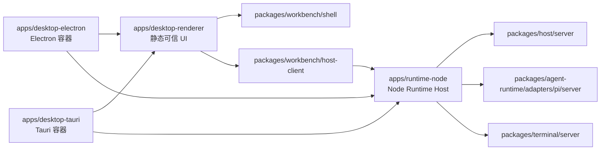

# Workbench Apps / Packages / Electron / Tauri 架构迁移计划

状态：Completed（2026-08-31；按用户要求仅验收本机 Linux，Windows/macOS 原生行不在本次验收范围且不声明通过）

起点：Agent Runtime 多 package 重构已经在提交 `77322072` 完成。本计划是后续独立项目，不修改该提交的
完成定义，也不把新的目录迁移混入已经验证通过的 Agent Runtime 迁移。

相关计划：[Workbench Agent Runtime 多 Package 重构计划](./multi-package-agent-runtime-refactor-plan.md)

## 0. 一页结论

Workbench 可以采用 DeepSeek Harness 的核心分层思想：

```text
apps/       可运行、可部署、最终装配的产品入口
packages/   可复用能力、稳定契约、实现与 Adapter
```

但不机械复制 DeepSeek 的 Cordis plugin/profile/bundle 体系，也不把所有叫作 Shell、Host 或 Boot 的代码都放进
`apps`。`apps` 只保留薄入口、平台配置、最终 provider 选择和产物装配；可被 Web、Electron、Tauri 或测试复用的
Workbench Shell、Runtime Host、Terminal、Extension Platform 和 transport 仍属于 `packages`。

目标应用层：

```text
apps/
├── web/                 # Next Web 产品入口与 Web 部署
├── desktop-renderer/    # Electron/Tauri 共用的静态 UI 装配产物
├── runtime-node/        # Pi、Terminal、HTTP/RPC/WebSocket 的 Node 可执行入口
├── desktop-electron/    # Electron main/preload/window/updater/packaging
└── desktop-tauri/       # Tauri Rust 壳、capabilities、sidecar supervision
```

其中 `desktop-renderer` 和 `desktop-tauri` 不在第一批创建。只有对应代码和构建产物真正落地时才建立 workspace，
不创建只有 `package.json` 的空架构目录。

最终桌面运行关系：



Tauri 的目标不是把 Pi SDK、`node-pty` 或当前 Next custom server 重写成 Rust。第一版 Tauri 由 Rust 壳启动并监管
同一套 Node Runtime Host sidecar；UI 最终作为静态可信资产嵌入。Electron 和 Tauri 复用同一个 Host 协议、源代码图和
契约测试，但允许使用不同的目标平台封装产物，不要求二者分发完全相同的字节。

## 1. 目标与完成定义

### 1.1 架构目标

1. 仓库根只负责 workspace 编排、共享工具和文档，不再同时承担 Next app、Node server 和 Electron builder 配置。
2. `apps` 中每个 leaf 都是独立可运行或可发布的 assembly；入口尽量只做配置、provider 选择和启动。
3. `packages` 按真实 capability/co-change 边界组织，不使用泛化的 `utils`、`services`、`implementations` 大桶。
4. 所有 package 禁止导入 `apps`；App 之间禁止源码导入，只能通过明确、版本化的构建产物契约组合。
5. Workbench Core 和 Shell 不知道 Pi；`apps/runtime-node` 选择 Pi server installation，`apps/web` 与
   `apps/desktop-renderer` 各自在 composition root 选择 Pi client installation 和 Pi-owned contributions。
6. Web、Electron 和 Tauri 使用同一套 Workbench Shell、Host client、Agent Runtime contracts 和业务能力。
7. Electron 与 Tauri 都启动同一个逻辑 Node Runtime Host，不各自复制一套 Pi/Terminal backend。
8. 平台原生能力通过窄的可选 capability ports 暴露，不在通用 UI 中直接导入 `electron`、Tauri API 或 Rust command。
9. Tauri 从第一个 spike 起只加载 bundled trusted asset；Next parity 只在普通浏览器中验证，不把 localhost/remote Next
   页面装入 Tauri WebView。
10. 当前 RPC、WebSocket、持久化和 Pi session 行为在目录迁移阶段保持兼容。

### 1.2 分里程碑完成定义

本项目拆成两个可以独立完成和清理的里程碑。Tauri 不得阻塞 Apps/Packages/Electron 分层。

Milestone A — Apps / Packages / Runtime / Electron：

- 根目录不再存在生产入口 `app/`、`server.ts` 和 `electron/`；
- 根 `package.json` 不再声明产品运行依赖、Electron `main` 或 electron-builder 产品配置；
- 除明确 allowlist 的仓库工具/config 外，全部生产 TS/TSX/JS/JSX/MJS/CJS 位于 `apps/**` 或 `packages/**`；根
  `components`、`extensions`、`hooks`、`i18n`、`lib`、`platform`、`runtime`、`services`、`stores`、`workbench` 等旧生产
  目录不再存在；
- `apps/web`、`apps/runtime-node` 和 `apps/desktop-electron` 各自拥有准确 manifest、config 和有限职责；
- `packages/**` 对 `apps/**` 的生产、测试、动态 import 和文件路径依赖均为零；
- Electron 通过正式 Runtime artifact 启动 Host，完成 ready、identity、Pi RPC、Pi WebSocket、Terminal WebSocket 和
  shutdown smoke；
- Electron staged desktop artifacts 在 exact manifest-owned Pi README/docs/examples model-readable closure 之外无 forbidden
  TypeScript/test-shaped、source map、broken symlink 或未声明 workspace source package；该 model-readable closure 不构成
  startup、NFT 或 dynamic-loader admission；
- clean checkout 上 frozen install、全量 check、Web build、Runtime Host build、Electron budget/pack/smoke 通过。

Milestone B — Static Desktop Renderer / Tauri：

- `apps/desktop-renderer` 和 `apps/desktop-tauri` 拥有准确 manifest、config、capabilities 和有限职责；
- Electron 与 Tauri 使用同一静态 renderer、Host protocol、源代码图和 conformance suite；
- 桌面 renderer 不依赖 Next server、Electron 或 Tauri implementation；
- Tauri WebView 只加载 bundled trusted asset，不给前端 broad shell spawn 权限；
- Tauri sidecar/runtime resources 无 TypeScript、测试、source map、broken symlink 或未声明 workspace source package；
- Windows、macOS、Linux 的目标产物分别验证 `node-pty`、`tree-sitter-bash`、Pi session，以及 containment ADR
  定义的 cooperative cleanup、owner-alive force 与 container hard-death；tree 与 exact-PGID 证据不得互换；
- clean checkout 上 Tauri check/build/package/security/native smoke 通过。

### 1.3 非目标

本计划不包含：

- 不把 Pi coding-agent 或 Terminal 重写成 Rust；
- 不为了目录对称重命名已经稳定的 14 个 workspace package；
- 不引入 DeepSeek Harness 的 Cordis、profiles、patch YAML、动态 plugin roster 或 everything-is-a-plugin 模型；
- 不一次性拆出几十个没有独立消费者的 leaf package；
- 不在第二个真实 transport/provider 出现前建立动态 registry；
- 不在目录迁移阶段改变 RPC wire、持久化格式或用户可见行为；
- 不在首个 Tauri 版本支持 iOS/Android；当前 Pi SDK、Node sidecar 和 PTY 约束使第一目标仅为桌面系统；
- 不要求 Electron 和 Tauri 使用完全相同的安装器、更新器或签名链。

## 2. 当前状态与必须先处理的耦合

当前仓库已经拥有正确的 Agent Runtime package 边界，但应用与构建仍把多个根概念混成一个 `projectRoot`：

| 当前事实                                                                         | 迁移风险                                                       |
| -------------------------------------------------------------------------------- | -------------------------------------------------------------- |
| 根 `package.json` 同时拥有 Next scripts、产品依赖、Electron main 和 builder 配置 | 无法判断依赖和配置属于哪个可运行产品                           |
| 根 `server.ts` 同时创建 Next handler、Pi RPC/WS 和 Terminal WS                   | Tauri sidecar 无法只启动后端，Electron 也与 Next 根绑定        |
| 根 `next.config.ts` 使用 `output: "standalone"`                                  | App 移入 monorepo 后 standalone 相对目录和 tracing root 会改变 |
| `electron/build-desktop-server.cjs` 以仓库根和根 `server.ts` 为入口              | Runtime Host 移动后会错误 externalize、trace 或定位文件        |
| `electron/prepare-package.cjs` 把仓库根、Next 根和 desktop 根视为同一路径        | 移动任一目录都可能破坏 pnpm symlink 或 staged tree             |
| 根 `tsconfig.json` 拥有 Next plugin 和 `@/* -> ./*`                              | package/app 边界容易被根 alias 重新穿透                        |
| 客户端大量使用同源 `/api` 与当前 location 推导 WebSocket                         | 静态桌面 renderer 无法连接随机端口 sidecar                     |
| Electron preload 当前只覆盖少量窗口能力                                          | 现在是建立稳定 `DesktopBridge` 的低成本时点                    |
| `node-pty`、`tree-sitter-bash` 是平台/ABI 相关 native dependency                 | Tauri sidecar 不能假定普通单文件 JS 打包即可跨平台             |

Next 16 的本地文档还给出三个必须保留的约束：

- monorepo app 移动后要显式设置 `outputFileTracingRoot`；
- Turbopack 不能解析其 root 外的文件，因此应显式把 `turbopack.root` 设为仓库根；
- `output: "standalone"` 不会追踪 custom server，所以现有 esbuild + `@vercel/nft` 合并链仍需保留，直到
  Runtime Host 拥有自己的完整 artifact builder。

## 3. 架构决策

### ADR-1：Apps 是 assembly，不是共享 library

允许：

```text
apps -> packages
```

禁止：

```text
packages -> apps
app A source -> app B source
```

Electron/Tauri 可以消费 `runtime-node` 和 `desktop-renderer` 的构建产物，但必须通过 artifact manifest 和根构建编排，
不能通过 `workspace:*` 导入另一个 app 的 `src`。

开发期由仓库级 orchestrator 分别启动各 app，并通过 endpoint/config 连接；它不能让一个 app 把另一个 app 的源码目录作为
自己的 framework root。生产装配只能消费构建产物。

### ADR-2：Node Runtime Host 是独立 app

`runtime-node` 是独立可启动、可健康检查、可被多个容器监管的 API-only 程序，因此属于 `apps`。它负责：

- 最终选择 Pi Server Adapter；
- 组装 Workbench Host、Pi、Terminal、Automation 和 Execution services；
- 监听 HTTP/RPC/WebSocket；
- 发出结构化 ready；
- 响应健康、版本、identity 与 shutdown；
- 管理服务端生命周期和退出清理。

可复用的 router、trust、lifecycle、protocol 和 server implementation 仍放在 `packages`。`runtime-node` 不成为新的
业务代码大桶，也不调用 `next()`、不读取 `apps/web` 的源码或产物。Web custom server/proxy 由 `apps/web` 持有；根
orchestrator 或 desktop container 分别启动 Web 与 Runtime artifacts。

### ADR-3：Web 与 Desktop renderer 是两个薄 assembly

`apps/web` 保留 Next Web 部署能力。`apps/desktop-renderer` 生成 Electron/Tauri 共用的静态可信 UI，并和 Web app
共同挂载 `packages/workbench/shell`。

桌面静态构建优先验证 Next static export，以复用现有框架；只有具体的 Next-only 阻塞无法在 Shell 边界消除时，才通过
单独 ADR 引入 Vite。不能仅因为 Tauri 常见模板使用 Vite 就提前增加第二套前端构建器。

### ADR-4：平台能力使用 Desktop capability ports

Workbench Shell 只依赖 Workbench-owned contracts。平台实现分别位于 Electron preload/client adapter 和 Tauri
command/client adapter。建议能力按用途拆成可选子端口，例如：

```ts
interface WorkbenchDesktopBridge {
  readonly runtime: RuntimeBootstrapPort;
  readonly window?: WindowChromePort;
  readonly externalLinks?: ExternalLinkPort;
  readonly updater?: DesktopUpdatePort;
  readonly lifecycle?: DesktopLifecyclePort;
}
```

子端口存在即表示支持，不再建立巨大的平台接口或 boolean capability matrix。Browser adapter 可以只实现 `runtime`，
通用 Shell 不能通过平台名称分支行为。

### ADR-5：Tauri 先使用 Node sidecar，不做 Rust backend 重写

Tauri Rust 壳只负责：

- 原生窗口、菜单、系统集成和 updater；
- 启动、监管、重启和关闭 Runtime Host sidecar；
- 把一次性 Runtime connection 信息交给可信的静态 renderer；
- 定义最小 capabilities、commands 和 CSP。

Pi SDK、RPC、WebSocket、Terminal 与 native Node modules 继续位于 Node Runtime Host。该选择保留现有行为和 SDK，
也让 Electron/Tauri 共用 server contract。

### ADR-6：不按美观提前拆 package

新 leaf package 至少满足下列一项才创建：

- 有两个及以上独立消费者；
- 有第二个实现或平台 Adapter；
- 需要独立发布/构建/权限边界；
- Node、browser、React、native 或 server/client 环境边界必须由 manifest 强制；
- 代码已经形成高内聚并具有独立测试和变化节奏。

父分组目录不放 `package.json`。不创建空 `src`、空 `test` 或只做无期限 barrel 的 package。

## 4. 目标目录与职责

```text
apps/
├── web/
│   ├── package.json
│   ├── next.config.ts
│   ├── public/
│   └── src/
│       ├── app/
│       └── main composition
├── desktop-renderer/
│   ├── package.json
│   ├── next.config.ts                 # 默认先验证 output: "export"
│   └── src/app/
│       ├── layout.tsx
│       └── page.tsx
├── runtime-node/
│   ├── package.json
│   ├── src/main.ts
│   └── test/
├── desktop-electron/
│   ├── package.json
│   ├── src/main.cjs
│   ├── src/preload.cjs
│   ├── scripts/
│   └── test/
└── desktop-tauri/
    ├── package.json
    ├── src/
    └── src-tauri/
        ├── Cargo.toml
        ├── tauri.conf.json
        ├── capabilities/
        ├── icons/
        └── src/

packages/
├── contracts/                         # 已有，保持
├── agent-runtime/                     # 已有，保持
├── server/                            # 已有，保持
├── workbench/
│   ├── shell/                         # 可复用 Workbench UI shell/slots/layout
│   ├── host-contracts/                # endpoint/bootstrap/version/auth DTO
│   ├── host-client/                   # HTTP/RPC/WS browser client
│   └── desktop-contracts/             # 平台 capability ports
├── host/
│   ├── server/                        # 平台无关 HTTP/RPC/WS host
│   └── testkit/                       # Host conformance/smoke helpers
├── extension-platform/
│   ├── sdk/
│   └── host/
├── terminal/
│   ├── contracts/
│   ├── client/
│   ├── server/
│   └── pi-tool/                       # Pi ToolDefinition Adapter
└── extensions/                        # 仅对足够独立的大型 builtin 建 leaf
```

这是目标 capability map，不是要求一次创建全部目录。已经稳定的
`packages/contracts/{execution,automation,attachment-understanding}` 和 `packages/server/execution` 不在本项目中为了
目录对称再次搬家。

当 `apps/web` 与 `apps/desktop-renderer` 成为两个真实消费者时，当前应用层 Pi runtime contributions 提升为
`packages/agent-runtime/adapters/pi/contributions` leaf；两个 app 各自在自己的 composition root 同时选择
`@workbench/agent-runtime-pi-client/installation` 和该 contributions package。Contributions package 只提供 Pi-owned
能力集合，不负责创建 app、Shell 或全局 Runtime。

### 4.1 当前目录的目标归属

| 当前路径                                      | 目标归属                                     | 说明                                                                                                 |
| --------------------------------------------- | -------------------------------------------- | ---------------------------------------------------------------------------------------------------- |
| `app/`、`next.config.ts`、`public/`           | `apps/web`                                   | Next 页面、route 和 Web build 配置                                                                   |
| 根 `server.ts`                                | 拆到 `apps/runtime-node` + `packages/host/*` | App 只保留 composition/launcher                                                                      |
| `electron/`                                   | `apps/desktop-electron`                      | main、preload、packaging、budget、probe                                                              |
| `workbench/` 和通用 Shell 部分                | `packages/workbench/shell`                   | 不能整体塞进 `apps/web`                                                                              |
| `platform/extensions/`                        | `packages/extension-platform/*`              | SDK/host 环境分离                                                                                    |
| `runtime/terminal/`                           | `packages/terminal/*`                        | Pi bash tool 单独作为 Adapter                                                                        |
| `runtime/server/executions/`                  | 已有 `packages/server/execution`             | 已完成：engine/repository/service/compiler/Terminal Command adapter；fresh assembly gates 已统一执行 |
| `runtime/server/automations/`                 | `packages/server/automation`                 | 形成真实 leaf 后创建                                                                                 |
| `runtime/server/settings/`                    | `packages/server/settings`                   | Workbench-owned settings server                                                                      |
| `runtime/server/http/`                        | `packages/host/server`                       | HTTP/WS Host，不复制 server-core                                                                     |
| `runtime/server/workbench-server-shutdown.ts` | `apps/runtime-node` composition              | 通用 hooks 继续来自 `@workbench/server-core`                                                         |
| Pi UI contributions                           | Pi-owned package 或 app composition          | 不提升到通用 Shell                                                                                   |
| 根共享 scripts/test loader                    | 仓库根 `scripts/`                            | 继续服务全部 workspace                                                                               |
| 根 `package.json`                             | workspace orchestration                      | 最终不拥有产品运行依赖                                                                               |

### 4.2 根生产源码闭包规则

Milestone A 不是只移动三个醒目的入口目录。Phase 0 必须生成全部 tracked production source ledger，覆盖根现有
`app`、`components`、`extensions`、`hooks`、`i18n`、`lib`、`platform`、`runtime`、`services`、`stores`、
`test-utils`、`workbench` 和其他新增根源码。每个文件在移动前必须标记且最终只有一个 owner：

- Next route、Web-only provider、Web-only i18n/request composition → `apps/web/src`；
- Runtime/desktop 最终 provider 选择与 process launcher → 对应 `apps/*`；
- 可复用 Shell、UI、state、service、extension/terminal/host 能力 → 对应 capability package；
- Pi-only UI/server integration → Pi Adapter/contributions package 或 app composition root；
- 共置测试跟随 owner，跨 app/package test helper 只有形成真实复用时才进入 testkit package。

根只允许仓库级 orchestration/tooling，例如 `scripts/**`、`run_scripts/**`、workspace config、shared tsconfig、formatter/linter
config、文档和其共置测试。新增 source-closure checker 扫描生产扩展名和 import/file-read 边：

1. allowlist 外的生产 TS/TSX/JS/JSX/MJS/CJS 不得位于仓库根旧目录；
2. `apps/**` 与 `packages/**` 不得 import 或通过 fs/path 读取根生产源码；
3. ownership ledger 在 Phase 5 前不得有 `unassigned`，Milestone A 完成后由机械扫描证明为零，而非手工声明；
4. 不能通过保留根 re-export、symlink 或宽泛 `@/*` alias 让旧目录看似消失但继续成为 source owner。

## 5. 必须先稳定的跨平台契约

### 5.1 Runtime connection contract

所有 browser client 不再自行假定相对 `/api` 或从 `window.location` 拼出固定 WebSocket。统一注入 Workbench-owned
connection descriptor：

```ts
type RuntimeConnection =
  | {
      kind: "same-origin";
      httpOrigin: string;
    }
  | {
      kind: "desktop-sidecar";
      httpOrigin: string;
      instanceId: string;
      accessToken: string;
    };
```

准确字段可在实施阶段根据现有 transport 调整，但必须满足：

- Web 可继续默认 same-origin；
- Desktop 可连接 `127.0.0.1` 的系统分配端口；
- Desktop HTTP 使用 `Authorization: Bearer`，并显式处理可信 renderer origin 的 CORS/preflight；
- Browser `WebSocket` 不能设置普通 Authorization header，因此 Desktop WebSocket 统一使用版本化认证首帧：连接建立后，
  client 必须在短超时内发送 `authenticate` frame（protocol version、instanceId、token）；
- WebSocket 认证完成前不得创建 Pi session、订阅 stream、分配 PTY 或接收业务 frame；失败使用稳定 close code，超时立即关闭；
- 认证成功后的 Pi/Terminal 业务 wire 保持不变，auth framing 由 Host transport layer 统一拥有；
- token 不写入持久配置、URL、日志或 crash report；
- transport implementation 不读取 Electron/Tauri 全局对象；
- protocol version 不兼容时给出稳定、可诊断错误。

### 5.2 Runtime Host lifecycle contract

Host 至少提供：

- `--host 127.0.0.1` 和 `--port 0`；
- 版本化结构化 ready 消息；
- `health`、`identity` 和 protocol version；
- 优雅 shutdown 与有界强制退出；
- 正常退出时的 cooperative descendant cleanup、container owner-alive 时的有界强制清理，以及 container hard-death
  后按平台 containment matrix 单独验收的回收；POSIX process group 只覆盖触发时仍属于 exact PGID 的成员，不等于任意
  descendant tree；
- 启动失败时稳定 exit code 和结构化诊断；
- 不把 access token 输出到 stdout/stderr。

Desktop container 生成或安全传入每次启动的 token，并通过受控 bootstrap bridge 交给可信 renderer。WebView 不获得任意
process spawn 能力。

Electron 与 Tauri 统一使用版本化 NDJSON control protocol：container 写 Host stdin，Host stdout 只输出 control frame，
全部业务日志写 stderr。最小 frame 集合为：

```text
container -> host: start { controlVersion, authMode, accessToken, allowedOrigins }
host -> container: ready { controlVersion, hostProtocolVersion, instanceId, pid, httpOrigin }
host -> container: startup-error { code, message }
container -> host: shutdown { reason, deadlineMs }
host -> container: shutdown-ack {}
```

token 只存在于 container → Host 的 `start` control frame和 container → trusted renderer 的窄 bootstrap response，不出现在
ready、命令行、URL 或日志。Frame 必须有长度上限、版本检查和无效输入退出策略；stdio 被用作 control channel 后，任何
第三方 stdout 都必须重定向为 stderr，避免破坏 framing。

### 5.3 Artifact contract

Runtime Host builder 产生版本化 manifest，而不是让 Electron/Tauri 依赖硬编码目录：

```json
{
  "schemaVersion": 1,
  "hostProtocolVersion": 1,
  "platform": "linux",
  "arch": "x64",
  "targetTriple": "x86_64-unknown-linux-gnu",
  "libc": "glibc",
  "nodeVersion": "24.x",
  "nodeModuleAbi": 137,
  "napiVersion": 10,
  "entrypoint": "server.mjs",
  "externalPackages": [],
  "resources": [],
  "nativePackages": [],
  "nativeFiles": []
}
```

示例只说明职责，不冻结字段名。Electron flavor 可以是 Node 可执行环境 + bundle +精确 runtime closure；Tauri flavor
可以是带 target triple 的 executable sidecar，或 Node executable + JS/native resources。二者必须来自相同源图、使用同一
Host protocol/conformance suite，并各自有完整依赖闭包。

manifest 必须记录构建该 envelope 的实际 Node runtime/ABI、target triple、OS/arch、Linux libc，以及所有 `.node`、DLL、
shared library 和 runtime resources。Electron 按 Electron Node ABI rebuild 的 native bytes 不得复用于 Tauri 自带 Node
runtime；native smoke 必须在最终打包 executable 下运行，不能只用开发机 `node` 证明通过。

Desktop renderer 也输出 manifest，至少声明入口、静态资源根、build/version 和所需 Host protocol version。Container
只消费 manifest，不扫描另一个 app 的源码树。

### 5.4 Milestone A Web artifact lifecycle

在静态 desktop renderer 完成前，packaged Electron 需要同时监管 `apps/web` 的 Next server artifact 和 API-only Runtime
artifact。Web artifact 必须有自己的 manifest 和 process lifecycle，至少声明 Web entrypoint、`relativeAppDir`、resources、
process control version 和所需 Runtime protocol version。

Electron 生产启动顺序固定为：

1. container 生成 Runtime access token；
2. 以 desktop-serve 模式启动 Web artifact，绑定 `127.0.0.1:0`，通过 NDJSON control `ready` 返回准确 Web origin；此时
   不创建 BrowserWindow；
3. 以该 Web origin 作为唯一 allowed renderer origin 启动 Runtime artifact；
4. Runtime ready 后再创建 BrowserWindow，加载 Web origin，并由 preload `runtime.bootstrap` 把 Runtime origin、
   instanceId 和 token 交给可信页面；
5. 任一进程 startup-error/提前退出时都不打开主窗口，并有界关闭另一个子进程；
6. 退出时先停止 renderer 发起新请求，再依次请求 Runtime shutdown 和 Web shutdown，等待 ack 后才强制终止超时进程。

desktop-serve 模式只提供 Next UI/static assets，浏览器 Host client 直接使用 preload 注入的 Runtime connection，不要求 Web
server知道 Runtime source。Web 部署模式可由外部 orchestrator 向 `apps/web` custom server/proxy 注入 Runtime endpoint，
但两个 app 仍不互相导入源码。Web stdout 和 Runtime stdout 都只承载版本化 control frames，业务日志写 stderr；Electron
负责两个子进程的 crash、restart 和 orphan cleanup。

### 5.5 Tauri 安全基线

从第一个 spike 开始固定以下规则：

- Rust 启动和关闭 sidecar，不给 renderer `shell:allow-spawn`；
- Host 只监听 `127.0.0.1`、随机端口，并验证 token 与 Origin；
- capability 绑定明确 window label，不使用 `windows: ["*"]`；
- 显式配置 `app.security.capabilities`，不靠目录自动全量启用；
- 不给生产主窗口配置 `remote.urls`；
- CSP 保持开启；默认静态策略只开放 `127.0.0.1` 的 HTTP/WS scheme/host 和必要端口范围，随机端口无法在 build-time CSP
  中精确固定时，由每次启动的 token、Origin allowlist 和 Host instance identity 形成第二层约束；若未来由 Rust 安全生成
  bootstrap HTML 并注入精确 origin，必须另做安全 ADR 和测试；
- Electron static renderer 使用已注册的 secure custom protocol，不接受 `Origin: null`；Tauri 和 Electron 的 dev/prod
  实际 Origin 必须在平台测试中采集，并由 container 通过 control protocol 显式传给 Host，Host 不使用 origin wildcard；
- 自定义 command 进入可审计 ACL，不暴露通用文件、shell 或网络代理 command；
- Tauri 从第一个 spike 起只加载 bundled asset，不使用 localhost/remote Next 作为 WebView 页面。

## 6. 分阶段实施计划

所有阶段都在当前分支连续实施。每个阶段通过 Gate 后立即进入下一阶段；不得把 Next root、Runtime Host root 和
Electron staging root 在同一个机械移动步骤中同时改变。

### Phase 0：基线、边界护栏和路径模型

目标：不移动生产源码，先让后续错误能被机械发现。

实施：

1. 在 clean checkout 重新记录 `pnpm check`、fresh `pnpm build`、Electron staging、runtime budget、pack 和 smoke；
2. 保存 standalone 结构、`relativeAppDir`、custom server external allowlist、staged size/file/package count；
3. 扩展 workspace dependency checker：禁止 `packages/**` 导入 `apps/**` 或读取其源码路径；
4. 增加 app-to-app source import 禁令，同时允许由根 build script 消费带 manifest 的产物；
5. 把构建脚本中的单一 `projectRoot` 设计拆成明确的
   `repositoryRoot`、`webRoot`、`desktopRendererRoot`、`runtimeRoot`、`electronRoot`、`tauriRoot`、`stagingRoot`；
6. 生成全部根 production source ledger，为每个文件记录环境、消费者、目标 owner 和迁移阶段；
7. 给现有硬编码 `/api`、WebSocket origin、根 `server.ts`、`.next` 和 Electron path 建 inventory test；
8. 记录 native dependencies、动态 require/import 和 runtime asset 清单。

Gate：

- 不改变现有产物行为和预算；
- 新边界测试对故意加入的 `packages -> apps` fixture 能失败；
- ledger 覆盖所有 tracked 根 production sources，且没有未分类文件；
- fresh 产物与提交 `77322072` 后的基线无不可解释漂移。

### Phase 1：Host connection 与 Desktop contracts

目标：先解除 UI 对 same-origin 和具体桌面容器的假设。

实施：

1. 创建有真实消费者的 `@workbench/host-contracts` 和 `@workbench/host-client`；
2. 统一现有 RPC、Pi WebSocket、Terminal WebSocket 的 endpoint resolution；
3. 默认 Browser installation 继续提供 `same-origin` descriptor，保持行为不变；
4. 创建最小 `@workbench/desktop-contracts`，把现有 Electron titlebar/preload API 迁成第一个 Adapter；
5. 逐个收口直接读取 `window.location`、`window.electron*` 或硬编码 `/api` 的生产消费者；
6. 实现 Desktop HTTP Bearer/CORS 与统一 WebSocket authentication framing；
7. 为 auth timeout/close code、token、protocol mismatch、reconnect 和多个 Host instance 编写契约测试。

Gate：

- current Web/Electron 在 same-origin 模式下行为不变；
- 目标测试能用随机 loopback origin 运行，不依赖浏览器当前 origin；
- 未认证 WebSocket 在 auth deadline 前不创建 session、stream subscription 或 PTY；
- 通用 Shell 和 client packages 不导入 Electron/Tauri；
- manifest boundary、root typecheck、相关 transport tests 和 production build 通过。

### Phase 2：提取阻塞 App 分层的复用能力

目标：避免把共享实现随 Next app 整体搬入 `apps/web`。

按连续工作单元处理：

1. `platform/extensions` → `extension-platform/sdk` + `extension-platform/host`；
2. `runtime/terminal` → `terminal/contracts`、`terminal/client`、`terminal/server`，Pi ToolDefinition 留在
   `terminal/pi-tool`；
3. 从当前 `workbench`/components 中提取不依赖 Next server 的 Shell、slots、layout 和 contributions host；
4. 把剩余通用 HTTP/WS Host orchestration 放入 `packages/host/server`，ready/auth/control DTO 放入
   `@workbench/host-contracts`，不放入 Pi Adapter；
5. `runtime/server/executions` 已并入已有 `@workbench/execution-server`（本 slice 的 source/test/closure
   验证和 fresh build/pack aggregate assembly gates 均已完成）；automation 和 settings 在形成真实边界时分别进入
   `packages/server/automation` 与 `packages/server/settings`；
6. `runtime/server/http` 进入 `packages/host/server`；应用级 shutdown composition 进入 `apps/runtime-node`，并复用已有
   `@workbench/server-core` 的 request trust、shutdown hooks、child-process environment、settings file、file persistence 和
   RPC error primitives；
7. 大型 builtin extension 只有达到独立依赖/测试边界时才迁 `packages/extensions/*`。
8. 每完成一个工作单元就更新 source ownership ledger；不能按根目录整棵机械搬入 app，必须按最终 owner 分流。

Phase 2 Execution residual：Execution/Automation 的协调 shutdown 在本工作单元后仍留在应用 lifecycle；该债务已在
Phase 3 通过 Catalog → Automation → Execution → Pi hooks → Terminal 的单一关闭图关闭。

每个新 capability group 在第一个真实 leaf 落地时，同步向 `pnpm-workspace.yaml` 添加精确 glob，并更新 workspace
foundation 断言；不提前添加会匹配空目录或临时目录的宽泛 `packages/**`。

每个 leaf 必须同时具备真实 source、准确 manifest、独立 tsconfig、有限 exports 和测试。旧路径只允许短期纯
re-export，并在同一 capability 的消费者迁完后删除。

Gate：

- 每包独立 typecheck/test；
- package `src/test` 中无根 `@/*` alias；
- Browser/Node/React/native 依赖方向正确；
- Workbench Shell 不出现 Pi、Next server、Electron 或 Tauri import；
- 剩余根 production source 全部已有明确 app/package owner 和删除阶段；
- 根应用仍能完整 build 和 Electron smoke。

### Phase 3：在原位置拆开 Next 与 Runtime Host

目标：先拆职责，再搬路径。

实施：

1. 将当前 `server.ts` 拆成薄 combined launcher、Next web handler 和平台无关 API-only Runtime Host；
2. Runtime Host 显式接收 trust、Pi installation、Terminal gateway 和 lifecycle options，但不接收或调用 Next handler；
3. 把 Runtime API 从 Next route implementation 收口到 Host router；Next route 过渡期只做薄 delegator/proxy；
4. 实现 loopback、端口 `0`、stdin/stdout NDJSON control、health/identity、token validation 和 shutdown；
5. 保留当前根 launcher，使 `pnpm dev/start` 在本阶段无用户入口变化；
6. 保证 Pi/Terminal registry、stream hub 和 shutdown graph 仍然只有一个实例。

Gate：

- combined Next + Host 模式与 API-only Host 模式分别通过 smoke；
- RPC、Pi WS、Terminal WS 和 shutdown 行为与现状一致；
- 非 Pi fixture 可启动最小 Host；
- 不出现第二个 session registry/stream hub；
- `pnpm check`、fresh build、Electron staging/budget/pack 通过。

### Phase 4：建立 `apps/runtime-node`

目标：让 Runtime Host 成为独立可执行 assembly。

实施：

1. 在 `pnpm-workspace.yaml` 加精确 `apps/*`，创建第一个真实 app `apps/runtime-node`；
2. 把 Node composition root、CLI/config parser 和 launcher 移入该 app；
3. App 只选择 Pi/Terminal/Automation/Execution provider，服务实现来自 packages；
4. Runtime app 永远保持 API-only；旧根 launcher 在本阶段降为临时 Web + child-process supervisor/proxy，启动并监管新
   Runtime artifact，但不再在自身进程创建第二套 Host service graph；
5. 建立 Runtime Host control protocol、artifact manifest 和 target-specific builder；
6. 根 `dev/start/build` 暂时由 migration supervisor 分别编排旧 Web launcher 与新 Runtime workspace，不让 Runtime
   app 读取 Web root；
7. 验证 `tsx watch` 能跟随实际 package source，生产构建 bundle 所有 `@workbench/*` source package。

Gate：

- 从任意 cwd 启动 app 均正确定位仓库/资源；
- artifact 中无 `@workbench/*` runtime external；
- 新 Runtime artifact 可独立通过 conformance smoke；当前 Electron 在 Phase 6 切换前继续启动根 migration
  supervisor，由后者监管 Web/Runtime 两个 process；
- ready/RPC/WS/PTY/shutdown smoke 通过；
- native/dynamic dependencies 与 manifest 完整一致。

### Phase 5：移动 Web app 到 `apps/web`

目标：把 Next 产品入口和配置移出仓库根，不改变 Host 协议。

实施：

1. 按 ownership ledger 移动 `app/`、Web-only composition、app-owned components/hooks/i18n/lib/services/stores、
   `public/`、`next.config.ts`、PostCSS、components config、app tsconfig 和 Next custom server/proxy；
2. App 内 alias 改为 `@/* -> ./src/*`，根 tsconfig 移除 Next plugin/app alias；
3. `next.config.ts` 显式设置 `outputFileTracingRoot` 和 `turbopack.root` 为 repository root；
4. 重写相对新 app root 的 tracing excludes，不全局排除可能含 runtime assets 的 `packages/**`；
5. `apps/web` 自己的 custom `next()` 显式传入 `dir: webRoot`，并把 Runtime HTTP/WS 代理到独立 endpoint；
6. 检查 Tailwind v4 对 app 外 UI package 的扫描；只有唯一 class 证明漏扫时才增加窄 `@source`；
7. 更新 dev watcher、test runner、README、run scripts 和 `.gitignore` 的 app 路径；
8. Web composition root 显式选择 Pi client installation 和 Pi-owned contributions，Workbench Shell 仍无 Pi import；
9. 根脚本继续作为短期 delegator，用户命令不立即破坏。

Gate：

- Web dev、目标测试、production Next build 和 standalone start 通过；
- package UI 在 production CSS 中存在唯一验证 class；
- `apps/web` manifest 声明全部直接依赖；
- 根 tsconfig 不再把 packages/apps 自动吞入同一项目；
- ledger 中没有 unassigned source，剩余根文件仅为后续 Runtime/Electron owner 或带删除阶段的纯 transition entry；
- Runtime Host 的 RPC/WS 行为不因 Web 路径移动而变化。

### Phase 6：Monorepo standalone 与 Runtime staging

目标：先让发行构建理解多个 app root，再移动 Electron。

实施：

1. 从 Next metadata 读取 `relativeAppDir`，不再假定 `.next/standalone/.next`；
2. 保留 standalone 的 monorepo 相对层级，禁止为了美观扁平化导致 pnpm symlink 断裂；
3. Web manifest 明确 custom server entrypoint、`relativeAppDir`、resources、control version 和 shutdown contract；
4. Electron staging 只通过 Runtime/Web artifact manifests 取入口和资源；
5. Web 与 Runtime builders 都继续 bundle `@workbench/*`，并拥有各自预算驱动的第三方 external ownership：Web artifact
   精确为 `[next]`；Runtime artifact 精确为
   `[@earendil-works/pi-coding-agent,node-pty,tree-sitter,tree-sitter-bash,ws]`。dynamic ownership 与 external 分开记录，
   精确为 `[@earendil-works/pi-ai,@earendil-works/pi-coding-agent]`；
6. staged desktop budget 校验两个 manifest 的 aggregate closure：external aggregate 精确为六个唯一 package（Web 的 `next`
   加 Runtime 的五个 package）。任何增删都必须由 fresh trace 和实际 owner 变化解释，不能为了通过检查保留 Runtime
   不再使用的 `next`；
7. 将 `repositoryRoot`、`webRoot`、`desktopRendererRoot`、`runtimeRoot`、`electronRoot`、`tauriRoot` 和 `stagingRoot`
   分开；
8. 检查所有 `import.meta.url`/fs-relative runtime assets，显式 inline/copy/include；
9. Runtime manifest 记录 Electron runtime 的 Node/Electron ABI、native files 和 platform envelope；
10. fresh 删除旧 `.next/.desktop-build/.electron-build` 后生成产物，防止缓存假通过。

Gate：

- staged desktop artifacts：在 exact manifest-owned Pi README/docs/examples model-readable closure 之外，0 forbidden
  TypeScript/test-shaped；0 source maps、0 broken symlinks、0 `@workbench/*` externals。model-readable resources 不构成
  startup、NFT 或 dynamic-loader admission；
- Web/Runtime per-artifact allowlists 与 aggregate desktop budget 精确一致，且 ownership 可解释；
- staged Web 与 Runtime processes 能从实际发行 cwd 分别完成 ready/control/shutdown；
- 用 Web ready origin 启动 Runtime 后完成 identity、Pi RPC/WS、Terminal WS；
- `node-pty`/tree-sitter native smoke 在 staged Electron runtime 下执行；
- size/file/package count 漂移有记录和解释；
- `electron:pack --dir` 通过。

### Phase 7：移动 Electron 到 `apps/desktop-electron`

目标：让 Electron 成为只负责原生容器和产物装配的薄 app。

实施：

1. 移动 main、preload、window/lifecycle、probe、packaging、budget 和 Electron tests；
2. 把根 `package.json` 的 `main`、electron-builder `build`、`productName`、`desktopName` 和 Electron-only dependencies
   移入 app manifest；
3. Electron main 通过 Runtime artifact manifest 启动 Host，不读取 `apps/runtime-node/src`；
4. preload 只实现 `@workbench/desktop-contracts` 的 Electron adapter；
5. 开发模式只连接显式传入的 Web/Runtime endpoints；仓库根 `electron:dev` orchestrator 分别启动三个 app，不让
   Electron app 解析 sibling source；
6. 生产模式只使用 staged artifacts，不把 monorepo source path 带入发行包；
7. 生产启动严格执行 Web ready → Runtime start（allowedOrigins = Web origin）→ Runtime ready → BrowserWindow；
8. 任一 child startup/crash 都有界关闭 sibling，退出时停止 renderer 请求后依次 shutdown Runtime/Web，并清理 orphan；
9. 更新 Linux/Windows launch scripts、dist path、process detection 和 probe。

Gate：

- Electron dev：直接连接已有 endpoints，以及由根 orchestrator 启动 Web/Runtime artifacts 两种模式都通过；
- packaged app 完成 window、ready、RPC、Pi WS、Terminal、titlebar 和退出清理 smoke；
- Web 或 Runtime 任一 startup-error/crash 的 sibling cleanup 与无孤儿进程测试通过；
- runtime budget、pack、native rebuild、artifact naming 通过；
- 根 manifest 不再拥有 Electron main/builder 配置。

Phase 7 的上述 packaged-app execution smoke 当前是 **Linux native** contract：它在本机 Linux target 上强制运行，并以 Xvfb、`/proc`
start-time identity 和 isolated POSIX process groups fail-closed 地验证窗口、Host protocol、PTY 与退出清理。macOS/Windows 或任意
cross-target 目录/发行产物仍需完成 manifest/layout/budget 验证，但不得误送进该 Linux runner，也不得因此被记为通过上述 execution
contract；规范 `electron:pack`/`electron:dist` 在这些 `execution: not-run` target 上必须 fail-closed，不能以 exit 0
掩盖缺失执行证据。仅显式 `electron:pack:artifact`/`electron:dist:artifact` 可完成 artifact-only 验证；它必须返回结构化
`execution: "not-run"`，而非声称通过 execution contract。相应平台的同等 native packaged-app smoke 是后续
platform-matrix gate 的明确待办。

### Phase 8：Milestone A 根目录与迁移脚手架清理

目标：在 Tauri 开始前完成 Apps/Packages/Runtime/Electron 分层，避免根迁移被未来桌面工作无限期阻塞。

实施：

1. 删除根 `app/`、`server.ts`、`electron/` 以及 ledger 中全部旧 production source 目录/文件、旧 config 和所有
   transition delegator；
2. 根 `package.json` 只保留 monorepo orchestration 和仓库级 dev tooling；
3. 清理旧 `@/*` 路径、旧 runtime/app 文本、stale excludes 和旧 benchmark path；
4. 逐 app/package 收紧 manifest，删除 root hoist 掩盖的未声明依赖；
5. 固化 boundary tests：packages 不导入 apps、apps 不源码导入 apps、Shell 无平台实现、Core 无 Pi；
6. 更新 Milestone A 架构图、README、开发命令、发行文档和故障排查；
7. 对空目录做物理删除；Git 不追踪空目录，IDE 不应再显示迁移残留。

Gate：

- clean `pnpm install --frozen-lockfile`；
- `pnpm check`、全部 Milestone A app/package builds；
- Runtime Host artifact/conformance；
- Web production build；
- Electron dev/pack/budget/smoke；
- source-closure checker 证明 allowlist 外的生产源码全部位于 `apps/**` 或 `packages/**`；
- 全仓旧根路径和禁止依赖扫描为零。

Phase 8 完成即宣布 Milestone A 完成，不等待 Tauri。

### Phase 9：Tauri sidecar parity spike

目标：使用已稳定的 Milestone A 产物验证 Rust supervision、control protocol、native modules 和平台打包。

实施：

1. 创建 `apps/desktop-tauri` 的最小真实 workspace 与 `src-tauri`；
2. 同 app 内提供 bundled diagnostics renderer，只显示 bootstrap、health、RPC、WS、PTY 和 shutdown 结果；
3. diagnostics renderer 只获得窄 `runtime.bootstrap` command，不获得 shell spawn、通用 filesystem、remote URL 或通用
   Tauri network plugin capability；
4. Rust 启动带 target triple 的 Runtime Host sidecar，通过 stdin/stdout NDJSON control protocol 完成 start/ready/shutdown；
5. 验证 token、随机端口、真实 Origin、Runtime generation restart、crash、shutdown，并分别记录 Windows JobObject
   strict tree、Unix exact-PGID 和 escaped `setsid`/PTY descendant；
6. 分别评估：单可执行 sidecar，或 Node runtime + JS/native resources；
7. 对 `node-pty`、`tree-sitter-bash`、Pi SDK 动态依赖和 runtime assets 建 ABI/目标平台清单；
8. 形成 ADR，选择 Windows/macOS/Linux 的正式 sidecar envelope，并冻结各平台 containment scope。

Gate：

- `cargo fmt/check/clippy/test` 与目标平台 Tauri dev/build spike 通过；
- diagnostics renderer 始终从 bundled asset 加载，`remote.urls` 为空；
- PTY create/resize/input/output、Pi session、所有 WebSocket 和 shutdown 通过；
- native smoke 使用最终 sidecar Node runtime/ABI，不使用开发机 Node 代替；
- renderer 无 broad spawn、remote URL、filesystem 或通用 Tauri network plugin capability；
- Windows packaged native gate 以 JobObject hard-kill 验证 strict descendant tree；Unix packaged native gate 以 liveness
  watchdog 验证 exact-PGID parent-death containment；两者都必须保留精确 identity 的 unrelated decoy；
- `setsid` 与真实 `node-pty` 的 PID/PPID/PGID/SID 必须作为负向/范围证据；未执行的平台保持 pending，Linux exact-PGID
  spike 不得关闭三平台或 strict-tree gate。

### Phase 10：静态 Desktop renderer 与生产 Tauri

目标：让 Electron/Tauri 共用可信静态 UI，并完成生产 Tauri 架构。

实施：

1. 先建立 static-export inventory，至少覆盖当前动态 `[threadId]` route、Next API route handlers、基于
   `cookies()`/`headers()` 的 server i18n、`next/dynamic`、Server Actions、rewrites/redirects/proxy 和默认 Image
   Optimization；
2. 创建 Next 形态的 `apps/desktop-renderer`：`next.config.ts` 使用 `output: "export"`，入口只挂载
   `@workbench/shell`、Host client 和 desktop capability adapter；
3. 将运行时 thread navigation 变为可静态托管的 client-side routing/state，移除 desktop UI 对 Next API routes、SSR、
   server actions 和动态 route runtime 的依赖；
4. 若 inventory 证明 Next export 存在不能合理消除的 blocker，先记录独立 ADR，再把 app 形态改为 Vite/SPA；不得让
   `main.tsx` 与 Next 目录结构同时存在；
5. Desktop renderer composition root 选择 Pi client installation 和共享的 Pi-owned contributions package；Workbench
   Shell 仍无 Pi import；
6. Tauri `frontendDist` 指向静态 renderer artifact，Rust 在创建主窗口前启动并验证 Host；
7. 通过窄 bootstrap 与 lifecycle restart command 把 Runtime connection 交给主窗口，并在旧代完整排空后才发布新代；
8. Electron 注册 secure custom protocol并切换到同一静态 renderer artifact，保留相同 Host contract；
9. 完成 Tauri capabilities、CSP、command ACL、Origin、bootstrap 与 restart security 审计。

Gate：

- Next export inventory 中每个 server-only能力都有明确移除或 Adapter 结果；
- 同一 renderer artifact 在 Electron 和 Tauri 中通过核心 UI/Host smoke；
- Web app 继续独立 build/deploy；
- Tauri 主窗口只加载 bundled asset，不配置 production `remote.urls`；
- Electron/Tauri 的 dev/prod Origin 均被采集并通过显式 allowlist 验证，不接受 `Origin: null`；
- Electron/Tauri 的平台差异仅出现在 desktop adapter/container；
- protocol mismatch、Host crash/restart 和退出清理有稳定 UX/诊断；
- Unix strict descendant-tree 差距已明确选择 delegated cgroup、收窄的受支持契约或平台不支持之一，不能以未决状态进入
  production；
- 所选验收平台（本次为本机 Linux x64/glibc）的 Tauri package 和 native dependency smoke 通过；Windows/macOS 仅在未来纳入验收范围时成为 gate，本次未验证且不声明通过。

### Phase 11：Milestone B 实验脚手架与发行收口

目标：删除 diagnostics/spike 路径，固化静态 Desktop renderer 和正式 Tauri 发行边界。

实施：

1. 删除仅服务 diagnostics spike 的 UI、capability 和构建脚手架；
2. 收紧 Electron/Tauri manifests、CSP、Origin allowlist、artifact/resource 清单和 app dependencies；
3. 固化 static renderer、Runtime Host control/auth protocol 和 native ABI contract tests；
4. 更新 Tauri/Electron 开发、打包、签名、更新和故障排查文档；
5. 删除所有 Milestone B 空目录、stale path 和实验配置。

Gate：

- clean frozen install 与全部 app/package checks；
- Web/Runtime/Electron 的 Milestone A gates 继续通过；
- Tauri cargo check/build/package/security/native smoke；
- Electron/Tauri 共用 renderer/Host conformance；
- 所选 platform containment contract 的 packaged hard-kill matrix 全部通过；
- 全仓 spike、remote renderer 和禁止依赖扫描为零。

## 7. 当前分支连续实施顺序

| 顺序 | 工作单元                                              | 风险 | 不得混入              |
| ---: | ----------------------------------------------------- | ---- | --------------------- |
|    0 | baseline + boundary guards + path vocabulary          | 低   | 源码移动              |
|    1 | Host contracts/client + HTTP/WS auth/control protocol | 高   | Server/目录移动       |
|    2 | Desktop contracts + Electron adapter                  | 中   | Tauri scaffold        |
|    3 | Extension Platform package 化                         | 中   | Terminal/Shell 大搬迁 |
|    4 | Terminal package 化                                   | 高   | Electron staging 变化 |
|    5 | Workbench Shell 第一批无平台边界                      | 高   | Next root 移动        |
|    6 | API-only Runtime Host 原位职责拆分                    | 高   | App root 移动         |
|    7 | `apps/runtime-node` + control/artifact manifest       | 高   | Electron 目录移动     |
|    8 | `apps/web` + Next custom server/proxy                 | 高   | Electron 目录移动     |
|    9 | monorepo standalone/staging                           | 高   | UI/协议功能改动       |
|   10 | `apps/desktop-electron`                               | 高   | Tauri production      |
|   11 | Milestone A root/transition cleanup                   | 中   | Tauri 或新业务        |
|   12 | bundled Tauri diagnostics + sidecar parity spike      | 高   | Remote Next renderer  |
|   13 | static-export inventory + desktop renderer            | 高   | 未经 ADR 引入 Vite    |
|   14 | production Tauri + Electron renderer convergence      | 高   | 新业务功能            |
|   15 | Milestone B experiment/release cleanup                | 中   | Wire/业务改动         |

按表在当前分支直接连续修改。每个工作单元通过对应 Gate 后继续下一项，不为了加快进度同时改变多个 root 概念。

## 8. 验证矩阵

### 8.1 每个 package 工作单元

- 目标 package typecheck/test；
- workspace manifest/import boundary；
- 依赖必须用 `workspace:*`；
- package source 无根 alias、无 `apps` import；
- 根 typecheck 和最小相关集成测试。

### 8.2 Host/transport 工作单元

- HTTP RPC、Pi mux/host WebSocket、Terminal WebSocket；
- HTTP Bearer/CORS、WebSocket auth first-frame timeout/close code、未认证零资源分配；
- random port、token、explicit Origin allowlist、Host/control protocol version；
- stdin/stdout NDJSON framing、stderr logs、invalid/oversized control frame；
- reconnect、Host crash、shutdown，以及 Host cooperative descendant cleanup；
- 非 Pi Host fixture；
- source watch 和 production bundle 两种路径。

### 8.3 Web 工作单元

- Next dev；
- targeted tests；
- production build；
- standalone launch；
- Tailwind package source scan；
- Web + Runtime Host integration smoke。

### 8.4 Electron 工作单元

- external allowlist 与 native/dynamic package closure；
- Electron Node version/ABI 与 `.node`/DLL/shared-library manifest；
- fresh staging：在 exact manifest-owned Pi README/docs/examples model-readable closure 之外，0 forbidden
  TS/test-shaped，且 0 source maps/broken symlinks；model-readable resources 不构成 startup、NFT 或 dynamic-loader admission；
- runtime budget；
- dev 两种启动模式；
- packaged ready/RPC/WS/PTY/window/shutdown；
- `electron:pack --dir` 和正式 artifact。

### 8.5 Tauri 工作单元

- Rust fmt/clippy/check/test；
- capabilities/CSP/command ACL 静态审计；
- sidecar target triple、Node ABI/Linux libc 与 artifact manifest；
- bundled renderer、dev/prod Origin allowlist 和 narrow bootstrap command；
- Windows/macOS/Linux native package matrix；
- PTY、Pi、RPC、全部 WS、restart、shutdown；
- Windows Job strict tree、Unix watchdog exact PGID、escaped PTY negative，以及每个 owner 的 PID/start identity/PGID/SID
  和 unrelated decoy；
- bundled static renderer；
- installer/package smoke。

### 8.6 里程碑完整 Gate

每个高风险里程碑必须从 fresh 产物执行，不复用旧 `.next`、`.desktop-build`、`.electron-build` 或 Tauri target
缓存来证明迁移成功。Milestone A 的完成不运行或等待 Tauri，只要求：

```text
frozen workspace install
package/app typecheck + tests + boundaries
Web production build
Runtime Host artifact + conformance smoke
Electron staging + budget + pack + smoke
```

Milestone B 在保持以上全部 gates 的基础上追加：

```text
Static Desktop renderer export + conformance
Tauri check + target package + sidecar/native smoke
```

## 9. 当前分支直接实施原则

1. 所有阶段都直接在当前分支连续修改，不建立额外流程或并行迁移分支。
2. 一次只改变一个 root 概念：Runtime、Web、staging、Electron、Tauri 分开；对应 Gate 通过后立即继续。
3. 根命令和旧入口只为保证迁移中的分支可构建、可运行而短期 delegate/re-export；每个临时入口必须有明确删除阶段，
   不额外保留长期双实现。
4. 新 package 禁止反向导入旧根；App 之间只消费 artifact manifest/version，不建立 source import。
5. 根依赖在 native staging owner 稳定后直接清理，避免 package move 与原生依赖归属在同一步变化。
6. 每个阶段记录 allowlist、size、file count、package count；出现 TS、断链、行为回归或依赖闭包异常时，在当前阶段直接
   修正，通过 Gate 后再继续。
7. Milestone A 完成后直接删除全部迁移脚手架；Tauri 工作从已经清理完成的 Apps/Packages/Electron 架构继续。

## 10. 开始实施前必须确认的决策

下列决策在本计划中已经给出默认答案，只有出现具体证据时才重新打开：

| 决策              | 默认答案                                                                       | 重新评估触发条件                        |
| ----------------- | ------------------------------------------------------------------------------ | --------------------------------------- |
| Apps 命名         | `web`、`runtime-node`、`desktop-renderer`、`desktop-electron`、`desktop-tauri` | 产品/发行面发生真实变化                 |
| Tauri backend     | Node Runtime Host sidecar                                                      | Pi/PTY 有成熟等价 Rust 实现且收益可量化 |
| Desktop renderer  | 共享静态 artifact                                                              | 平台 UI 需求真正分叉                    |
| 静态构建器        | 先验证 Next export                                                             | 存在无法合理消除的 Next-only 阻塞       |
| App 复用          | 只消费 artifact，不导入另一个 app 的 source                                    | 无；这是强制边界                        |
| Host control      | stdin/stdout versioned NDJSON，logs 只走 stderr                                | 平台证明无法可靠监管 stdio              |
| Desktop HTTP auth | Bearer + explicit Origin/CORS                                                  | transport 被替换                        |
| Desktop WS auth   | 短超时版本化 authentication first frame                                        | 浏览器提供更安全的标准认证机制          |
| Native envelope   | Electron/Tauri 分别按实际 Node ABI 构建，不复用 native bytes                   | 两者运行时 ABI 被证明完全一致           |
| Runtime transport | HTTP/RPC/WebSocket + bootstrap token                                           | 第二种真实 transport 已实现并证明必要   |
| Tauri spike UI    | bundled diagnostics renderer                                                   | 无；不使用 remote Next WebView          |
| Package 粒度      | 按真实 capability/co-change                                                    | 有新的消费者、实现或环境边界            |
| Tauri 范围        | Windows/macOS/Linux desktop                                                    | Node/PTY mobile strategy 已解决         |

## 11. 参考依据

DeepSeek Harness 只作为 package/app 分层与薄 app 入口的参考，不作为框架实现模板：

- [DeepSeek Harness packages](https://github.com/deepseek-ai/deepseek-harness/tree/master/packages)
- [DeepSeek Harness package group map](https://raw.githubusercontent.com/deepseek-ai/deepseek-harness/master/packages/README.md)
- [DeepSeek Harness apps](https://github.com/deepseek-ai/deepseek-harness/tree/master/apps)
- [DeepSeek Harness Web entry](https://raw.githubusercontent.com/deepseek-ai/deepseek-harness/master/apps/web/src/main.ts)
- [DeepSeek Harness client Web shell](https://raw.githubusercontent.com/deepseek-ai/deepseek-harness/master/packages/client/web/README.md)

Tauri 设计依据：

- [Tauri project structure](https://v2.tauri.app/start/project-structure/)
- [Tauri + Next.js](https://v2.tauri.app/start/frontend/nextjs/)
- [Tauri Node.js sidecar](https://v2.tauri.app/learn/sidecar-nodejs/)
- [Tauri external binaries](https://v2.tauri.app/develop/sidecar/)
- [Tauri capabilities](https://v2.tauri.app/security/capabilities/)
- [Tauri configuration reference](https://v2.tauri.app/reference/config/)
- [Tauri localhost plugin security warning](https://v2.tauri.app/plugin/localhost/)

## 12. 当前执行状态

- [x] Agent Runtime package 基础完成并独立提交；
- [x] DeepSeek Harness 与当前仓库结构审计；
- [x] Next/Electron monorepo path、standalone 和 staging 风险审计；
- [x] Tauri sidecar/static renderer/security/native dependency 可行性审计；
- [x] 冻结目标目录、依赖方向、阶段、Gate 和实施约束；
- [x] Phase 0：重新采集 clean baseline 并落边界护栏；
- [x] Phase 1：Host connection 与 Desktop contracts；
- [x] Phase 2 Extension Platform：`@workbench/extension-sdk` 与 `@workbench/extension-host` 已形成真实 leaf，旧
      `platform/extensions` owner 已删除；
- [x] Phase 2 Host Server：通用 HTTP/WS ingress、认证和 control contract 已进入 `@workbench/host-server` 与
      `@workbench/host-contracts`，Next relay 仍由 root composition 注入；
- [x] Phase 2 Terminal source ownership：contracts/client/server/Pi ToolDefinition 已拆成四个 leaf，旧
      `runtime/terminal` owner 已删除；fresh Electron native provenance、staged Electron native-load smoke 与
      Terminal gateway/PTy release smoke 已通过 Phase 2 aggregate release gate。root native compatibility
      declarations 仍保留，直到 staging resolver 从 leaf manifest 解析/rebuild 的独立清理 gate 完成；证据见
      [`migration/phase-2-aggregate-release-evidence.md`](./migration/phase-2-aggregate-release-evidence.md)；
- [x] Phase 2 Shell S1：`@workbench/shell` 已提取 pure RightWorkspace layout/model、conversation layout/title、
      resize mechanics、statusbar slot host 和不含 Next 的 `WorkbenchMain` frame；在 S1 时 root 仍拥有
      `MainViewHost`、RightWorkspace controller/provider/feedback/runtime host 及完整 Shell assembly；fresh
      build、package-only Tailwind CSS、Electron staging/budget 与 staged Host smoke 证据见
      [`migration/phase-2-shell-s1-evidence.md`](./migration/phase-2-shell-s1-evidence.md)；
- [x] Phase 2 Execution Server：`@workbench/execution-server` 的 source/test/closure 与 fresh aggregate release
      gate 已通过；证据见
      [`migration/phase-2-execution-server-evidence.md`](./migration/phase-2-execution-server-evidence.md) 和
      [`migration/phase-2-aggregate-release-evidence.md`](./migration/phase-2-aggregate-release-evidence.md)。
      当时保留的 Execution/Automation 协同 shutdown 已在 Phase 3 application lifecycle 中关闭；
- [x] Phase 2 Shell S2/S3：RightWorkspace controller、generic React Provider/context/runtime host 和
      runtime-neutral feedback claim/CAS store 已迁入 `@workbench/shell`；draft→remote thread scope promotion
      通过一次 atomic controller transaction 重算 resource keys、处理 collision、保留 opaque unknown contribution
      keys，并更新 history/active references。S1 历史证据不改写；S2/S3 增量证据见
      [`migration/phase-2-shell-s2-s3-evidence.md`](./migration/phase-2-shell-s2-s3-evidence.md)，共同 fresh release
      证据见 [`migration/phase-2-aggregate-release-evidence.md`](./migration/phase-2-aggregate-release-evidence.md)；
- [x] Phase 3：已在原位置拆开 combined Next 与 API-only Runtime Host，10 条 Next API route 原子降为薄
      delegator，Runtime router、warmup、Pi/Terminal/Execution/Automation/Catalog lifecycle 仍由唯一 installed graph
      拥有；loopback port 0、NDJSON control、identity/health、Bearer/WS first-frame auth、fresh build、native staging、
      combined/API-only/PTY smoke、directory packaging 与 budget 均通过，且未创建第二套 Host/session registry/stream
      hub。证据见 [`migration/phase-3-runtime-host-evidence.md`](./migration/phase-3-runtime-host-evidence.md)。
- [x] Phase 4：`apps/runtime-node` 已成为唯一 API-only Runtime assembly；根 `server.ts` 已降为临时 Web
      supervisor/proxy，只启动和监管一个 opaque Runtime child，不再创建第二套 Host graph。Runtime artifact 从任意 cwd
      与搬迁目录均完成 control、ready/RPC/Pi WS/Terminal PTY/shutdown；Electron `43.4.1` / ABI `148` target 完成真实
      rebuild/native load、combined/direct/relocation smoke，以及 `node electron/build-package.cjs --dir`。afterPack
      将 curated Runtime tree materialize 到 `process.resourcesPath`，并以 regular-file bytes/hash/mode 与 raw symlink
      target 比对 staged ↔ packaged 全树 `7,629` entries、`0` delta。证据及限制见
      [`migration/phase-4-runtime-node-evidence.md`](./migration/phase-4-runtime-node-evidence.md)。
- [x] Phase 5：Next 产品入口、配置、public assets 与 custom Web supervisor 已原子迁入真实 `@workbench/web` app；
      `next({ dir: webRoot })`、repository-root tracing/Turbopack、root command delegation 与 Electron staged app topology
      已同步。Web composition 只通过 public seams 选择 `@workbench/shell`、Pi client 与 Pi contributions，Web SSR/standalone
      closure 不含 Pi Server、Pi SDK 或 native Runtime。fresh raw Next standalone 在共享 runtime completion 后返回 HTTP
      `200` 与 `75,880`-byte SSR，独立 `zh-CN` 请求验证正确 `<html lang>`；Shell-only Tailwind sentinel、closure、完整
      gate 与非声明项见
      [`migration/phase-5-web-shell-pi-evidence.md`](./migration/phase-5-web-shell-pi-evidence.md)。
- [x] Phase 6：Web 与 Runtime 已发布独立 manifest-owned artifacts；desktop composition 精确为四个字段，其中两个是
      Web/Runtime child manifest references。source、staged 与 packaged 路径中的 child artifact selection 及其
      entry/resource resolution 均由 manifests 驱动；Electron launcher 与外层 app envelope 仍是固定 curated files。fresh Web/Runtime build、Electron
      `43.4.1` / ABI `148` native rebuild、combined/API-only/Web-only/split process smoke、`electron-builder --dir`、
      per-artifact/aggregate closure 与 staged ↔ packaged `7,440` entries 全树 `0` delta 已通过。Web 只为 Next
      `config-schema.js` 的结构化 production dependency 保留一个 exact test-shaped exception；Runtime 只在
      manifest-owned Pi model-readable examples closure 内允许 TS/test-shaped resources。证据及限制见
      [`migration/phase-6-standalone-runtime-staging-evidence.md`](./migration/phase-6-standalone-runtime-staging-evidence.md)。
- [x] Phase 7：Electron main/preload/lifecycle、packaging、budget 与 tests 已归属真实
      `@workbench/desktop-electron` app；根 manifest 不再拥有 Electron main/builder metadata。production 只消费 staged
      Web/Runtime manifests，并完成 Web ready → Runtime ready → Window 与 native Linux packaged Window/RPC/Pi WS/Terminal
      PTY/titlebar/cleanup execution smoke。root managed dev 分别拥有 Web、Runtime、Electron，显式 connect-existing、source
      generation replacement、inner-orchestrator crash 后的 exact owner/PGID cleanup 均通过真实 Xvfb E2E。证据与平台限制见
      [`migration/phase-7-desktop-electron-evidence.md`](./migration/phase-7-desktop-electron-evidence.md)。
- [x] Phase 8 / Milestone A：根旧 production roots、transition supervisor/routes/delegators 与迁移 config 已删除；
      根 manifest 只保留 workspace orchestration 和直接使用的 dev tooling，`shamefully-hoist` 已移除。永久
      Web/Runtime process ownership、schema v2 artifacts、app/package dependency boundaries 与 source-closure checker 已固化。
      frozen offline install、最终 `pnpm check`、fresh Runtime/Web/Electron build、raw standalone 以及 canonical
      Electron pack/budget/native Linux packaged smoke 均通过。完整证据、artifact metrics 与非声明项见
      [`migration/phase-8-milestone-a-evidence.md`](./migration/phase-8-milestone-a-evidence.md)。
- [x] Phase 9 Linux exact-PGID spike：最终 Debian package 的 normal 与 running hard-death gate 已通过；normal gate
      验证两代 Runtime 在新代发布前清空旧 Host/PGID/port，并以 exit 0、零 residue 收口；hard-death gate 在真实 PTY
      活跃时杀死精确 Tauri PID，验证 watchdog exact PGID 与端口清空且 unrelated decoy 存活。真实 PTY 位于 scope 外并
      偶然退出，不计为 containment；real-process escaped `setsid` survivor 继续证明 arbitrary descendants 不受支持。
      Windows JobObject 与 macOS packaged rows 仍 pending，本项不代表三平台 production-ready。证据见
      [`migration/phase-9-tauri-sidecar-evidence.md`](./migration/phase-9-tauri-sidecar-evidence.md)。
- [x] Phase 10（本机 Linux 验收范围）：静态 Desktop renderer 与 production Tauri/Electron container convergence 的 native Linux row
      已完成：同一 manifest/build ID 进入 Electron 与 Tauri，Web standalone、严格 CSP、精确 Origin/bootstrap、可达的
      双语 `desktop.runtime.restart`、旧代排空后启动新代、同窗口 renderer reload、Electron Window/RPC/WS/PTY/titlebar/cleanup
      以及 Tauri Debian normal/hard-death exact-PGID/decoy gate 均通过。Tauri staging 的 Darwin/Windows/Linux target
      suffix matrix 已固化，producer 通过当前 Node 执行 `npm_execpath` 的 JS 入口并拒绝 Windows batch shim；这只关闭
      静态 staging 阻断，不替代原生执行。按用户要求本次只测试本机环境，因此 Windows/macOS package、native dependency
      与 containment rows 保留为未验证非声明项，但不再阻塞本机 Linux 范围的 Phase 10 完成。证据见
      [`migration/phase-10-static-desktop-renderer-evidence.md`](./migration/phase-10-static-desktop-renderer-evidence.md)。
- [x] Phase 11（本机 Linux 验收范围）：diagnostics/spike UI、capability、旧 Electron Web child/dev owner、空目录与 stale launcher 已从
      production source 清零；双语开发/打包/签名/updater/排错文档和 Linux release gates 已更新并执行。当前工作树的
      Tauri `clippy -D warnings`、全量 Rust tests 与真实 `stage:sidecar` 入口已通过。另已从当前 source candidates 建立
      隔离的 source-only clean Git snapshot；frozen offline install 在全部 35 个 workspace project 上零下载成功。
      `apps/web` 与 `apps/desktop-renderer` 的 `typecheck` 均先执行 `next typegen` 再执行 `tsc` 后，该 snapshot 的全量
      `pnpm check` 与 fresh `pnpm build` 已通过。clean-source Debian replay 另暴露并关闭 native addon mode 泄漏：共享 Runtime
      producer 在 inventory 前把非执行 addon 归一为 `0644`、policy-declared helper 归一为 `0755`；未放宽 resolver 或 smoke。
      修复后的 Runtime builder 47/47、fresh aggregate build、Electron packaged execution、Tauri Debian build，以及 normal/hard-death
      product smokes 均从 clean source 通过，且检查、构建后保持 source-clean。本机 Linux 范围已完成；Windows/macOS release
      matrix 按用户要求未测试并明确不声明通过。

Phase 0 的 fresh build、Electron staging/pack、runtime budget 和 staged Host smoke 已通过；人工基线见
[`migration/phase-0-build-baseline.md`](./migration/phase-0-build-baseline.md)，机器可审计的 source ledger 与 path/native/dynamic
inventory 见
[`migration/phase-0-repository-inventory.json`](./migration/phase-0-repository-inventory.json)。Phase 1 的 Host connection、HTTP/WS
认证边界、多 Host 隔离、Desktop capability、fresh build、Electron pack/budget 与 staged smoke 证据见
[`migration/phase-1-host-connection-evidence.md`](./migration/phase-1-host-connection-evidence.md)。Phase 2 已按最终
capability owner 提取复用实现，其 aggregate release gate 已从 fresh `.next`、`.desktop-build`、
`.electron-build` 与 `dist-electron` 输出通过，证据见
[`migration/phase-2-aggregate-release-evidence.md`](./migration/phase-2-aggregate-release-evidence.md)。该通过不等同于
Phase 3 Runtime Host；Phase 3 现已另从 fresh 输出通过，证据见
[`migration/phase-3-runtime-host-evidence.md`](./migration/phase-3-runtime-host-evidence.md)。Phase 4 的 Runtime Node
assembly、artifact 与 Electron directory-package evidence 已另行收口，见
[`migration/phase-4-runtime-node-evidence.md`](./migration/phase-4-runtime-node-evidence.md)。Phase 5 的 Web/Shell/Pi
ownership、raw standalone 与 production CSS evidence 已另行收口，见
[`migration/phase-5-web-shell-pi-evidence.md`](./migration/phase-5-web-shell-pi-evidence.md)。Phase 6 的 split artifact
authority、fresh standalone、Runtime staging、Electron native/process/package 与 full-tree equivalence evidence 见
[`migration/phase-6-standalone-runtime-staging-evidence.md`](./migration/phase-6-standalone-runtime-staging-evidence.md)。Phase 7 的
app ownership、production lifecycle、Linux packaged execution、managed/connect-existing dev 与 crash/orphan cleanup 已收口，
见 [`migration/phase-7-desktop-electron-evidence.md`](./migration/phase-7-desktop-electron-evidence.md)。Phase 8 已完成：根生产 source 与
transition topology 已清零，artifact policy、永久 source closure、tooling-only root 与 hoist-free dependency
authority 已落地，并从 fresh outputs 重新通过 Milestone A 的 build/pack/budget/smoke gates；证据见
[`migration/phase-8-milestone-a-evidence.md`](./migration/phase-8-milestone-a-evidence.md)。Milestone A 现已完成，不等待
Tauri。Phase 9 的 Linux x64 glibc exact-PGID spike 已由最终 Debian normal/hard-death gate 收口；Windows、macOS
packaged rows 仍 pending，Unix arbitrary descendant tree 明确不在所选支持契约内。Phase 10 的 Linux container
convergence 与 Runtime restart 已完成；Phase 11 的隔离 source-only snapshot 已通过 frozen offline install、全量
`pnpm check`、fresh `pnpm build`、Electron packaged execution、Tauri Debian package 与 normal/hard-death native smokes。
按用户要求本次只验收本机环境，当前范围内无剩余工作；Windows/macOS package/native/containment rows 是未验证非声明项，
不计入本次完成条件。Phase 9 的
具体术语、范围和晋级门见
[`migration/phase-9-tauri-sidecar-containment-adr.md`](./migration/phase-9-tauri-sidecar-containment-adr.md)；
Linux executed evidence 见
[`migration/phase-9-tauri-sidecar-evidence.md`](./migration/phase-9-tauri-sidecar-evidence.md)，且不得替代后续
Windows/macOS 平台证据。
