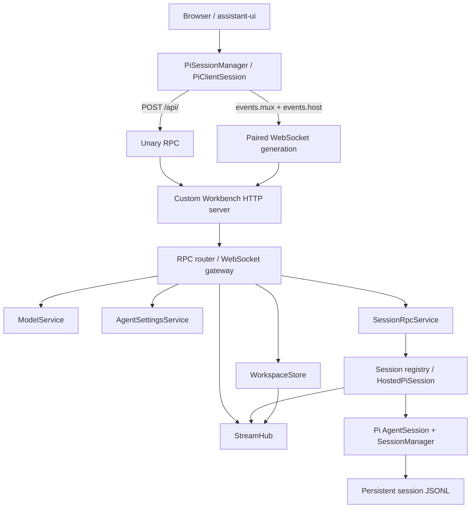

# Workbench Pi Runtime

Workbench Pi Runtime 将 `@earendil-works/pi-coding-agent` 直接嵌入 Workbench 的 Next.js
进程。浏览器不连接独立的 Pi 服务；自定义 Node HTTP server 同时承载 Next.js、HTTP RPC
和两条 WebSocket 下行流，并负责 Pi session 的创建、恢复、执行和持久化。

本目录实现的是
[DeepSeek Harness HTTP / WebSocket 接口参考](../../docs/deepseekharness-api-design.md)中的当前
Workbench 子集，而不是参考文档全部 59 个接口。线协议的类型来源是：

- [`rpc-contracts.ts`](./rpc-contracts.ts)：RPC envelope，以及 Host、Workspace、LLM、Settings、
  Session 的请求和响应类型；
- [`stream-contracts.ts`](./stream-contracts.ts)：mux/host WebSocket frame 和 payload 联合；
- [`contracts.ts`](./contracts.ts)：Workbench UI 适配层与 legacy `/api/pi/**` 使用的 Pi 类型。

## 架构



Unary RPC 是 session、workspace 和 running 状态的权威快照；WebSocket 只传递增量事件。
客户端重连后若服务端 watermark 与本地序号不同，会重新读取 unary 状态，而不是假设流能够永久
保存全部历史。

## 已实现的协议面

所有普通 unary 方法都使用 `POST /api/<method>`：

- Host：`host.describe`、`host.pickDirectory`、`host.listDirectory`、
  `host.createDirectory`、`host.openPath`；
- Workspace：`workspace.list`、`workspace.create`、`workspace.rename`、
  `workspace.delete`、`workspace.insertBefore`、`workspace.insertSessionBefore`、
  `workspace.archiveSession`、`workspace.unarchiveSession`；
- Skills：`skill.list`；
- Commands：`command.list`；
- Extensions：`extension.list`；
- Settings：`settings.describe`、`settings.openDocument`、`settings.update`；
- LLM：`llm.providers`、`llm.providerConfig`、`llm.configureProvider`、
  `llm.removeProvider`、`llm.modelContextWindow`、`llm.updateModelContextWindow`、
  `llm.models`、`llm.discoverModels`；
- Session：`session.list`、`session.search`、`session.create`、`session.history`、
  `session.models`、`session.selectModel`、`session.rename`、`session.fork`、
  `session.prompt`、`session.attachment`、`session.updateQueue`、`session.cancel`。

另外还提供：

- `POST /api/respond`：回答 mux 流中的 question 或 approval；
- `GET|HEAD /api/session.export`：流式导出一个 session，可选包含 descendants；
- `GET /api/events.mux`：session 事件、队列、交互请求等增量；
- `GET /api/events.host`：session、workspace、running 和 host 错误等增量。

参考文档中的 Agent Presets、Goals、Credentials 和 Message Feedback 等接口
尚未在本目录实现。

`host.describe` 同时返回 Workbench 的 `version` 和当前嵌入 Pi coding agent 的 `piVersion`；
状态栏等客户端界面应使用后者展示 Pi 版本。

当前 Settings 协议只暴露全局 `pi.agent` 命名空间，并且仅允许 loopback 请求。系统提示词写入
Pi agent 目录下的 `SYSTEM.md`；上下文压缩参数写入同目录的 `settings.json`，且会保留文件中的
其他 Pi 配置。更新使用 revision 进行冲突检测，并在新 session 或已有 session 执行 `/reload`
后生效。`settings.openDocument` 会在文件不存在时创建最小的 `settings.json`，再交给本地主机的
默认应用打开。

## RPC envelope 和错误

普通请求必须使用下面的 envelope，`method` 必须与 URL 中的方法完全一致：

```json
{
  "type": "client-request",
  "rpcId": "session-list-1",
  "method": "session.list",
  "payload": {}
}
```

响应回显同一个 `rpcId`：

```json
{
  "type": "server-response",
  "rpcId": "session-list-1",
  "result": {
    "ok": true,
    "value": {}
  }
}
```

HTTP `200` 只表示 RPC 载体成功完成。调用方必须继续检查 `result.ok`；输入校验和业务失败
同样返回 HTTP `200`，失败内容统一为：

```json
{
  "ok": false,
  "error": {
    "code": "bad-request",
    "message": "Invalid RPC request",
    "details": { "issues": [] }
  }
}
```

客户端应使用 `error.code` 和 `error.details` 分支，不应依赖面向人的 `message`。RPC object
会接受并剥离未知字段，以保持参考协议的兼容行为。

载体层规则：

- 只接受 `POST` 和 `Content-Type: application/json`；
- 默认最多缓冲 160 MiB 请求体，声明或实际超限返回 `413`；
- 非 JSON、非法 UTF-8 或非法 JSON 返回 `400`；
- 非 JSON media type 返回 `415`；
- 信任检查失败返回 `403`；
- 未预期的 handler 错误返回纯文本 `500`，不会把内部异常写入 RPC details。

`POST /api/respond` 使用 `ClientResponse`，并返回
`{ accepted: true } | { accepted: false, reason: "not-pending" | "bad-response" }`；它不是普通
`ServerResponse`。交互请求按 `rpcId` first-claim，重复或已失效的回答不会再次执行。

## 请求信任边界

Workbench 默认监听 `127.0.0.1:3000`。所有 `/api` HTTP 请求和两条 WebSocket upgrade
都执行相同的 DNS-rebinding / cross-site 防护：

- `Host` 必须是 loopback authority，或匹配 `PI_WORKBENCH_TRUSTED_HOSTS`；
- `Origin` 存在时，其 authority 必须与 `Host` 完全一致；
- `Sec-Fetch-Site: cross-site` 一律拒绝；
- `host.pickDirectory`、`host.openPath` 和 `llm.discoverModels` 即使来自配置的 trusted host，
  仍只允许 loopback 调用。

`PI_WORKBENCH_TRUSTED_HOSTS` 是逗号分隔的规范 `host` 或 `host:port`。不带端口的条目匹配该
host 的任意端口；带端口的条目精确匹配。

这只是本地服务的可达性和浏览器来源约束，不是身份认证。服务本身不提供 TLS、登录、
Cookie session 或 Bearer Token；如需跨机器暴露，必须在外层增加可信的认证与 TLS 代理。

## Workspace 和 Host 目录

`WorkspaceStore` 维护 canonical path、显示名称、workspace 顺序、每个 workspace 的 session
顺序和 archived session 集合。新 workspace 使用持久随机 UUID；不要使用 legacy
`PiWorkspaceSummary` 的 cwd hash 推导新 `workspaceId`。

状态默认写入 `~/.pi/workbench/workspaces.json`。写入使用进程间锁和原子替换；启动和
`workspace.list` 会与 Pi 已持久化的 session 对账。Archive 只影响 Workbench 组织状态，
不会删除 Pi session JSONL。

原生目录选择器仅供 loopback 使用。没有桌面选择器或通过 trusted host 访问时，客户端可以用
`host.listDirectory` 与 `host.createDirectory` 完成远程目录选择。目录列表只返回可进入的目录，
单次最多 500 项，并通过 `truncated` 表示截断。

## 模型

Pi `ModelRuntime` 是 provider、model 和凭证状态的权威来源：

- `llm.providers` 返回当前可配置或已注册的 provider；
- `llm.providerConfig` 返回 provider 的非敏感连接参数和模型目录；
- `llm.configureProvider` 将自定义连接与模型目录写入 Pi `models.json`，API key 则通过 Pi
  credential store 单独持久化；`llm.removeProvider` 删除由 Workbench 管理的对应配置；
- `llm.models` 按 provider 分组返回可用模型和 reasoning efforts，单个 provider 失败不会使
  整个 catalog 失败；
- `llm.modelContextWindow` 读取单个模型的有效上下文窗口；`llm.updateModelContextWindow` 通过
  `models.json` 的 `modelOverrides` 只覆盖该模型的 `contextWindow`，并保留 provider 凭证、headers
  及其他模型配置；
- `session.models` 在 catalog 之外还返回 session 当前选择和 `routable` 状态；
- `session.selectModel` 与 prompt/queue mutation 串行执行，避免与正在提交的图片 prompt
  发生竞态。

`llm.discoverModels` 可以读取 OpenAI-compatible `GET <baseURL>/models`，也可以使用
Anthropic `GET <baseURL>/v1/models`（当 base URL 已以 `/v1` 结尾时不会重复追加）及其游标分页。
显式传入的 `apiKey` 优先，否则已确定 provider 时会尝试 Pi 中已保存的凭证；请求级 key 不会
持久化、回传或写入日志。一次发现的全部模型列表响应合计最多读取 4 MiB，并支持请求取消。

Project-local settings、extensions 和 resources 默认不可信。只有
`PI_WORKBENCH_TRUST_PROJECT=1` 时，session 和模型服务才允许 Pi 加载这些项目资源。

## Skills

`skill.list` 按 `sessionId` 返回该 Pi session 的 `ResourceLoader` 已加载技能。响应只暴露协议定义的
名称、描述和模型是否可调用，不向浏览器返回技能文件路径。带有
`disable-model-invocation: true` 的技能会返回 `modelInvocable: false`，但仍可通过显式 skill 命令
调用。

技能发现沿用 Pi 的全局、package、settings 和项目资源规则。项目级技能仍受
`PI_WORKBENCH_TRUST_PROJECT=1` 控制；未信任时不会因为打开设置页而绕过资源信任边界。

## Commands

`command.list` 按 `sessionId` 返回统一的 Composer command catalog。每项带有可用于分组的
`kind`，当前聚合 Workbench 已适配的 Pi 内置命令、`extensionRunner.getRegisteredCommands()`、
prompt templates，以及 `ResourceLoader` 已加载的 skills。扩展项同时包含注册时的 `name` 和解决
重名后的 `invocationName`；只有 `invocationName` 能保证作为 `/command` 输入时准确命中目标命令。

扩展项还包含 description 和脱敏后的来源标签、scope、origin，不会把 handler、参数补全函数或
扩展文件绝对路径返回浏览器。catalog 也返回命令的 `effect` 和 `exclusive`：`/compact`、`/reload`
是独占的 `session-action`，普通 extension command 是独占的 `agent-turn`，prompt template 是
`prompt-transform`，skill 是可组合的 `instruction`。独占命令不能和另一个 Token 混用，从而避免
reload 后 preflight 快照失效，也避免 lifecycle action 与主 Agent turn 的顺序歧义。

Workbench 已适配的带参命令还可由 catalog 返回声明式 `argsSchema` 和 `argsBinding`。`/compact`
使用独占的 message-text binding：选择后在 Composer 上方打开结构化参数面板，参数写入
`args.customInstructions`；Token 后输入的正文始终保留在 `request.userText`。关闭面板会保留 Token，
点击 Token 可重新编辑，删除 Token 才清理参数。服务端先调用
`AgentSession.compact(customInstructions)`，成功后才执行可选的普通 Agent turn；压缩失败时显示错误并
停止后续请求。旧客户端发送的字符串 args 或无 args 的正文 fallback 仍兼容，对象不会整体 JSON
序列化后传给 Pi。

结构化 Composer 提交先对 catalog 中的全部 Token 做 preflight resolve；未知、冲突或已失效的命令会
在任何副作用发生前拒绝。执行阶段不再把所有命令统一实现成“先调用一次模型，再收集回答”：skill
通过 Pi 已加载资源公开的 `filePath`/`baseDir` 确定性读取为 trusted instruction，prompt template 按
Pi 公开的参数替换语义确定性转换 user text，两者都只进入一次最终主模型调用。extension command
仍通过 `AgentSession.prompt()` 的公开命令入口执行，但明确作为拥有该 turn 的 `agent-turn`，完成后
不会再启动第二个主请求。`/compact` 和 `/reload` 分别使用 `AgentSession.compact()` 与
`AgentSession.reload()`；Workbench 不调用或复制 extension handler，Pi 包源码和 `registerCommand()`
契约保持不变。

服务端先形成 canonical `ResolvedAgentRequest`，分别保存 user text、request config、trusted
instructions、trusted/untrusted context 和仅供历史/诊断使用的 command trace。trace 不会整体注入
模型；Pi string adapter 只在最后边界把 config、instructions、按 trust 标记的 context 和 user request
编译给 `AgentSession.prompt()`。这仍是 Pi 只接受字符串 prompt 时的 adapter fallback，而不是内部
canonical request。

UI 原文和 canonical Composer document 以隐藏的 `workbench.composer-user.v2` custom message
持久化；`sourceText` 只作为编辑器 serialization/fallback。解析状态和 command trace 另存为
`workbench.composer-resolution.v1`，历史投影恢复为一条标准 user message，并让用户气泡继续按与
Composer 相同的 Token renderer 显示。旧 `workbench.composer-user.v1` marker 仍可读取。纯
session-action 或 agent-turn 完成后不会额外启动空 LLM turn；空 `content` 只要带有结构化 Composer
语义仍可进入 admission。单个执行失败记录为 `execution-failed` trace，不回滚已接纳的用户消息；
纯命令事务发布 `command_done` 或 `command_error`。这类预期的命令结果不会发布全局
`host/agent-error`，该通道只保留给 session host、journal 和 transport 等基础设施故障。

Pi 内置 session-action 还会在用户 Token 气泡后运行可见的
`workbench.composer-command-response.v1` 状态机：调用 Pi API 前发布 `running`，完成后原位更新为
`success` 或 `execution-failed`。canonical message event 会实时传输并持久化每次状态转换，终态另外写入
不参与 LLM context 的 Session custom entry；响应只保存稳定的 command id、label、status 和 submission
id，不保存内部异常文本，UI 再按当前 locale 渲染。因此 `/compact` 会先显示“正在压缩上下文…”，再
更新为“会话上下文已压缩”或可见错误；`/reload` 使用同一生命周期。命令状态活跃时，同一次 Pi
compaction conversation event 不再额外渲染 separator，避免一个动作出现两条结果消息；历史恢复也按
`submissionId + commandId` 折叠为一个最终系统响应。

Pi TUI 中仅对终端有意义的命令（例如 `/quit`、`/copy`）不会出现在 Workbench catalog；只有具备
Workbench 等价语义的内置命令才会被暴露，避免把 UI action 错当成普通 prompt。Pi 包源码与
`registerCommand()` 契约保持不变。

## Extensions

`extension.list` 按 `sessionId` 返回该 Pi session 的 `ResourceLoader` 已成功加载且未标记为 hidden
的扩展。响应包含面向展示的扩展名称、来源范围、来源类型，以及其注册的事件、工具和命令名称；
不会把扩展文件的绝对路径或具体加载错误内容返回浏览器，只返回加载失败数量。

扩展发现沿用 Pi 的全局、package、settings 和项目资源规则。项目级扩展受
`PI_WORKBENCH_TRUST_PROJECT=1` 控制；查询设置页不会提升项目资源信任。

## Session 生命周期和持久状态

Pi `SessionManager` 管理 JSONL session。进程内的 session registry 为正在使用的 session
创建 `HostedPiSession`，并允许多个 session 独立后台运行。空闲且没有暂停队列的 host 在
10 分钟后释放；JSONL 历史不会因此丢失，下一次访问会 cold-open。

Workbench 在 Pi JSONL 中保存 canonical event journal。每个 `SessionEvent` 都包含稳定递增的
`seq`、epoch-millisecond `time` 和原始 `data`，因此 cold history 和 live mux 使用同一事件
序列。`session.history` 按完整消息组分页，避免把 `message_start` / `message_end` 组从中间切开。

其他关键行为：

- `session.create` 支持调用方指定 session ID，并对同一 ID 串行化以保证幂等和 cwd 冲突检测；
- 未提供 workspace/cwd 时，session 使用服务进程的 `process.cwd()`；
- prompt、queue mutation 和 model selection 在每个 session 内串行化；
- follow-up/steer 先以 prompt `rpcId` 乐观加入客户端队列；服务端接纳后沿用该 ID，
  `session.prompt` 响应通过 `queued` 和可选 `queueItemId` 区分进入队列或直接成为下一轮，失败则按 ID
  精确回滚；
- queue item 有稳定 ID，可执行 edit、remove 或将 follow-up 提升为 steer；
- prompt 的 `rpcId` 和规范化 IANA client timezone 会作为 provenance 写入 JSONL；
- inline image 会在进入 Pi 前校验 base64、文件签名、媒体类型和模型图片能力；
- fork 只在可证明已持久化的完整 turn boundary 建立独立 child，不替换或修改 source session；
- create、rename、fork、cold rename、running 状态、归档状态和 workspace 变更都会发布对应实时增量；
- export 直接流式打包原始 JSONL，不先把整个 ZIP 或 session 读入内存。

## mux 和 host WebSocket

两条 WebSocket 都是 server-to-client downlink。每个 text frame 都是完整的
`ServerRequest`，且 `method === payload.type`。客户端不得在 socket 上发送应用消息；服务收到
任意客户端 message 后以 close code `1008`、reason `downlink only` 关闭连接。question 和
approval 的上行回答必须通过 `POST /api/respond`。

`/api/events.mux` 当前承载：

- canonical session event 和 session watermark；
- `session.prompt` 真正接纳后的瞬时 `session/prompt-accepted` 确认；其 frame `rpcId` 与原 HTTP
  RPC 相同，并携带接纳后的运行态，但不重复传输 prompt 内容；
- 权威 queue snapshot；
- question/approval requested 与 resolved；
- stream error；
- contracts 还保留 jobs 和 projection payload，以便后续 producer 接入。

`/api/events.host` 当前承载带完整摘要的 session added/changed、session removed/status、agent
error、workspace changed/removed/order、archived session 变化和兼容的 remote event。连接中的浏览器
可以直接应用会话创建、标题/消息元数据、运行与归档增量；`session.list` 只负责首屏和断线重建基线。

新 mux subscriber 会先收到已保留的 session watermark、queue 和未决交互，再收到 bootstrap
期间缓冲的 live frame。bootstrap 缓冲上限为 10,000 帧；单 socket 待发送数据上限为 1 MiB。
消费者过慢、序列化失败或 stream 异常时，服务尽力发送 `stream/error`，然后以 `1011` 结束
连接。普通 `GET|HEAD` 访问这两个路径而不 upgrade 会得到 `426 Upgrade Required`。

浏览器把 mux 和 host 作为同一个 connection generation：只有两条 socket 都打开后才提交该代
frame；任意一条断开都会废弃整代并同时重建两条连接。重连使用带抖动的指数退避（250 ms 到
10 s），随后通过 `host.describe`、`session.list` 和 `workspace.list` 恢复权威基线，旧一代的
未决交互不会覆盖新状态。

开发模式会在浏览器 Console 输出 `websocket connecting`、两条 `stream open` 和最终的
`websocket ready`；Network 面板中 mux/host 应同时保持 `101 Switching Protocols`。若普通
`GET /api/events.mux` 返回 `405` 而不是 `426`，通常说明端口仍被直接启动的旧 `next dev`
占用，应先精确确认监听进程，再用 `pnpm dev` 重新启动 custom server。

## 自定义 server

根目录 [`server.ts`](../../server.ts) 是开发和生产的必经入口：

1. 创建一个不监听网络的 Node server，让 Next 安装自己的 upgrade listener；
2. `app.prepare()` 后取得 Next request handler；
3. 创建 Pi 下行流和独立双向 Terminal 的 `ws` `noServer` gateway；
4. 启动唯一对外监听的 Workbench HTTP server；
5. 将 Terminal 及 mux/host upgrade 交给对应 gateway，其余 upgrade 转发给 Next。

Terminal 的 PTY 生命周期和双向 frame 协议属于独立的
[`runtime/terminal`](../terminal/README.md) 边界，不混入 Pi 的 downlink-only stream。

这样可以避免 Next 与 Pi 分别监听端口或抢占 upgrade。不要直接用 `next dev` 或 `next start`
启动本项目；`pnpm dev` 和 `pnpm start` 已经使用该入口。

## 目录布局

实现按传输层和业务域分组，测试与源文件共置：

```text
runtime/pi/
├── README.md
├── contracts.ts
├── rpc-contracts.ts
├── stream-contracts.ts
├── client/
│   ├── transport/
│   │   ├── api.ts
│   │   └── connections.ts
│   ├── runtime/
│   │   ├── manager.ts
│   │   └── context.tsx
│   ├── messages/
│   │   ├── messages.ts
│   │   └── queue.ts
│   ├── models/
│   │   └── model-selection.ts
│   └── sessions/
│       ├── session-create-intent.ts
│       └── session-rpc-adapter.ts
└── server/
    ├── core/
    │   └── errors.ts
    ├── transport/
    │   ├── api-request-guard.ts
    │   ├── custom-server.ts
    │   ├── local-api-request-trust.ts
    │   ├── responses.ts
    │   ├── rpc-router.ts
    │   └── rpc-transport.ts
    ├── host/
    │   ├── host-directories.ts
    │   └── native-workspace-picker.ts
    ├── models/
    │   └── model-service.ts
    ├── commands/
    │   └── command-service.ts
    ├── extensions/
    │   └── extension-service.ts
    ├── skills/
    │   └── skill-service.ts
    ├── workspaces/
    │   ├── workspace-registry.ts
    │   ├── workspace-store.ts
    │   └── workspace-paths.ts
    ├── sessions/
    │   ├── interactive-response-registry.ts
    │   ├── session-event-journal.ts
    │   ├── session-export.ts
    │   ├── session-queue.ts
    │   ├── session-registry.ts
    │   └── session-rpc-service.ts
    └── streams/
        ├── legacy-sse.ts
        ├── stream-hub.ts
        └── websocket-gateway.ts
```

职责约定：

- `transport` 只处理 carrier、信任、校验、路由和 upgrade；
- `sessions`、`workspaces`、`models`、`host` 包含业务规则和 Pi/文件系统适配；
- `streams` 负责实时分发与 legacy SSE，不拥有业务状态；
- `client/transport` 不拥有 assistant-ui 状态，状态协调集中在 `client/runtime`；
- `*-contracts.ts` 不导入 server/client 实现，保持线协议可独立复用。

## 配置

- `PORT`：对外监听端口，默认为 `3000`，必须为 `1..65535` 的整数；
- `WORKBENCH_HOST`：对外监听 hostname，默认为 `127.0.0.1`；
- `PI_WORKBENCH_TRUSTED_HOSTS`：额外允许的逗号分隔 `host[:port]` authority，默认没有；
- `PI_WORKBENCH_TRUST_PROJECT`：只有精确值 `1` 才信任 project-local Pi 资源；
- `PI_WORKBENCH_STATE_DIR`：Workspace 状态目录，默认为 `~/.pi/workbench`；
- `PI_WORKBENCH_WORKSPACE_STATE_FILE`：Workspace 状态文件的显式路径，设置后优先于 state dir。

## 运行和验证

项目只使用 pnpm：

```bash
pnpm install
pnpm dev
```

生产构建和启动：

```bash
pnpm build
pnpm start
```

常用静态检查：

```bash
pnpm exec tsc --noEmit
pnpm lint
```

运行 Pi runtime 的 Node 测试：

```bash
mapfile -t pi_tests < <(rg --files runtime/pi -g '*.test.ts')
node --no-warnings=ExperimentalWarning \
  --import ./.codex/hooks/register-typescript-loader.mjs \
  --test "${pi_tests[@]}"
```

修改 custom server 或 WebSocket 时，除单元测试外还应在非 3000 端口进行 smoke test，至少验证
RPC envelope、恶意 Host 的 `403`、普通 stream GET 的 `426`、两个 WS handshake，以及向
downlink 发送消息后的 `1008` close。

## 当前能力边界

- `session.attachment` 已保留协议形状，但 Pi 当前没有按 `attachmentId` 读取持久附件的仓库；
  该方法稳定返回 `attachment-error`。发送 prompt 时的 inline image 已支持。
- Inline image 仅接受 PNG、JPEG、WebP 和 GIF；最多 20 张，单张解码后最多 20 MiB，总计最多
  100 MiB。媒体类型必须与文件签名一致。
- 当前 queue edit 只接受 text content；图片 queue item 可以保留、删除或 steer，但不能通过该
  RPC 改写为新的图片内容。
- Skills 当前只实现 session-scoped `skill.list`；启停、编辑、安装和 reload 尚未加入 Workbench
  协议。
- Extensions 当前只实现 session-scoped `extension.list`；启停、编辑、安装和 reload 尚未加入
  Workbench 协议。
- Commands 已聚合受支持的 Pi built-ins、session-scoped extension commands、prompt templates 和
  skills。终端专用的 interactive TUI commands 仍不会暴露；新增内置项时必须先提供 Workbench
  等价语义，并继续使用 Pi 的公开 API。
- `session.create.agentPreset` 是兼容字段，当前 Pi session engine 不支持创建时选择 preset，传入
  后返回 `agent-preset-invalid`。
- 不能把包含历史图片、活动图片 prompt 或待处理图片队列的 session 切换到 text-only model。
- `/api/pi/**`、`legacy-sse.ts` 和 legacy contracts 仍为兼容层；新 UI 的核心读写使用
  `/api/<method>` 与 mux/host WS。队列 pause 暂时仍经过 legacy command，因为目标协议没有
  pause 方法。
- 当前实现不等同于参考 Harness 的完整 Host；新增接口时应先扩展 contracts、RPC validation、
  domain service 和测试，再接入 UI，不能直接在组件中发明第二套协议。
