# Workbench Pi Runtime

Workbench Pi Runtime 将 `@earendil-works/pi-coding-agent` 直接嵌入 Workbench 的 Next.js
进程。浏览器不连接独立的 Pi 服务；自定义 Node HTTP server 同时承载 Next.js、HTTP RPC
和两条 WebSocket 下行流，并负责 Pi session 的创建、恢复、执行和持久化。

本目录实现的是
[DeepSeek Harness HTTP / WebSocket 接口参考](../../docs/deepseekharness-api-design.md)中的当前
Workbench 子集，而不是参考文档全部 59 个接口。线协议的类型来源是：

- [`contracts/rpc.ts`](./contracts/rpc.ts)：RPC envelope，以及 Host、Workspace、LLM、Settings、
  Session 的请求和响应类型；
- [`contracts/stream.ts`](./contracts/stream.ts)：mux/host WebSocket frame 和 payload 联合；
- [`contracts/pi.ts`](./contracts/pi.ts)：Workbench UI 适配层与 legacy `/api/pi/**` 使用的 Pi 类型。

Workbench Execution 负责 Workflow 的定义存储、编译、手动执行和 Run 记录，实现在
[`runtime/server/executions`](../server/executions)，共享契约位于
[`runtime/shared/execution.ts`](../shared/execution.ts)。Automation 是独立领域，定义、存储和调度位于
[`runtime/server/automations`](../server/automations)，共享契约位于
[`runtime/shared/automation.ts`](../shared/automation.ts)。Automation 不创建执行图或 Workflow Run；
触发时只在目标工作区创建一个普通、可见的会话，再通过标准 Agent 执行端口提交用户配置的提示词。
本目录保留 Workflow Agent 节点适配器、Automation 普通会话启动适配器，以及 Workbench 事件/RPC
接线。前端在 `extensions/builtin/execution/{workflow,automation}` 页面外壳层复用布局。

### Workflow Multi-Agent v2

Workflow v2 将稳定 Agent 与图节点分开：`agents[]` 定义 `workflowId + agentId` 身份，Agent Node
只引用 `agentId`、Pi prompt template、输入 binding 和输出 JSON Schema。个人工作流的持久目录为：

```text
<execution-root>/workflows/<workflowId>/
├── workflow.json
├── agents/<agentId>/.pi/
│   ├── APPEND_SYSTEM.md
│   ├── settings.json
│   └── prompts/*.md
└── runs/<runId>/
    ├── summary.json
    ├── events.jsonl
    ├── sessions/<agentId>/*.jsonl
    └── artifacts/
```

项目工作流使用同一内部布局，但完整目录位于所选项目中：

```text
<project>/.pi/workflows/<workflowId>/
```

已发布的项目定义继续写入相邻的 `<project>/.pi/workflows/<workflowId>.json`，供外部编辑和发布冲突
检测使用。旧版本误写在用户级 `<execution-root>/workflows/<workflowId>/` 的项目工作流会在首次读取时
整体迁移到项目目录，保留 Agent 资源、修订、Run、会话和产物。

Agent cwd 固定为 `agents/<agentId>`，因此模型、Thinking、Prompt、Skill 和 Extension 都直接使用
Pi 的项目级资源加载与全局继承，不存在第二套 Agent 配置格式。执行器以 `runId + agentId` 解析
会话：同一 Run 的同一 Agent 使用 follow-up 串行复用，不同 Agent 可并行，新 Run 使用新的会话。
每个 Workflow Agent 会话额外注册 `submit_workflow_output`；工具按当前 Node 的 JSON Schema 校验
结果，Prompt 结束而未提交时以 `structured-output-missing` 失败。加载 Agent 本地 `.pi` 资源前仍
必须通过 Project Trust；该目录隔离只用于组织工作区，不是文件系统安全沙箱。

## 架构

```mermaid
flowchart TD
  UI["Browser / assistant-ui"] --> PORT["WorkbenchAgentRuntimeAdapter"]
  PORT --> ADAPTER["Pi assistant-ui adapter"]
  ADAPTER --> CM["PiSessionManager / PiClientSession"]
  CM -->|"POST /api/<method>"| HTTP["Unary RPC"]
  CM -->|"events.mux + events.host"| WS["Paired WebSocket generation"]

  HTTP --> CS["Custom Workbench HTTP server"]
  WS --> CS
  CS --> ROUTER["Thin RPC router"]
  CS --> GATEWAY["WebSocket gateway"]
  CS --> FILE_CONTENT["Workspace file content endpoint"]

  ROUTER --> COMPOSITION["Injected ordered route groups"]
  COMPOSITION --> WORKSPACE_ROUTES["Workspace RPC routes"]
  COMPOSITION --> WORKSPACE_GIT_ROUTES["Workspace Git RPC routes"]
  COMPOSITION --> WORKSPACE_FILE_ROUTES["Workspace File RPC routes"]
  COMPOSITION --> MODEL_PROVIDER_ROUTES["Model Provider RPC routes"]
  COMPOSITION --> MODEL_CONTEXT_WINDOW_ROUTES["Model Context Window RPC routes"]
  COMPOSITION --> AGENT_SETTINGS_ROUTES["Agent Settings RPC routes"]
  COMPOSITION --> WORKBENCH_SETTINGS_ROUTES["Workbench Settings RPC routes"]
  COMPOSITION --> IMAGE_SETTINGS_ROUTES["Image Understanding Settings RPC routes"]
  COMPOSITION --> SESSION_ROUTES["Session RPC routes"]
  COMPOSITION --> EXECUTION_ROUTES["Execution RPC routes"]
  COMPOSITION --> AUTOMATION_ROUTES["Automation RPC routes"]
  COMPOSITION --> TRACE_ROUTES["Context Trace RPC routes"]
  COMPOSITION --> IMPORT_ROUTES["External Import RPC routes"]
  COMPOSITION --> SKILL_ROUTES["Skill RPC routes"]
  COMPOSITION --> EXTENSION_ROUTES["Extension RPC routes"]
  COMPOSITION --> COMMAND["CommandService"]
  GATEWAY --> HUB["StreamHub"]

  SESSION_ROUTES --> SESSION_FACADE["PiSessionProtocolFacade"]
  TRACE_ROUTES --> TRACE_SERVICE["PiSessionContextTraceService"]
  IMPORT_ROUTES --> IMPORT_SERVICE["ExternalSessionImportService"]
  WORKSPACE_ROUTES --> WORKSPACE_PROTOCOL["WorkspaceProtocolService"]
  WORKSPACE_PROTOCOL --> WORKSPACE["WorkspaceStore"]
  WORKSPACE_PROTOCOL -->|"session catalog"| REGISTRY
  WORKSPACE_PROTOCOL --> TRUST["Project Trust service"]
  WORKSPACE_GIT_ROUTES --> WORKSPACE_GIT["Workspace Git service"]
  WORKSPACE_GIT --> WORKSPACE
  WORKSPACE_FILE_ROUTES --> WORKSPACE_FILES["WorkspaceFileProtocol / Service"]
  FILE_CONTENT --> WORKSPACE_FILES
  WORKSPACE_FILES --> WORKSPACE
  SKILL_ROUTES --> SKILL_SERVICE["SkillProtocol / SkillService"]
  SKILL_SERVICE -->|"session target"| REGISTRY
  SKILL_SERVICE -->|"catalog target"| RESOURCE_CONTEXT["Scoped Resource Context"]
  EXTENSION_ROUTES --> EXTENSION_SERVICE["ExtensionProtocol / ExtensionService"]
  EXTENSION_SERVICE -->|"session target"| REGISTRY
  EXTENSION_SERVICE -->|"catalog target"| RESOURCE_CONTEXT
  AGENT_SETTINGS_ROUTES --> SETTINGS["AgentSettingsProtocol / Service"]
  WORKBENCH_SETTINGS_ROUTES --> WORKBENCH_SETTINGS["WorkbenchSettingsProtocol / Service"]
  IMAGE_SETTINGS_ROUTES --> IMAGE_SETTINGS["ImageUnderstandingSettingsProtocol / Store"]
  MODEL_PROVIDER_ROUTES --> MODEL["ModelProviderProtocol / ModelService"]
  MODEL_CONTEXT_WINDOW_ROUTES --> MODEL_CONTEXT_PROTOCOL["ModelContextWindowProtocol / ModelService"]
  SESSION_FACADE -->|"owns lifecycle"| SESSION["SessionRpcService"]
  SESSION_FACADE -.->|"late-bound"| WORKSPACE
  SESSION --> EXEC_PORT["AgentExecutionPort"]
  SESSION --> THREAD_PORT["AgentThreadStorePort"]
  SESSION --> HISTORY["PiSessionHistoryService"]
  SESSION --> MODEL_CONTEXT["PiSessionModelContextService"]
  EXECUTION_ROUTES --> EXECUTION["Workbench Execution service"]
  AUTOMATION_ROUTES --> AUTOMATION["Automation service"]
  EXECUTION --> WORKFLOW_EXECUTOR["Workflow Agent node adapter"]
  AUTOMATION --> AUTOMATION_EXECUTOR["Ordinary session launch adapter"]
  COMMAND -.->|"implements"| COMMAND_PORT["AgentCommandCatalogPort"]
  EXEC_PORT --> PI_SERVER["Pi server adapter"]
  THREAD_PORT --> PI_SERVER
  PI_SERVER --> REGISTRY["Session registry / HostedPiSession"]
  HISTORY --> REGISTRY
  MODEL_CONTEXT --> REGISTRY
  MODEL_CONTEXT --> MODEL
  COMMAND --> REGISTRY
  TRACE_SERVICE -->|"activates live queries"| REGISTRY
  TRACE_SERVICE --> TRACE["Context Trace / journal"]
  IMPORT_SERVICE --> IMPORT_ADAPTERS["Codex / Claude Code / Cursor adapters"]
  IMPORT_SERVICE --> WORKSPACE
  REGISTRY --> PI["Pi AgentSession + SessionManager"]
  WORKFLOW_EXECUTOR --> PI
  AUTOMATION_EXECUTOR --> PI
  IMPORT_SERVICE --> PI
  REGISTRY --> TRACE
  PI --> JSONL["Persistent session JSONL"]
  REGISTRY --> HUB
  WORKSPACE --> HUB
```



Unary RPC 是 session、workspace 和 running 状态的权威快照；WebSocket 只传递增量事件。
客户端重连后若服务端 watermark 与本地序号不同，会重新读取 unary 状态，而不是假设流能够永久
保存全部历史。

## 已实现的协议面

所有普通 unary 方法都使用 `POST /api/<method>`：

- Host：`host.describe`、`host.pickDirectory`、`host.listDirectory`、
  `host.createDirectory`、`host.openPath`，以及本地应用集成
  `host.localApps.list`、`host.localApps.refresh`、`host.localApps.open`；
- Project Trust：`projectTrust.describe`、`projectTrust.update`；
- Workspace：`workspace.list`、`workspace.listArchivedSessions`、`workspace.create`、`workspace.rename`、
  `workspace.delete`、`workspace.insertBefore`、`workspace.insertSessionBefore`、
  `workspace.setPinned`、`workspace.setSessionPinned`、`workspace.archiveSession`、
  `workspace.unarchiveSession`；
- Workspace files：`workspace.files.list`、`workspace.files.search`、`workspace.files.describe`、
  `workspace.files.read`、`workspace.files.write`，以及 `GET/HEAD /api/workspace.files.content`；
- Workspace Git：`workspace.git.describe`、`workspace.git.log`、
  `workspace.git.switchBranch`、`workspace.git.createBranch`；
- Skills：`skill.list`、`skill.describe`、`skill.setEnabled`、`skill.files.list`、`skill.files.read`、
  `skill.remove`；
- Commands / Prompts：会话或新会话资源目标的命令目录 `command.list`，以及独立资源目录
  `prompt.list`；
- Extensions：`extension.list`、`extension.files.list`、`extension.files.read`、
  `extension.setEnabled`、`extension.remove`；
- Pi Packages：`package.list`、`package.describe`、`package.updates`、`package.install`、
  `package.update`、`package.remove`、`packageCatalog.search`、`packageCatalog.describe`；
- Settings：Pi 原生设置 `settings.describe`、`settings.openDocument`、`settings.update`，Workbench
  设置 `workbenchSettings.describe`、`workbenchSettings.openDocument`、
  `workbenchSettings.update`，以及附件识别配置
  `imageUnderstanding.describe`、`imageUnderstanding.update`；
- LLM：`llm.providers`、`llm.providerConfig`、`llm.startProviderLogin`、
  `llm.providerLogin`、`llm.respondProviderLogin`、`llm.cancelProviderLogin`、`llm.configureProvider`、
  `llm.removeProvider`、`llm.modelContextWindow`、`llm.updateModelContextWindow`、
  `llm.resetModelContextWindow`、
  `llm.models`、`llm.discoverModels`、`llm.testModelImageInput`；
- Session：`session.list`、`session.search`、`session.create`、`session.history`、
  `session.regenerate`、`session.resume`、`session.selectBranch`、
  `session.contextTrace.activations`、`session.contextTrace.list`、`session.contextTrace.read`、
  `session.models`、`session.selectModel`、`session.contextPolicy`、
  `session.updateContextPolicy`、`session.compactContext`、`session.rename`、`session.fork`、
  `session.delete`、`session.prompt`、`session.attachment`、`session.updateQueue`、
  `session.cancel`。
- External session import：`sessionImport.scan`、`sessionImport.import`；

另外还提供：

- `POST /api/respond`：回答 mux 流中的 question 或 approval；
- `GET|HEAD /api/session.export`：流式导出一个 session，可选包含 descendants；
- `GET /api/events.mux`：session 事件、队列、交互请求等增量；
- `GET /api/events.host`：session、workspace、running 和 host 错误等增量。

参考文档中的 Agent Presets、Goals、Credentials 和 Message Feedback 等接口
尚未在本目录实现。

`host.describe` 同时返回稳定的 `product: "pi-workbench"`、Workbench 的 `version`、当前嵌入
Pi coding agent 的 `piVersion`，以及用户级 Pi Package 的权威 `userPackageDir`；原生壳使用
`product` 识别服务，状态栏等客户端界面应使用 `piVersion` 展示 Pi 版本。工具箱使用
`userPackageDir` 展示安装位置，不在浏览器中推导用户主目录或写死默认路径。

当前 Settings 协议只暴露全局 `pi.agent` 命名空间，并且仅允许 loopback 请求。系统提示词写入
Pi agent 目录下的 `SYSTEM.md`；上下文压缩参数写入同目录的 `settings.json`，且会保留文件中的
其他 Pi 配置。更新使用 revision 进行冲突检测，并在新 session 或已有 session 执行 `/reload`
后生效。`settings.openDocument` 会在文件不存在时创建最小的 `settings.json`，再交给本地主机的
默认应用打开。

三个设置子域分别由 `transport/routes/agent-settings-rpc-routes.ts`、
`workbench-settings-rpc-routes.ts` 和 `image-understanding-settings-rpc-routes.ts` 拥有，避免把 Pi
原生设置、Workbench preferences 与附件识别凭据合并成一个泛化服务。Agent Settings route 只依赖
`AgentSettingsProtocol` 和组合根注入的文档打开函数，三个方法全部保持 loopback-only，并独占 4 MiB
更新载体预算与打开取消映射；Workbench Settings route 通过 late-bound `WorkbenchSettingsProtocol`
保留环境覆盖和 HMR 语义，describe/update 允许显式 trusted host，文档打开保持 loopback-only，
并独占 24 MiB 更新载体预算与打开取消映射；Image
Understanding route 通过 late-bound `ImageUnderstandingSettingsProtocol` 保留 registry 和旧文件迁移，
两个方法保持 loopback-only。三个 route 统一复用顶层错误投影，但不会取得文件锁、状态文件、凭据或
Pi agent 目录。

Workbench 自有的持久配置统一写入 Pi agent 目录下的 `workbench-settings.json`。文档使用
`version`、全局 `revision`、`preferences`、`workspaces` 和 `imageUnderstanding` 顶层字段；三类
写入共享进程间锁并使用 mode-0600 原子替换。`preferences` 包含外观与背景图、locale、模型选择器
记忆、Toolbox 置顶、RightWorkspace 布局和侧栏开关。浏览器中的旧 localStorage、Cookie 与
IndexedDB 值在对应功能首次 hydrate 时导入，成功后删除。滚动位置和未保存文件草稿仍是
sessionStorage 临时状态，不属于跨窗口的用户配置。
`workbenchSettings.openDocument` 会在文档不存在时写入最小的 `version`/`revision` 结构，再交给本地
Host 的默认应用打开；已经存在的文档不会因打开动作被解析、改写或覆盖。

旧 `~/.pi/workbench/workspaces.json` 与
`~/.pi/agent/workbench/image-understanding.json` 会在服务端首次读取时原子导入对应 section，成功
提交新文档后删除旧文件。RPC 只向浏览器返回非敏感的 `preferences`；OCR secrets 与完整 Workspace
状态虽然位于同一物理文件，但不会经过 Workbench Settings RPC 返回。

## RPC envelope 和错误

普通请求必须使用下面的 envelope，`method` 必须与 URL 中的方法完全一致：

```json
{
  "type": "client-request",
  "rpcId": "session-list-1",
  "method": "session.list",
  "payload": {}
}
```

响应回显同一个 `rpcId`：

```json
{
  "type": "server-response",
  "rpcId": "session-list-1",
  "result": {
    "ok": true,
    "value": {}
  }
}
```

HTTP `200` 只表示 RPC 载体成功完成。调用方必须继续检查 `result.ok`；输入校验和业务失败
同样返回 HTTP `200`，失败内容统一为：

```json
{
  "ok": false,
  "error": {
    "code": "bad-request",
    "message": "Invalid RPC request",
    "details": { "issues": [] }
  }
}
```

客户端应使用 `error.code` 和 `error.details` 分支，不应依赖面向人的 `message`。RPC object
会接受并剥离未知字段，以保持参考协议的兼容行为。

浏览器可见的业务错误必须显式继承 `server/core/rpc-domain-error.ts` 的 `RpcDomainError`。
共享投影器 `transport/rpc-domain-error-projector.ts` 只把带有该安全标记的错误转换为上述业务
envelope；仅仅伪造同名 `code`、`details` 字段的普通异常不会被暴露。标记使用 HMR 稳定的
`Symbol.for`，但自身不可枚举、不可序列化。领域 route 仍通过注入回调取得投影能力，因此不需要导入
具体错误类；未标记异常会原样抛回统一的纯文本 `500` 边界。

载体层规则：

- 只接受 `POST` 和 `Content-Type: application/json`；
- 普通 RPC 最多缓冲 1 MiB 请求体；只有领域契约确实需要时才显式放宽：`settings.update` 为
  4 MiB、`llm.configureProvider` 为 8 MiB、`workbenchSettings.update` 为 24 MiB、
  `workspace.files.write` 为 20 MiB，包含 inline 图片/PDF 的 `session.prompt` 为 80 MiB；
- 仍承载队列暂停和 follow-up 重排的 legacy session commands route 与附件 prompt 共用 80 MiB
  上限；声明或实际读取超限都返回 `413`；
- 请求体预算在 JSON 解析和兼容性未知字段剥离之前执行，未知字段不会绕过对应 method 的上限；
- 非 JSON、非法 UTF-8 或非法 JSON 返回 `400`；
- 非 JSON media type 返回 `415`；
- 信任检查失败返回 `403`；
- 未预期的 handler 错误返回纯文本 `500`，不会把内部异常写入 RPC details。

`POST /api/respond` 使用 `ClientResponse`，并返回
`{ accepted: true } | { accepted: false, reason: "not-pending" | "bad-response" }`；它不是普通
`ServerResponse`。交互请求按 `rpcId` first-claim，重复或已失效的回答不会再次执行。

## 请求信任边界

Workbench 默认监听 `127.0.0.1:3000`。所有 `/api` HTTP 请求和两条 WebSocket upgrade
都执行相同的 DNS-rebinding / cross-site 防护：

- `Host` 必须是 loopback authority，或匹配 `PI_WORKBENCH_TRUSTED_HOSTS`；
- `Origin` 存在时，其 authority 必须与 `Host` 完全一致；
- `Sec-Fetch-Site: cross-site` 一律拒绝；
- `host.pickDirectory`、`host.openPath`、所有 `host.localApps.*` 方法和 `llm.discoverModels`
  即使来自配置的 trusted host，仍只允许 loopback 调用。

`PI_WORKBENCH_TRUSTED_HOSTS` 是逗号分隔的规范 `host` 或 `host:port`。不带端口的条目匹配该
host 的任意端口；带端口的条目精确匹配。

这只是本地服务的可达性和浏览器来源约束，不是身份认证。服务本身不提供 TLS、登录、
Cookie session 或 Bearer Token；如需跨机器暴露，必须在外层增加可信的认证与 TLS 代理。

## Workspace 和 Host 目录

`WorkspaceStore` 维护 canonical path、显示名称、workspace 顺序、每个 workspace 的 session
顺序、archived session 集合，以及 workspace/session 的置顶状态。新 workspace 使用持久随机 UUID；不要使用 legacy
`PiWorkspaceSummary` 的 cwd hash 推导新 `workspaceId`。

11 个 Workspace 组织与归档方法的 payload validator 和 transport 映射由独立的
`transport/routes/workspace-rpc-routes.ts` 拥有；route 只依赖 `WorkspaceProtocolService`，不直接读取
Session Registry、WorkspaceStore、Project Trust 或资源目录缓存。服务通过窄的 Session catalog 端口只接收
`{ id, cwd }` 快照，在 `workspace.list` 前完成会话对账，在 create/list/unarchive 的兼容路径中协调历史
Project Trust 迁移，并在删除 Workspace 后失效对应的 project resource context。可热更新的
WorkspaceStore 仍按调用延迟解析；Store 自己继续拥有持久化和 `events.host` 发布。四个
`workspace.files.*` unary 方法不属于这个 route group；它们的 validator、写入载体预算、取消错误映射和
handler 由 `transport/routes/workspace-file-rpc-routes.ts` 独立拥有。该 route 只依赖窄的
`WorkspaceFileProtocol`，实际路径、真实路径、软链接、文件容量和并发版本检查仍由
`WorkspaceFileService` 执行。默认工厂为 unary route 与流式 content 端点提供同一套延迟
WorkspaceStore 组装；5 MiB 是可编辑 UTF-8 文件内容上限，20 MiB 是包含 JSON envelope 和多字节转义的
RPC 载体预算，两者语义不同。

对外返回的 `WorkspaceView.sessionIds` 只包含当前未归档的 session；底层仍保留完整顺序，取消归档
后会恢复到原位置。`workspace.list` 只返回可见工作区快照，归档集合的权威基线由独立的
`workspace.listArchivedSessions` 返回。归档与取消归档 RPC 只确认本次 `sessionId` 和目标
`archived` 状态；持久化成功后的权威增量由 `events.host` 的
`host/session-archive-changed` 发布，并携带所属工作区更新后的可见快照。历史归档记录若尚未
归属 canonical Workspace，取消归档会先按 session 的 canonical cwd 恢复工作区成员关系，再以同一个
host 增量原子发布，避免恢复后的会话成为无工作区列表项。

状态默认写入 `~/.pi/agent/workbench-settings.json` 的 `workspaces` section，置顶状态因此由服务端
持久化并同步到连接同一 Workbench host 的多个浏览器。写入使用共享进程间锁和原子替换；启动和
`workspace.list` 会与 Pi 已持久化的 session 对账。Archive 只影响 Workbench 组织状态，
不会删除 Pi session JSONL。

原生目录选择器仅供 loopback 使用。没有桌面选择器或通过 trusted host 访问时，客户端可以用
`host.listDirectory` 与 `host.createDirectory` 完成远程目录选择。目录列表只返回可进入的目录，
单次最多 500 项，并通过 `truncated` 表示截断。

本地应用集成运行在 Electron 启动的本机 Host 进程中，不在 Renderer 中读取平台或安装路径。
统一 Registry 定义编辑器、媒体播放器、终端和文件管理器，并声明各应用支持的文件类别；Windows Detector 使用 App Paths、Uninstall Registry、
已知目录、PATH 与 JetBrains Toolbox，macOS 使用 Bundle ID/Spotlight 与应用目录回退，Linux 使用
XDG application 目录、本地化用户桌面中的 `.desktop`、PATH 与 Flatpak。探测结果缓存在内存中，
只有 `host.localApps.refresh` 会主动重扫。
RPC 只返回稳定的 `id`、`name`、`kind`、`icon` 和 `supportedFileKinds`，可执行文件、Bundle ID、desktop entry 与启动参数
始终留在 Host 内；品牌图标固定维护在 `extensions/builtin/workspace-file/icons`，不从操作系统动态提取。
所有启动均通过参数数组执行且禁用 shell，避免把用户路径拼进命令字符串。

资源管理器使用独立的 workspace-bound 文件接口，不复用目录选择器协议。请求携带
`workspaceId` 和规范的 `/` 分隔相对路径；服务端从 `WorkspaceStore` 读取权威根目录，同时执行
词法与 `realpath` 边界检查，拒绝 `..`、绝对路径和逃逸工作区的软链接。目录按需列出直接子项，
目录优先且单次最多 2,000 项。`workspace.files.search` 为 Composer 等文件选择器提供有界路径搜索，
最多扫描 20,000 个目录项、返回 100 个结果，并跳过 `.git`、`node_modules`、构建产物和常见缓存目录。
`workspace.files.describe` 只读取元数据和最多 64 KiB 的编码样本，
用于在不加载完整文件的前提下区分 UTF-8 文本与二进制文件。可编辑文本缓冲的读取和写入仍仅支持
最大 5 MiB 的 UTF-8 普通文件；写入必须携带读取时的 SHA-256 version，磁盘内容已变化时返回冲突，
避免静默覆盖。大文本源码与图片、PDF、音视频和 Office 文档通过同源
`workspace.files.content` 端点按需流式读取；前端对大文本做增量 UTF-8 解码和可见行虚拟化，避免先
缓冲完整 JSON 或挂载完整 textarea。内容端点支持 `HEAD`、单段 `Range` 和 ETag；超过 100 MiB 的
文件仅允许元数据、分段读取及浏览器原生音视频流，其他无 Range 的整文件预览仍返回 `413`，避免
PDF、Office 等缓冲型查看器一次性占用过多内存。端点复用相同的 workspace/realpath 授权规则，
不向浏览器暴露主机文件路径。

Workspace Git 同样只接受 `workspaceId`，并从 `WorkspaceStore` 解析权威目录；浏览器不能提交宿主
路径或 Git 命令。`workspace.git.describe` 只在 Workspace 自身就是仓库根目录时返回当前本地分支、
本地分支列表、未提交文件数，以及最多 200 个用于切换确认的相对文件路径和增删行统计，避免从子目录
越过已导入 Workspace 边界操作父目录仓库。`workspace.git.log` 以拓扑顺序返回所有 refs 可达的最近
500 个提交、父提交、作者、日期和装饰引用，并通过 `truncated` 标识还有更早历史；它与状态读取一样
允许显式 trusted host 调用，但仍不接受路径、revision 或任意 Git 参数。切换与创建
分支使用参数数组调用 `git`、禁用交互式凭据提示且不经过 shell；两项 mutation 只允许 loopback 请求，
按项目与 Pi 资源 mutation 串行化，并在相关已加载 session 运行时返回 `session-busy`。成功改变分支后
会 reload 同项目的空闲 session，使 branch-local `.pi` 资源与新的工作树保持一致。

## 模型

Pi `ModelRuntime` 是 provider、model 和凭证状态的权威来源：

- `llm.providers` 返回当前可配置或已注册的 provider，并刷新 Pi 的认证可用性快照，因此 Pi TUI
  在同一个 `auth.json` 中新增或移除的账号登录/API key 无需重启 Workbench 即可反映到设置页；
- `llm.providerConfig` 返回 provider 的非敏感连接参数和模型目录；
- `llm.providers` 同时返回 Pi provider 声明的可交互认证方式及其原始展示名称。账号登录通过
  `startProviderLogin` 启动后台认证会话，页面轮询 `providerLogin`，并用
  `respondProviderLogin` 回答 Pi 发出的 `text`、`secret`、`select` 或 `manual_code` prompt；
  `auth_url`、`device_code`、`info` 和 `progress` 事件直接驱动浏览器登录 UI。认证答案只用于
  当前 prompt，不进入状态快照、日志或 provider 配置，凭据仍由 Pi credential store 持久化。登录成功
  后会对该 provider 执行一次最多 15 秒的显式网络目录刷新；目录刷新失败不会回滚有效凭据，设置页继续
  使用最后已知目录。适配器目录会直接显示在自定义设置中，只有用户选择自定义模型时才写入本地目录快照；
- `llm.configureProvider` 将自定义连接与模型目录写入 Pi `models.json`，API key 则通过 Pi
  credential store 单独持久化；`llm.removeProvider` 移除由 Workbench 管理的内置 provider
  配置与凭据，对于自定义 provider 则删除其定义；
- `llm.models` 按 provider 分组返回可用模型和 reasoning efforts，单个 provider 失败不会使
  整个 catalog 失败；
- 自定义模型的高级选项直接映射 Pi `models.json` 的 `reasoning` 与 `thinkingLevelMap`。思考模型
  开关决定是否公开推理控制，未启用的标准推理等级以 `null` 保存；已有的厂商级字符串映射会在
  设置页编辑与保存时保留；
- `llm.modelContextWindow` 读取单个模型的有效上下文窗口；`llm.updateModelContextWindow` 通过
  `models.json` 的 `modelOverrides` 只覆盖该模型的 `contextWindow`，并保留 provider 凭证、headers
  及其他模型配置；`llm.resetModelContextWindow` 只删除该覆盖字段，恢复 Provider 目录值。这个值只供 Pi 做 token 容量统计、溢出判断和自动压缩，不会作为 API 的
  `max_tokens` 发送；`maxTokens` 是独立的最大输出元数据，由 provider 适配器映射到对应的输出参数；
- `session.models` 在 catalog 之外还返回 session 当前选择和 `routable` 状态；
- `session.selectModel` 与 prompt/queue mutation 串行执行，避免与正在提交的图片 prompt
  发生竞态；session context policy 也使用同一 mutation 队列，按 `inherit`、`auto`、`maximum`
  或 `custom` 计算当前模型的有效预算。策略作为 branch-local custom entry 持久化，fork 会复制
  当前有效 marker；`inherit` 写入 reset tombstone，只移除会话 override，不修改全局压缩默认值或
  模型容量配置。`session.contextPolicy` 还返回当前模型输入的分项估算：系统提示词、Skills、上下文
  文件/注入内容、内置/MCP/扩展工具 Schema、用户输入、助手历史、工具结果与其他输入；当 Pi 已有
  当前上下文总量时，各分项按内容权重对齐该总量，否则使用约 4 字符/token 的本地估算。Pi 的
  `ToolInfo` 暂无显式 MCP 类型，因此 MCP 分类只采用保守的 source/name 元数据识别，未确认项归入
  扩展工具 Schema。

LLM transport 分成两个独立 route group。`transport/routes/model-provider-rpc-routes.ts` 拥有
Provider 目录、非敏感配置、账号登录、配置/移除、模型目录、endpoint discovery 和图片能力测试共
11 个方法的 validator、8 MiB 配置载体预算、八个 loopback-only 能力、取消映射与 session model
refresh 通知；它只依赖 `ModelProviderProtocol`。`model-context-window-rpc-routes.ts` 独立拥有三个模型
容量方法，其中读取允许显式 trusted host，更新与重置保持 loopback-only，并只依赖
`ModelContextWindowProtocol`。两个协议由同一个 `ModelService` 实现，不创建第二套 Pi `ModelRuntime`；
Pi credential store、`models.json`、Provider auth、动态刷新和真实模型请求始终留在服务端模型领域。

`llm.discoverModels` 可以读取 OpenAI-compatible `GET <baseURL>/models`，也可以使用
Anthropic `GET <baseURL>/v1/models`（当 base URL 已以 `/v1` 结尾时不会重复追加）及其游标分页，
还支持 Google Generative AI `GET <baseURL>/models` 的 `pageToken` 分页与
`x-goog-api-key` 认证。
账号登录提供方使用 `source: "provider"`：服务端先通过 Pi `ModelRuntime.getAuth()` 解析或刷新账号
凭据，再调用 provider-owned `refresh({ allowNetwork: true })` 和 `getAvailable()` 返回模型目录，不把
OAuth access token 或认证头交给浏览器，也不退回要求 API Key 的通用 endpoint 请求。设置页的提供方
“测试”和账号目录刷新都走这条路径；API Key 测试及需要直接探测草稿地址的自定义提供方仍使用
`source: "endpoint"`。
显式传入的 `apiKey` 优先，否则已确定 provider 时会尝试 Pi 中已保存的凭证；请求级 key 不会
持久化、回传或写入日志。图片输入能力归一化为 `supported`、`unsupported` 或 `unknown`：
OpenRouter 风格响应读取 `architecture.input_modalities`，Anthropic 响应读取
`capabilities.image_input.supported`，Pi 已知 provider 使用运行时模型元数据；没有能力字段的
OpenAI-compatible 响应保持 `unknown`，不按模型名推断，也不发送可能计费的探测请求。一次发现的
API/运行时来源会随自定义模型配置写入 Workbench 自有的来源标记；设置页模型类型下拉框的显式
选择以 `user` 来源保存，后续重新获取并添加同一模型时会被最新 API 检测结果覆盖。没有来源标记的
历史手动 `input` 值仍按 `unknown` 处理。自定义 provider 的模型选择器强制使用 endpoint discovery，
避免把它自己在 `models.json` 声明的 `input` 反向当成 API 证据。一次发现的全部模型列表响应合计
最多读取 4 MiB，并支持请求取消。发现失败时，`model-discovery-failed` 的 details 会返回稳定的
`reason`，并在 HTTP 失败时返回 `httpStatus`；设置页据此区分凭据、地址、限流、提供方故障、
协议、响应格式和网络错误，不解析服务端英文错误文本。

设置页的单模型测试先通过 `llm.discoverModels` 直接读取提供方模型元数据；若目标模型的图片输入能力
为明确的 `supported` 或 `unsupported`，则以 `provider-api` 来源更新草稿且不发送推理请求。只有元数据
未知、模型未列出或模型列表请求失败时，才回退到 `llm.testModelImageInput`。该 RPC 使用已保存的
provider、凭据和模型配置发送一张内置的小型 PNG，要求模型
读出图中的固定验证码。只有验证码匹配才返回 `supported`，只有提供方明确拒绝图片输入才返回
`unsupported`；认证、网络、限流、超时或模型未可靠读图都返回 `inconclusive`。探测会临时强制
图片进入 provider 适配器，但不修改运行时模型对象；设置页仅在明确结果时以 `test` 来源更新草稿，
仍需用户保存后才持久化。探测图使用标准 RGB PNG；请求最多等待 90 秒并禁用重试。为避免兼容 API
因无关参数拒绝探测，请求不发送 system prompt 或显式输出上限，并在临时模型副本中关闭 reasoning
与 sampling 参数。服务端将鉴权、额度、限流、超时、网络、协议不匹配、模型不可用、图片解码、
安全过滤和提供方不可用归一化为稳定 reason，并识别 OpenRouter 的“没有支持图片输入的 endpoint”等
明确拒绝；它属于可能计费的推理请求，因此 UI 必须在按钮附近明确提示。

Project-local settings、extensions 和 resources 默认不可信。Workbench 在首次导入没有当前目录或
父目录决策的新工作区时询问用户，即使目录尚未包含受信任边界保护的资源也会先保存决定，避免之后
新增 `.pi` 配置、Skill 或 Extension 时静默改变有效信任状态。决定通过 Pi 官方
`ProjectTrustStore` 写入 `~/.pi/agent/trust.json`；已有决定优先，否则遵循全局
`defaultProjectTrust`。`projectTrust.describe.requiresTrust` 只表示目录当前是否已包含受保护资源，
不控制是否需要首次导入确认。只有有效决定为信任时，session 和模型服务才允许 Pi 加载这些项目资源。
`PI_WORKBENCH_TRUST_PROJECT=1` 保留为本次
Workbench 进程全部信任的显式覆盖。升级到 Project Trust 的首次工作区对账会为此前已经导入、
且没有当前目录或父目录保存决定的有效项目补写 `true`；显式 `false` 不会被覆盖。迁移完成标记
保存在 Workspace 状态中，因此之后新导入的项目不会被兼容迁移自动信任。

## Skills

Skills、Extensions 与已安装 Package 的兼容 RPC 接受两种互斥资源身份：会话内设置界面可继续提交
`{ sessionId }`；Toolbox 必须提交 `{ target: { scope: "user" } }` 或
`{ target: { scope: "project", workspaceId } }`。服务端将 target 解析为缓存的
`DefaultResourceLoader` + `SettingsManager` 资源上下文，项目路径只能来自 `WorkspaceStore`，并继续遵守
Project Trust。这个上下文不会创建 `AgentSession`、不会创建聊天记录，也不依赖当前或任意代表性会话。
`prompt.list` 只提供 target 形式；Composer 使用的 `command.list` 既接受已有会话，也接受新会话的
target。target 形式不会创建 `AgentSession` 或空聊天记录。

六个 `skill.*` 方法的 payload validator、只读/变更信任边界与 handler 映射由独立的
`transport/routes/skill-rpc-routes.ts` 拥有；`skill.setEnabled` 和 `skill.remove` 继续保持
loopback-only，其余目录与读取方法允许通过显式配置的 trusted host 调用。route 只依赖窄的
`SkillProtocol`，Pi `DefaultResourceLoader`、SettingsManager、session host、文件路径和资源 mutation
协调仍由 `SkillService` 独占。`transport/resource-rpc-validators.ts` 集中维护 Skills、Extensions、
Commands 与 Packages 共享的 session/target 二选一规则、user/project target，以及通用资源名称和
相对路径边界，避免后续领域 route 各自复制同一 wire 约束。

`skill.list` 合并目标资源上下文的 `ResourceLoader` 已加载技能与 Pi
`DefaultPackageManager.resolve()` 解析出的技能资源，因此已禁用的技能仍会留在工具箱目录中，并以
`enabled: false` 返回，便于重新启用。响应只暴露协议定义的名称、描述、启用状态、模型是否可调用，
以及脱敏后的 package 来源、作用域和来源类型，不向浏览器返回技能文件路径。工具箱可据此把 npm
package 提供的技能关联到同一个官方 Package 详情，同时保留技能自身的调用信息。带有
`disable-model-invocation: true` 的技能会返回 `modelInvocable: false`，但仍可通过显式 skill 命令
调用。

`skill.describe` 按资源 target 和技能名称读取详情页所需的 `SKILL.md` 正文。服务端只会在该 target
已解析的技能集合中精确匹配名称，并使用 Pi 提供的权威文件路径读取正文；请求不接受文件路径，因此
不能用作任意文件读取接口。响应会随正文返回这个已匹配技能的权威 `filePath`，
供工具箱在作用域后显示实际 Skill 位置；不会返回其他候选技能或任意请求路径。正文按需读取且最大为
1 MiB，超过限制时返回稳定的 `skill-document-too-large` 错误。

`skill.setEnabled` 是 loopback-only mutation。它使用 Pi 官方 Config Selector 相同的精确 `+path` /
`-path` 资源过滤规则：顶层 Skill 写入对应作用域的 `skills`，package Skill 把字符串 PackageSource
按需转换为对象并更新其中的 `skills` filter。修改前会确认所有受影响的已加载 session 都处于空闲
状态；持久化成功后 reload 这些 session 和对应的独立资源上下文，使 Toolbox 与模型实际可见资源一致。

`skill.files.list` 只接受资源 target、Skill 名称和相对目录。服务端先从该 target 精确解析 Skill，
再把 `SKILL.md` 所在目录作为授权根目录；真实路径、路径穿越和符号链接都必须留在这个根内。响应只
返回目录项元数据，不返回文件正文，且每个目录最多返回 2,000 项。工具箱打开的是以 Skill 根目录为
身份的文件工作区，默认不选择或读取 `SKILL.md`；右侧编辑区保持空状态并显示辅助 Explorer，只有用户
点击树节点后才通过 `skill.files.read` 创建对应的只读文件标签。目录会话统一拥有面包屑、文件树开关、
本地编辑器菜单和 Explorer 生命周期，因此用户级 Skill 不需要伪装成已导入项目文件。

`skill.files.read` 使用相同的 target、Skill 身份与目录根，只接受文件树返回的规范相对路径。读取的
真实路径和符号链接仍必须位于 Skill 根目录内；当前返回最大 5 MiB 的 UTF-8 普通文件正文、内容版本
和文件元数据，供同一个只读 File Surface 打开 `references/` 等目录中的 Markdown 或源码文件。它不
提供写入能力，也不接受浏览器提交任意绝对路径。

`skill.remove` 也是 loopback-only mutation，只允许删除 Pi 自动发现、非临时、独立安装的 Skill
根目录，并在删除前对 canonical target 和来源根做边界校验。Package 提供的 Skill 不会直接删除
`node_modules` 内文件；工具箱会在确认后改走精确作用域的 `package.remove`，并明确提示同一包的其他
能力也会一起移除。

技能发现沿用 Pi 的全局、package、settings 和项目资源规则。项目级技能仍受按目录保存的 Pi
Project Trust 决策控制；未信任时不会因为打开设置页而绕过资源信任边界。

## Commands

`command.list` 返回统一的 Composer command catalog。已有会话按 `sessionId` 聚合 Workbench 已适配的
Pi 内置命令、`extensionRunner.getRegisteredCommands()`、prompt templates，以及 `ResourceLoader`
已加载的 skills。新会话按 user/project target 返回无需运行时 session 即可准确发现的 Pi 内置命令
和已加载 skills：user target 只返回用户级 Skill，project target 同时返回用户级与当前项目级 Skill。
它不会为了打开 `/` 菜单而创建空聊天记录。Extension 注册命令和 prompt
templates 在会话建立后由完整运行时目录补齐，避免在扩展实际运行前猜测命令名与冲突解析。

每项带有可用于分组的 `kind`。扩展项同时包含注册时的 `name` 和解决重名后的
`invocationName`；只有 `invocationName` 能保证作为 `/command` 输入时准确命中目标命令。

Extension command 和 prompt template 项还返回脱敏后的 package 来源、作用域和来源类型；不会返回
具体文件路径。工具箱使用这些字段把 package 提供的 Prompt 关联到官方 Package 详情。

浏览器侧不会把这个 Pi RPC DTO 直接暴露给 Workbench。`@workbench/agent-runtime-pi-client`
实现层中的 command catalog 根据
活动 session 或 draft workspace 选择请求目标并订阅资源 catalog revision；纯投影位于
`shared/commands/command-projection.ts`，由浏览器和服务端 `AgentCommandCatalogPort` 共同复用，把每项
转换为通用 `WorkbenchAgentCommand`。Pi 的扁平 `source/scope/origin` 在实现层收敛为通用的 `source`
metadata。
其中 package 来源只作为可选展示 label 暴露，不把 Pi 的 `origin` 枚举固化进通用端口。Workbench
Composer 因此不导入 `runtime/pi`。服务端 `command.list`、冲突解析和命令执行路径保持 Pi 原生实现。

扩展项还包含 description 和脱敏后的来源标签、scope、origin，不会把 handler、参数补全函数或
扩展文件绝对路径返回浏览器。catalog 也返回命令的 `effect` 和 `exclusive`：`/compact`、`/reload`
是独占的 `session-action`，普通 extension command 是独占的 `agent-turn`，prompt template 是
`prompt-transform`，skill 是可组合的 `instruction`。独占命令不能和另一个 Token 混用，从而避免
reload 后 preflight 快照失效，也避免 lifecycle action 与主 Agent turn 的顺序歧义。
Skill 命令同样返回脱敏后的 source、scope 和 origin，供 Composer 区分用户级、项目级与 Package
来源；catalog 仍不会暴露 Skill 文件路径。

Workbench 已适配的带参命令还可由 catalog 返回声明式 `argsSchema` 和 `argsBinding`。`/compact`
使用独占的 message-text binding：选择后在 Composer 上方打开结构化参数面板，参数写入
`args.customInstructions`；Token 后输入的正文始终保留在 `request.userText`。关闭面板会保留 Token，
点击 Token 可重新编辑，删除 Token 才清理参数。服务端先调用
`AgentSession.compact(customInstructions)`，成功后才执行可选的普通 Agent turn；压缩失败时显示错误并
停止后续请求。旧客户端发送的字符串 args 或无 args 的正文 fallback 仍兼容，对象不会整体 JSON
序列化后传给 Pi。

结构化 Composer 提交使用后端无关的 `version: 2` wire，Agent 命令统一标记为 `source: "agent"`；Pi
RPC 边界同时读取旧 `version: 1` / `source: "pi"` 请求并在进入执行层前归一化。提交随后对 catalog
中的全部 Token 做 preflight resolve；未知、冲突或已失效的命令会
在任何副作用发生前拒绝。执行阶段不再把所有命令统一实现成“先调用一次模型，再收集回答”：skill
通过 Pi 已加载资源公开的 `filePath`/`baseDir` 记录为可信的显式用户选择，string adapter 只提示模型
必须先使用现有 `read` 工具完整按需读取对应 `SKILL.md`，不会把 Skill 正文预先拼入请求；prompt template
按 Pi 公开的参数替换语义确定性转换 user text，两者都只进入一次最终主模型调用。显式 Skill 提交时若
`read` 不在当前 active tools 中，preflight 会在执行任何命令前拒绝请求，避免模型只根据名称或描述猜测。
extension command 仍通过 `AgentSession.prompt()` 的公开命令入口执行，但明确作为拥有该 turn 的
`agent-turn`，完成后不会再启动第二个主请求。`/compact` 和 `/reload` 分别使用 `AgentSession.compact()` 与
`AgentSession.reload()`；Workbench 不调用或复制 extension handler，Pi 包源码和 `registerCommand()`
契约保持不变。

服务端先形成 canonical `ResolvedAgentRequest`，分别保存 user text、request config、显式选择的
Skill 引用、trusted instructions、trusted/untrusted context 和仅供历史/诊断使用的 command trace。
trace 不会整体注入模型；`server/commands/pi-composer-prompt.ts` 的 Pi string adapter 只在最后边界把
config、Skill 选择及其强制按需读取提示、
instructions、按 trust 标记的 context 和 user request 编译给 `AgentSession.prompt()`。这仍是 Pi 只接受
字符串 prompt 时的 adapter fallback，而不是内部 canonical request。

UI 原文和 canonical Composer document 以隐藏的 `workbench.composer-user.v3` custom message
持久化；`sourceText` 只作为编辑器 serialization/fallback，并统一使用
`[$label](command://<agent|workbench>/<id>?args=<encoded-json>)` 与
`[$label](skill://<scope>/<name>)` 资源链接。
旧式 `:agent-command[...]` / `:pi-command[...]` 只读兼容，不再用于新写入。解析状态和 command trace 另存为
`workbench.composer-resolution.v2`，历史投影恢复为一条标准 user message，并让用户气泡继续按与
Composer 相同的 Token renderer 显示。旧 `workbench.composer-user.v1/v2` 和
`workbench.composer-resolution.v1` marker 仍可读取，内部 Pi source 会归一化为 Agent source。纯
session-action 或 agent-turn 完成后不会额外启动空 LLM turn；空 `content` 只要带有结构化 Composer
语义仍可进入 admission。单个执行失败记录为 `execution-failed` trace，不回滚已接纳的用户消息；
纯命令事务发布 `command_done` 或 `command_error`。这类预期的命令结果不会发布全局
`host/agent-error`，该通道只保留给 session host、journal 和 transport 等基础设施故障。

Pi 内置 session-action 还会在用户 Token 气泡后运行可见的
`workbench.composer-command-response.v2` 状态机：调用 Pi API 前发布 `running`，完成后原位更新为
`success` 或 `execution-failed`。canonical message event 会实时传输并持久化每次状态转换，终态另外写入
不参与 LLM context 的 Session custom entry；响应只保存稳定的 command id、label、status 和 submission
id、命令原有的安全结构化参数，以及失败时由服务端归一化的稳定 `failureReason`，并统一标记
`source: "agent"`。原始异常、Provider 响应和堆栈不会进入浏览器协议；UI 按当前 locale 将原因和恢复
建议一起渲染。旧 v1/Pi 响应和没有参数、没有失败原因的历史记录仍会
在历史读取时归一化。因此 `$compact` 会先通过生命周期分割线显示“正在压缩上下文…”，再
原位更新为“会话上下文已压缩”或包含具体原因的错误分割线；`$reload` 仍使用普通命令结果卡片。
命令状态活跃时，同一次 Pi compaction conversation event 会折叠进这条生命周期分割线，避免一个动作出现两条结果消息；历史恢复也按
`submissionId + commandId` 折叠为一个最终系统响应。

Pi TUI 中仅对终端有意义的命令（例如 `/quit`、`/copy`）不会出现在 Workbench catalog；只有具备
Workbench 等价语义的内置命令才会被暴露，避免把 UI action 错当成普通 prompt。Pi 包源码与
`registerCommand()` 契约保持不变。

## Extensions

五个 `extension.*` 方法的完整扩展身份、payload validator、只读/变更信任边界与 handler 映射由
`transport/routes/extension-rpc-routes.ts` 独立拥有。`extension.setEnabled` 和 `extension.remove`
保持 loopback-only，目录和源码读取允许通过显式配置的 trusted host 调用；单文件扩展的
`extension.files.read` 仍可省略相对路径并读取权威入口文件。route 只依赖窄的 `ExtensionProtocol`，
Pi `DefaultResourceLoader`、SettingsManager、已加载 event/tool/command runtime、session/scoped resource
host、文件系统边界和 mutation coordinator 仍由 `ExtensionService` 独占。完整身份字段只在这个 route
定义一次，session/target、名称和相对路径边界继续复用跨资源领域的 validator。

`extension.list` 按资源 target 合并独立 `ResourceLoader` 已加载扩展与
`DefaultPackageManager.resolve()` 解析出的扩展资源，因此已禁用扩展仍留在工具箱中并以
`enabled: false` 返回，便于重新启用。响应包含面向展示的扩展名称、权威入口文件路径、来源范围、
来源类型，以及已加载扩展注册的事件、工具和命令名称。扩展点还带有可安全展示的声明性元数据：事件
只返回处理器数量，工具返回显示名称、说明和有大小上限的参数 Schema，命令返回说明以及是否注册参数
补全。处理函数、执行函数、自定义渲染函数、参数补全实现和源码都不会进入 RPC 响应。入口路径用于
工具箱显示安装位置和组成精确 mutation 身份，不会被任何读取接口作为任意文件输入；具体加载错误内容
也不会返回浏览器，只返回加载失败数量。尚未加载的已禁用或加载失败资源不执行模块，因此扩展点列表
为空。

Workbench 自身依赖的 Pi 生命周期适配器通过 `DefaultResourceLoader` 的隐藏内联
`extensionFactories` 注入，只作用于 Workbench 创建的 session。它们不写入用户或项目扩展目录，
不进入 `extension.list`、文件读取和启停/删除 RPC，也不会被同一 Pi agent 目录下的 TUI 或其他客户端
自动加载。内部扩展初始化失败写入 Host 日志，不计入面向用户的扩展加载错误数量。当前消息终止原因
归一化使用这一机制在 Pi 持久化 `message_end` 前写入版本化 diagnostic；Workbench 的 `ask_user`
工具也由隐藏内联扩展注册，通过统一 Workbench settings 中的 `askUserEnabled` 开关同步到每个已加载
session 的 active tools。开关关闭时工具不会进入后续模型请求，已经发出的待回答问题则由 Composer
Overlay 取消，避免 session 在不可见状态下等待。`ask_user` 的结构化选项允许至多一个
`recommended: true`，该语义通过 question stream 和历史 tool result 原样保留，由 Workbench 在具体
选项后显示本地化推荐标记。普通选择题至少提供两个选项；候选项可能不完整时可设置
`allowCustom: true`，Workbench 会在选项后显示“其他答案”输入框，并允许必填问题由选择或自定义回答
任一方式满足。单个选项只有在同时允许自定义回答时才有效，避免出现没有实际选择空间的问题。

`extension.setEnabled` 是 loopback-only mutation，并要求请求携带当前列表返回的完整扩展身份。
它沿用 Pi Config Selector 的精确 `+path` / `-path` 规则：顶层扩展更新对应作用域的 `extensions`，
Package 扩展更新匹配 PackageSource 的 `extensions` filter。修改前会确认受影响的已加载 session 均
为空闲；持久化成功后 reload 这些 session 和对应 target 的资源上下文。停用 Package 扩展时还会按
同一个 package source 将当前启用的 Skill、Prompt 和
Theme 写入各自的精确停用 filter；该扩展注册的 event、tool 和 command 则随 reload 一并卸载。重新启用
扩展不会擅自重新启用这些独立资源，避免覆盖用户原有的逐项选择。资源 mutation 完成后，浏览器通过
共享 catalog revision 同时刷新 Toolbox 与 Composer command catalog，不能继续展示已失效的 Skill、
Prompt 或 Extension command。

`extension.files.list` 和 `extension.files.read` 使用与 mutation 相同的完整扩展身份，在目标 target
的已解析资源中精确匹配权威入口文件。以 `index.*` 为入口的目录型扩展可以列出并读取其扩展根目录内
的文件；直接以单个文件为入口的扩展只暴露该入口文件，不会顺带暴露同一 `extensions` 目录中的其他
扩展。所有目录与文件读取都经过真实路径边界检查，文本读取上限为 5 MiB 且只接受 UTF-8，因此这些
接口不能用作任意宿主文件读取。工具箱先通过目录 Open Handler 建立以授权根目录为身份的文件工作区，
默认不选择或读取入口文件；用户从配套 Explorer Surface 选择文件后，才由 `extension-file` Open
Handler 创建对应的只读 File Surface。目录会话统一拥有面包屑、文件树开关、本地编辑器菜单和
Explorer 生命周期，资源去重、聚焦和恢复仍由 RightWorkspace 管理。

`extension.remove` 同样只允许 loopback 请求，并要求受影响的已加载 session 为空闲。它只删除 Pi 自动发现、非临时、独立
安装且真实路径仍位于对应 `extensions` 根目录内的扩展；直接入口文件只删除该文件，子目录入口删除
扩展根目录。Package 提供的扩展不直接删除 `node_modules` 文件，工具箱改走精确作用域的
`package.remove`，并在确认框中提示同包其他能力也会一起移除。

扩展发现沿用 Pi 的全局、package、settings 和项目资源规则。项目级扩展受按目录保存的 Pi
Project Trust 决策控制；查询设置页不会提升项目资源信任。

## Pi Package Catalog

`package.list` 按资源 target 返回该用户级或项目级 settings 中已配置的 Packages；Toolbox 不需要先有
任何 session。
响应只包含 package source、作用域，以及是否采用资源筛选配置；不会向浏览器返回 settings 文件路径
或具体资源路径。这个列表用于工具箱的“已安装”视图，并遵循当前 session 已生效的项目信任边界。

`package.describe` 只在打开一个已安装 Package 详情时按需读取本地快照。请求使用完整的
`source + target` 身份；服务端先确认该 source 仍配置在目标作用域，再通过 Pi
`DefaultPackageManager.listConfiguredPackages()` 取得实际安装目录，并只读取其中最大 1 MiB 的
`package.json`。响应对白名单字段进行投影，包含安装时版本、说明、作者、许可证、资源类型、依赖数量
和 Pi manifest，不返回安装路径、scripts 或其他任意 manifest 字段。发布时间、下载量和 registry 包体积
不属于本地快照，因此已安装详情不会通过 `packageCatalog.describe` 借用最新版数值；官方目录详情仍由
独立的 catalog RPC 提供。

`package.updates` 使用相同的 session/target 身份；工具箱侧栏会在当前范围可用时按需检查，以显示
“可用更新”的数量。浏览器按 user/project target 共享短期结果并合并进行中的相同请求，进入更新详情
会立即复用侧栏结果；结果过期、手动刷新或对应作用域的 Package 变更时在保留旧列表的同时后台重查。
服务端也会合并同一作用域正在进行的检查，避免多个窗口重复启动相同的 npm/Git 网络操作。
服务端复用 Pi `DefaultPackageManager.checkForAvailableUpdates()`：npm Package 从实际下载目录的
`package.json` 读取当前版本，并与其配置范围内的远端目标版本比较；Git Package 比较当前 checkout 与
远端 revision。固定版本、本地来源、缺失下载目录和离线模式不会被误报为可用更新。Workbench 在
SDK 的布尔更新结果之后，通过公开安装目录和相同的 npm 命令补充当前/目标版本，Git 包则补充本地/远端
revision；补充信息读取失败不会隐藏权威更新结果。响应不会向浏览器暴露下载路径或命令输出。

`packageCatalog.search` 的外部来源固定为 `https://pi.dev/packages`。外部目录不参与 Workbench
启动门槛；public listener 报告 ready 后才通过不被启动流程等待的内部 RPC 异步预热官网第一页，并在
后台以有限并发按名称顺序抓取全部分页，保留官网 card 的搜索索引后原子替换完整进程内快照；之后浏览器
提交的 `name`、`type`、`sort` 和 `page` 查询只在该快照上执行，不再为每次输入或翻页访问官网。完整
快照默认每 30 分钟刷新一次；同一轮刷新会合并，刷新失败继续服务旧快照。
后台分页抓取对连接中断以及 `408`、`425`、`429` 和可恢复的 `5xx` 响应执行最多三次的有界指数
退避，并遵守有上限的 `Retry-After`；首次按需查询不增加这些重试等待，避免官网离线时拖慢服务启动。
首次启动尚未形成完整快照或官网暂时不可用时，已访问查询还有上限为 128 项的回退页缓存，并会合并
相同的并发请求。响应继续包含归一化后的包名、说明、作者、资源类型、月下载量、发布时间、版本、
npm/仓库/官方详情链接和安装命令。UI 扩展不直接请求或解析外部页面。

`packageCatalog.describe` 只在用户首次打开一个目录项时按需读取该包的固定官方详情页，并返回官网
展示的版本、发布时间、月/周下载量、作者、许可证、资源类型、包体积、依赖/peer 依赖数量和 Pi
manifest。详情使用最多 256 项的进程内 LRU 缓存；已观察详情超过 6 小时后由后台刷新，读取仍立即
返回旧值。包名经过 RPC 校验并逐段编码，客户端不能传入任意 URL；市场列表不会为每个结果批量
请求详情页。

Pi 官方当前未公开目录 JSON API，服务端适配器因此只解析官方目录服务端渲染的结构化 card 属性，
且把响应限制在 2 MiB；目录 URL 固定，不能由客户端传入，避免把该 RPC 变成任意 URL 代理。官方
将来提供稳定 API 时，只需替换该 domain adapter，不改变前端 contract。

`package.install` 只接受通过 npm 包名规则校验的官方目录名称，以及用户级 target 或项目级
`workspaceId` target；Toolbox 的用户级请求不携带 `sessionId`。项目目标由服务端通过 `WorkspaceStore`
解析为已导入项目的权威路径，浏览器不能
提交任意安装目录；项目安装仍要求该权威路径具有有效的 Pi Project Trust 信任决定。服务端固定构造
`npm:<package>` source，并通过 Pi 导出的 `DefaultPackageManager.installAndPersist()` 写入对应作用域。
该方法仅允许 loopback 请求，安装任务在进程内串行执行，避免多个 npm 进程同时修改 Package 目录或
settings。调用 `package.install` 的前端只提交包名和目标，不提交 shell 命令。服务端在写入前确认全部
受影响的已加载 session 均为空闲，并在安装成功后自动 reload：用户级变更同步全部已加载 session，
项目级变更只同步 cwd 属于目标 Workspace 的 session；因此响应返回 `reloadRequired: false`，新资源
可以立即进入 Toolbox 和 Composer catalog。Pi Package 具有完整系统访问权限，安装前仍需审查来源。

`package.update` 接受“可用更新”检查返回的精确 Package source，以及与详情页绑定的用户级或项目级
`workspaceId` target。服务端再次确认 source 仍配置在该作用域后，调用 Pi
`DefaultPackageManager.install()` 就地更新对应的 npm 安装或 Git checkout；npm 更新会由服务端重新
解析本次检查的目标版本，并以 `<name>@<exact-version>` 安装，避免 `@latest` 在检查与安装之间发生漂移；
settings 中的原始 source、版本范围或 tag 语义与资源筛选保持不变。
这里不直接调用 Pi 的 `update(source)`，因为该 API 会按 Package identity 同时匹配用户和项目 settings，
而 Workbench 的按钮必须只更新用户明确打开的那一个作用域。项目目标仍要求已导入且受信任；更新与安装、
移除共享 mutation 锁，只允许 loopback 请求，并在成功后 reload 受影响 session 和无会话 Toolbox 目录。
服务端会在 reload 前确认本地 npm 版本或 Git revision 与服务端解析出的精确目标一致；只有目标确实
落盘才返回成功。详情页随后重新读取安装目录中的 `package.json` 快照，“可用更新”列表也会重新检查；
包管理命令正常退出但实际版本不匹配时则返回稳定的 `update-failed`，不会显示假成功。若检查后恰好发布
了更新版本，本次精确目标仍视为成功，刷新后的列表会继续展示下一次更新。

`package.remove` 接受已配置 Package 的精确 source，以及与安装相同的用户级或项目级
`workspaceId` 目标。服务端先确认 source 确实存在于目标作用域的 Pi settings 中，通过 Pi 导出的
`DefaultPackageManager.removeSourceFromSettings()` 持久化移除配置，再 reload 全部受影响 session；
只有等旧 Extension 完成 `session_shutdown` 并退出活动 runtime 后，才在同一 mutation 锁内调用
`DefaultPackageManager.remove()` 清理 npm/git 文件。项目目标同样必须来自已导入 Workspace 并通过
Project Trust。移除与安装共享同一个进程内串行队列，并且只允许 loopback 请求，避免跨作用域误删或
与正在运行的 Package mutation 竞争。若任一受影响的已加载 session 正在运行，服务端会在持久化前
返回 `session-busy`；成功后以 `reloadRequired: false` 返回。配置优先的顺序也保证进程若在文件清理
期间重启，最多留下不再加载的孤立文件，不会因旧配置仍在而自动把 Package 安装回来。

## Session 生命周期和持久状态

### 外部会话导入

Workbench 内置的数据导入扩展通过两个 loopback-only RPC 读取本机 Codex、Claude Code 和 Cursor
会话。`sessionImport.scan` 只从固定的应用数据目录返回可序列化预览，不接受浏览器提交文件路径；
`sessionImport.import` 只接受扫描结果中的 `source + sourceSessionId` 身份，并在服务端重新解析权威
来源。当前适配格式是 Codex session JSONL、Claude Code project JSONL，以及 Cursor
`globalStorage/state.vscdb` 中的 `composerHeaders`、`composerData:*` 与 `bubbleId:*`。
两个方法的 payload validator、200 项批量上限和 loopback-only 限制由独立的
`transport/routes/external-session-import-rpc-routes.ts` 拥有；route 只依赖
`ExternalSessionImportProtocol`，不导入来源适配器、Pi `SessionManager`、Session Registry 或
WorkspaceStore。来源枚举与扫描/导入 DTO 只在 `contracts/rpc.ts` 定义一次，服务端领域类型直接复用
该 contract，避免 transport、client 与导入器各自维护同形联合。
用户入口注册在 Workbench 设置的“数据 → 导入”分区；该设置项直接承载扫描、选择和导入
状态，不在侧边栏、移动端 Header 或对话区 Main View 注册第二个入口。

导入器使用 Pi 公开的 `SessionManager.create()`、`appendModelChange()`、`appendMessage()`、
`appendCustomEntry()` 和 `appendSessionInfo()` 生成原生 Pi JSONL；不会复制或手写 Pi 的文件格式。
导入后的会话因此直接进入既有的 list、history、search、fork、rename、archive 和 export 流程。每个
外部身份映射为由 SHA-256 派生的稳定 Pi session id，并写入
`workbench.external-session-import.v1` provenance entry；重复执行会稳定跳过已经导入的记录。

只迁移当前对话分支中的用户消息、助手文本、可用的 reasoning/thinking 摘要和配对的工具调用/结果。
Codex world state、系统/开发者提示词、凭据、原始 Provider 加密 reasoning、Cursor 加密 blob 和应用
专用编辑状态不会进入 Pi。Claude Code 图片目前以省略占位文本表示。来源项目目录必须仍然存在且为
目录；缺失的旧路径会在预览中禁用，不会被自动重定向到其他 Workspace。成功写入后，导入器通过
WorkspaceStore 创建或复用项目并绑定 session，同时向共享 host stream 发布既有的 session/workspace
增量，不建立第二条事件连接。

Pi `SessionManager` 管理 JSONL session。进程内的 session registry 为正在使用的 session
创建 `HostedPiSession`，并允许多个 session 独立后台运行。空闲且没有暂停队列的 host 在
10 分钟后释放；JSONL 历史不会因此丢失，下一次访问会 cold-open。

`session.list` 和 `workspace.list` 的冷启动目录使用独立的
`~/.pi/agent/workbench-session-index.v1.json` 持久索引。索引只保存 Pi `SessionInfo`、Workbench
列表摘要、全文搜索文本和 JSONL 的 `size:mtimeMs` fingerprint，并以 mode-0600 原子替换；Pi JSONL
仍是会话权威数据。服务进程重启后先读取索引并对目录执行轻量 stat，只用 `SessionManager.open()`
重建新增或变化的文件；索引缺失、损坏或版本不匹配时才回退到 `SessionManager.listAll()`。列表和
`session.search` 共享这一份目录数据，因此搜索不会再次全量扫描所有 JSONL。每轮冷恢复会输出
`[workbench-pi] session catalog` 结构化耗时，包含索引命中、文件数、总字节、fingerprint、全量解析
和索引写入时间。

Workbench 在 Pi JSONL 中保存 canonical event journal。每个 `SessionEvent` 都包含稳定递增的
`seq`、epoch-millisecond `time` 和原始 `data`，因此 cold history 和 live mux 使用同一事件
序列。`session.history` 按完整消息组分页，避免把 `message_start` / `message_end` 组从中间切开。
尾页还返回从 Pi session tree 投影出的可切换 branches；每个分支使用稳定 `leafId` 标识，
`headLeafId` 指向当前活动分支。

`session.regenerate({ sessionId, messageId })` 从已有用户消息的稳定 journal entry 重新执行回答。
服务端把该用户消息所在位置激活为新的 branch，再调用 Pi agent continuation，因此不会追加一条重复的
用户消息，原回答也继续保留为 sibling branch。`session.selectBranch({ sessionId, leafId })` 选择
`session.history.branches` 返回的 leaf，重建 Pi model context 和 branch-local context policy，刷新
canonical event watermark，并用 `workbench.branch-selection.v1` custom entry 持久化这次选择。
两种 mutation 都与 prompt/queue mutation 串行执行；session 正在运行时返回 busy，客户端不得只在
assistant-ui 本地切换分支而不提交权威 RPC。

可恢复中止使用同一份 Pi JSONL，而不是浏览器临时状态。一次 run 到达 `agent_settled` 后，如果最后的
assistant message 被归类为用户停止、进程中止、网络错误、限流、额度/鉴权或 Provider 错误，Hosted
Session 会追加 `workbench.resume-checkpoint.v1` custom entry。checkpoint 保存 terminal message 的
canonical entry id、恢复前的 context anchor、事件序号、模型与中止原因；`session.history` 尾页将当前
branch 上仍有效的 checkpoint 投影到 `resume.checkpoint`。后续出现新的 user/assistant/tool-result
context message 时，该 checkpoint 自动失效，不需要修改或删除旧 JSONL entry。

`session.resume({ sessionId, checkpointId, expectedLeafId })` 是“继续当前任务”：服务端同时校验
checkpoint identity 与当前 branch leaf，拒绝 stale 请求；再从持久化 context 中去掉末尾未完成的
assistant error/aborted message，要求剩余上下文以 user 或 tool-result 结束，然后调用 Pi continuation。
它不会截断历史，也不会创建 regenerate 的 sibling branch。续跑请求会追加
`workbench.resume-attempt.v1` 审计 entry。若一次已开始的工具调用没有对应的持久化 tool-result，
checkpoint 会标记为 `confirmation-required` 并拒绝自动继续，以免重复执行外部副作用。额度或鉴权失败
在原模型上标记为 blocked；用户切换到其他可用模型后，同一个 checkpoint 会重新投影为 ready。UI 因此
只在 checkpoint ready 时把停止卡片的动作显示为“继续”；“重试”仍对应 `session.regenerate`，两者语义
保持独立。

活动运行的计时由 Hosted Session 在服务端维护。`session.list`、`host/session-status`、
`session/prompt-accepted` 和活动 `session/event` 都携带同一个 `runTiming`，其中 `startedAt` 是服务端
记录的 epoch-millisecond 起点，`elapsedMs` 是该 payload 序列化时由服务端计算的已运行时间。连续的
steer 保持当前起点；一个终态 assistant response 后立即消费 follow-up 时，下一次 `agent_start` 会按
新的服务端事件时间重置起点。浏览器只用单调时钟在两次服务端快照之间做显示插值，不从本地墙上时钟、
组件挂载时间或消息列表猜测运行起点；重连则重新以 unary/stream 的服务端快照校准。

### 上下文观测接口

Workbench 通过最后加载的隐藏内联扩展与 Hosted Session 的权威事件订阅读取 Pi 已完成上游扩展
转换后的有效值，覆盖完整 system prompt、system prompt 的 context-file/skill/tool 来源、当前 tools、
送入 agent 的 messages、最终 provider payload、最终 AssistantMessage、工具执行开始/结束，以及
agent/turn/retry/compaction 生命周期。`message_end` 产生独立的 `model-output` 审计事件，作为一次真实
Model Step 的完成边界；它同时记录当时的 model、thinking level 和 provider 归一化 token usage：
非缓存输入、输出、缓存读取、缓存写入和总量；Provider 可用时还保留 reasoning（输出的子集）与一小时
缓存写入拆分。工具执行发生在该边界之后，并以 `toolCallId` 与 output 中的 tool call 配对。观测坐标按
下面的层次关联：

`prompt-composition` 仍保存扩展处理后的完整 system prompt 作为审计真值，但 UI 的 `SYSTEM` 节点使用
移除 Pi 格式化 Skills 块后的独立投影。System Prompt 的加载来源直接读取 Pi `ResourceLoader`：受信任
项目的 `.pi/SYSTEM.md` 优先于用户目录 `~/.pi/agent/SYSTEM.md`，两者都不存在时标记为 Pi 内置默认；
`.pi/APPEND_SYSTEM.md` 与用户目录 `APPEND_SYSTEM.md` 按同样优先级记录为追加层。Pi 扩展通过
`before_agent_start` 返回值实际改变 system prompt 时，每个发生变更的 handler 还会按执行顺序记录为
独立扩展层，包含扩展路径、作用域、hook、handler 序号和该次变更后的完整提示词；返回相同提示词或只
注入 custom message 的 handler 不会被误报。Skills、AGENTS/context files 和工作目录仍是独立上下文，
不伪装成 System Prompt 文件来源。

```text
sessionId
└── activationId            # 一次 HostedPiSession 内存激活
    └── roundId             # prompt/continuation 到 agent_settled
        └── runId/runIndex  # 初次 agent run 或自动重试 run
            └── turnId/turnIndex
                ├── requestId/requestIndex
                └── toolCallId/toolName
```

前端使用四个 loopback-only unary RPC 和一个 mux 增量：

- `session.contextTrace.activations({ sessionId })` 按开始时间倒序返回当前与历史 activation、事件数、
  持久化字节数和完成状态，供审计界面选择一次具体的 Host 激活；
- `session.contextTrace.list({ sessionId, activationId?, afterSeq?, limit? })` 返回当前或指定历史
  activation 的轻量
  `SessionContextTraceEventSummary[]`、`nextSeq`、`retainedFromSeq` 和能力声明；`seq` 只在对应
  `activationId` 内递增，分页沿用最后一条 event 的 `seq`，`nextSeq` 是当前 activation 的排他高水位
  而不是受 limit 影响的下一页 cursor；`model-output` 摘要直接携带 model、thinking level 和 token
  usage，时间线无需加载多 MiB 详情即可展示输入、输出和缓存分项；旧 journal 的 `turn-end` usage 仍被
  保留用于兼容回退。当前 activation 的内存环缺少请求区间，或热更新前的 prompt 摘要尚未携带预览时，
  同一个 list 请求会从持久 journal 批量重建该页摘要；客户端不需要按 Turn 逐条 read 详情。客户端发现
  activation 改变时应丢弃旧 cursor。历史读取还返回
  `source: "disk"` 和 `integrity: "verified"`，表示读取期间已校验完整日志哈希链；
- `session.contextTrace.read({ sessionId, traceId })` 按需读取一条完整的判别联合
  `SessionContextTraceEvent`；详情已被容量淘汰时返回 `context-trace-not-found`；
- `session.contextTrace.promptParts({ sessionId })` 不启动空闲 Pi Host，直接从当前 trace 或持久
  journal 读取并校验所有保留 activation，只返回 `prompt-composition` 摘要及其所属
  AssistantMessage timestamp，供聊天消息冷启动水合；
- mux 的 `session/context-trace` 只推与 list 相同的摘要。前端先把摘要插入时间线，用户展开节点时
  再调用 read，避免每次完整上下文快照都在 WebSocket 中广播。

只有 `prompt-composition` mux 摘要会由 `PiClientSession` 投影为名为
`workbench.pi-context-trace-event` 的 assistant-ui `data` Part，与 `reasoning` 和 `tool-call`
进入同一个 Assistant 消息工作时间线；Round、Run、Turn、Provider、模型输出、工具执行等 trace
事件只留在审计界面，不进入聊天 Parts。Pi 的累计式 `message_update` 每次重建原生 Parts 时，客户端按
事件被观测时的原生 Part 边界重新插入 Prompt Data Part。冷启动时，客户端把 `session.history` 与
`session.contextTrace.promptParts` 并行加载，再以持久摘要关联的 AssistantMessage timestamp 把 Prompt
Part 插到对应原生消息内容之前；分页回填、分支切换和运行结束后的 rebaseline 都复用同一个投影。
`prompt-composition` 摘要携带每一层 System Prompt 的注入类型、作用域和文件路径，以及最终 Skill、
Extension、context-file 路径和 active-tool 清单及计数，供 Data Renderer 直接展示。来源可以区分 Pi
内置默认提示词、用户目录或项目目录的 `SYSTEM.md`、追加提示词及临时覆盖；完整 system prompt、工具
Schema、context-file 正文、provider payload 和其它 trace 详情仍只存在审计 journal，不会复制进
assistant-ui 消息状态。

浏览器侧对应的 typed helpers 是 `listPiRpcSessionContextTraceActivations()`、
`listPiRpcSessionContextTrace()`、`fetchPiRpcSessionContextTracePromptParts()`、
`readPiRpcSessionContextTrace()` 和
`PiSessionManager.subscribeSessionContextTrace()`。推荐先注册 live listener，再读取当前 activation 的
list 基线，并按 `activationId + seq` 去重；这样 list 与订阅建立之间发生的事件也不会丢失。读取历史
activation 时不订阅 live 增量，并使用 `hasMore` 分页。

审计 UI 不把 Pi 的内部 `turnIndex` 直接解释成用户 Turn。它按 `roundId` 投影为
`Turn → Model Step → Context / Output`：一个 `roundId` 是一次用户交互；同一 round 中每个唯一
`turnId` 是一次实际模型调用；`Context` 再按 Instructions、Tools、Conversation、Runtime 展开。
自动重试会重置 Pi `turnIndex`，但不会重置 UI 中同一用户 Turn 内的 Model Step 编号。

内存中只保留最多 512 条/16 MiB 的轻量摘要 hot ring 以支持低延迟实时时间线；完整 system prompt、
messages、tools 和 provider payload 不进入该 ring，而是完整转换为可序列化数据后同步追加到独立的磁盘审计
journal。只有磁盘 journal 初始化失败时，服务端才保留受限的完整事件内存降级缓存，并通过能力声明和
界面错误明确提示。journal 不是 Pi canonical session JSONL 或 Workbench settings。默认根目录
是 `~/.pi/agent/workbench-context-traces/v1`，也可用 `PI_WORKBENCH_CONTEXT_TRACE_DIR` 覆盖；session 目录名
是 session ID 的 SHA-256，目录权限强制为 `0700`，journal 与元数据文件为 `0600`。一次 activation 使用
append-only JSONL，每条记录包含前一条 hash 并形成 SHA-256 链；追加后执行 `fsync`，元数据通过临时文件
`fsync` 后原子替换。正常释放会写 activation footer；进程异常退出时，已经同步的前缀仍可读取和校验。
创建新 activation 时，默认按 100 次或约 1 GiB 的目标滚动清理已完成的最旧历史；当前或异常未完成的
activation 不会被自动删除。

Context Trace 不对字符串、数组、对象深度、资源数量或单条事件大小做截断，也不按字段名脱敏；图片、
文件 body、provider payload 和 Pi 生命周期事件公开的完整 response headers 都会写入 journal。循环引用
和 `bigint`、函数、`undefined` 等非 JSON 值仍会转换成可持久化标记。审计 journal 因而可能包含 API Key、
Cookie、System Prompt、用户消息、附件内容、宿主路径和工具参数；RPC 必须保持 loopback-only，journal
不应被同步到普通远程协作存储。

Pi 目前的 `before_provider_request` 是“逻辑 provider 请求”钩子：底层 HTTP transport 在同一 payload
和 headers 上重试时不会再次触发。因此协议明确返回
`providerTransportAttempts: "logical-request-only"` 和 `transportAttemptsObserved: false`，不要把
`requestId` 误画成每次网络尝试。当前 scope 是 `agent-turn`；compaction/branch summary 或附件 OCR
内部自行发起的辅助模型请求，并不保证经过这个 provider payload 钩子。

token 级 `message_update` 是例外：它通过 `session/message-update` 作为无 durable `seq` 的
transient compact delta 实时发送，不写 JSONL、不进入 canonical event cache，也不推进 reconnect
watermark。delta 复用 `@earendil-works/pi-ai` 的 `PiMessagesEvent` 内容事件子集，并由固定的
`streamId`、`message_start` durable `startSeq` 和 stream 内 revision 定序；payload 只重复不含
`content` 的固定大小 message metadata。`message_start` 后会先保留 revision 0 的空基线，因此在首个
token 到达前连接的客户端也能建立正确 stream。最终 durable `message_end` 仍是完成态的权威校正，首 token
时间也只在 `message_end.data.workbenchTiming` 中持久化一次。旧 JSONL 中已经存在的 durable
`message_update` 仍按原序列读取，以保持历史和 fork 坐标兼容。

其他关键行为：

- `session.create` 支持调用方指定 session ID，并对同一 ID 串行化以保证幂等和 cwd 冲突检测；
- 未提供 workspace/cwd 时，session 使用服务进程的 `process.cwd()`；
- prompt、queue mutation 和 model selection 在每个 session 内串行化；
- follow-up/steer 先以 prompt `rpcId` 乐观加入客户端队列；服务端接纳后沿用该 ID，
  `session.prompt` 响应通过 `queued` 和可选 `queueItemId` 区分进入队列或直接成为下一轮，失败则按 ID
  精确回滚；
- queue item 有稳定 ID，可执行 edit、remove、follow-up 重排或将 follow-up 提升为 steer；
- prompt 的 `rpcId` 和规范化 IANA client timezone 会作为 provenance 写入 JSONL；
- inline 图片和 PDF 会在进入 session 前校验 base64、文件签名、媒体类型及大小；“模型原生”模式把
  图片直接交给 Pi 的普通模型输入校验与请求路径，不创建附件理解任务或状态；只有开启附件理解时才会
  使用配置的 OCR 或多模态引擎预处理，PDF 仍要求已开启且兼容的 OCR；
- Composer 用户消息已经持久化、但模型原生图片在 Provider 调用前被当前模型的输入能力校验拒绝时，
  服务端写入 `workbench.prompt-failure.v1` 并将该提交作为已接纳的终态返回；客户端完成新会话提升，
  在对应用户消息后展示可重试的会话内错误，而不把消息恢复到 Composer；
- 带 `atSeq` 的 fork 可从可证明已持久化的 `message_end` 精确建立独立 child，即使 source turn
  仍在继续；省略 `atSeq` 时仍使用最后一个完整 `turn_end`。两种形式都不替换或修改 source session；
- create、rename、fork、cold rename、running 状态、AskUser 等待输入状态、归档状态和 workspace
  变更都会发布对应实时增量；
- export 直接流式打包原始 JSONL，不先把整个 ZIP 或 session 读入内存。

## mux 和 host WebSocket

两条 WebSocket 都是 server-to-client downlink。每个 text frame 都是完整的
`ServerRequest`，且 `method === payload.type`。客户端不得在 socket 上发送应用消息；服务收到
任意客户端 message 后以 close code `1008`、reason `downlink only` 关闭连接。question 和
approval 的上行回答必须通过 `POST /api/respond`。

`/api/events.mux` 当前承载：

- canonical session event 和 session watermark；
- 不参与 journal、durable sequence 或 reconnect watermark 的 transient `session/message-update`；
- 仅在连接 bootstrap 或 compact projector 自修复时出现的 `session/message-snapshot`；
- `session.prompt` 真正接纳后的瞬时 `session/prompt-accepted` 确认；其 frame `rpcId` 与原 HTTP
  RPC 相同，并携带接纳后的运行态，但不重复传输 prompt 内容；
- 权威 queue snapshot；
- question/approval requested 与 resolved；
- transient `session/context-trace` 上下文时间线摘要；
- stream error；
- contracts 还保留 jobs 和 projection payload，以便后续 producer 接入。

`/api/events.host` 当前承载带完整摘要的 session added/changed、session removed/status、
`host/session-interaction-status`、agent error、workspace changed/removed/order、archived session
变化和兼容的 remote event。AskUser 开始或结束等待时，interaction status 按 session 发布
`waitingForUserInput` 增量；`session.list` 同时返回该字段作为首屏和断线重建基线。连接中的浏览器可以
直接应用会话创建、标题/消息元数据、运行、等待输入与归档增量。

每个 active assistant stream 在 Hub 中只保留一份物化快照。Hub 在订阅调用栈内同步捕获 snapshot
cut，随后按 `session/subscribed → session/message-snapshot → queue/interaction → cut 后 live delta`
发送；客户端丢弃不高于 snapshot revision 的重复 delta，revision 缺口则废弃本代连接并通过新
snapshot 恢复。snapshot 还携带尚未完成的 tool-call 原始 JSON buffer，因为已经解析的 arguments
不能继续拼接后续 JSON fragment。durable `message_end`、branch reset 和 host shutdown 会清除该
快照，避免重连复活已完成的 streaming row。bootstrap 缓冲上限为 10,000 帧；单 socket 待发送
数据背压水位为 1 MiB。同步 bootstrap 或密集 live delta 短暂越过水位时，网关会在保持帧顺序的同时
继续排空队列；只有队列连续 10 秒仍高于水位时才判定客户端未消费，避免把健康的瞬时突发误报为慢
消费者，同时防止持续落后的连接无限占用内存。
消费者持续过慢、序列化失败或 stream 异常时，服务尽力发送 `stream/error`，然后以 `1011` 结束
连接。普通 `GET|HEAD` 访问这两个路径而不 upgrade 会得到 `426 Upgrade Required`。

浏览器把 mux 和 host 作为同一个 connection generation：只有两条 socket 都打开后才提交该代
frame；任意一条断开都会废弃整代并同时重建两条连接。重连使用带抖动的指数退避（250 ms 到
10 s），随后通过 `host.describe`、`session.list`、`workspace.list` 和
`workspace.listArchivedSessions` 恢复权威基线，旧一代的未决交互不会覆盖新状态。

开发模式会在浏览器 Console 输出 `websocket connecting`、两条 `stream open` 和最终的
`websocket ready`；Network 面板中 mux/host 应同时保持 `101 Switching Protocols`。若普通
`GET /api/events.mux` 返回 `405` 而不是 `426`，通常说明端口仍被直接启动的旧 `next dev`
占用，应先精确确认监听进程，再用 `pnpm dev` 重新启动 custom server。

## 自定义 server

根目录 [`server.ts`](../../server.ts) 是开发和生产的必经入口：

1. 创建一个不监听网络的 Node server，让 Next 安装自己的 upgrade listener；
2. `app.prepare()` 后取得 Next request handler；
3. 创建 Pi 下行流和独立双向 Terminal 的 `ws` `noServer` gateway；
4. 启动唯一对外监听的 Workbench HTTP server；
5. 将 Terminal 及 mux/host upgrade 交给对应 gateway，其余 upgrade 转发给 Next。

Terminal 的 PTY 生命周期和双向 frame 协议属于独立的
[`runtime/terminal`](../terminal/README.md) 边界，不混入 Pi 的 downlink-only stream。

这样可以避免 Next 与 Pi 分别监听端口或抢占 upgrade。不要直接用 `next dev` 或 `next start`
启动本项目；`pnpm dev` 和 `pnpm start` 已经使用该入口。

开发命令通过 [`scripts/dev-server.mjs`](../../scripts/dev-server.mjs) 启动 `tsx watch`，并显式排除
用户级 Pi agent 目录和各 Workspace 的 `.pi` 目录。Pi Package 安装、移除或 session reload 因而只
更新运行时资源，不会因为扩展文件增删而让外层监听器重启整个 Web server；Workbench 源码依赖仍按
原有规则参与开发重载。

生产命令不会运行 `tsx`。`pnpm build` 先生成 Next standalone output，再用 esbuild 将 `server.ts` 及其
本地服务端依赖预编译为 `.desktop-build/server.mjs`；桌面打包只合并 Next 与 custom server 的文件追踪
白名单。生产 launcher 在导入该 ESM 入口前从 `.next/required-server-files.json` 恢复 Next 的 standalone
配置，因此发行包不需要 `server.ts`、Next 配置源码或 TypeScript loader。

## 目录布局

实现按传输层和业务域分组，测试与源文件共置：

Pi 浏览器适配器已迁至
[`packages/agent-runtime/adapters/pi/client`](../../packages/agent-runtime/adapters/pi/client)，并只通过
`@workbench/agent-runtime-pi-client/*` 的有限功能入口供应用使用。下面只展示仍由本目录拥有的 Pi
服务端实现；协议和跨端纯逻辑分别由 `@workbench/agent-runtime-pi-protocol` 与
`@workbench/agent-runtime-pi-shared` 拥有。

```text
runtime/pi/
├── README.md
└── server/
    ├── agent-runtime/
    │   ├── pi-agent-execution-adapter.ts
    │   ├── pi-agent-server-installation.ts
    │   ├── pi-agent-thread-store-adapter.ts
    │   └── pi-agent-server-adapter.ts
    ├── core/
    │   ├── errors.ts
    │   └── rpc-domain-error.ts
    ├── attachment-understanding/
    │   ├── providers/
    │   ├── coordinator.ts
    │   ├── lifecycle.ts
    │   └── settings-store.ts
    ├── imports/
    │   ├── claude-code-session-adapter.ts
    │   ├── codex-session-adapter.ts
    │   ├── cursor-session-adapter.ts
    │   ├── external-session-import-service.ts
    │   ├── external-session-types.ts
    │   └── source-utils.ts
    ├── transport/
    │   ├── api-request-guard.ts
    │   ├── compaction-rpc-validator.ts
    │   ├── custom-server.ts
    │   ├── local-api-request-trust.ts
    │   ├── package-rpc-validators.ts
    │   ├── resource-rpc-validators.ts
    │   ├── responses.ts
    │   ├── routes/
    │   │   ├── agent-settings-rpc-routes.ts
    │   │   ├── extension-rpc-routes.ts
    │   │   ├── external-session-import-rpc-routes.ts
    │   │   ├── host-rpc-routes.ts
    │   │   ├── image-understanding-settings-rpc-routes.ts
    │   │   ├── installed-package-rpc-routes.ts
    │   │   ├── local-app-rpc-routes.ts
    │   │   ├── model-context-window-rpc-routes.ts
    │   │   ├── model-provider-rpc-routes.ts
    │   │   ├── package-catalog-rpc-routes.ts
    │   │   ├── project-trust-rpc-routes.ts
    │   │   ├── resource-catalog-rpc-routes.ts
    │   │   ├── rpc-route-group.ts
    │   │   ├── session-context-trace-rpc-routes.ts
    │   │   ├── session-rpc-routes.ts
    │   │   ├── skill-rpc-routes.ts
    │   │   ├── workbench-settings-rpc-routes.ts
    │   │   ├── workspace-git-rpc-routes.ts
    │   │   ├── workspace-file-rpc-routes.ts
    │   │   └── workspace-rpc-routes.ts
    │   ├── rpc-domain-error-projector.ts
    │   ├── rpc-route-composition.ts
    │   ├── rpc-router.ts
    │   └── rpc-transport.ts
    ├── host/
    │   ├── host-directories.ts
    │   ├── host-service.ts
    │   └── native-workspace-picker.ts
    ├── local-apps/
    │   └── service.ts
    ├── models/
    │   └── model-service.ts
    ├── packages/
    │   ├── installed-package-service.ts
    │   └── package-catalog-service.ts
    ├── settings/
    │   └── agent-settings-service.ts
    ├── commands/
    │   ├── command-service.ts
    │   └── pi-composer-prompt.ts
    ├── prompts/
    │   └── prompt-service.ts
    ├── trust/
    │   └── project-trust-service.ts
    ├── extensions/
    │   └── extension-service.ts
    ├── internal-extensions/
    │   └── message-termination.ts
    ├── skills/
    │   └── skill-service.ts
    ├── workspaces/
    │   ├── workspace-git.ts
    │   ├── workspace-file-content.ts
    │   ├── workspace-files.ts
    │   ├── workspace-protocol-service.ts
    │   ├── workspace-registry.ts
    │   ├── workspace-store.ts
    │   └── workspace-paths.ts
    ├── sessions/
    │   ├── interactive-response-registry.ts
    │   ├── pi-session-context-trace-service.ts
    │   ├── pi-session-history-service.ts
    │   ├── pi-session-model-context-service.ts
    │   ├── pi-session-protocol-facade.ts
    │   ├── session-context-trace-journal.ts
    │   ├── session-context-trace-summary.ts
    │   ├── session-context-trace.ts
    │   ├── session-context-policy.ts
    │   ├── session-event-journal.ts
    │   ├── session-export.ts
    │   ├── session-queue.ts
    │   ├── session-registry.ts
    │   ├── session-resume.ts
    │   └── session-rpc-service.ts
    └── streams/
        ├── legacy-sse.ts
        ├── stream-hub.ts
        └── websocket-gateway.ts
```

职责约定：

- `@workbench/agent-runtime-pi-protocol` 只包含稳定、可序列化的跨端协议与兼容 DTO，不导入浏览器
  实现、服务端实现或宿主对象；
- `@workbench/agent-runtime-pi-shared` 保存 Pi 浏览器与服务端可复用的纯逻辑，可以依赖 protocol，
  但不拥有网络、文件系统或 assistant-ui 状态；
- `@workbench/agent-runtime-pi-client` 是 Pi 对通用 `WorkbenchAgentRuntimeAdapter` 的具体浏览器实现。
  它拥有 Pi session 到
  assistant-ui Runtime 的投影、后台 thread presentation、通用 extras 和 callback 映射，以及 Pi
  manager、命令目录、workspace selection 与 active/draft tracker 的浏览器侧安装生命周期；通用
  `@workbench/agent-runtime-client` 不得反向导入 Pi。内部 `thread-store.ts` 直接包装 manager 已有逐线程订阅并将
  `cwd` 映射为通用 `rootPath`，不建立第二份缓存；`command-catalog.tsx` 负责选择 session/workspace
  target 与订阅资源 revision，纯 `CommandView` 投影复用 Pi shared package。
  `adapter.test.tsx` 调用通用 `defineWorkbenchAgentRuntimeAdapterContract()`，从真实通用 Host 锁定 Pi 的
  assistant-ui capabilities、command/thread presentation 和订阅面；Pi 消息、队列与生命周期细节仍由
  实现目录的专项测试覆盖。`pi-runtime-installation.tsx` 只把应用输入绑定到完整
  `PiAgentRuntimeProvider`；manager 和 adapter 仍在 Provider 内创建。
  `workbench/providers/installed-agent-runtime.tsx` 是当前唯一具体实现选择点，使用 singular factory 选择
  Pi；`assistant-runtime-provider.tsx` 只挂载结果并安装后端无关 Surface 桥接；
- Pi client package 内部的 `PiSessionManager` 维护独立的 thread-list 结构 revision。只有会话成员、归档状态
  或排序变化才通知通用 Runtime；初始 list 和同一浏览器的 draft promotion 只更新结构基线，避免宽泛
  manager 状态触发重复 reload 或重复 remote item；
- `server` 可以依赖 Pi protocol/shared packages，不得导入 Pi client package。Node/Pi Runtime、凭据、信任和
  文件系统逻辑只留在这里；
- `server/agent-runtime` 实现顶层 `runtime/server` 的后端无关执行与线程存储端口，把 `threadId`、
  `rootPath`、结构化 Prompt、目录摘要、搜索文档、CRUD/队列 mutation 和稳定 Agent 错误映射到 Pi
  `sessionId`、`cwd`、`PiQueuedPrompt`、Hosted Session/registry 操作和 Pi 错误码；`SessionRpcService`
  不再直接调用这些 Pi 执行或线程存储函数。`CommandService` 保留 Pi wire DTO，同时实现通用
  `AgentCommandCatalogPort`。`pi-agent-server-adapter.test.ts` 以可注入的底层依赖运行通用
  `defineWorkbenchAgentServerAdapterContract()`；测试仍经过真实 Pi execution/thread adapter，不创建
  第二个 session service；`pi-agent-server-installation.ts` 将同一个 Pi descriptor 与 adapter factory
  绑定，session facade 通过通用 installation 边界实例化它并校验 ID，默认服务图保持不变；
- `server/sessions/pi-session-protocol-facade.ts` 是 Pi session protocol 的组合根：每个 server module
  generation 只组装一个长寿命 `SessionRpcService`，因此 requested session ID 的创建协调能覆盖多个
  独立 HTTP 请求；可被 HMR 替换的 `WorkspaceStore` 通过延迟解析端口按调用取得当前实现，Facade
  无需退化成请求级对象图；
- `server/sessions/pi-session-history-service.ts` 拥有 Pi canonical event 的完整消息组分页、历史搜索
  回退文本、branch/resume 尾页投影和最新 event revision；
  `pi-session-model-context-service.ts` 拥有 session 当前模型解析、可选模型校验、模型选择、context
  policy 与手动 compaction，并在 Pi SDK 边界归一化预期错误。两者是 Pi protocol collaborator，
  不是顶层通用 Agent 端口；`SessionRpcService` 只做请求校验、会话存在性检查、调用编排和 wire error
  投影，不直接导入 `session-registry` 或 `ModelService`；
- `server/attachment-understanding` 拥有 OCR 网络调用、设置凭据、Pi 多模态执行和附件识别生命周期，
  纯声明与跨端状态机复用顶层 `runtime/shared/attachment-understanding`；对外
  `imageUnderstanding.*` RPC 名称保持兼容；
- `server/imports` 拥有本机 Codex、Claude Code、Cursor 数据发现与解析、Pi `SessionManager` 原生
  JSONL 写入、幂等 provenance、Workspace 创建/绑定和既有 Host 事件发布。它直接复用
  `contracts/rpc.ts` 的来源枚举及扫描/导入 DTO，只额外保留不跨浏览器边界的已加载 Pi Message 类型；
- `server/transport` 只处理 carrier、信任、校验、路由和 upgrade。`routes/session-rpc-routes.ts`
  拥有由 `PiSessionProtocolFacade` 支撑的 19 个核心 `session.*` payload validator、请求预算与 handler
  映射；它通过注入的错误投影回调保持统一 RPC envelope，不导入 registry、`ModelService` 或 Pi SDK。
  `routes/session-context-trace-rpc-routes.ts` 独立拥有 4 个 `session.contextTrace.*` validator、
  loopback-only 约束与 handler 映射，并只依赖窄的 `PiSessionContextTraceService`；两类 route 都由
  `rpc-route-composition.ts` 组装。`routes/external-session-import-rpc-routes.ts` 同样独立拥有两个
  `sessionImport.*` validator、批量边界和 loopback-only 约束，只依赖窄的
  `ExternalSessionImportProtocol`。`routes/workspace-rpc-routes.ts` 拥有 11 个 Workspace 组织/归档
  validator 与 handler 映射，只依赖 `WorkspaceProtocolService`；
  `routes/workspace-git-rpc-routes.ts` 独立拥有四个 Workspace Git validator、两个 loopback-only
  mutation 约束、取消映射和 handler，只依赖 `WorkspaceGitProtocol`；
  `routes/workspace-file-rpc-routes.ts` 独立拥有四个 `workspace.files.*` unary validator、20 MiB 写入载体
  预算、取消映射和 handler，并只依赖 `WorkspaceFileProtocol`。Range/ETag 流式 content 端点继续与
  POST route 分离。`routes/skill-rpc-routes.ts` 拥有六个 `skill.*` validator、两个 loopback-only
  mutation 约束和 handler，并只依赖 `SkillProtocol`；`routes/extension-rpc-routes.ts` 拥有五个
  `extension.*` validator、完整扩展身份、两个 loopback-only mutation 约束和 handler，并只依赖
  `ExtensionProtocol`。`routes/installed-package-rpc-routes.ts` 拥有六个本地 Package 查询/变更
  validator、三个 loopback-only mutation 约束和 handler，并只依赖 `InstalledPackageProtocol`；
  `routes/package-catalog-rpc-routes.ts` 独立拥有两个外部 Catalog 查询 validator 和 handler，只依赖
  `PackageCatalogProtocol`，并把请求 `AbortSignal` 原样交给服务层。npm 名称、已配置 Package source、
  mutation target 和 Catalog 查询边界集中在 `package-rpc-validators.ts`；跨资源领域复用的
  session/target 身份、target scope、名称和相对路径校验集中在 `resource-rpc-validators.ts`。
  `routes/agent-settings-rpc-routes.ts`、`workbench-settings-rpc-routes.ts` 和
  `image-understanding-settings-rpc-routes.ts` 分别拥有 3/3/2 个设置方法的 validator、载体预算、信任边界
  和 handler，只依赖对应窄协议；Agent 与 Workbench Settings 文档打开函数由组合根注入，Workbench
  Settings service 与 Image Understanding store 按调用延迟解析。`routes/model-provider-rpc-routes.ts` 拥有 11 个
  Provider/auth/catalog/discovery 方法及其配置载体预算、取消和 refresh 通知，只依赖
  `ModelProviderProtocol`；`model-context-window-rpc-routes.ts` 独立拥有三个容量读取/覆盖方法，只依赖
  `ModelContextWindowProtocol`。`host-rpc-routes.ts` 拥有五个 Host 描述、目录选择/浏览/创建和路径打开
  方法，只依赖 `HostProtocol`，其中原生选择与路径打开保持 loopback-only；
  `local-app-rpc-routes.ts` 拥有三个应用发现、刷新和打开方法，只依赖 `LocalAppProtocol` 且全部保持
  loopback-only。`project-trust-rpc-routes.ts` 通过延迟解析的 `ProjectTrustProtocol` 读写决定，并只在
  成功更新后调用组合根注入的资源失效回调；`resource-catalog-rpc-routes.ts` 复用共享资源身份校验，
  分别通过 `CommandCatalogProtocol` 与 `PromptCatalogProtocol` 提供两个只读目录。十九个领域 route 由
  `createPiRpcRouteGroups(dependencies)` 从显式依赖创建，并通过 `rpc-route-group.ts` 的 first-claim
  dispatcher 统一委托；`createDefaultPiRpcRouteGroups()` 只负责当前 server module generation 的一份
  长寿命默认服务图，共享 resource mutation coordinator、CommandService、ModelService 和 HostService，
  同时保留需要的 late-bound store/service。`createPiRpcRouter()` 只接收已创建的 route groups 与
  `respond` handler；默认顶层 Router 除委派外，只保留不使用 `ClientRequest` envelope 的 `respond`
  特例与未知方法回退。业务错误通过 `RpcDomainError` 显式加入浏览器安全协议，再由唯一共享投影器转换；
  route composition 和 Router 都不维护具体错误类白名单。
  `pi-session-context-trace-service.ts` 才负责确认会话存在、按需激活 live
  Host、解析当前 trace，并把 journal 失败归一化为稳定领域错误；`promptParts` 保持直接重放当前 trace
  或磁盘 journal，不会为了聊天历史水合启动空闲 Host。全局设置和 session context policy 共用
  `compaction-rpc-validator.ts`，避免两套 compaction patch 边界漂移；
- `server/workspaces/workspace-protocol-service.ts` 通过窄 Session catalog、Trust migration、resource
  context 和延迟 Store 端口编排 Workspace 组织协议；`WorkspaceStore` 继续独占状态持久化与 Host stream
  事件，`WorkspaceGitProtocol` 独占 workspace-bound Git 状态与本地分支 mutation，
  `WorkspaceFileService` 通过 `WorkspaceFileProtocol` 独占 workspace-bound 文件授权，并由共享默认工厂
  同时服务 unary route 与流式 content 端点。`server/sessions`、`workspaces`、`models`、`host` 包含其余
  业务规则和 Pi/文件系统适配；
- `server/skills/skill-service.ts` 实现窄的 `SkillProtocol`，并继续独占 Pi ResourceLoader、SettingsManager、
  session/scoped resource host、启停与删除协调，以及 Skill 授权目录和文件读取；transport 不直接取得
  Pi runtime、资源路径或 mutation coordinator；
- `server/extensions/extension-service.ts` 实现窄的 `ExtensionProtocol`，并继续独占 Pi ResourceLoader、
  SettingsManager、已加载扩展 runtime 映射、session/scoped resource host、启停与删除协调，以及扩展
  授权目录和文件读取；transport 只接收稳定、可序列化的协议输入与输出；
- `server/packages/installed-package-service.ts` 实现窄的 `InstalledPackageProtocol`，继续独占 Pi
  PackageManager、SettingsManager、项目 Trust、安装路径、mutation coordinator 和 session reload；
  `package-catalog-service.ts` 实现独立的 `PackageCatalogProtocol`，继续独占 `pi.dev` 网络访问、缓存、
  后台刷新和取消策略。transport 不直接取得两类服务的 Pi 或网络依赖；
- `server/settings/agent-settings-service.ts` 实现 `AgentSettingsProtocol`，继续独占 Pi agent 目录、
  `SYSTEM.md`、`settings.json`、revision 和跨进程文件锁；Workbench-owned preferences 的协议位于
  `@workbench/agent-runtime-contracts/settings`，通用持久化实现位于 `runtime/server/settings`。Pi route 只依赖
  该窄协议，当前安装的 Pi agent 目录由 `workbench/server/workbench-settings.ts` 在应用组合层注入。
  附件识别的 `settings-store.ts` 实现 `ImageUnderstandingSettingsProtocol`，但 runtime-only credential 读取
  不进入该 transport 协议；
- `server/models/model-service.ts` 同时实现 `ModelProviderProtocol` 与
  `ModelContextWindowProtocol`，继续独占 `createAgentSessionServices()` 创建的单一 Pi
  `ModelRuntime`、credential store、Provider 登录状态、`models.json` 配置、endpoint discovery 和
  图片能力测试；transport 不取得 Pi runtime、认证对象、凭据或配置存储；
- `server/host/host-service.ts` 实现 `HostProtocol`，继续独占 Pi/Workbench 版本、当前模型、已附加会话、
  用户 Package 目录和本机目录/打开能力的聚合；`local-apps/service.ts` 实现 `LocalAppProtocol`，独占应用
  检测缓存、启动器与目标路径解析。`trust/project-trust-service.ts` 实现 `ProjectTrustProtocol`，独占 Pi
  `ProjectTrustStore`、默认信任设置和规范路径；transport 不取得这些宿主对象；
- `server/commands/command-service.ts` 的 `CommandCatalogProtocol` 保留 session/target 兼容 wire DTO，并与
  通用 `AgentCommandCatalogPort` 共用同一份目录投影；`prompts/prompt-service.ts` 实现独立的
  `PromptCatalogProtocol`。两者继续在服务层取得 session 或 scoped resource context，transport 不接触
  ResourceLoader；
- `server/streams` 负责实时分发与 legacy SSE，不拥有业务状态；
- Pi client package 的 transport 不拥有 assistant-ui 状态，状态协调集中在其内部 runtime；
- 跨层导入直接指向拥有者模块，不通过聚合 barrel 隐藏依赖方向。

## 配置

- `PORT`：对外监听端口，默认为 `3000`，必须为 `0..65535` 的整数；`0` 让 Node 直接申请临时端口，
  Electron 生产宿主会通过版本化 IPC ready 握手取得实际端口；
- `WORKBENCH_HOST`：对外监听 hostname，默认为 `127.0.0.1`；
- `PI_WORKBENCH_TRUSTED_HOSTS`：额外允许的逗号分隔 `host[:port]` authority，默认没有；
- `PI_WORKBENCH_TRUST_PROJECT`：只有精确值 `1` 才对本次 Workbench 进程覆盖按目录保存的决定并信任
  所有 project-local Pi 资源；常规持久信任由 `~/.pi/agent/trust.json` 管理；
- `PI_WORKBENCH_SETTINGS_FILE`：统一 Workbench settings 文件，默认为
  `~/.pi/agent/workbench-settings.json`；
- `PI_WORKBENCH_STATE_DIR`：旧版 Workspace/OCR 独立状态目录兼容覆盖；设置后继续使用旧版独立文件，
  供测试和已有部署逐步迁移；
- `PI_WORKBENCH_WORKSPACE_STATE_FILE`：旧版 Workspace 独立状态文件兼容覆盖；
- `PI_WORKBENCH_IMAGE_UNDERSTANDING_STATE_FILE`：旧版图片理解独立状态文件兼容覆盖；
- `PI_WORKBENCH_CONTEXT_TRACE_DIR`：独立的上下文审计 journal 根目录；默认是
  `~/.pi/agent/workbench-context-traces/v1`。
- `PI_WORKBENCH_SESSION_INDEX_FILE`：会话目录持久索引文件；默认是
  `~/.pi/agent/workbench-session-index.v1.json`，主要供隔离测试或特殊部署覆盖。

## 运行和验证

项目只使用 pnpm：

```bash
pnpm install
pnpm dev
```

生产构建和启动：

```bash
pnpm build
pnpm start
```

常用静态检查：

```bash
pnpm exec tsc --noEmit
pnpm lint
```

运行 Pi server adapter 的 Node 测试：

```bash
pnpm --filter @workbench/agent-runtime-pi-server test
```

修改 custom server 或 WebSocket 时，除单元测试外还应在非 3000 端口进行 smoke test，至少验证
RPC envelope、恶意 Host 的 `403`、普通 stream GET 的 `426`、两个 WS handshake，以及向
downlink 发送消息后的 `1008` close。

## OCR 适配器规范

OCR 的纯声明解析位于 `@workbench/attachment-understanding-contracts`，服务端执行适配位于
`packages/agent-runtime/adapters/pi/server/src/attachment-understanding`。OCR 设置中的源码是以下形式的有效 TypeScript，但
运行时不会把它交给 TypeScript/JavaScript 引擎：

```ts
export default defineOcrAdapter({
  version: 1,
  id: "example-ocr",
  label: "Example OCR",
  accepts: ["image"],
  authentication: { header: "Authorization", prefix: "Bearer " },
  request: {
    kind: "json",
    body: { model: "$model", file: "$attachment.dataUrl" },
  },
  operation: {
    kind: "sync",
    output: {
      strategy: "first-non-empty",
      rules: [{ path: "result.text", format: "text" }],
    },
  },
});
```

服务端提取中间的 JSON 数据，安全移除字符串外的 `//` 与块注释，再执行字段白名单、长度/深度/数组
上限、标识符、HTTP header、路径语法和版本校验，最后交给统一执行器。源码可以包含说明性注释，但
不能包含 import、函数、表达式或 wrapper 外的语句；因此它不是 Node `vm` 沙箱，也不会获得
`process`、文件系统、环境变量或原始凭据。

版本 1 的顶层字段如下：

- `id` / `label`：稳定 Provider ID 和展示标签；
- `accepts`：`image`、`pdf` 或两者；
- `authentication`：写入凭据的 header 和 prefix。凭据由服务端统一 mode-0600 Workbench settings
  document 的 `imageUnderstanding.secrets` 保存，不出现在源码或 describe RPC；
- `request`：`json` body 模板或 `multipart` 文件字段/普通字段。模板值支持 `$model`、
  `$attachment.dataUrl`、`$attachment.base64`、`$attachment.name` 和
  `$attachment.mimeType`；
- `api`：可选的服务码路径、成功值及到稳定 Workbench 错误码的映射；
- `operation`：`sync` 直接按 output rules 取文本，或 `async-job` 声明 job ID、poll path、状态值、
  JSONL/纯文本结果源和 output rules；
- `retry`：仅对映射中显式标记 `retryable` 的提交错误做有界指数退避。

output rule 使用受限 dot path，并以 `[]` 展平数组，例如
`result.layoutParsingResults[].markdown.text` 或
`result.ocrResults[].prunedResult.rec_texts[]`。多个 rule 按顺序执行，第一个非空结果获胜；JSONL
逐行解析后再合并。所有 HTTP 请求仍受超时、取消、响应大小、HTTPS、重定向和结果下载 SSRF 防护。
新增厂商或模型应优先新增/调整模板，不应在 session coordinator 中增加厂商分支。

## 当前能力边界

- `session.attachment` 已保留协议形状，但 Pi 当前没有按 `attachmentId` 读取持久附件的仓库；
  该方法稳定返回 `attachment-error`。发送 prompt 时的 inline 图片与 PDF 已支持。
- Inline 附件最多 20 个。图片仅接受 PNG、JPEG、WebP 和 GIF，单张解码后最多 10 MiB；PDF
  仅接受 `application/pdf`，单文件最多 50 MiB；混合附件解码后总计最多 50 MiB。媒体类型必须与
  文件签名一致。
- 开启附件理解后的预处理使用 `workbench.attachment-recognition.v1` 状态机，并以
  `workbench.attachment-recognition` data part 合并到 AI 消息工作时间线；状态从 pending、running
  进入 succeeded/failed/cancelled/skipped 终态，成功结果可展开。历史
  `workbench.image-recognition.v1` 事件仍可读取，但新事件不再使用图片专属字段名。“模型原生”图片不
  进入该状态机，也不产生对应的时间线 Part。
- 图片与 PDF 使用种类内独立、从 1 开始的稳定引用（`image-1`、`image-2`、`pdf-1` 等）。同一引用
  同时用于展开结果和隔离的模型上下文，因此用户说“图一 / 图二”时不会依赖 Provider 返回顺序；
  旧历史中的通用附件 ID 会按结果顺序回退显示为“附件 N”。
- OCR 通过版本化的声明式 TypeScript 适配器执行。设置页内置 GLM-OCR、PaddleOCR-VL-1.6、
  PP-OCRv6 和 PP-StructureV3 模板，也允许编辑自定义适配器。适配器声明鉴权头、JSON/Multipart
  请求、同步/异步作业、错误码、轮询状态、结果 URL 和文本提取路径；服务端只把源码解析为受限
  数据，不执行 import、函数或任意 JavaScript。多模态预处理仍使用固定的 Pi ModelRuntime 实现。
- 内置 OCR 适配器接收图片与 PDF。PDF 不会作为 Pi 原生模型内容发送，也不会走当前仅支持图片的
  多模态预处理；只要请求包含 PDF，路由就要求已配置且声明支持 PDF 的 OCR 适配器。识别文本以
  隔离的 `workbench-untrusted-context` 注入文本模型，原始 Provider 响应、凭据与附件字节不会进入
  状态消息。旧版 GLM/Paddle 配置在读取时映射为对应适配器，原凭据保持 write-only 且不会被覆盖。
- 当前 queue edit 只接受 text content；附件 queue item 可以保留、删除或 steer，但不能通过该
  RPC 改写为新的附件内容。
- Skills 当前实现与会话解耦的用户/项目 target 目录与详情、官方资源过滤规则的启停、身份授权的目录浏览和只读
  文件查看，以及独立 Skill 删除；Package Skill 删除复用 `package.remove`。编辑 Skill 文件与独立
  Skill 安装尚未加入 Workbench 协议。
- Extensions 当前实现与会话解耦的用户/项目 target 目录、禁用资源保留、官方资源过滤规则的启停、按完整身份浏览
  授权目录与读取只读源码，以及独立扩展的边界校验删除；Package 扩展删除复用 `package.remove`。
  编辑和独立安装尚未加入 Workbench 协议。
- Pi Packages 当前实现与会话解耦的已配置列表、按实际安装目录读取的详情快照、按实际下载版本执行的
  可用更新检查、官方目录搜索/详情，以及 loopback-only 的用户级和已导入项目级 npm Package 安装、
  npm/Git 精确作用域更新与移除；安装、更新和移除会在确认相关 session 空闲后自动 reload 所有受影响的
  已加载 session。
- Commands 已聚合受支持的 Pi built-ins、session-scoped extension commands、prompt templates 和
  skills。终端专用的 interactive TUI commands 仍不会暴露；新增内置项时必须先提供 Workbench
  等价语义，并继续使用 Pi 的公开 API。
- `session.create.agentPreset` 是兼容字段，当前 Pi session engine 不支持创建时选择 preset，传入
  后返回 `agent-preset-invalid`。
- 历史图片在 text-only 模型上下文中会被稳定占位文本替换，不会阻止后续纯文字消息；仍不能在活动
  图片 prompt 或待处理图片队列存在时切换到 text-only model。
- `/api/pi/**`、`legacy-sse.ts` 和 legacy contracts 仍为兼容层；新 UI 的核心读写使用
  `/api/<method>` 与 mux/host WS。队列 pause 与 follow-up 重排暂时仍经过 legacy command，因为目标
  协议没有对应方法。
- 当前实现不等同于参考 Harness 的完整 Host；新增接口时应先扩展 contracts、RPC validation、
  domain service 和测试，再接入 UI，不能直接在组件中发明第二套协议。
