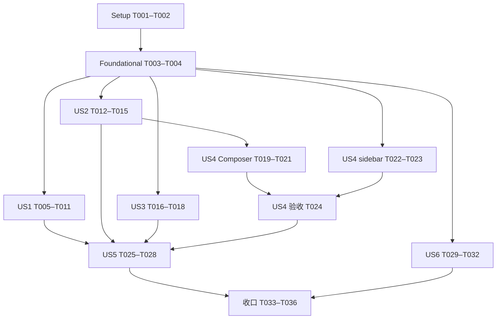

# Tasks: Spec 006 — UI 边界解耦

**Input**: [spec.md](spec.md)、[plan.md](plan.md)、[research.md](research.md)、[data-model.md](data-model.md)、[ownership-map.md](ownership-map.md)、[contracts/public-boundaries.md](contracts/public-boundaries.md)、[quickstart.md](quickstart.md)。

**状态**：实施完成，T001–T036 全部通过对应验证。实际分支 `codex/package-refactor`；以 source-inventory.json 的未提交工作树为来源，不从 HEAD 恢复文件。任务仅在对应检查通过后勾选。

**执行规则**：路径均相对仓库根；新增目标文件允许尚不存在。每项列出 owner、前置、来源/目标、消费者和完成证据。任务修改源码时必须先读取最近 AGENTS.md；同批更新相关 imports/exports、资源与既有测试引用。主 Agent独占 manifest/lock、SDK/Host、共享注册与最终集成。子 Agent交付这些文件的变更需求，由主 Agent在该任务内完成，禁止与其它写入任务并行。

**验证规则**：不新增、不执行 UI/DOM/fake DOM/Hook 渲染/视觉/交互/Browser/Electron 冒烟测试。既有 UI 测试仅保留、迁移、修 imports/fixture。不运行 pnpm test、pnpm check 或宽泛包级 test。按 quickstart 运行经传递导入审查的既有纯逻辑用例；若非平凡逻辑变化确需补例，只允许纯逻辑。没有单独新增 UI 测试任务，也不要求 TDD。静态检查不能记录成 UI 行为通过。

**完成规则**：每项完成后在实施时创建的 validation.md 中以任务 ID 记录变更、命令/静态核对结果及未验证项，再勾选。检查失败保持未完成。93 个库包、TS/TSX、真实 src/lib、最多一级子目录、唯一 i18n/状态/Provider、无生产循环均为终态要求。不提交、不推送、不部署。

**[P]** 表示在列出的前置全部完成后，可与不同文件 owner 的就绪任务并行；不代表可以忽略前置。最多两个写入子 Agent，使用 gpt-5.6-luna / gpt-5.6-sol。

## Phase 1 — Setup

**目标**：建立可追溯来源与允许验证清单。

**独立验收**：确认当前工作树差异，既有修改不丢失；全部 UI 执行入口被排除。

- [x] T001 核对 `specs/006-ui-boundary-decoupling/source-inventory.json` 的 544 项路径/hash 与 Git 状态，在 `specs/006-ui-boundary-decoupling/validation.md` 建立来源漂移、93 包/测试去向基线；漂移逐项解释，不覆盖工作树（Owner：主 Agent；前置：无。）

- [x] T002 依据 `specs/006-ui-boundary-decoupling/quickstart.md` 审查受影响 tests 及传递导入，在同目录 `validation.md` 记录精确纯逻辑允许清单、UI 排除清单、相关 typecheck 命令和任务证据格式；不得用文件扩展名代替内容判断（Owner：主 Agent；前置：T001。）

## Phase 2 — Foundational

**目标**：冻结共同边界与唯一写入责任，避免跨故事返工。

**独立验收**：合同字段、来源/消费者、注册冲突与文件分工均明确；不在此阶段搬迁业务实现。

- [x] T003 对照 `packages/extension-platform/extension-sdk/src/api/renderer.ts`、`packages/client/ui-message-blocks/src/message-blocks.tsx`、`packages/client/ui-layout/src/workbench-header.tsx` 复核 `specs/006-ui-boundary-decoupling/contracts/public-boundaries.md`；冻结 getResourceStats、只读 props、header model 与 token 最小类型，保留 basename/状态过滤和既有 fallback（Owner：主 Agent；前置：T002。）

- [x] T004 在 `specs/006-ui-boundary-decoupling/ownership-map.md` 补齐实际公开入口/消费者清单与分批文件 owner；核对 `packages/pi/pi-ui-toolbox/src/skill-reading-extension.ts` 的唯一 read 注册、所有已安装工具分类和 `packages/client/ui-tool/src/tool-diff-model.ts` 消费者；将最终禁止边逐项映射到 validation.md 的静态核对项（Owner：主 Agent；前置：T003。）

## Phase 3 — US1 工具呈现解耦 / P1 / MVP

**目标**：使 ui-tool 完全通过呈现合同处理差异，Pi 负责协议与文件能力。

**独立验收**：无工具名/参数解析残留；Pi diff、摘要、分组和统计保留；纯逻辑 fallback/聚合用例及相关类型检查通过。

- [x] T005 [US1] 在 `packages/extension-platform/extension-sdk/src/api/renderer.ts` 实现五个可选呈现字段及公开 summary/resource-stat 类型，同步 `packages/extension-platform/extension-sdk/src/index.ts` 的实际导出链；保留旧字段默认值，相关 SDK/消费者类型检查通过（Owner：主 Agent；前置：T004。）

- [x] T006 [P] [US1] 把 `packages/client/ui-tool/lib/tool-diff-model.ts` 的协议解析迁至 `packages/pi/pi-ui-toolbox/lib/file-mutation-tool-model.ts`，合入现有 timeline 文件统计的 Pi 规则；迁移相关纯逻辑测试到该包 tests，验证 edit/write、异常、空 diff、行数与 basename 聚合语义，暂留旧调用直到 T010 切换（Owner：Sol；前置：T005。）

- [x] T007 [P] [US1] 复用 `packages/extension-platform/extension-host/src/hosts/extension-error-boundary.tsx` 的隔离机制为 summary 提供可公开消费入口，核对 `packages/extension-platform/extension-host/src/hosts/renderer-host.tsx` 的匹配/fallback；不新建 registry，不在 try/catch 中直接调用组件，类型与异常路径静态审查通过（Owner：主 Agent；前置：T005。）

- [x] T008 [US1] 在 `packages/pi/pi-ui-toolbox/src/file-mutation-tool-summary.tsx` 和 `file-mutation-tool-renderer.tsx` 接入解析 helper：迁入文件按钮、增删数、ReviewableDiff、workspace-file request/diffId/scope/toast；summary 只控制 query 区，renderer 无 diff 时返回传入 fallback；保持原文案/样式并核对类型（Owner：Sol；前置：T006、T007。）

- [x] T009 [US1] 在 `packages/pi/pi-ui-toolbox/src/file-mutation-tool-presentation.tsx` 声明 edit/write 的标签、group、expandability、completion 和资源统计；组合 `packages/pi/pi-ui-toolbox/src/skill-reading-extension.ts` 的普通 read/skill resolve，并为已安装 bash/搜索等工具迁入摘要分类；通过 `packages/pi/pi-ui-toolbox/src/index.ts` 和 `packages/pi/pi-contributions/src/public/installation.tsx` 的实际安装链接入，保证唯一注册/既有 ID/销毁顺序（Owner：Sol 提供实现，主 Agent注册集成；前置：T008。）

- [x] T010 [US1] 改造 `packages/client/ui-tool/lib/tool-timeline-model.ts` 与 `packages/client/ui-tool/src/message-tool-timeline.tsx` 消费 resolved presentation；删除 toolChip/toolKind/latestActivity 的工具名称/参数猜测、diff/opener 特例；保持 parallel key 优先、sourceIndex、group disclosure、data fallback=null、统计完成状态过滤，summary 异常回退普通 query（Owner：Sol；前置：T009。）

- [x] T011 [US1] 清理 `packages/client/ui-tool/package.json` 的旧 tool-diff-model export/未用依赖及 `packages/client/ui-tool/src/tool-diff-model.ts`，更新全部公开消费者、Pi/i18n 词典 owner 与 `pnpm-lock.yaml`；运行允许的 timeline/diff 纯逻辑和相关类型/依赖检查，在 `specs/006-ui-boundary-decoupling/validation.md` 记录 US1 禁止边与读技能注册核对结果（Owner：主 Agent；前置：T010。）

## Phase 4 — US2 显式消息块与共享 token / P1

**目标**：节点层提供数据/动作，消息块不读取 Session 或编辑器注册表。

**独立验收**：blocks 无 agent-runtime-client/ui-composer 生产依赖；附件失效处理、retry guard 和只读 token 契约保持，类型及静态生命周期核对通过。

- [x] T012 [P] [US2] 从 `packages/client/ui-composer/src/composer-controls.tsx` 和 `composer-token-icon.tsx` 提取实际共享 token 至 `packages/client/ui-input-trigger/src/composer-command-token.tsx`、`composer-token-icon.tsx`、`tokens.ts`；更新两包公开 exports 与 Composer 消费者，菜单/编辑器留 composer；静态确认最小 token 类型无反向依赖，相关类型检查通过（Owner：主 Agent；前置：T004。）

- [x] T013 [US2] 在 `packages/client/ui-message-blocks/src/message-blocks.tsx` 接收附件 reader、isLast/isRunning/retry props；在 `packages/client/ui-conversation-nodes/src/conversation-node-seat.tsx` 及新 `message-block-adapter.tsx` 的实际调用链注入 Session actions；reader 使用既有 contracts 类型，逐项核对 reset/image-only/current flag/失败卡片/retry finally 与缺失 node fallback（Owner：Sol；前置：T012。）

- [x] T014 [US2] 把 `packages/client/ui-message-blocks/src/composer-message-content.tsx` 的注册表/agent commands 读取及解析调用移到 `packages/client/ui-conversation-nodes/src/composer-message-text.tsx`；块消费显式只读文档/展示数据与 ui-input-trigger/tokens，完整 parser 留 ui-composer/document，纯类型引用不得重新带入编辑器依赖（Owner：Sol；前置：T013。）

- [x] T015 [US2] 更新 `packages/client/ui-message-blocks/package.json`、`packages/client/ui-conversation-nodes/package.json`、`packages/client/ui-composer/src/tokens.ts` 的最终消费者/exports 并清除旧 token 转发；更新现有测试 imports/fixture 但不运行 UI 测试；相关类型和 import/manifest 双层禁止边检查通过，证据写入 `specs/006-ui-boundary-decoupling/validation.md`（Owner：主 Agent；前置：T014。）

## Phase 5 — US3 Shell 装配与布局边界 / P1

**目标**：布局只消费会话投影与区域节点，滚动持久化在安装级共享。

**独立验收**：layout 不依赖三个会话能力包；Provider 在 RuntimeProvider 内且覆盖主/侧会话；菜单、标题和 Portal 装配静态核对与类型检查通过。

- [x] T016 [P] [US3] 在 `packages/client/ui-layout/src/workbench-header.tsx`、`workbench-shell.tsx` 增加 ConversationHeaderModel/actions 接口，并于 `packages/client/shell/src/conversation-header.tsx` 与 `application.tsx` 提供标题截断、workspace 和菜单投影；同批更新调用链，保留 mainView/breadcrumb、new-thread fallback、thread.menu context 与 archive 导航（Owner：主 Agent；前置：T004。）

- [x] T017 [US3] 把 `packages/client/ui-layout/src/workbench-shell.tsx` 的 ThreadScrollStateProvider 移到 `packages/client/shell/src/application.tsx` 的 RuntimeProvider 内、WorkbenchShell 外；保留 application factory，删除 layout persistence 透传，静态核对 installation identity、Strict Effects dispose 与 SideChat scratch lease 不变（Owner：主 Agent；前置：T016。）

- [x] T018 [US3] 删除 `packages/client/ui-layout/package.json` 的会话包依赖并更新 `packages/client/shell/package.json`、相关调用点和既有测试 props；类型检查与 provider/slot/Portal 静态核对通过，在 `specs/006-ui-boundary-decoupling/validation.md` 记录 layout 禁止边（Owner：主 Agent；前置：T017。）

## Phase 6 — US4 Composer 与侧栏内部解耦 / P2

**目标**：拆分协调职责并缩小侧栏消费面，保持唯一状态与事务。

**独立验收**：Composer 无重复 editor/store，异步/IME/ref/提交语义保持；sidebar 不再暴露整个 runtime，投影与 move 事务的允许纯逻辑检查通过。

- [x] T019 [P] [US4] 从 `packages/client/ui-composer/src/workbench-composer.tsx` 提取 Lexical 插件至 `composer-editor-plugins.tsx`，提取实际纯建议映射至 `packages/client/ui-composer/lib/composer-suggestion-model.ts`；原组件接入，保留插件顺序、IME/Enter 优先级、捕获 ref 和既有 view，类型及现有允许解析用例通过（Owner：Sol；前置：T015。）

- [x] T020 [US4] 在 `packages/client/ui-composer/src/use-composer-suggestions.ts`、`use-composer-mentions.ts` 和 `use-composer-command-parameters.ts` 承接原组件的命令/文件/会话建议及参数协调；更新 `workbench-composer.tsx`，核对切会话失效响应、effect deps、最新回调、焦点与取消语义，不复制注册表或状态（Owner：Sol；前置：T019。）

- [x] T021 [US4] 从 `packages/client/ui-composer/src/workbench-composer.tsx` 提取 `use-composer-attachments.ts`、`use-composer-submission.ts` 并复用既有 submit helper；保持上传/释放、提交 guard、session identity 和成功/失败复位，在 validation.md 记录静态生命周期核对与允许的提交策略用例结果（Owner：Sol；前置：T020。）

- [x] T022 [P] [US4] 从 `packages/client/ui-conversation-list/src/workspace-sidebar-context.tsx` 提取 `sidebar-contracts.ts` 的显式 view/actions 类型和 `packages/client/ui-conversation-list/lib/sidebar-projection.ts` 的实际投影 helper；原 controller 消费 helper，禁止整体 Runtime/Capabilities 字段，类型和既有允许投影用例通过（Owner：Luna；前置：T004。）

- [x] T023 [US4] 将 `packages/client/ui-conversation-list/src/workspace-sidebar-context.tsx` 拆到 `use-workspace-sidebar-controller.ts`、`sidebar-context.tsx`、`sidebar-move-menu-items.tsx`；更新 section/thread/workspace 行消费者使用窄 selector，保持单一 zustand store、action 引用和原 commitSidebarMove pin/save 错误阶段，不新增 Context/store（Owner：Sol 或主 Agent；前置：T022。）

- [x] T024 [US4] 清理 `packages/client/ui-composer/src/workbench-composer.tsx` 与 `packages/client/ui-conversation-list/src/workspace-sidebar-context.tsx` 的死实现/旧宽接口/临时转发；全量检索消费者并运行相关类型及白名单纯逻辑检查，在 `specs/006-ui-boundary-decoupling/validation.md` 分别验收 Composer 和 sidebar，不用行数代替完成条件（Owner：主 Agent；前置：T021、T023。）

## Phase 7 — US5 样式归属 / P2

**目标**：每个组件通过自身资源入口获得样式，消息流不控制其它 owner。

**独立验收**：跨包独占选择器清零；浅/深主题、颜色、密度、圆角、reduced motion、Portal 与级联顺序完成静态审查，不运行 UI 测试。

- [x] T025 [US5] 针对 `packages/client/ui-conversation-messages/src/chat-icons.css`、`conversation.css` 枚举全部选择器和真实 DOM/资源入口，在 `specs/006-ui-boundary-decoupling/ownership-map.md` 固定逐项 CSS 去向；保留 code-header 测量 marker，不扩大 :root 作用域（Owner：主 Agent；前置：T011、T015、T018、T024。）

- [x] T026 [US5] 把 message-actions 按钮/伪元素样式迁入 `packages/client/ui-conversation-nodes/src/message-actions.css`，composer-dock 动画迁入 `packages/client/ui-conversation/src/conversation-dock.css`；从原消息流 CSS 删除声明并接入各 owner 资源入口，保持 token/hit area/reduced motion 与层叠顺序（Owner：主 Agent；前置：T025。）

- [x] T027 [US5] 迁移 Markdown/code-header 专属规则至 `packages/client/markdown/src/styles.css`、`packages/client/code-highlighting/src/code-block.css`，bubble/字体规则至 `packages/client/ui-message-blocks/src/styles.css` 的所属样式；同步 `packages/client/ui-conversation-messages/src/conversation.css`，保证独立入口和既有测量 marker 不变（Owner：主 Agent；前置：T026。）

- [x] T028 [US5] 清理 `packages/client/ui-conversation-messages/src/chat-icons.css` 的跨 owner 图标规则，逐个消费者改用已有 icon/button token 派生局部类或已验证通用 variant；复核 ui-tool/blocks/nodes/markdown 的全部消费，在 `specs/006-ui-boundary-decoupling/validation.md` 记录样式作用域静态审查、资源图与主题静态审查，删无消费者旧资源（Owner：主 Agent；前置：T027。）

## Phase 8 — US6 外观设置与测试归属 / P2

**目标**：外观设置按页面和控件组织，selector 断言回到能力包。

**独立验收**：设置 ID/提交取消语义不变；selector 三项既有断言完整迁移，ui 无反向 dev 依赖；类型和纯 helper 检查通过。

- [x] T029 [P] [US6] 从 `packages/client/ui-theme/src/appearance-settings-item.tsx` 提取 `appearance-controls.tsx` 的实际控件并复用现有共享基础组件；保留 Range draft/ref/RAF/interactionEnd 与 Color delay/cancel 的不同策略，原页面接入，类型与计时清理静态核对通过（Owner：Luna；前置：T004。）

- [x] T030 [US6] 从 `packages/client/ui-theme/src/appearance-settings-item.tsx` 提取 `appearance-theme-page.tsx`、`appearance-font-page.tsx`、`appearance-background-page.tsx`；原入口保留 settings dispatcher/ID、唯一 prefs/background store、双语词典与 running indicator catalog，相关类型和现有允许颜色/页面纯逻辑检查通过（Owner：Luna；前置：T029。）

- [x] T031 [P] [US6] 把 `packages/client/ui/tests/ui/shared-foundations.test.tsx` 中三个既有 SearchableSelector 断言迁至 `packages/client/ui-selectors/tests/searchable-selector.test.tsx`，Tabs/Settings/StatusBadge/Surface 断言留原文件；逐项静态核对断言来源和 imports，不新增断言、不执行任一 UI 测试（Owner：Luna；前置：T004。）

- [x] T032 [US6] 删除 `packages/client/ui/package.json` 的 ui-selectors dev 依赖并更新 `pnpm-lock.yaml`；清理 theme 旧实现/入口且更新现有 UI fixtures，相关类型/依赖检查通过，在 `specs/006-ui-boundary-decoupling/validation.md` 分别记录主题静态生命周期与 selector 断言迁移证据（Owner：主 Agent；前置：T030、T031。）

## Phase 9 — Polish 与跨故事收口

**目标**：形成可审查、无临时兼容残留的最终结果。

**独立验收**：全部故事退出条件与允许检查通过，未运行的 UI 验证明示；历史成果与用户修改保留。

- [x] T033 全仓复核 `specs/006-ui-boundary-decoupling/contracts/public-boundaries.md` 的禁止边，检查受影响 `packages/*/*/package.json`、exports、生产无环与消费者；删除死源码/旧转发/无用依赖/空目录，核对 93 包与实际 src/lib，不改未涉及代码（Owner：主 Agent；前置：T028、T032。）

- [x] T034 同步所有受影响包 `README.md`、`README.zh.md` 与最近 `AGENTS.md` 的边界/入口说明，复核共置 `src/i18n/en-US.ts`、`zh-CN.ts` 的键/参数/注册唯一性；在 `specs/006-ui-boundary-decoupling/validation.md` 核对全部既有测试去向，新增纯逻辑用例单列（Owner：主 Agent；前置：T033。）

- [x] T035 执行 `specs/006-ui-boundary-decoupling/quickstart.md` 的 workspace-dependencies、package-structure、CSS owner/token 静态核对、lint、typecheck 和精确允许的纯逻辑命令；复用仍有效的已通过证据，仅因新增变更/失败扩大复测；将结果及 UI 排除项写入 validation.md，失败不可勾选（Owner：主 Agent；前置：T034。）

- [x] T036 运行 `pnpm build` 并核对 Web/Runtime/Electron 构建组合，无 Browser/Electron 冒烟；在 `specs/006-ui-boundary-decoupling/validation.md` 记录构建、残余风险与 git diff --check，更新本期 `tasks.md`/根 `AGENTS.md` 的真实实施状态，保持 Spec004/005 原完成记录，不提交/推送（Owner：主 Agent；前置：T035。）

## Dependencies 与交付顺序

上述为逻辑依赖；实际优先交付 P1，再推进 P2。主 Agent的共享文件写入串行，所有任务正文中的直接前置优先于阶段排列。故事内除显式 [P] 外按列出顺序执行；US4 的 Composer 与 sidebar 是两个独立链，T024 汇合。US5 依赖前面 DOM/consumer 稳定，不强行声明可以独立提前迁 CSS。

## 并行示例与文件锁

| 故事 | 可行安排                                                                                    | 必须串行的部分                                                 |
| ---- | ------------------------------------------------------------------------------------------- | -------------------------------------------------------------- |
| US1  | T005 后 Sol 做 T006 的 Pi 纯解析，主 Agent做 T007 的 Host 隔离                              | T008–T011 的呈现、注册和时间线切换按依赖顺序                   |
| US2  | T012 可与 US1 的 Pi-only T006 并行；共享入口由主 Agent独占                                  | T013–T015 共同修改 blocks/nodes，不同时派两个 writer           |
| US3  | 主 Agent做 T016–T018 时，Sol 可处理不涉及 Shell 的就绪任务                                  | Header/WorkbenchShell/application 连续修改，同一 owner         |
| US4  | T019 的 Composer 与 T022 的 sidebar 可由 Sol/Luna 分别处理                                  | Composer 同源文件链和 sidebar controller 链各自串行；T024 汇合 |
| US5  | CSS 同时改声明与入口，不安排两个 writer；可与 Luna 的 theme-only T029 并行                  | T025–T028 串行，避免多次编辑 conversation.css                  |
| US6  | T029 的 theme 与 T031 的 selector 测试文件逻辑独立；有空闲 Sol 时可分配，否则 Luna 顺序处理 | T032 manifest/lock 与其它集成写入串行                          |

每次实际派发前确认前置完成、文件集不交叉、最多两个写入子 Agent。没有可独立并行的有用工作时由当前 Agent顺序完成；不为使用多 Agent 而拆空任务。

## Implementation Strategy

1. 首个 MVP 为 Setup + Foundational + US1（T001–T011）：通用工具呈现完成独立验收，Pi 行为和 fallback 有允许的证据。
2. 接着完成 US2/US3，形成三个 P1 边界均已切断的里程碑。每个故事都先通过自身验收，再继续依赖它的任务。
3. 完成 US4 与 US6 的内部整理，随后 US5 样式收口与最终统一检查。MVP 是交付顺序，不代表其余任务从范围中删除。
4. UI 行为仅做规定的静态审查，不启动交互验证；没有通过的命令不能标成功。用户未授权本阶段提交/推送，任务中也不包含发布。

## 覆盖与生成检查

共 36 项：Setup 2、Foundational 2、US1 7、US2 4、US3 3、US4 6、US5 4、US6 4、收口 4。所有任务具有唯一递增 ID、checkbox、文件路径；故事任务有对应 US 标签，共 8 个 [P] 任务。完成状态以任务 checkbox 和 validation.md 为准。

setup-tasks.sh 已执行；仓库没有 `.specify/extensions.yml`，before_tasks/after_tasks hooks 均跳过。生成阶段只检查文档、格式与依赖完整性，不运行源码测试/构建。
